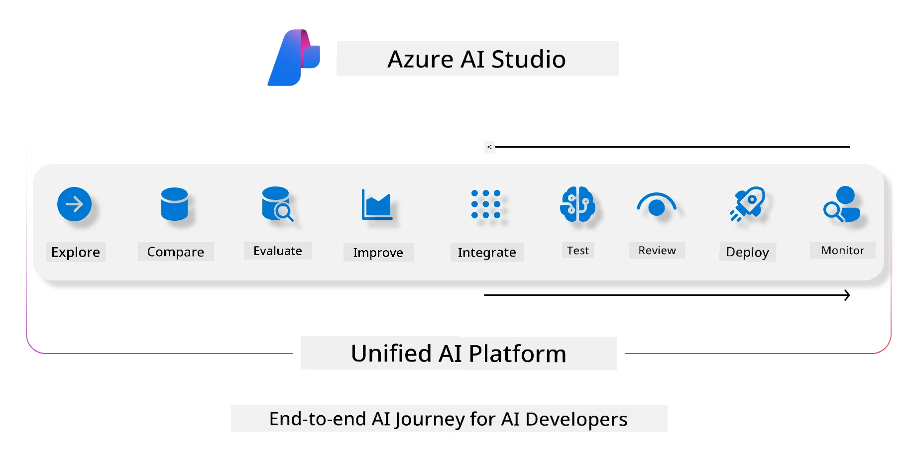
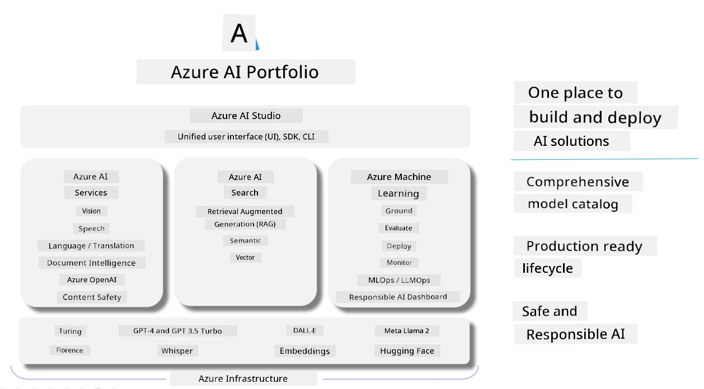

# **Using Microsoft Foundry to evaluation**

How to evaluate your generative AI application using [Microsoft Foundry](https://ai.azure.com?WT.mc_id=aiml-138114-kinfeylo). Whether you're assessing single-turn or multi-turn conversations, Microsoft Foundry provides tools for evaluating model performance and safety. 

## How to evaluate generative AI apps with Microsoft Foundry
For more details instruction see the [Microsoft Foundry Documentation](https://learn.microsoft.com/azure/ai-studio/how-to/evaluate-generative-ai-app?WT.mc_id=aiml-138114-kinfeylo)

Here are the steps to get started:

## Evaluating Generative AI Models in Microsoft Foundry

**Prerequisites**

- A test dataset in either CSV or JSON format.
- A deployed generative AI model (such as Phi-3, GPT 3.5, GPT 4, or Davinci models).
- A runtime with a compute instance to run the evaluation.

## Built-in Evaluation Metrics

Microsoft Foundry allows you to evaluate both single-turn and complex, multi-turn conversations.
For Retrieval Augmented Generation (RAG) scenarios, where the model is grounded in specific data, you can assess performance using built-in evaluation metrics.
Additionally, you can evaluate general single-turn question answering scenarios (non-RAG).

## Creating an Evaluation Run

From the Microsoft Foundry UI, navigate to either the Evaluate page or the Prompt Flow page.
Follow the evaluation creation wizard to set up an evaluation run. Provide an optional name for your evaluation.
Select the scenario that aligns with your application's objectives.
Choose one or more evaluation metrics to assess the model's output.

## Custom Evaluation Flow (Optional)

For greater flexibility, you can establish a custom evaluation flow. Customize the evaluation process based on your specific requirements.

## Viewing Results

After running the evaluation, log, view, and analyze detailed evaluation metrics in Microsoft Foundry. Gain insights into your application's capabilities and limitations.

**Note** Microsoft Foundry is currently in public preview, so use it for experimentation and development purposes. For production workloads, consider other options. Explore the official [AI Foundry documentation](https://learn.microsoft.com/azure/ai-studio/?WT.mc_id=aiml-138114-kinfeylo) for more details and step-by-step instructions.

---

<!-- CO-OP TRANSLATOR DISCLAIMER START -->
**Disclaimer**:
This document has been translated using the AI translation service [Co-op Translator](https://github.com/Azure/co-op-translator). While we strive for accuracy, please be aware that automated translations may contain errors or inaccuracies. The original document in its native language should be considered the authoritative source. For critical information, professional human translation is recommended. We are not liable for any misunderstandings or misinterpretations arising from the use of this translation.
<!-- CO-OP TRANSLATOR DISCLAIMER END -->