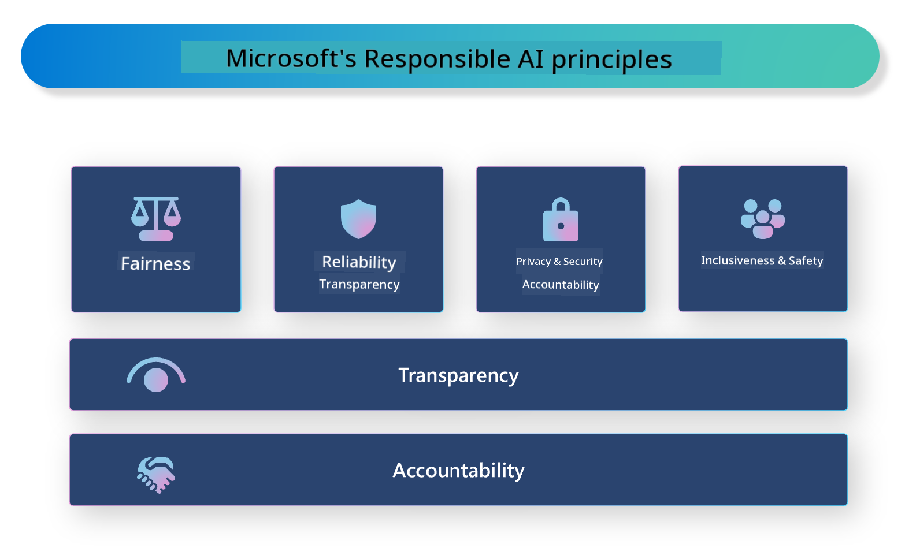

<!--
CO_OP_TRANSLATOR_METADATA:
{
  "original_hash": "805b96b20152936d8f4c587d90d6e06e",
  "translation_date": "2025-07-16T22:46:18+00:00",
  "source_file": "md/01.Introduction/05/ResponsibleAI.md",
  "language_code": "en"
}
-->
# **Introduce Responsible AI**

[Microsoft Responsible AI](https://www.microsoft.com/ai/responsible-ai?WT.mc_id=aiml-138114-kinfeylo) is an initiative designed to help developers and organizations create AI systems that are transparent, trustworthy, and accountable. It offers guidance and resources for building responsible AI solutions aligned with ethical principles like privacy, fairness, and transparency. We will also look at some challenges and best practices involved in developing responsible AI systems.

## Overview of Microsoft Responsible AI 

**Ethical principles** 

Microsoft Responsible AI is guided by ethical principles such as privacy, fairness, transparency, accountability, and safety. These principles ensure AI systems are developed in an ethical and responsible way.

**Transparent AI**

Microsoft Responsible AI highlights the importance of transparency in AI systems. This means providing clear explanations of how AI models operate and making data sources and algorithms publicly accessible.

**Accountable AI** 

[Microsoft Responsible AI](https://www.microsoft.com/ai/responsible-ai?WT.mc_id=aiml-138114-kinfeylo) supports the creation of accountable AI systems that offer insights into how AI models make decisions. This helps users understand and trust AI outputs.

**Inclusiveness** 

AI systems should be designed to benefit everyone. Microsoft strives to build inclusive AI that takes diverse perspectives into account and avoids bias or discrimination.

**Reliability and Safety**

Ensuring AI systems are reliable and safe is essential. Microsoft focuses on developing robust models that perform consistently and prevent harmful outcomes.

**Fairness in AI** 

Microsoft Responsible AI acknowledges that AI systems can reinforce biases if trained on biased data or algorithms. The initiative provides guidance for creating fair AI systems that do not discriminate based on race, gender, age, or other factors.

**Privacy and security** 

Microsoft Responsible AI stresses the importance of protecting user privacy and data security in AI systems. This includes strong data encryption, access controls, and regular audits to identify vulnerabilities.

**Accountability and responsibility** 

Microsoft Responsible AI promotes accountability and responsibility throughout AI development and deployment. This means ensuring developers and organizations understand potential risks and take steps to mitigate them.

## Best practices for building responsible AI systems

**Develop AI models using diverse data sets** 

To prevent bias, it’s important to use diverse data sets that represent a wide range of perspectives and experiences.

**Use explainable AI techniques** 

Explainable AI methods help users understand how AI models make decisions, which builds trust in the system.

**Regularly audit AI systems for vulnerabilities** 

Conducting regular audits helps identify risks and vulnerabilities that need to be addressed.

**Implement strong data encryption and access controls** 

Data encryption and access controls protect user privacy and security in AI systems.

**Follow ethical principles in AI development** 

Adhering to ethical principles like fairness, transparency, and accountability helps build trust and ensures responsible AI development.

## Using AI Foundry for Responsible AI 

[Azure AI Foundry](https://ai.azure.com?WT.mc_id=aiml-138114-kinfeylo) is a powerful platform that enables developers and organizations to quickly build intelligent, cutting-edge, market-ready, and responsible applications. Key features of Azure AI Foundry include:

**Out-of-the-Box APIs and Models** 

Azure AI Foundry offers pre-built and customizable APIs and models covering a wide range of AI tasks, including generative AI, natural language processing for conversations, search, monitoring, translation, speech, vision, and decision-making.

**Prompt Flow** 

Prompt Flow in Azure AI Foundry lets you design conversational AI experiences. It helps you create and manage conversational flows, making it easier to build chatbots, virtual assistants, and other interactive applications.

**Retrieval Augmented Generation (RAG)** 

RAG combines retrieval-based and generative approaches to improve the quality of generated responses by leveraging both existing knowledge (retrieval) and creative generation.

**Evaluation and Monitoring Metrics for Generative AI** 

Azure AI Foundry provides tools to evaluate and monitor generative AI models. You can assess their performance, fairness, and other key metrics to ensure responsible deployment. If you’ve created a dashboard, you can use the no-code UI in Azure Machine Learning Studio to customize and generate a Responsible AI Dashboard and scorecard based on the [Responsible AI Toolbox](https://responsibleaitoolbox.ai/?WT.mc_id=aiml-138114-kinfeylo) Python Libraries. This scorecard helps share important insights about fairness, feature importance, and other responsible deployment factors with both technical and non-technical stakeholders.

To use AI Foundry responsibly, follow these best practices:

**Define the problem and objectives of your AI system**

Before development, clearly define the problem or goal your AI system aims to address. This helps identify the data, algorithms, and resources needed to build an effective model.

**Gather and preprocess relevant data** 

The quality and quantity of training data greatly affect AI performance. Collect relevant data, clean and preprocess it, and ensure it represents the population or problem you want to solve.

**Choose appropriate evaluation** 

Select the most suitable evaluation algorithm based on your data and problem.

**Evaluate and interpret the model** 

After building your AI model, evaluate its performance using appropriate metrics and interpret the results transparently. This helps identify biases or limitations and guides improvements.

**Ensure transparency and explainability** 

AI systems should be transparent and explainable so users understand how they work and how decisions are made. This is especially important for applications with significant impacts, such as healthcare, finance, and legal systems.

**Monitor and update the model** 

Continuously monitor and update AI systems to keep them accurate and effective over time. This requires ongoing maintenance, testing, and retraining.

In summary, Microsoft Responsible AI is an initiative to help developers and organizations build AI systems that are transparent, trustworthy, and accountable. Responsible AI implementation is essential, and Azure AI Foundry aims to make it practical for organizations. By following ethical principles and best practices, we can ensure AI systems are developed and deployed responsibly for the benefit of society.

**Disclaimer**:  
This document has been translated using the AI translation service [Co-op Translator](https://github.com/Azure/co-op-translator). While we strive for accuracy, please be aware that automated translations may contain errors or inaccuracies. The original document in its native language should be considered the authoritative source. For critical information, professional human translation is recommended. We are not liable for any misunderstandings or misinterpretations arising from the use of this translation.