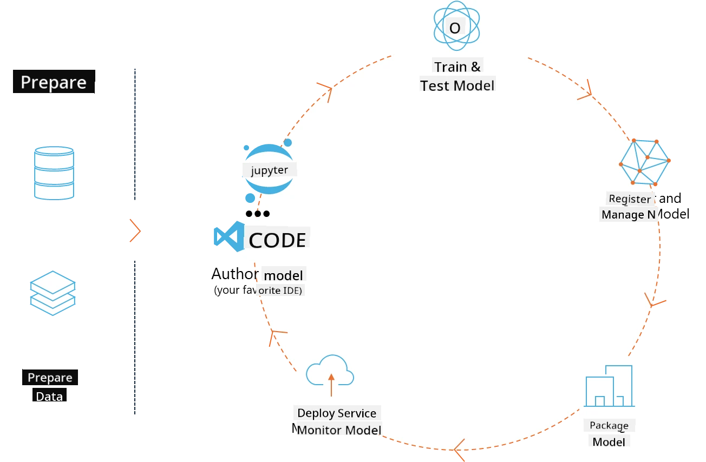
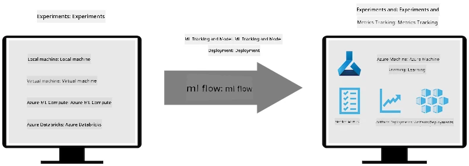
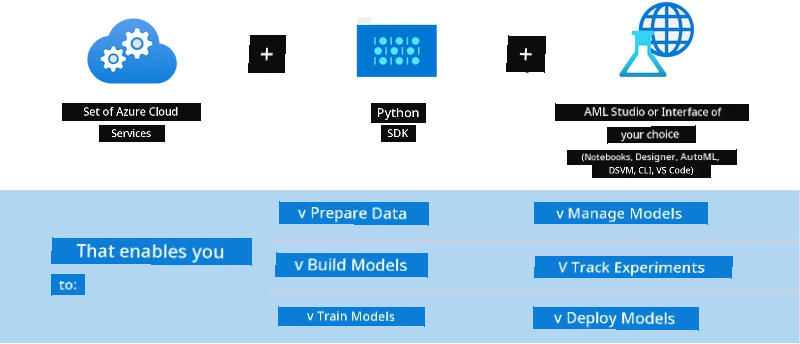

<!--
CO_OP_TRANSLATOR_METADATA:
{
  "original_hash": "f61c383bbf0c3dac97e43f833c258731",
  "translation_date": "2025-07-17T02:24:47+00:00",
  "source_file": "md/02.Application/01.TextAndChat/Phi3/E2E_Phi-3-MLflow.md",
  "language_code": "en"
}
-->
# MLflow

[MLflow](https://mlflow.org/) is an open-source platform designed to manage the entire machine learning lifecycle.



MLflow is used to manage the ML lifecycle, including experimentation, reproducibility, deployment, and a central model registry. MLflow currently offers four components:

- **MLflow Tracking:** Record and query experiments, code, data configuration, and results.
- **MLflow Projects:** Package data science code in a format that allows reproducing runs on any platform.
- **MLflow Models:** Deploy machine learning models in various serving environments.
- **Model Registry:** Store, annotate, and manage models in a central repository.

It includes features for tracking experiments, packaging code into reproducible runs, and sharing and deploying models. MLflow is integrated into Databricks and supports a wide range of ML libraries, making it library-agnostic. It can be used with any machine learning library and in any programming language, as it provides a REST API and CLI for convenience.



Key features of MLflow include:

- **Experiment Tracking:** Record and compare parameters and results.
- **Model Management:** Deploy models to various serving and inference platforms.
- **Model Registry:** Collaboratively manage the lifecycle of MLflow Models, including versioning and annotations.
- **Projects:** Package ML code for sharing or production use.

MLflow also supports the MLOps loop, which includes preparing data, registering and managing models, packaging models for execution, deploying services, and monitoring models. It aims to simplify the process of moving from prototype to production workflow, especially in cloud and edge environments.

## E2E Scenario - Building a wrapper and using Phi-3 as an MLflow model

In this end-to-end example, we will demonstrate two different approaches to building a wrapper around the Phi-3 small language model (SLM) and then running it as an MLflow model either locally or in the cloud, for example, in an Azure Machine Learning workspace.



| Project | Description | Location |
| ------------ | ----------- | -------- |
| Transformer Pipeline | The Transformer Pipeline is the easiest way to build a wrapper if you want to use a HuggingFace model with MLflow’s experimental transformers flavor. | [**TransformerPipeline.ipynb**](../../../../../../code/06.E2E/E2E_Phi-3-MLflow_TransformerPipeline.ipynb) |
| Custom Python Wrapper | At the time of writing, the transformer pipeline did not support MLflow wrapper generation for HuggingFace models in ONNX format, even with the experimental optimum Python package. In such cases, you can build your own custom Python wrapper for MLflow models. | [**CustomPythonWrapper.ipynb**](../../../../../../code/06.E2E/E2E_Phi-3-MLflow_CustomPythonWrapper.ipynb) |

## Project: Transformer Pipeline

1. You will need the relevant Python packages from MLflow and HuggingFace:

    ``` Python
    import mlflow
    import transformers
    ```

2. Next, initialize a transformer pipeline by referring to the target Phi-3 model in the HuggingFace registry. As shown in the _Phi-3-mini-4k-instruct_ model card, its task is “Text Generation”:

    ``` Python
    pipeline = transformers.pipeline(
        task = "text-generation",
        model = "microsoft/Phi-3-mini-4k-instruct"
    )
    ```

3. Now you can save your Phi-3 model’s transformer pipeline in MLflow format and provide additional details such as the target artifacts path, specific model configuration settings, and inference API type:

    ``` Python
    model_info = mlflow.transformers.log_model(
        transformers_model = pipeline,
        artifact_path = "phi3-mlflow-model",
        model_config = model_config,
        task = "llm/v1/chat"
    )
    ```

## Project: Custom Python Wrapper

1. Here, we use Microsoft's [ONNX Runtime generate() API](https://github.com/microsoft/onnxruntime-genai) for inference and token encoding/decoding of the ONNX model. You should select the _onnxruntime_genai_ package for your target compute; the example below targets CPU:

    ``` Python
    import mlflow
    from mlflow.models import infer_signature
    import onnxruntime_genai as og
    ```

1. Our custom class implements two methods: _load_context()_ to initialize the **ONNX model** of Phi-3 Mini 4K Instruct, **generator parameters**, and **tokenizer**; and _predict()_ to generate output tokens for the given prompt:

    ``` Python
    class Phi3Model(mlflow.pyfunc.PythonModel):
        def load_context(self, context):
            # Retrieving model from the artifacts
            model_path = context.artifacts["phi3-mini-onnx"]
            model_options = {
                 "max_length": 300,
                 "temperature": 0.2,         
            }
        
            # Defining the model
            self.phi3_model = og.Model(model_path)
            self.params = og.GeneratorParams(self.phi3_model)
            self.params.set_search_options(**model_options)
            
            # Defining the tokenizer
            self.tokenizer = og.Tokenizer(self.phi3_model)
    
        def predict(self, context, model_input):
            # Retrieving prompt from the input
            prompt = model_input["prompt"][0]
            self.params.input_ids = self.tokenizer.encode(prompt)
    
            # Generating the model's response
            response = self.phi3_model.generate(self.params)
    
            return self.tokenizer.decode(response[0][len(self.params.input_ids):])
    ```

1. You can now use the _mlflow.pyfunc.log_model()_ function to create a custom Python wrapper (in pickle format) for the Phi-3 model, along with the original ONNX model and required dependencies:

    ``` Python
    model_info = mlflow.pyfunc.log_model(
        artifact_path = artifact_path,
        python_model = Phi3Model(),
        artifacts = {
            "phi3-mini-onnx": "cpu_and_mobile/cpu-int4-rtn-block-32-acc-level-4",
        },
        input_example = input_example,
        signature = infer_signature(input_example, ["Run"]),
        extra_pip_requirements = ["torch", "onnxruntime_genai", "numpy"],
    )
    ```

## Signatures of generated MLflow models

1. In step 3 of the Transformer Pipeline project above, we set the MLflow model’s task to “_llm/v1/chat_”. This instruction generates a model API wrapper compatible with OpenAI’s Chat API, as shown below:

    ``` Python
    {inputs: 
      ['messages': Array({content: string (required), name: string (optional), role: string (required)}) (required), 'temperature': double (optional), 'max_tokens': long (optional), 'stop': Array(string) (optional), 'n': long (optional), 'stream': boolean (optional)],
    outputs: 
      ['id': string (required), 'object': string (required), 'created': long (required), 'model': string (required), 'choices': Array({finish_reason: string (required), index: long (required), message: {content: string (required), name: string (optional), role: string (required)} (required)}) (required), 'usage': {completion_tokens: long (required), prompt_tokens: long (required), total_tokens: long (required)} (required)],
    params: 
      None}
    ```

1. As a result, you can submit your prompt in the following format:

    ``` Python
    messages = [{"role": "user", "content": "What is the capital of Spain?"}]
    ```

1. Then, use OpenAI API-compatible post-processing, e.g., _response[0][‘choices’][0][‘message’][‘content’]_, to format your output like this:

    ``` JSON
    Question: What is the capital of Spain?
    
    Answer: The capital of Spain is Madrid. It is the largest city in Spain and serves as the political, economic, and cultural center of the country. Madrid is located in the center of the Iberian Peninsula and is known for its rich history, art, and architecture, including the Royal Palace, the Prado Museum, and the Plaza Mayor.
    
    Usage: {'prompt_tokens': 11, 'completion_tokens': 73, 'total_tokens': 84}
    ```

1. In step 3 of the Custom Python Wrapper project above, we allow the MLflow package to generate the model’s signature from a given input example. Our MLflow wrapper's signature will look like this:

    ``` Python
    {inputs: 
      ['prompt': string (required)],
    outputs: 
      [string (required)],
    params: 
      None}
    ```

1. Therefore, our prompt needs to include a "prompt" dictionary key, similar to this:

    ``` Python
    {"prompt": "<|system|>You are a stand-up comedian.<|end|><|user|>Tell me a joke about atom<|end|><|assistant|>",}
    ```

1. The model's output will then be provided as a string:

    ``` JSON
    Alright, here's a little atom-related joke for you!
    
    Why don't electrons ever play hide and seek with protons?
    
    Because good luck finding them when they're always "sharing" their electrons!
    
    Remember, this is all in good fun, and we're just having a little atomic-level humor!
    ```

**Disclaimer**:  
This document has been translated using the AI translation service [Co-op Translator](https://github.com/Azure/co-op-translator). While we strive for accuracy, please be aware that automated translations may contain errors or inaccuracies. The original document in its native language should be considered the authoritative source. For critical information, professional human translation is recommended. We are not liable for any misunderstandings or misinterpretations arising from the use of this translation.