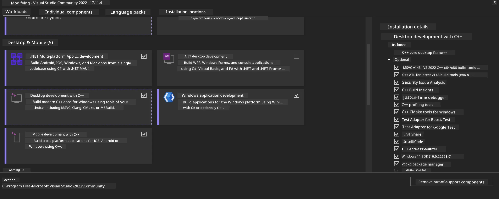
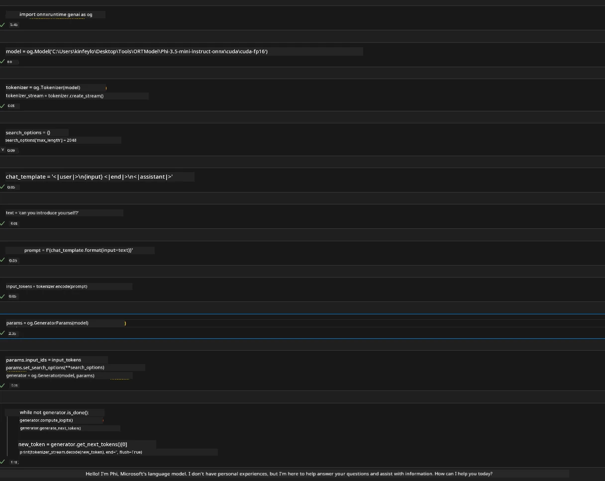
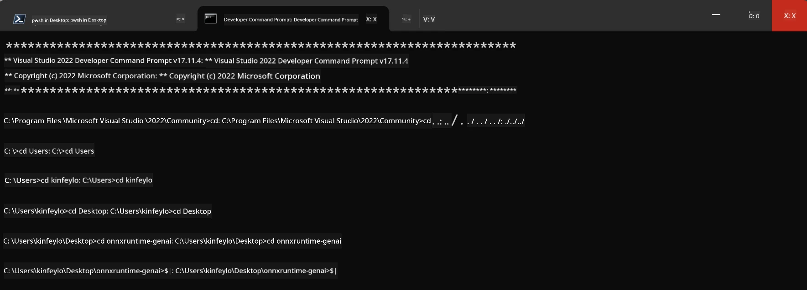

# **Guideline for OnnxRuntime GenAI Windows GPU**

This guideline provides steps for setting up and using ONNX Runtime (ORT) with GPUs on Windows. It’s designed to help you take advantage of GPU acceleration for your models, enhancing performance and efficiency.

The document covers:

- Environment Setup: Instructions for installing necessary dependencies like CUDA, cuDNN, and ONNX Runtime.
- Configuration: How to configure the environment and ONNX Runtime to effectively use GPU resources.
- Optimization Tips: Recommendations for fine-tuning your GPU settings for the best performance.

### **1. Python 3.10.x / 3.11.8**

   ***Note*** It is recommended to use [miniforge](https://github.com/conda-forge/miniforge/releases/latest/download/Miniforge3-Windows-x86_64.exe) as your Python environment

   ```bash

   conda create -n pydev python==3.11.8

   conda activate pydev

   ```

   ***Reminder*** If you have installed any Python ONNX libraries, please uninstall them

### **2. Install CMake with winget**

   ```bash

   winget install -e --id Kitware.CMake

   ```

### **3. Install Visual Studio 2022 - Desktop Development with C++**

   ***Note*** You can skip this step if you don’t need to compile



### **4. Install NVIDIA Driver**

1. **NVIDIA GPU Driver**  [https://www.nvidia.com/en-us/drivers/](https://www.nvidia.com/en-us/drivers/)

2. **NVIDIA CUDA 12.4** [https://developer.nvidia.com/cuda-12-4-0-download-archive](https://developer.nvidia.com/cuda-12-4-0-download-archive)

3. **NVIDIA CUDNN 9.4**  [https://developer.nvidia.com/cudnn-downloads](https://developer.nvidia.com/cudnn-downloads)

***Reminder*** Please use the default settings during installation

### **5. Set NVIDIA Environment**

Copy NVIDIA CUDNN 9.4 lib, bin, and include files to NVIDIA CUDA 12.4 lib, bin, and include folders

- Copy files from *'C:\Program Files\NVIDIA\CUDNN\v9.4\bin\12.6'* to *'C:\Program Files\NVIDIA GPU Computing Toolkit\CUDA\v12.4\bin'*

- Copy files from *'C:\Program Files\NVIDIA\CUDNN\v9.4\include\12.6'* to *'C:\Program Files\NVIDIA GPU Computing Toolkit\CUDA\v12.4\include'*

- Copy files from *'C:\Program Files\NVIDIA\CUDNN\v9.4\lib\12.6'* to *'C:\Program Files\NVIDIA GPU Computing Toolkit\CUDA\v12.4\lib\x64'*

### **6. Download Phi-3.5-mini-instruct-onnx**

   ```bash

   winget install -e --id Git.Git

   winget install -e --id GitHub.GitLFS

   git lfs install

   git clone https://huggingface.co/microsoft/Phi-3.5-mini-instruct-onnx

   ```

### **7. Running InferencePhi35Instruct.ipynb**

   Open [Notebook](../../../../../../code/09.UpdateSamples/Aug/ortgpu-phi35-instruct.ipynb) and run it



### **8. Compile ORT GenAI GPU**

   ***Note*** 
   
   1. Please uninstall all onnx, onnxruntime, and onnxruntime-genai packages first

   ```bash

   pip list 
   
   ```

   Then uninstall all onnxruntime libraries, for example:

   ```bash

   pip uninstall onnxruntime

   pip uninstall onnxruntime-genai

   pip uninstall onnxruntume-genai-cuda
   
   ```

   2. Check Visual Studio Extension support 

   Verify that the folder C:\Program Files\NVIDIA GPU Computing Toolkit\CUDA\v12.4\extras contains the folder visual_studio_integration at C:\Program Files\NVIDIA GPU Computing Toolkit\CUDA\v12.4\extras\visual_studio_integration. 
   
   If it’s missing, check other CUDA toolkit driver folders and copy the visual_studio_integration folder and its contents to C:\Program Files\NVIDIA GPU Computing Toolkit\CUDA\v12.4\extras\visual_studio_integration

   - You can skip this step if you don’t want to compile

   ```bash

   git clone https://github.com/microsoft/onnxruntime-genai

   ```

   - Download [https://github.com/microsoft/onnxruntime/releases/download/v1.19.2/onnxruntime-win-x64-gpu-1.19.2.zip](https://github.com/microsoft/onnxruntime/releases/download/v1.19.2/onnxruntime-win-x64-gpu-1.19.2.zip)

   - Unzip onnxruntime-win-x64-gpu-1.19.2.zip, rename the folder to **ort**, and copy the ort folder into onnxruntime-genai

   - Using Windows Terminal, open the Developer Command Prompt for VS 2022 and navigate to onnxruntime-genai



   - Compile it using your Python environment

   ```bash

   cd onnxruntime-genai

   python build.py --use_cuda  --cuda_home "C:\Program Files\NVIDIA GPU Computing Toolkit\CUDA\v12.4" --config Release
 

   cd build/Windows/Release/Wheel

   pip install .whl

   ```

**Disclaimer**:  
This document has been translated using the AI translation service [Co-op Translator](https://github.com/Azure/co-op-translator). While we strive for accuracy, please be aware that automated translations may contain errors or inaccuracies. The original document in its native language should be considered the authoritative source. For critical information, professional human translation is recommended. We are not liable for any misunderstandings or misinterpretations arising from the use of this translation.