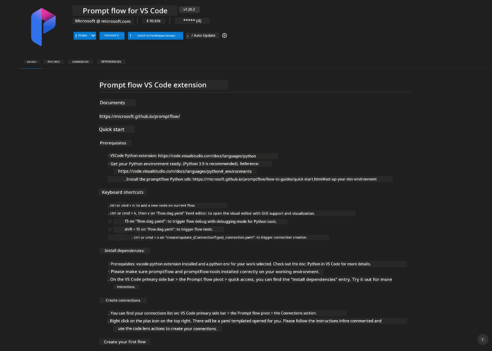
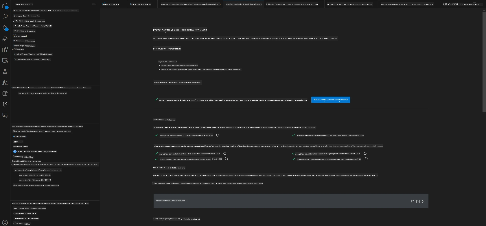
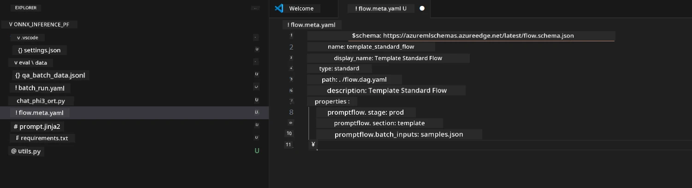
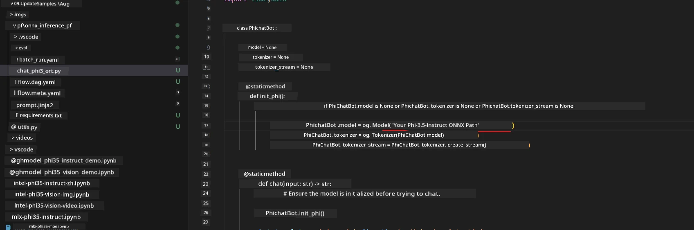
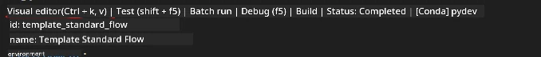
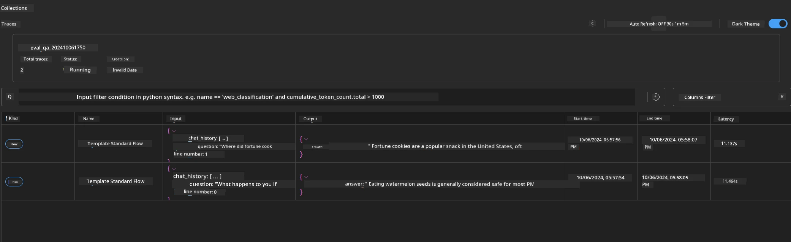

<!--
CO_OP_TRANSLATOR_METADATA:
{
  "original_hash": "92e7dac1e5af0dd7c94170fdaf6860fe",
  "translation_date": "2025-07-17T02:56:15+00:00",
  "source_file": "md/02.Application/01.TextAndChat/Phi3/UsingPromptFlowWithONNX.md",
  "language_code": "en"
}
-->
# Using Windows GPU to create Prompt flow solution with Phi-3.5-Instruct ONNX 

The following document is an example of how to use PromptFlow with ONNX (Open Neural Network Exchange) for developing AI applications based on Phi-3 models.

PromptFlow is a suite of development tools designed to streamline the end-to-end development cycle of LLM-based (Large Language Model) AI applications, from ideation and prototyping to testing and evaluation.

By integrating PromptFlow with ONNX, developers can:

- Optimize Model Performance: Leverage ONNX for efficient model inference and deployment.
- Simplify Development: Use PromptFlow to manage the workflow and automate repetitive tasks.
- Enhance Collaboration: Facilitate better collaboration among team members by providing a unified development environment.

**Prompt flow** is a suite of development tools designed to streamline the end-to-end development cycle of LLM-based AI applications, from ideation, prototyping, testing, evaluation to production deployment and monitoring. It makes prompt engineering much easier and enables you to build LLM apps with production quality.

Prompt flow can connect to OpenAI, Azure OpenAI Service, and customizable models (Huggingface, local LLM/SLM). We hope to deploy Phi-3.5's quantized ONNX model to local applications. Prompt flow can help us better plan our business and complete local solutions based on Phi-3.5. In this example, we will combine ONNX Runtime GenAI Library to complete the Prompt flow solution based on Windows GPU.

## **Installation**

### **ONNX Runtime GenAI for Windows GPU**

Read this guideline to set ONNX Runtime GenAI for Windows GPU  [click here](./ORTWindowGPUGuideline.md)

### **Set up Prompt flow in VSCode**

1. Install Prompt flow VS Code Extension



2. After installing the Prompt flow VS Code Extension, click the extension and choose **Installation dependencies**. Follow this guideline to install the Prompt flow SDK in your environment.



3. Download [Sample Code](../../../../../../code/09.UpdateSamples/Aug/pf/onnx_inference_pf) and open this sample in VS Code.



4. Open **flow.dag.yaml** to select your Python environment.


   Open **chat_phi3_ort.py** to update the location of your Phi-3.5-instruct ONNX Model.



5. Run your prompt flow to test it.

Open **flow.dag.yaml** and click the visual editor.



After clicking this, run it to test.


1. You can run batch commands in the terminal to check more results.

```bash

pf run create --file batch_run.yaml --stream --name 'Your eval qa name'    

```

You can view the results in your default browser.



**Disclaimer**:  
This document has been translated using the AI translation service [Co-op Translator](https://github.com/Azure/co-op-translator). While we strive for accuracy, please be aware that automated translations may contain errors or inaccuracies. The original document in its native language should be considered the authoritative source. For critical information, professional human translation is recommended. We are not liable for any misunderstandings or misinterpretations arising from the use of this translation.