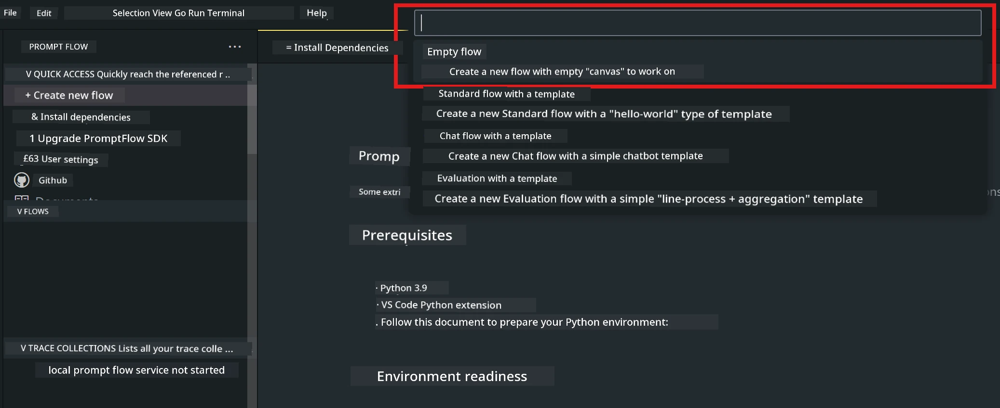
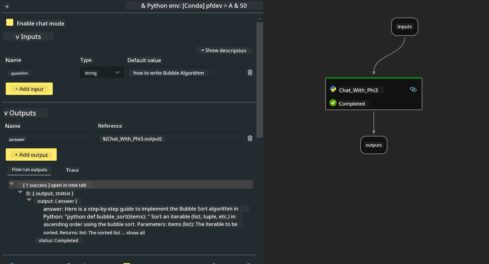

# **Lab 2 - Run Prompt flow with Phi-3-mini in AIPC**

## **What is Prompt flow**

Prompt flow is a set of development tools designed to simplify the entire development cycle of LLM-based AI applications—from ideation, prototyping, testing, and evaluation to production deployment and monitoring. It makes prompt engineering much easier and allows you to build LLM apps with production-level quality.

With prompt flow, you can:

- Create flows that connect LLMs, prompts, Python code, and other tools into an executable workflow.

- Debug and iterate your flows, especially interactions with LLMs, with ease.

- Evaluate your flows and calculate quality and performance metrics using larger datasets.

- Integrate testing and evaluation into your CI/CD system to ensure the quality of your flow.

- Deploy your flows to the serving platform of your choice or easily integrate them into your app’s codebase.

- (Optional but highly recommended) Collaborate with your team by using the cloud version of Prompt flow in Azure AI.

## **What is AIPC**

An AI PC includes a CPU, a GPU, and an NPU, each with specific AI acceleration capabilities. An NPU, or neural processing unit, is a specialized accelerator that handles artificial intelligence (AI) and machine learning (ML) tasks directly on your PC instead of sending data to the cloud for processing. While the GPU and CPU can also handle these workloads, the NPU excels at low-power AI computations. The AI PC represents a fundamental shift in how our computers operate. It’s not a solution to a problem that didn’t exist before, but rather a major improvement for everyday PC use.

So how does it work? Compared to generative AI and massive large language models (LLMs) trained on vast amounts of public data, the AI running on your PC is more accessible on almost every level. The concept is easier to grasp, and since it’s trained on your own data without needing cloud access, the benefits are more immediately appealing to a wider audience.

In the near future, the AI PC ecosystem will include personal assistants and smaller AI models running directly on your PC, using your data to provide personal, private, and more secure AI enhancements for everyday tasks—such as taking meeting notes, organizing a fantasy football league, automating photo and video editing improvements, or planning the perfect itinerary for a family reunion based on everyone’s arrival and departure times.

## **Building generation code flows on AIPC**

***Note***: If you haven’t completed the environment setup, please visit [Lab 0 - Installations](./01.Installations.md)

1. Open the Prompt flow Extension in Visual Studio Code and create an empty flow project



2. Add Inputs and Outputs parameters and add Python Code as a new flow



You can refer to this structure (flow.dag.yaml) to build your flow

```yaml

inputs:
  question:
    type: string
    default: how to write Bubble Algorithm
outputs:
  answer:
    type: string
    reference: ${Chat_With_Phi3.output}
nodes:
- name: Chat_With_Phi3
  type: python
  source:
    type: code
    path: Chat_With_Phi3.py
  inputs:
    question: ${inputs.question}


```

3. Add code in ***Chat_With_Phi3.py***

```python


from promptflow.core import tool

# import torch
from transformers import AutoTokenizer, pipeline,TextStreamer
import intel_npu_acceleration_library as npu_lib

import warnings

import asyncio
import platform

class Phi3CodeAgent:
    
    model = None
    tokenizer = None
    text_streamer = None
    
    model_id = "microsoft/Phi-3-mini-4k-instruct"

    @staticmethod
    def init_phi3():
        
        if Phi3CodeAgent.model is None or Phi3CodeAgent.tokenizer is None or Phi3CodeAgent.text_streamer is None:
            Phi3CodeAgent.model = npu_lib.NPUModelForCausalLM.from_pretrained(
                                    Phi3CodeAgent.model_id,
                                    torch_dtype="auto",
                                    dtype=npu_lib.int4,
                                    trust_remote_code=True
                                )
            Phi3CodeAgent.tokenizer = AutoTokenizer.from_pretrained(Phi3CodeAgent.model_id)
            Phi3CodeAgent.text_streamer = TextStreamer(Phi3CodeAgent.tokenizer, skip_prompt=True)

    

    @staticmethod
    def chat_with_phi3(prompt):
        
        Phi3CodeAgent.init_phi3()

        messages = "<|system|>You are a AI Python coding assistant. Please help me to generate code in Python.The answer only genertated Python code, but any comments and instructions do not need to be generated<|end|><|user|>" + prompt +"<|end|><|assistant|>"


        generation_args = {
            "max_new_tokens": 1024,
            "return_full_text": False,
            "temperature": 0.3,
            "do_sample": False,
            "streamer": Phi3CodeAgent.text_streamer,
        }

        pipe = pipeline(
            "text-generation",
            model=Phi3CodeAgent.model,
            tokenizer=Phi3CodeAgent.tokenizer,
            # **generation_args
        )

        result = ''

        with warnings.catch_warnings():
            warnings.simplefilter("ignore")
            response = pipe(messages, **generation_args)
            result =response[0]['generated_text']
            return result


@tool
def my_python_tool(question: str) -> str:
    if platform.system() == 'Windows':
        asyncio.set_event_loop_policy(asyncio.WindowsSelectorEventLoopPolicy())
    return Phi3CodeAgent.chat_with_phi3(question)


```

4. You can test the flow by Debugging or Running it to check if the generation code works properly


5. Run the flow as a development API in the terminal

```

pf flow serve --source ./ --port 8080 --host localhost   

```

You can test it using Postman / Thunder Client

### **Note**

1. The first run takes a long time. It’s recommended to download the phi-3 model using the Hugging Face CLI.

2. Due to the limited computing power of the Intel NPU, it’s recommended to use Phi-3-mini-4k-instruct.

3. We use Intel NPU Acceleration to quantize to INT4, but if you restart the service, you need to delete the cache and nc_workshop folders.

## **Resources**

1. Learn Promptflow [https://microsoft.github.io/promptflow/](https://microsoft.github.io/promptflow/)

2. Learn Intel NPU Acceleration [https://github.com/intel/intel-npu-acceleration-library](https://github.com/intel/intel-npu-acceleration-library)

3. Sample Code, download [Local NPU Agent Sample Code](../../../../../../../../../code/07.Lab/01/AIPC)

**Disclaimer**:  
This document has been translated using the AI translation service [Co-op Translator](https://github.com/Azure/co-op-translator). While we strive for accuracy, please be aware that automated translations may contain errors or inaccuracies. The original document in its native language should be considered the authoritative source. For critical information, professional human translation is recommended. We are not liable for any misunderstandings or misinterpretations arising from the use of this translation.