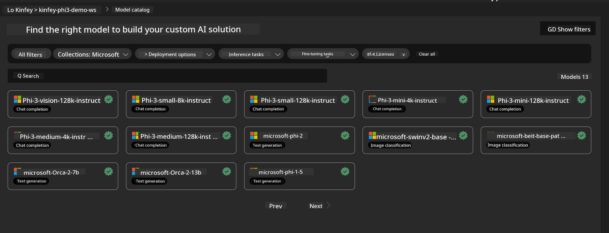
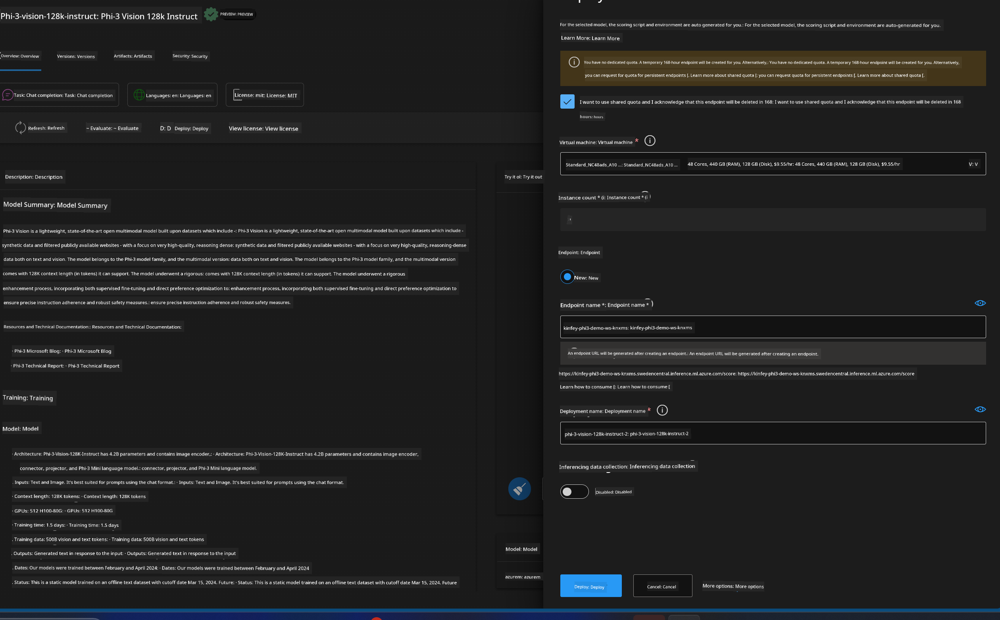
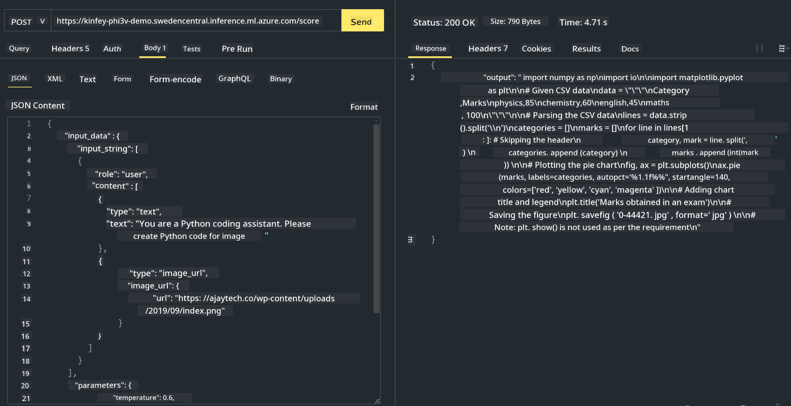

<!--
CO_OP_TRANSLATOR_METADATA:
{
  "original_hash": "20cb4e6ac1686248e8be913ccf6c2bc2",
  "translation_date": "2025-07-17T04:03:27+00:00",
  "source_file": "md/02.Application/02.Code/Phi3/VSCodeExt/HOL/AIPC/03.DeployPhi3VisionOnAzure.md",
  "language_code": "en"
}
-->
# **Lab 3 - Deploy Phi-3-vision on Azure Machine Learning Service**

We use NPU to complete the production deployment of local code, and then we want to introduce the ability to integrate PHI-3-VISION through it to generate code from images.

In this guide, we will quickly build a Model As Service Phi-3 Vision service in Azure Machine Learning Service.

***Note***: Phi-3 Vision requires computing power to generate content faster. We need cloud computing resources to help us achieve this.


### **1. Create Azure Machine Learning Service**

We need to create an Azure Machine Learning Service in the Azure Portal. If you want to learn how, please visit this link [https://learn.microsoft.com/azure/machine-learning/quickstart-create-resources?view=azureml-api-2](https://learn.microsoft.com/azure/machine-learning/quickstart-create-resources?view=azureml-api-2)


### **2. Choose Phi-3 Vision in Azure Machine Learning Service**




### **3. Deploy Phi-3-Vision in Azure**





### **4. Test Endpoint in Postman**





***Note***

1. The parameters you send must include Authorization, azureml-model-deployment, and Content-Type. You need to check the deployment details to get these.

2. To send parameters, Phi-3-Vision requires an image link. Please refer to the GPT-4-Vision method for sending parameters, for example

```json

{
  "input_data":{
    "input_string":[
      {
        "role":"user",
        "content":[ 
          {
            "type": "text",
            "text": "You are a Python coding assistant.Please create Python code for image "
          },
          {
              "type": "image_url",
              "image_url": {
                "url": "https://ajaytech.co/wp-content/uploads/2019/09/index.png"
              }
          }
        ]
      }
    ],
    "parameters":{
          "temperature": 0.6,
          "top_p": 0.9,
          "do_sample": false,
          "max_new_tokens": 2048
    }
  }
}

```

3. Call **/score** using the Post method

**Congratulations**! You have completed the quick PHI-3-VISION deployment and tested how to generate code from images. Next, we can build applications combining NPUs and cloud services.

**Disclaimer**:  
This document has been translated using the AI translation service [Co-op Translator](https://github.com/Azure/co-op-translator). While we strive for accuracy, please be aware that automated translations may contain errors or inaccuracies. The original document in its native language should be considered the authoritative source. For critical information, professional human translation is recommended. We are not liable for any misunderstandings or misinterpretations arising from the use of this translation.