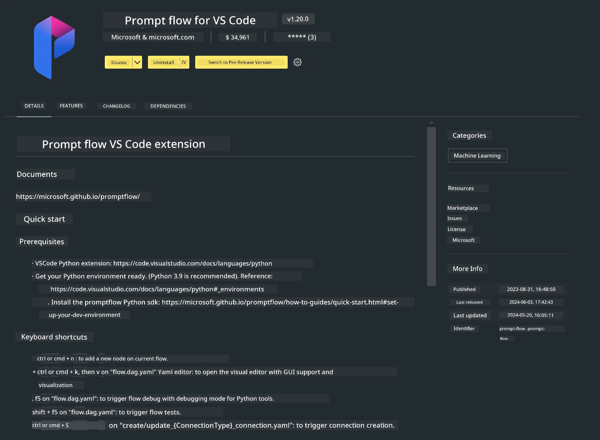

# **Lab 0 - Installation**

When starting the Lab, we need to set up the appropriate environment:

### **1. Python 3.11+**

It is recommended to use miniforge to set up your Python environment.

For miniforge setup, please refer to [https://github.com/conda-forge/miniforge](https://github.com/conda-forge/miniforge)

After setting up miniforge, run the following command in Power Shell

```bash

conda create -n pyenv python==3.11.8 -y

conda activate pyenv

```

### **2. Install Prompt flow SDK**

In Lab 1, we will use Prompt flow, so you need to install the Prompt flow SDK.

```bash

pip install promptflow --upgrade

```

You can verify the promptflow sdk with this command

```bash

pf --version

```

### **3. Install Visual Studio Code Prompt flow Extension**



### **4. Apple's MLX Framework**

MLX is an array framework for machine learning research on Apple silicon, developed by Apple machine learning research. You can use the **Apple MLX framework** to accelerate LLM / SLM with Apple Silicon. For more details, you can read [https://github.com/microsoft/PhiCookBook/blob/main/md/01.Introduction/03/MLX_Inference.md](https://github.com/microsoft/PhiCookBook/blob/main/md/01.Introduction/03/MLX_Inference.md).

Install the MLX framework library in bash

```bash

pip install mlx-lm

```

### **5. Other Python Libraries**

Create a requirements.txt file and add the following content

```txt

notebook
numpy 
scipy 
scikit-learn 
matplotlib 
pandas 
pillow 
graphviz

```

### **6. Install NVM**

Install nvm in Powershell

```bash

brew install nvm

```

Install nodejs 18.20

```bash

nvm install 18.20.0

nvm use 18.20.0

```

### **7. Install Visual Studio Code Development Support**

```bash

npm install --global yo generator-code

```

Congratulations! You have successfully set up the SDK. Next, proceed to the hands-on exercises.

**Disclaimer**:  
This document has been translated using the AI translation service [Co-op Translator](https://github.com/Azure/co-op-translator). While we strive for accuracy, please be aware that automated translations may contain errors or inaccuracies. The original document in its native language should be considered the authoritative source. For critical information, professional human translation is recommended. We are not liable for any misunderstandings or misinterpretations arising from the use of this translation.