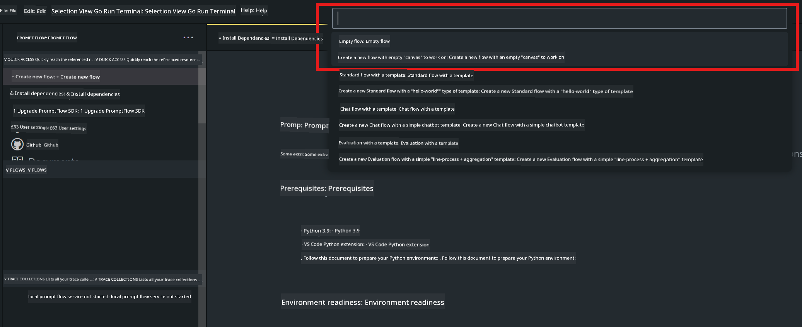
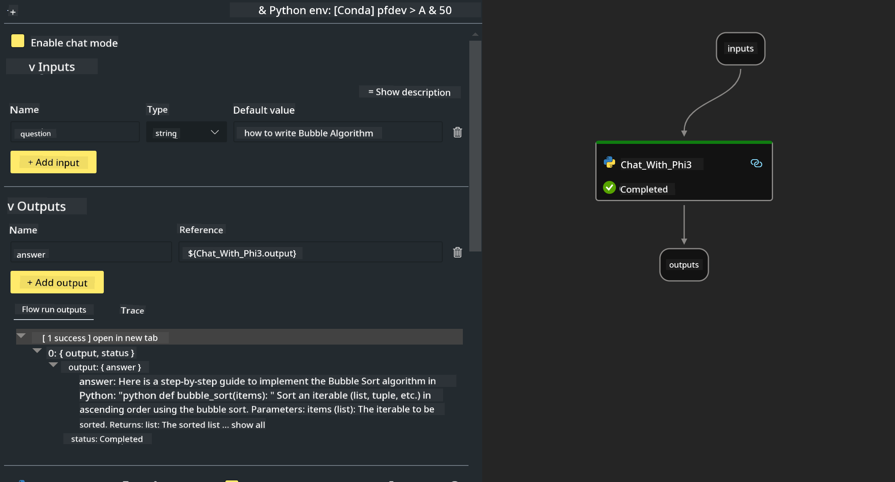

<!--
CO_OP_TRANSLATOR_METADATA:
{
  "original_hash": "3dbbf568625b1ee04b354c2dc81d3248",
  "translation_date": "2025-07-17T04:22:01+00:00",
  "source_file": "md/02.Application/02.Code/Phi3/VSCodeExt/HOL/Apple/02.PromptflowWithMLX.md",
  "language_code": "en"
}
-->
# **Lab 2 - Run Prompt flow with Phi-3-mini in AIPC**

## **What is Prompt flow**

Prompt flow is a set of development tools designed to simplify the entire development cycle of LLM-based AI applications, from ideation, prototyping, testing, and evaluation to production deployment and monitoring. It makes prompt engineering much easier and allows you to build LLM apps with production-level quality.

With prompt flow, you can:

- Create flows that connect LLMs, prompts, Python code, and other tools into an executable workflow.

- Debug and iterate your flows, especially interactions with LLMs, with ease.

- Evaluate your flows and calculate quality and performance metrics using larger datasets.

- Integrate testing and evaluation into your CI/CD system to ensure the quality of your flow.

- Deploy your flows to the serving platform of your choice or easily integrate them into your app’s codebase.

- (Optional but highly recommended) Collaborate with your team by using the cloud version of Prompt flow in Azure AI.

## **Building generation code flows on Apple Silicon**

***Note***: If you haven’t completed the environment setup, please visit [Lab 0 - Installations](./01.Installations.md)

1. Open the Prompt flow Extension in Visual Studio Code and create an empty flow project



2. Add Inputs and Outputs parameters and add Python Code as a new flow



You can refer to this structure (flow.dag.yaml) to build your flow

```yaml

inputs:
  prompt:
    type: string
    default: Write python code for Fibonacci serie. Please use markdown as output
outputs:
  result:
    type: string
    reference: ${gen_code_by_phi3.output}
nodes:
- name: gen_code_by_phi3
  type: python
  source:
    type: code
    path: gen_code_by_phi3.py
  inputs:
    prompt: ${inputs.prompt}


```

3. Quantize phi-3-mini

We want to better run SLM on local devices. Generally, we quantize the model (INT4, FP16, FP32)

```bash

python -m mlx_lm.convert --hf-path microsoft/Phi-3-mini-4k-instruct

```

**Note:** the default folder is mlx_model

4. Add code in ***Chat_With_Phi3.py***

```python


from promptflow import tool

from mlx_lm import load, generate


# The inputs section will change based on the arguments of the tool function, after you save the code
# Adding type to arguments and return value will help the system show the types properly
# Please update the function name/signature per need
@tool
def my_python_tool(prompt: str) -> str:

    model_id = './mlx_model_phi3_mini'

    model, tokenizer = load(model_id)

    # <|user|>\nWrite python code for Fibonacci serie. Please use markdown as output<|end|>\n<|assistant|>

    response = generate(model, tokenizer, prompt="<|user|>\n" + prompt  + "<|end|>\n<|assistant|>", max_tokens=2048, verbose=True)

    return response


```

4. You can test the flow by Debugging or Running to check if the generation code works properly


5. Run the flow as a development API in the terminal

```

pf flow serve --source ./ --port 8080 --host localhost   

```

You can test it in Postman / Thunder Client

### **Note**

1. The first run takes a long time. It is recommended to download the phi-3 model using the Hugging Face CLI.

2. Considering the limited computing power of Intel NPU, it is recommended to use Phi-3-mini-4k-instruct.

3. We use Intel NPU Acceleration to quantize with INT4 conversion, but if you restart the service, you need to delete the cache and nc_workshop folders.

## **Resources**

1. Learn Promptflow [https://microsoft.github.io/promptflow/](https://microsoft.github.io/promptflow/)

2. Learn Intel NPU Acceleration [https://github.com/intel/intel-npu-acceleration-library](https://github.com/intel/intel-npu-acceleration-library)

3. Sample Code, download [Local NPU Agent Sample Code](../../../../../../../../../code/07.Lab/01/AIPC/local-npu-agent)

**Disclaimer**:  
This document has been translated using the AI translation service [Co-op Translator](https://github.com/Azure/co-op-translator). While we strive for accuracy, please be aware that automated translations may contain errors or inaccuracies. The original document in its native language should be considered the authoritative source. For critical information, professional human translation is recommended. We are not liable for any misunderstandings or misinterpretations arising from the use of this translation.