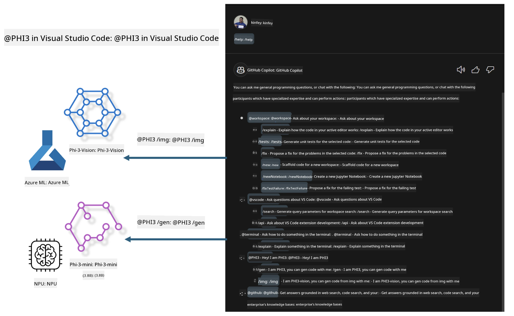

# **Build your own Visual Studio Code GitHub Copilot Chat with Microsoft Phi-3 Family**

Have you tried the workspace agent in GitHub Copilot Chat? Want to create a custom code agent for your team? This hands-on lab aims to combine open source models to build an enterprise-grade code business agent.

## **Foundation**

### **Why choose Microsoft Phi-3**

Phi-3 is a family of models, including phi-3-mini, phi-3-small, and phi-3-medium, each trained with different parameters for text generation, dialogue completion, and code generation. There is also phi-3-vision, which is vision-based. It’s ideal for enterprises or teams looking to build offline generative AI solutions.

Recommended reading: [https://github.com/microsoft/PhiCookBook/blob/main/md/01.Introduction/01/01.PhiFamily.md](https://github.com/microsoft/PhiCookBook/blob/main/md/01.Introduction/01/01.PhiFamily.md)

### **Microsoft GitHub Copilot Chat**

The GitHub Copilot Chat extension provides a chat interface that lets you interact with GitHub Copilot and get coding-related answers directly inside VS Code, without needing to browse documentation or search forums.

Copilot Chat may use syntax highlighting, indentation, and other formatting to make responses clearer. Depending on your question, the response might include links to context Copilot used, like source code files or documentation, or buttons to access VS Code features.

- Copilot Chat fits into your developer workflow and helps where you need it:

- Start an inline chat directly from the editor or terminal for coding help

- Use the Chat view to have an AI assistant ready anytime

- Launch Quick Chat to ask a quick question and get back to work

You can use GitHub Copilot Chat for:

- Answering coding questions on the best way to solve problems

- Explaining others’ code and suggesting improvements

- Proposing code fixes

- Generating unit tests

- Creating code documentation

Recommended reading: [https://code.visualstudio.com/docs/copilot/copilot-chat](https://code.visualstudio.com/docs/copilot/copilot-chat?WT.mc_id=aiml-137032-kinfeylo)

### **Microsoft GitHub Copilot Chat @workspace**

Using **@workspace** in Copilot Chat lets you ask questions about your entire codebase. Based on your query, Copilot smartly retrieves relevant files and symbols, referencing them in its answer with links and code examples.

To answer your question, **@workspace** searches the same sources a developer would when navigating a codebase in VS Code:

- All files in the workspace, except those ignored by a .gitignore file

- Directory structure including nested folders and file names

- GitHub’s code search index, if the workspace is a GitHub repo indexed by code search

- Symbols and definitions in the workspace

- Currently selected or visible text in the active editor

Note: .gitignore is ignored if you have a file open or text selected inside an ignored file.

Recommended reading: [[https://code.visualstudio.com/docs/copilot/copilot-chat](https://code.visualstudio.com/docs/copilot/workspace-context?WT.mc_id=aiml-137032-kinfeylo)]

## **Learn more about this Lab**

GitHub Copilot has significantly boosted programming efficiency in enterprises, and many want to customize its features. Many companies have built custom Extensions similar to GitHub Copilot tailored to their business needs using open source models. Custom Extensions are easier to control but can impact user experience. After all, GitHub Copilot excels in handling general scenarios and professional tasks. Maintaining a consistent experience while customizing features offers a better user experience. GitHub Copilot Chat provides APIs for enterprises to extend the Chat experience. Keeping a consistent experience with custom features is ideal.

This lab mainly uses the Phi-3 model combined with local NPU and Azure hybrid to build a custom Agent in GitHub Copilot Chat ***@PHI3*** to assist enterprise developers with code generation ***(@PHI3 /gen)*** and image-based code generation ***(@PHI3 /img)***.

### ***Note:***

This lab currently runs on Intel CPU AIPC and Apple Silicon. We will continue updating with a Qualcomm NPU version.

## **Lab**

| Name | Description | AIPC | Apple |
| ------------ | ----------- | -------- |-------- |
| Lab0 - Installations(✅) | Set up and install related environments and tools | [Go](./HOL/AIPC/01.Installations.md) |[Go](./HOL/Apple/01.Installations.md) |
| Lab1 - Run Prompt flow with Phi-3-mini (✅) | Use local NPU with AIPC / Apple Silicon to create code generation via Phi-3-mini | [Go](./HOL/AIPC/02.PromptflowWithNPU.md) |  [Go](./HOL/Apple/02.PromptflowWithMLX.md) |
| Lab2 - Deploy Phi-3-vision on Azure Machine Learning Service(✅) | Generate code by deploying Phi-3-vision image from Azure Machine Learning Service’s Model Catalog | [Go](./HOL/AIPC/03.DeployPhi3VisionOnAzure.md) |[Go](./HOL/Apple/03.DeployPhi3VisionOnAzure.md) |
| Lab3 - Create a @phi-3 agent in GitHub Copilot Chat(✅)  | Build a custom Phi-3 agent in GitHub Copilot Chat for code generation, graph code generation, RAG, and more | [Go](./HOL/AIPC/04.CreatePhi3AgentInVSCode.md) | [Go](./HOL/Apple/04.CreatePhi3AgentInVSCode.md) |
| Sample Code (✅)  | Download sample code | [Go](../../../../../../../code/07.Lab/01/AIPC) | [Go](../../../../../../../code/07.Lab/01/Apple) |

## **Resources**

1. Phi-3 Cookbook [https://github.com/microsoft/Phi-3CookBook](https://github.com/microsoft/Phi-3CookBook)

2. Learn more about GitHub Copilot [https://learn.microsoft.com/training/paths/copilot/](https://learn.microsoft.com/training/paths/copilot/?WT.mc_id=aiml-137032-kinfeylo)

3. Learn more about GitHub Copilot Chat [https://learn.microsoft.com/training/paths/accelerate-app-development-using-github-copilot/](https://learn.microsoft.com/training/paths/accelerate-app-development-using-github-copilot/?WT.mc_id=aiml-137032-kinfeylo)

4. Learn more about GitHub Copilot Chat API [https://code.visualstudio.com/api/extension-guides/chat](https://code.visualstudio.com/api/extension-guides/chat?WT.mc_id=aiml-137032-kinfeylo)

5. Learn more about Azure AI Foundry [https://learn.microsoft.com/training/paths/create-custom-copilots-ai-studio/](https://learn.microsoft.com/training/paths/create-custom-copilots-ai-studio/?WT.mc_id=aiml-137032-kinfeylo)

6. Learn more about Azure AI Foundry's Model Catalog [https://learn.microsoft.com/azure/ai-studio/how-to/model-catalog-overview](https://learn.microsoft.com/azure/ai-studio/how-to/model-catalog-overview)

**Disclaimer**:  
This document has been translated using the AI translation service [Co-op Translator](https://github.com/Azure/co-op-translator). While we strive for accuracy, please be aware that automated translations may contain errors or inaccuracies. The original document in its native language should be considered the authoritative source. For critical information, professional human translation is recommended. We are not liable for any misunderstandings or misinterpretations arising from the use of this translation.