<!--
CO_OP_TRANSLATOR_METADATA:
{
  "original_hash": "c1559c5af6caccf6f623fd43a6b3a9a3",
  "translation_date": "2025-07-17T05:53:37+00:00",
  "source_file": "md/03.FineTuning/FineTuning_AIFoundry.md",
  "language_code": "en"
}
-->
# Fine-tuning Phi-3 with Azure AI Foundry

Let’s explore how to fine-tune Microsoft’s Phi-3 Mini language model using Azure AI Foundry. Fine-tuning lets you adapt Phi-3 Mini to specific tasks, making it more powerful and context-aware.

## Considerations

- **Capabilities:** Which models can be fine-tuned? What can the base model be fine-tuned to do?
- **Cost:** What is the pricing model for fine-tuning?
- **Customizability:** How much can I modify the base model – and in what ways?
- **Convenience:** How does fine-tuning actually work – do I need to write custom code? Do I need to provide my own compute?
- **Safety:** Fine-tuned models can have safety risks – are there guardrails to prevent unintended harm?

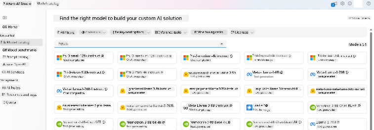

## Preparation for fine-tuning

### Prerequisites

> [!NOTE]
> For Phi-3 family models, the pay-as-you-go fine-tuning option is only available with hubs created in the **East US 2** region.

- An Azure subscription. If you don’t have one, create a [paid Azure account](https://azure.microsoft.com/pricing/purchase-options/pay-as-you-go) to get started.

- An [AI Foundry project](https://ai.azure.com?WT.mc_id=aiml-138114-kinfeylo).
- Azure role-based access controls (Azure RBAC) are used to grant access to Azure AI Foundry operations. To follow the steps in this article, your user account must have the __Azure AI Developer role__ assigned on the resource group.

### Subscription provider registration

Make sure your subscription is registered with the `Microsoft.Network` resource provider.

1. Sign in to the [Azure portal](https://portal.azure.com).
2. Select **Subscriptions** from the left menu.
3. Choose the subscription you want to use.
4. Select **AI project settings** > **Resource providers** from the left menu.
5. Confirm that **Microsoft.Network** is listed. If not, add it.

### Data preparation

Prepare your training and validation data to fine-tune your model. These datasets should include input-output examples demonstrating how you want the model to perform.

Ensure all training examples follow the expected format for inference. To fine-tune effectively, use a balanced and diverse dataset.

This means maintaining data balance, including various scenarios, and regularly refining your training data to reflect real-world expectations, which leads to more accurate and balanced model responses.

Different model types require different training data formats.

### Chat Completion

Your training and validation data **must** be formatted as a JSON Lines (JSONL) file. For `Phi-3-mini-128k-instruct`, the fine-tuning dataset must follow the conversational format used by the Chat completions API.

### Example file format

```json
    {"messages": [{"role": "system", "content": "You are an Xbox customer support agent whose primary goal is to help users with issues they are experiencing with their Xbox devices. You are friendly and concise. You only provide factual answers to queries, and do not provide answers that are not related to Xbox."}, {"role": "user", "content": "Is Xbox better than PlayStation?"}, {"role": "assistant", "content": "I apologize, but I cannot provide personal opinions. My primary job is to assist you with any issues related to your Xbox device. Do you have any Xbox-related issues that need addressing?"}]}
    {"messages": [{"role": "system", "content": "You are an Xbox customer support agent whose primary goal is to help users with issues they are experiencing with their Xbox devices. You are friendly and concise. You only provide factual answers to queries, and do not provide answers that are not related to Xbox."}, {"role": "user", "content": "Can I play PC games on my Xbox?"}, {"role": "assistant", "content": "While Xbox consoles don't natively support PC games, they can play an array of Xbox games, many of which are also available on PC. Can I assist you with finding games compatible with your Xbox device?"}]}
    {"messages": [{"role": "system", "content": "You are an Xbox customer support agent whose primary goal is to help users with issues they are experiencing with their Xbox devices. You are friendly and concise. You only provide factual answers to queries, and do not provide answers that are not related to Xbox."}, {"role": "user", "content": "I'm having trouble connecting my Xbox to the Wi-Fi."}, {"role": "assistant", "content": "No worries, let's go through the network settings on your Xbox. Can you please tell me what happens when you try to connect it to the Wi-Fi?"}]}
```

The supported file type is JSON Lines. Files are uploaded to the default datastore and made available in your project.

## Fine-Tuning Phi-3 with Azure AI Foundry

Azure AI Foundry allows you to customize large language models with your own datasets through fine-tuning. Fine-tuning adds value by enabling customization and optimization for specific tasks and applications. It improves performance, reduces costs and latency, and produces tailored outputs.

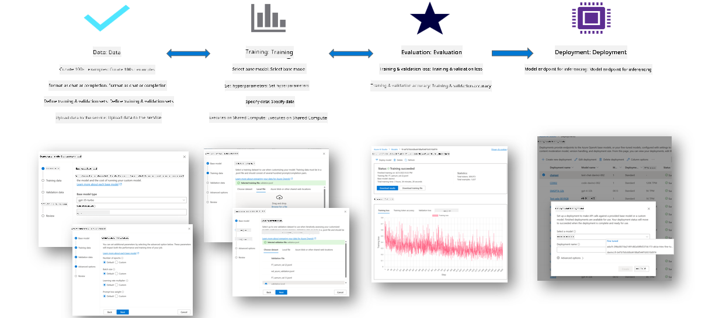

### Create a New Project

1. Sign in to [Azure AI Foundry](https://ai.azure.com).

2. Select **+New project** to create a new project in Azure AI Foundry.

    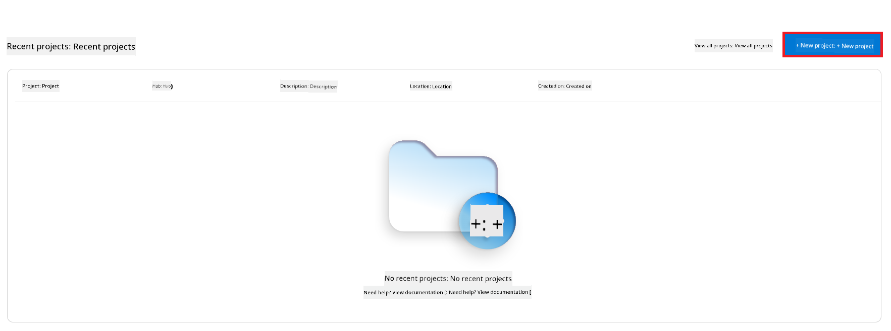

3. Complete the following:

    - Enter a unique **Hub name**.
    - Select the **Hub** to use (or create a new one if needed).

    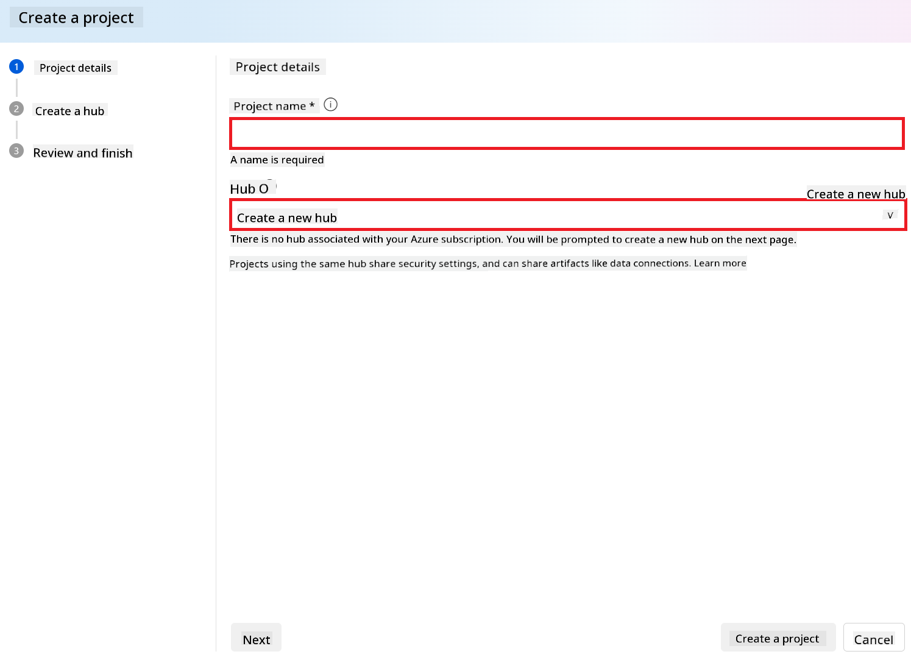

4. To create a new hub, provide:

    - A unique **Hub name**.
    - Your Azure **Subscription**.
    - The **Resource group** to use (or create a new one).
    - The **Location** you want to use.
    - The **Connect Azure AI Services** to use (or create a new one).
    - For **Connect Azure AI Search**, select **Skip connecting**.

    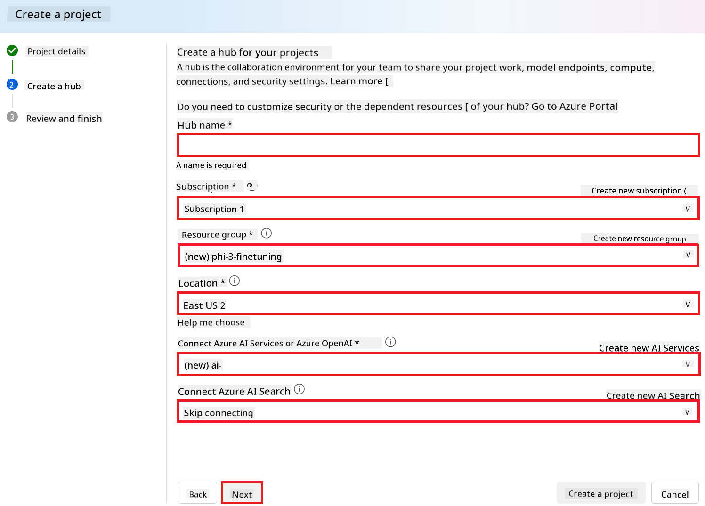

5. Select **Next**.
6. Select **Create a project**.

### Data Preparation

Before fine-tuning, collect or create a dataset relevant to your task, such as chat instructions, question-answer pairs, or other relevant text data. Clean and preprocess this data by removing noise, handling missing values, and tokenizing the text.

### Fine-tune Phi-3 models in Azure AI Foundry

> [!NOTE]
> Fine-tuning of Phi-3 models is currently supported only in projects located in East US 2.

1. Select **Model catalog** from the left menu.

2. Search for *phi-3* in the **search bar** and select the Phi-3 model you want to use.

    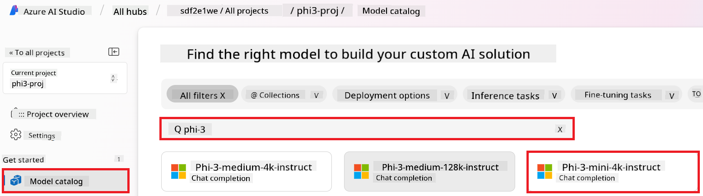

3. Select **Fine-tune**.

    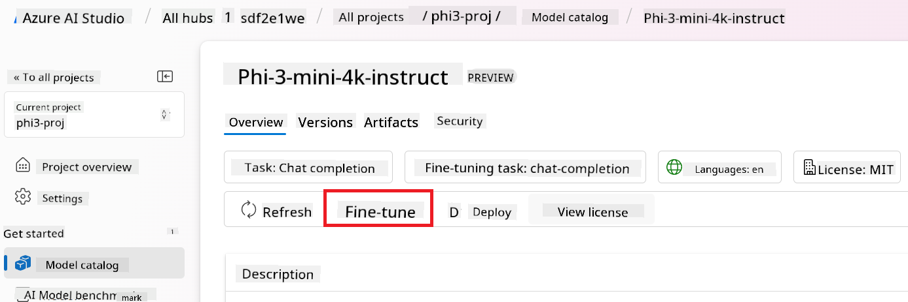

4. Enter the **Fine-tuned model name**.

    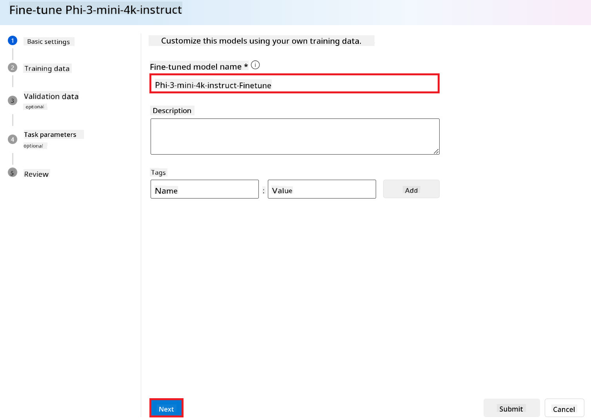

5. Select **Next**.

6. Complete the following:

    - Choose **task type** as **Chat completion**.
    - Select the **Training data** you want to use. You can upload it via Azure AI Foundry’s data or from your local environment.

    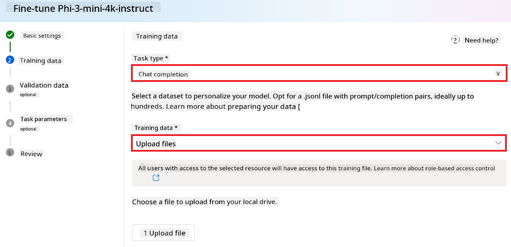

7. Select **Next**.

8. Upload the **Validation data** you want to use, or select **Automatic split of training data**.

    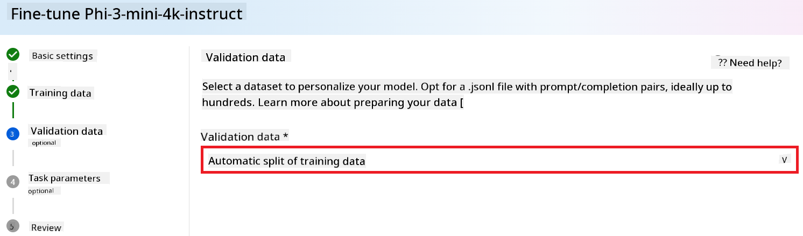

9. Select **Next**.

10. Set the following:

    - Choose the **Batch size multiplier**.
    - Choose the **Learning rate**.
    - Choose the number of **Epochs**.

    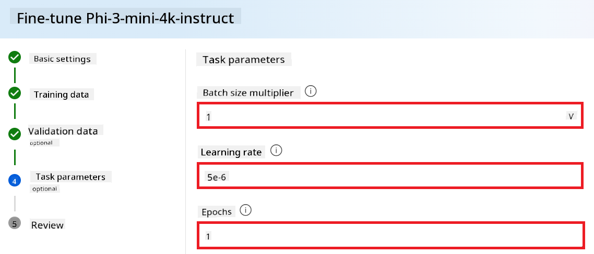

11. Select **Submit** to start fine-tuning.

    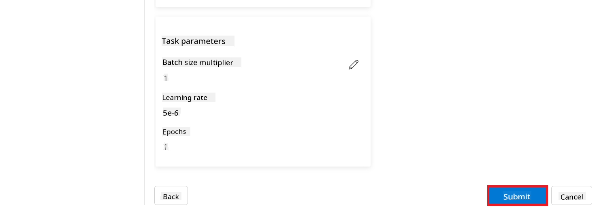

12. When your model is fine-tuned, its status will show as **Completed**, as in the image below. You can now deploy the model and use it in your application, the playground, or prompt flow. For more details, see [How to deploy Phi-3 family of small language models with Azure AI Foundry](https://learn.microsoft.com/azure/ai-studio/how-to/deploy-models-phi-3?tabs=phi-3-5&pivots=programming-language-python).

    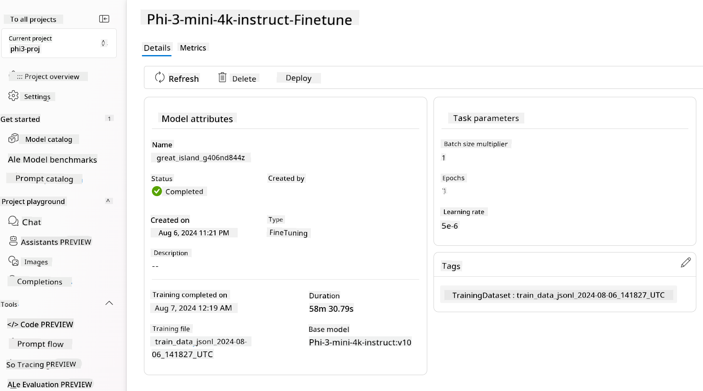

> [!NOTE]
> For more detailed information on fine-tuning Phi-3, visit [Fine-tune Phi-3 models in Azure AI Foundry](https://learn.microsoft.com/azure/ai-studio/how-to/fine-tune-phi-3?tabs=phi-3-mini).

## Cleaning up your fine-tuned models

You can delete a fine-tuned model from the fine-tuning model list in [Azure AI Foundry](https://ai.azure.com) or from the model details page. Select the fine-tuned model you want to delete on the Fine-tuning page, then click the Delete button.

> [!NOTE]
> You cannot delete a custom model if it has an active deployment. You must delete the deployment first before deleting the custom model.

## Cost and quotas

### Cost and quota considerations for Phi-3 models fine-tuned as a service

Phi models fine-tuned as a service are provided by Microsoft and integrated with Azure AI Foundry. Pricing details are available when [deploying](https://learn.microsoft.com/azure/ai-studio/how-to/deploy-models-phi-3?tabs=phi-3-5&pivots=programming-language-python) or fine-tuning models under the Pricing and terms tab in the deployment wizard.

## Content filtering

Models deployed as a pay-as-you-go service are protected by Azure AI Content Safety. When deployed to real-time endpoints, you can opt out of this feature. With Azure AI Content Safety enabled, both prompts and completions are checked by a set of classification models designed to detect and prevent harmful content. The content filtering system identifies and acts on specific categories of potentially harmful content in both input prompts and output completions. Learn more about [Azure AI Content Safety](https://learn.microsoft.com/azure/ai-studio/concepts/content-filtering).

**Fine-Tuning Configuration**

Hyperparameters: Set hyperparameters like learning rate, batch size, and number of training epochs.

**Loss Function**

Choose a suitable loss function for your task (e.g., cross-entropy).

**Optimizer**

Select an optimizer (e.g., Adam) for updating gradients during training.

**Fine-Tuning Process**

- Load Pre-Trained Model: Load the Phi-3 Mini checkpoint.
- Add Custom Layers: Add task-specific layers (e.g., classification head for chat instructions).

**Train the Model**

Fine-tune the model using your prepared dataset. Monitor training progress and adjust hyperparameters as needed.

**Evaluation and Validation**

Validation Set: Split your data into training and validation sets.

**Evaluate Performance**

Use metrics like accuracy, F1-score, or perplexity to measure model performance.

## Save Fine-Tuned Model

**Checkpoint**

Save the fine-tuned model checkpoint for future use.

## Deployment

- Deploy as a Web Service: Deploy your fine-tuned model as a web service in Azure AI Foundry.
- Test the Endpoint: Send test queries to the deployed endpoint to verify it works.

## Iterate and Improve

Iterate: If performance isn’t satisfactory, adjust hyperparameters, add more data, or fine-tune for more epochs.

## Monitor and Refine

Continuously monitor the model’s behavior and refine it as needed.

## Customize and Extend

Custom Tasks: Phi-3 Mini can be fine-tuned for many tasks beyond chat instructions. Explore other use cases!
Experiment: Try different architectures, layer combinations, and techniques to improve performance.

> [!NOTE]
> Fine-tuning is an iterative process. Experiment, learn, and adapt your model to get the best results for your specific task!

**Disclaimer**:  
This document has been translated using the AI translation service [Co-op Translator](https://github.com/Azure/co-op-translator). While we strive for accuracy, please be aware that automated translations may contain errors or inaccuracies. The original document in its native language should be considered the authoritative source. For critical information, professional human translation is recommended. We are not liable for any misunderstandings or misinterpretations arising from the use of this translation.