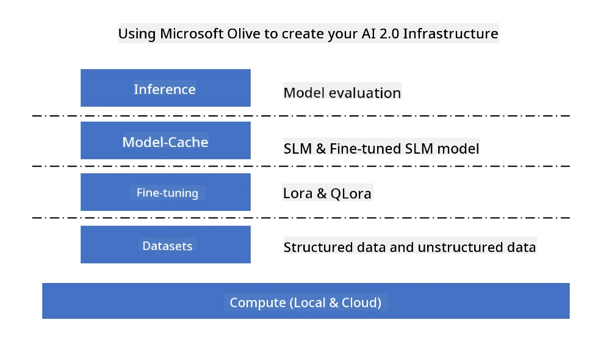
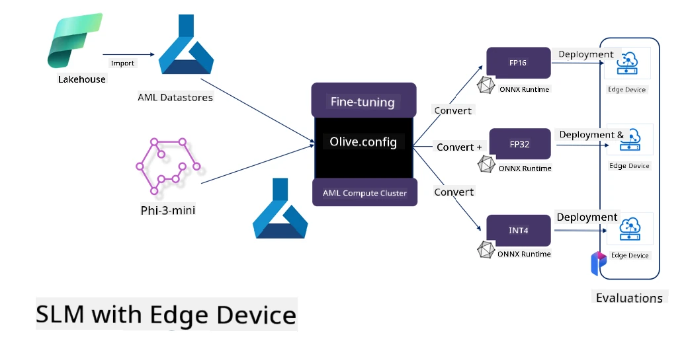

# **Fine-tuning Phi-3 with Microsoft Olive**

[Olive](https://github.com/microsoft/OLive?WT.mc_id=aiml-138114-kinfeylo) is an easy-to-use hardware-aware model optimization tool that combines industry-leading techniques in model compression, optimization, and compilation.

It’s designed to simplify the process of optimizing machine learning models, ensuring they make the most efficient use of specific hardware architectures.

Whether you’re working on cloud-based applications or edge devices, Olive lets you optimize your models quickly and effectively.

## Key Features:
- Olive integrates and automates optimization techniques tailored for specific hardware targets.
- Since no single optimization method fits all cases, Olive supports extensibility by allowing experts to plug in their own optimization innovations.

## Reduce Engineering Effort:
- Developers often need to learn and use multiple hardware vendor-specific toolchains to prepare and optimize trained models for deployment.
- Olive streamlines this by automating optimization techniques for the target hardware.

## Ready-to-Use End-to-End Optimization Solution:

By combining and tuning integrated techniques, Olive provides a unified solution for end-to-end optimization.
It considers constraints like accuracy and latency while optimizing models.

## Using Microsoft Olive for Fine-tuning

Microsoft Olive is a very user-friendly open source model optimization tool that supports both fine-tuning and inference in the field of generative AI. With simple configuration, combined with open source small language models and related runtime environments (AzureML / local GPU, CPU, DirectML), you can complete fine-tuning or inference through automatic optimization, and find the best model to deploy on the cloud or edge devices. This enables enterprises to build their own industry-specific models both on-premises and in the cloud.



## Phi-3 Fine Tuning with Microsoft Olive



## Phi-3 Olive Sample Code and Example
In this example, you’ll use Olive to:

- Fine-tune a LoRA adapter to classify phrases into Sad, Joy, Fear, Surprise.
- Merge the adapter weights into the base model.
- Optimize and quantize the model to int4.

[Sample Code](../../code/03.Finetuning/olive-ort-example/README.md)

### Setup Microsoft Olive

Installing Microsoft Olive is very straightforward and supports CPU, GPU, DirectML, and Azure ML.

```bash
pip install olive-ai
```

If you want to run an ONNX model on CPU, you can use

```bash
pip install olive-ai[cpu]
```

If you want to run an ONNX model on GPU, you can use

```python
pip install olive-ai[gpu]
```

If you want to use Azure ML, use

```python
pip install git+https://github.com/microsoft/Olive#egg=olive-ai[azureml]
```

**Notice**  
OS requirement: Ubuntu 20.04 / 22.04

### **Microsoft Olive’s Config.json**

After installation, you can configure various model-specific settings through the Config file, including data, compute, training, deployment, and model generation.

**1. Data**

Microsoft Olive supports training on both local and cloud data, which can be configured in the settings.

*Local data settings*

You can simply set up the dataset for fine-tuning, usually in JSON format, and adapt it using the data template. This should be adjusted based on the model’s requirements (for example, adapt it to the format required by Microsoft Phi-3-mini. For other models, please refer to their specific fine-tuning format requirements).

```json

    "data_configs": [
        {
            "name": "dataset_default_train",
            "type": "HuggingfaceContainer",
            "load_dataset_config": {
                "params": {
                    "data_name": "json", 
                    "data_files":"dataset/dataset-classification.json",
                    "split": "train"
                }
            },
            "pre_process_data_config": {
                "params": {
                    "dataset_type": "corpus",
                    "text_cols": [
                            "phrase",
                            "tone"
                    ],
                    "text_template": "### Text: {phrase}\n### The tone is:\n{tone}",
                    "corpus_strategy": "join",
                    "source_max_len": 2048,
                    "pad_to_max_len": false,
                    "use_attention_mask": false
                }
            }
        }
    ],
```

**Cloud data source settings**

By linking the datastore of Azure AI Studio/Azure Machine Learning Service, you can connect cloud data. You can choose to import different data sources into Azure AI Studio/Azure Machine Learning Service via Microsoft Fabric and Azure Data to support fine-tuning.

```json

    "data_configs": [
        {
            "name": "dataset_default_train",
            "type": "HuggingfaceContainer",
            "load_dataset_config": {
                "params": {
                    "data_name": "json", 
                    "data_files": {
                        "type": "azureml_datastore",
                        "config": {
                            "azureml_client": {
                                "subscription_id": "Your Azure Subscrition ID",
                                "resource_group": "Your Azure Resource Group",
                                "workspace_name": "Your Azure ML Workspaces name"
                            },
                            "datastore_name": "workspaceblobstore",
                            "relative_path": "Your train_data.json Azure ML Location"
                        }
                    },
                    "split": "train"
                }
            },
            "pre_process_data_config": {
                "params": {
                    "dataset_type": "corpus",
                    "text_cols": [
                            "Question",
                            "Best Answer"
                    ],
                    "text_template": "<|user|>\n{Question}<|end|>\n<|assistant|>\n{Best Answer}\n<|end|>",
                    "corpus_strategy": "join",
                    "source_max_len": 2048,
                    "pad_to_max_len": false,
                    "use_attention_mask": false
                }
            }
        }
    ],
    
```

**2. Compute configuration**

If you want to run locally, you can use local data resources directly. If you want to use Azure AI Studio / Azure Machine Learning Service resources, you need to configure the relevant Azure parameters, compute cluster name, etc.

```json

    "systems": {
        "aml": {
            "type": "AzureML",
            "config": {
                "accelerators": ["gpu"],
                "hf_token": true,
                "aml_compute": "Your Azure AI Studio / Azure Machine Learning Service Compute Name",
                "aml_docker_config": {
                    "base_image": "Your Azure AI Studio / Azure Machine Learning Service docker",
                    "conda_file_path": "conda.yaml"
                }
            }
        },
        "azure_arc": {
            "type": "AzureML",
            "config": {
                "accelerators": ["gpu"],
                "aml_compute": "Your Azure AI Studio / Azure Machine Learning Service Compute Name",
                "aml_docker_config": {
                    "base_image": "Your Azure AI Studio / Azure Machine Learning Service docker",
                    "conda_file_path": "conda.yaml"
                }
            }
        }
    },
```

***Notice***

Since it runs through a container on Azure AI Studio/Azure Machine Learning Service, the required environment must be configured. This is done in the conda.yaml environment.

```yaml

name: project_environment
channels:
  - defaults
dependencies:
  - python=3.8.13
  - pip=22.3.1
  - pip:
      - einops
      - accelerate
      - azure-keyvault-secrets
      - azure-identity
      - bitsandbytes
      - datasets
      - huggingface_hub
      - peft
      - scipy
      - sentencepiece
      - torch>=2.2.0
      - transformers
      - git+https://github.com/microsoft/Olive@jiapli/mlflow_loading_fix#egg=olive-ai[gpu]
      - --extra-index-url https://aiinfra.pkgs.visualstudio.com/PublicPackages/_packaging/ORT-Nightly/pypi/simple/ 
      - ort-nightly-gpu==1.18.0.dev20240307004
      - --extra-index-url https://aiinfra.pkgs.visualstudio.com/PublicPackages/_packaging/onnxruntime-genai/pypi/simple/
      - onnxruntime-genai-cuda

    

```

**3. Choose your SLM**

You can use a model directly from Hugging Face, or combine it with the Model Catalog of Azure AI Studio / Azure Machine Learning to select the model. In the example below, we use Microsoft Phi-3-mini.

If you have the model locally, you can use this method:

```json

    "input_model":{
        "type": "PyTorchModel",
        "config": {
            "hf_config": {
                "model_name": "model-cache/microsoft/phi-3-mini",
                "task": "text-generation",
                "model_loading_args": {
                    "trust_remote_code": true
                }
            }
        }
    },
```

If you want to use a model from Azure AI Studio / Azure Machine Learning Service, you can use this method:

```json

    "input_model":{
        "type": "PyTorchModel",
        "config": {
            "model_path": {
                "type": "azureml_registry_model",
                "config": {
                    "name": "microsoft/Phi-3-mini-4k-instruct",
                    "registry_name": "azureml-msr",
                    "version": "11"
                }
            },
             "model_file_format": "PyTorch.MLflow",
             "hf_config": {
                "model_name": "microsoft/Phi-3-mini-4k-instruct",
                "task": "text-generation",
                "from_pretrained_args": {
                    "trust_remote_code": true
                }
            }
        }
    },
```

**Notice:**  
Integration with Azure AI Studio / Azure Machine Learning Service is required, so when setting up the model, please refer to the version number and related naming conventions.

All models on Azure must be set to PyTorch.MLflow.

You need a Hugging Face account and must bind the key to the Key value in Azure AI Studio / Azure Machine Learning.

**4. Algorithm**

Microsoft Olive encapsulates LoRA and QLoRA fine-tuning algorithms very well. You only need to configure some relevant parameters. Here, QLoRA is used as an example.

```json
        "lora": {
            "type": "LoRA",
            "config": {
                "target_modules": [
                    "o_proj",
                    "qkv_proj"
                ],
                "double_quant": true,
                "lora_r": 64,
                "lora_alpha": 64,
                "lora_dropout": 0.1,
                "train_data_config": "dataset_default_train",
                "eval_dataset_size": 0.3,
                "training_args": {
                    "seed": 0,
                    "data_seed": 42,
                    "per_device_train_batch_size": 1,
                    "per_device_eval_batch_size": 1,
                    "gradient_accumulation_steps": 4,
                    "gradient_checkpointing": false,
                    "learning_rate": 0.0001,
                    "num_train_epochs": 3,
                    "max_steps": 10,
                    "logging_steps": 10,
                    "evaluation_strategy": "steps",
                    "eval_steps": 187,
                    "group_by_length": true,
                    "adam_beta2": 0.999,
                    "max_grad_norm": 0.3
                }
            }
        },
```

If you want quantization conversion, the main branch of Microsoft Olive already supports the onnxruntime-genai method. You can configure it as needed:

1. Merge adapter weights into the base model  
2. Convert the model to an ONNX model with the required precision using ModelBuilder

For example, converting to quantized INT4.

```json

        "merge_adapter_weights": {
            "type": "MergeAdapterWeights"
        },
        "builder": {
            "type": "ModelBuilder",
            "config": {
                "precision": "int4"
            }
        }
```

**Notice**  
- If you use QLoRA, quantization conversion with ONNXRuntime-genai is currently not supported.  
- You can configure the above steps according to your needs. It’s not necessary to complete all steps. Depending on your requirements, you can directly use the algorithm steps without fine-tuning. Finally, you need to configure the relevant engines.

```json

    "engine": {
        "log_severity_level": 0,
        "host": "aml",
        "target": "aml",
        "search_strategy": false,
        "execution_providers": ["CUDAExecutionProvider"],
        "cache_dir": "../model-cache/models/phi3-finetuned/cache",
        "output_dir" : "../model-cache/models/phi3-finetuned"
    }
```

**5. Finished fine-tuning**

Run the following command in the directory containing olive-config.json:

```bash
olive run --config olive-config.json  
```

**Disclaimer**:  
This document has been translated using the AI translation service [Co-op Translator](https://github.com/Azure/co-op-translator). While we strive for accuracy, please be aware that automated translations may contain errors or inaccuracies. The original document in its native language should be considered the authoritative source. For critical information, professional human translation is recommended. We are not liable for any misunderstandings or misinterpretations arising from the use of this translation.