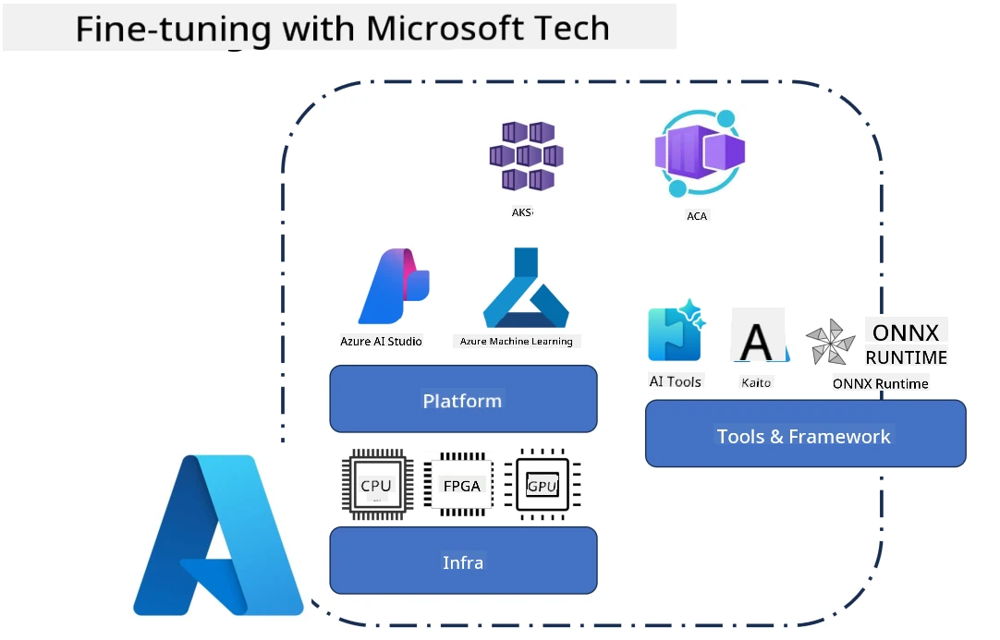
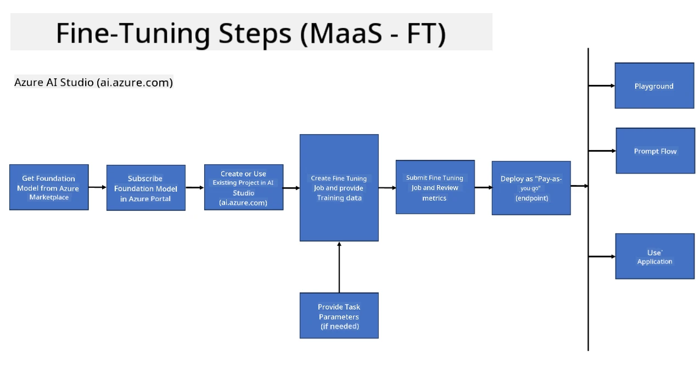
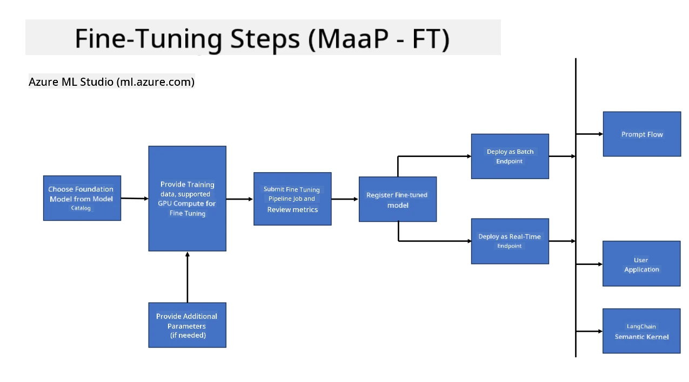
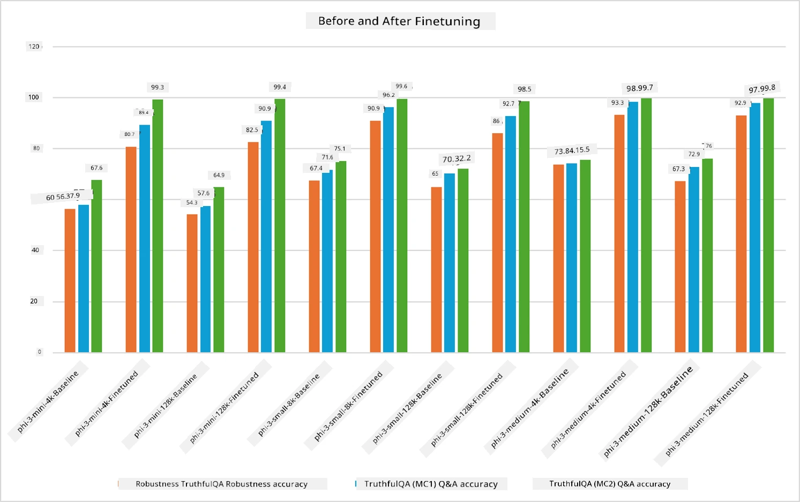

## Fine Tuning Scenarios

This section provides an overview of fine-tuning scenarios in Microsoft Foundry and Azure environments, including deployment models, infrastructure layers, and commonly used optimization techniques.

**Platform**  
This includes managed services such as Microsoft Foundry (formerly Azure AI Foundry) and Azure Machine Learning, which provide model management, orchestration, experiment tracking, and deployment workflows.

**Infrastructure**  
Fine-tuning requires scalable compute resources. In Azure environments, this typically includes GPU-based virtual machines and CPU resources for lightweight workloads, along with scalable storage for datasets and checkpoints.

**Tools & Framework**  
Fine-tuning workflows commonly rely on frameworks and optimization libraries such as Hugging Face Transformers, DeepSpeed, and PEFT (Parameter-Efficient Fine-Tuning).

The fine-tuning process with Microsoft technologies spans platform services, compute infrastructure, and training frameworks. By understanding how these components work together, developers can efficiently adapt foundation models to specific tasks and production scenarios.

## Model as Service

Fine-tune the model using hosted fine-tuning, without the need to create and manage compute.

Serverless fine-tuning is now available for Phi-3, Phi-3.5, and Phi-4 model families, enabling developers to quickly and easily customize the models for cloud and edge scenarios without having to arrange for compute.

## Model as a Platform 

Users manage their own compute in order to Fine-tune their models.

[Fine Tuning Sample](https://github.com/Azure/azureml-examples/blob/main/sdk/python/foundation-models/system/finetune/chat-completion/chat-completion.ipynb)

## Fine-Tuning Techniques Comparison

|Scenario|LoRA|QLoRA|PEFT|DeepSpeed|ZeRO|DoRA|
|---|---|---|---|---|---|---|
|Adapting pre-trained LLMs to specific tasks or domains|Yes|Yes|Yes|Yes|Yes|Yes|
|Fine-tuning for NLP tasks such as text classification, named entity recognition, and machine translation|Yes|Yes|Yes|Yes|Yes|Yes|
|Fine-tuning for QA tasks|Yes|Yes|Yes|Yes|Yes|Yes|
|Fine-tuning for generating human-like responses in chatbots|Yes|Yes|Yes|Yes|Yes|Yes|
|Fine-tuning for generating music, art, or other forms of creativity|Yes|Yes|Yes|Yes|Yes|Yes|
|Reducing computational and financial costs|Yes|Yes|Yes|Yes|Yes|Yes|
|Reducing memory usage|Yes|Yes|Yes|Yes|Yes|Yes|
|Using fewer parameters for efficient finetuning|Yes|Yes|Yes|No|No|Yes|
|Memory-efficient form of data parallelism that gives access to the aggregate GPU memory of all the GPU devices available|No|No|No|Yes|Yes|No|

> [!NOTE]
> LoRA, QLoRA, PEFT, and DoRA are parameter-efficient fine-tuning methods, whereas DeepSpeed and ZeRO focus on distributed training and memory optimization.

## Fine Tuning Performance Examples

---

<!-- CO-OP TRANSLATOR DISCLAIMER START -->
**Disclaimer**:
This document has been translated using the AI translation service [Co-op Translator](https://github.com/Azure/co-op-translator). While we strive for accuracy, please be aware that automated translations may contain errors or inaccuracies. The original document in its native language should be considered the authoritative source. For critical information, professional human translation is recommended. We are not liable for any misunderstandings or misinterpretations arising from the use of this translation.
<!-- CO-OP TRANSLATOR DISCLAIMER END -->