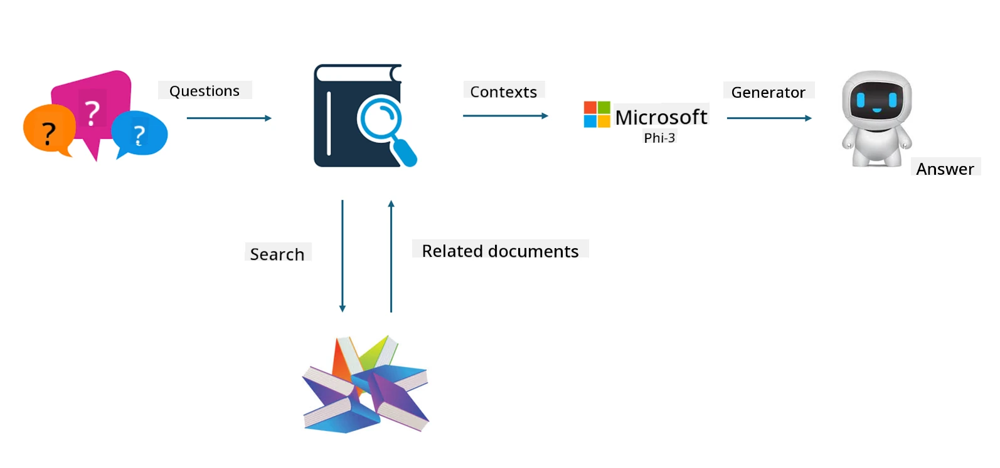

## Finetuning vs RAG

## Retrieval Augmented Generation

RAG combines data retrieval with text generation. Both structured and unstructured enterprise data are stored in a vector database. When searching for relevant information, related summaries and content are retrieved to form a context, which is then combined with the text completion capabilities of LLM/SLM to generate content.

## RAG Process

## Fine-tuning
Fine-tuning involves improving a specific model. It doesn’t require starting from the model’s algorithm, but it does require continuous data accumulation. If you want more precise terminology and language use in industry applications, fine-tuning is the better option. However, if your data changes frequently, fine-tuning can become complex.

## How to choose
If your answer requires incorporating external data, RAG is the best choice.

If you need to deliver stable and precise industry knowledge, fine-tuning is a good option. RAG focuses on retrieving relevant content but may not always capture specialized nuances perfectly.

Fine-tuning requires a high-quality dataset, and if the data scope is small, it won’t make much difference. RAG is more flexible.  
Fine-tuning is a black box, somewhat mysterious, and its internal workings are hard to understand. In contrast, RAG makes it easier to trace the data source, which helps effectively address hallucinations or content errors and offers better transparency.

**Disclaimer**:  
This document has been translated using the AI translation service [Co-op Translator](https://github.com/Azure/co-op-translator). While we strive for accuracy, please be aware that automated translations may contain errors or inaccuracies. The original document in its native language should be considered the authoritative source. For critical information, professional human translation is recommended. We are not liable for any misunderstandings or misinterpretations arising from the use of this translation.