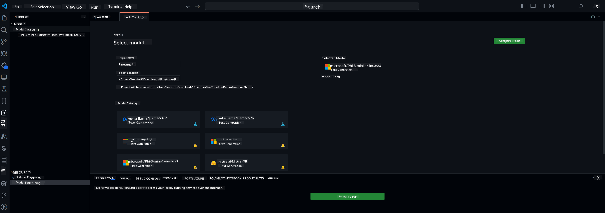

<!--
CO_OP_TRANSLATOR_METADATA:
{
  "original_hash": "c2bc0950f44919ac75a88c1a871680c2",
  "translation_date": "2025-07-17T08:58:49+00:00",
  "source_file": "md/03.FineTuning/Finetuning_VSCodeaitoolkit.md",
  "language_code": "en"
}
-->
## Welcome to AI Toolkit for VS Code

[AI Toolkit for VS Code](https://github.com/microsoft/vscode-ai-toolkit/tree/main) integrates various models from the Azure AI Studio Catalog and other sources like Hugging Face. The toolkit simplifies common development tasks for building AI applications with generative AI tools and models by offering:
- Easy model discovery and playground.
- Model fine-tuning and inference using local computing resources.
- Remote fine-tuning and inference using Azure resources.

[Install AI Toolkit for VSCode](https://marketplace.visualstudio.com/items?itemName=ms-windows-ai-studio.windows-ai-studio)




**[Private Preview]** One-click provisioning for Azure Container Apps to run model fine-tuning and inference in the cloud.

Now, let’s dive into your AI app development:

- [Welcome to AI Toolkit for VS Code](../../../../md/03.FineTuning)
- [Local Development](../../../../md/03.FineTuning)
  - [Preparations](../../../../md/03.FineTuning)
  - [Activate Conda](../../../../md/03.FineTuning)
  - [Base model fine-tuning only](../../../../md/03.FineTuning)
  - [Model fine-tuning and inferencing](../../../../md/03.FineTuning)
  - [Model Fine-tuning](../../../../md/03.FineTuning)
  - [Microsoft Olive](../../../../md/03.FineTuning)
  - [Fine Tuning Samples and Resources](../../../../md/03.FineTuning)
- [**\[Private Preview\]** Remote Development](../../../../md/03.FineTuning)
  - [Prerequisites](../../../../md/03.FineTuning)
  - [Setting Up a Remote Development Project](../../../../md/03.FineTuning)
  - [Provision Azure Resources](../../../../md/03.FineTuning)
  - [\[Optional\] Add Huggingface Token to the Azure Container App Secret](../../../../md/03.FineTuning)
  - [Run Fine-tuning](../../../../md/03.FineTuning)
  - [Provision Inference Endpoint](../../../../md/03.FineTuning)
  - [Deploy the Inference Endpoint](../../../../md/03.FineTuning)
  - [Advanced usage](../../../../md/03.FineTuning)

## Local Development
### Preparations

1. Ensure the NVIDIA driver is installed on your host machine.  
2. Run `huggingface-cli login` if you plan to use Hugging Face datasets.  
3. Explanation of `Olive` key settings for anything that affects memory usage.

### Activate Conda
Since we are using a WSL environment that is shared, you need to manually activate the conda environment. After this step, you can run fine-tuning or inference.

```bash
conda activate [conda-env-name] 
```

### Base model fine-tuning only
If you want to try the base model without fine-tuning, run this command after activating conda.

```bash
cd inference

# Web browser interface allows to adjust a few parameters like max new token length, temperature and so on.
# User has to manually open the link (e.g. http://0.0.0.0:7860) in a browser after gradio initiates the connections.
python gradio_chat.py --baseonly
```

### Model fine-tuning and inferencing

Once the workspace is opened in a dev container, open a terminal (default path is the project root), then run the command below to fine-tune a LLM on the selected dataset.

```bash
python finetuning/invoke_olive.py 
```

Checkpoints and the final model will be saved in the `models` folder.

Next, run inference with the fine-tuned model through chats in a `console`, `web browser`, or `prompt flow`.

```bash
cd inference

# Console interface.
python console_chat.py

# Web browser interface allows to adjust a few parameters like max new token length, temperature and so on.
# User has to manually open the link (e.g. http://127.0.0.1:7860) in a browser after gradio initiates the connections.
python gradio_chat.py
```

To use `prompt flow` in VS Code, please refer to this [Quick Start](https://microsoft.github.io/promptflow/how-to-guides/quick-start.html).

### Model Fine-tuning

Next, download the appropriate model depending on whether your device has a GPU.

To start a local fine-tuning session using QLoRA, select a model from our catalog that you want to fine-tune.
| Platform(s) | GPU available | Model name | Size (GB) |
|---------|---------|--------|--------|
| Windows | Yes | Phi-3-mini-4k-**directml**-int4-awq-block-128-onnx | 2.13GB |
| Linux | Yes | Phi-3-mini-4k-**cuda**-int4-onnx | 2.30GB |
| Windows<br>Linux | No | Phi-3-mini-4k-**cpu**-int4-rtn-block-32-acc-level-4-onnx | 2.72GB |

**_Note_** You don’t need an Azure Account to download the models.

The Phi3-mini (int4) model is about 2GB-3GB in size. Depending on your network speed, downloading may take a few minutes.

Start by choosing a project name and location.  
Then select a model from the catalog. You will be prompted to download the project template. After that, click "Configure Project" to adjust various settings.

### Microsoft Olive 

We use [Olive](https://microsoft.github.io/Olive/why-olive.html) to run QLoRA fine-tuning on a PyTorch model from our catalog. All settings come preset with default values optimized for running fine-tuning locally with efficient memory use, but you can adjust them to fit your scenario.

### Fine Tuning Samples and Resources

- [Fine tuning Getting Started Guide](https://learn.microsoft.com/windows/ai/toolkit/toolkit-fine-tune)
- [Fine tuning with a HuggingFace Dataset](https://github.com/microsoft/vscode-ai-toolkit/blob/main/archive/walkthrough-hf-dataset.md)
- [Fine tuning with Simple DataSet](https://github.com/microsoft/vscode-ai-toolkit/blob/main/archive/walkthrough-simple-dataset.md)

## **[Private Preview]** Remote Development

### Prerequisites

1. To run model fine-tuning in your remote Azure Container App environment, ensure your subscription has enough GPU capacity. Submit a [support ticket](https://azure.microsoft.com/support/create-ticket/) to request the required capacity for your application. [More info about GPU capacity](https://learn.microsoft.com/azure/container-apps/workload-profiles-overview)  
2. If you are using a private dataset on HuggingFace, make sure you have a [HuggingFace account](https://huggingface.co/?WT.mc_id=aiml-137032-kinfeylo) and have [generated an access token](https://huggingface.co/docs/hub/security-tokens?WT.mc_id=aiml-137032-kinfeylo)  
3. Enable the Remote Fine-tuning and Inference feature flag in AI Toolkit for VS Code:  
   1. Open VS Code Settings via *File -> Preferences -> Settings*.  
   2. Go to *Extensions* and select *AI Toolkit*.  
   3. Enable the *"Enable Remote Fine-tuning And Inference"* option.  
   4. Reload VS Code to apply changes.

- [Remote Fine tuning](https://github.com/microsoft/vscode-ai-toolkit/blob/main/archive/remote-finetuning.md)

### Setting Up a Remote Development Project
1. Run the command palette `AI Toolkit: Focus on Resource View`.  
2. Go to *Model Fine-tuning* to access the model catalog. Name your project and select its location on your machine. Then click *"Configure Project"*.  
3. Project Configuration:  
    1. Do not enable the *"Fine-tune locally"* option.  
    2. Olive configuration settings will appear with default values. Adjust and fill in these as needed.  
    3. Proceed to *Generate Project*. This step uses WSL and sets up a new Conda environment, preparing for future Dev Container support.  
4. Click *"Relaunch Window In Workspace"* to open your remote development project.

> **Note:** The project currently works either locally or remotely within AI Toolkit for VS Code. If you enable *"Fine-tune locally"* during project creation, it will run only in WSL without remote development features. If you don’t enable *"Fine-tune locally"*, the project will be limited to the remote Azure Container App environment.

### Provision Azure Resources
To get started, provision the Azure resources for remote fine-tuning by running the `AI Toolkit: Provision Azure Container Apps job for fine-tuning` command from the palette.

Track the provisioning progress via the link shown in the output channel.

### [Optional] Add Huggingface Token to the Azure Container App Secret
If you use a private HuggingFace dataset, set your HuggingFace token as an environment variable to avoid manual login on the Hugging Face Hub.  
Use the `AI Toolkit: Add Azure Container Apps Job secret for fine-tuning` command. Set the secret name as [`HF_TOKEN`](https://huggingface.co/docs/huggingface_hub/package_reference/environment_variables#hftoken) and use your Hugging Face token as the secret value.

### Run Fine-tuning
Start the remote fine-tuning job by running the `AI Toolkit: Run fine-tuning` command.

To view system and console logs, visit the Azure portal via the link in the output panel (more details at [View and Query Logs on Azure](https://aka.ms/ai-toolkit/remote-provision#view-and-query-logs-on-azure)).  
Alternatively, view console logs directly in VS Code’s output panel by running `AI Toolkit: Show the running fine-tuning job streaming logs`.  
> **Note:** The job may be queued if resources are limited. If logs don’t appear, run the streaming logs command again after a short wait to reconnect.

During fine-tuning, QLoRA will create LoRA adapters for the model to use during inference.  
Fine-tuning results will be saved in Azure Files.

### Provision Inference Endpoint
After training adapters remotely, use a simple Gradio app to interact with the model.  
Like fine-tuning, set up Azure resources for remote inference by running `AI Toolkit: Provision Azure Container Apps for inference` from the command palette.

By default, the subscription and resource group for inference should match those used for fine-tuning. The inference will use the same Azure Container App Environment and access the model and adapters stored in Azure Files from the fine-tuning step.

### Deploy the Inference Endpoint
If you want to update the inference code or reload the inference model, run the `AI Toolkit: Deploy for inference` command. This syncs your latest code with the Azure Container App and restarts the replica.

Once deployment completes successfully, access the inference API by clicking the "*Go to Inference Endpoint*" button in the VS Code notification.  
Alternatively, find the web API endpoint under `ACA_APP_ENDPOINT` in `./infra/inference.config.json` and in the output panel. You’re now ready to test the model using this endpoint.

### Advanced usage
For more details on remote development with AI Toolkit, see the [Fine-Tuning models remotely](https://aka.ms/ai-toolkit/remote-provision) and [Inferencing with the fine-tuned model](https://aka.ms/ai-toolkit/remote-inference) documentation.

**Disclaimer**:  
This document has been translated using the AI translation service [Co-op Translator](https://github.com/Azure/co-op-translator). While we strive for accuracy, please be aware that automated translations may contain errors or inaccuracies. The original document in its native language should be considered the authoritative source. For critical information, professional human translation is recommended. We are not liable for any misunderstandings or misinterpretations arising from the use of this translation.