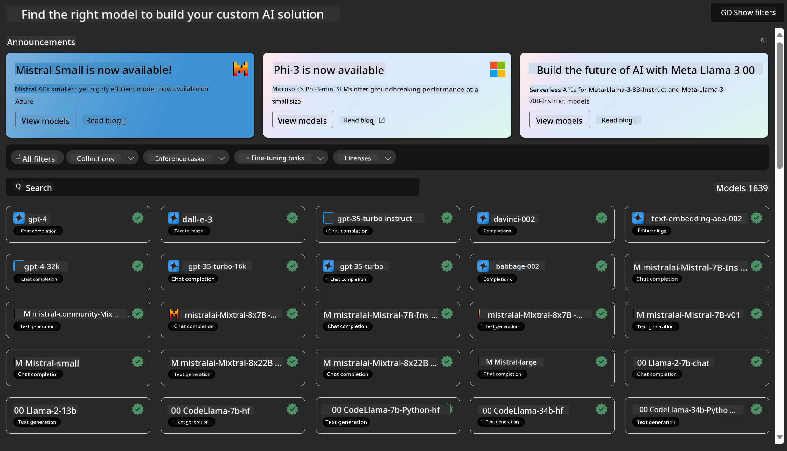
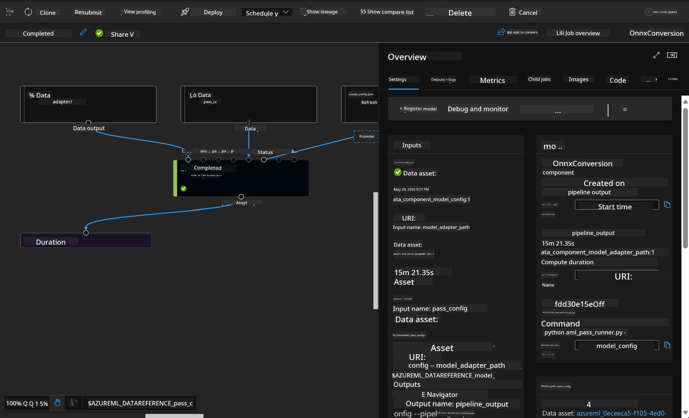

<!--
CO_OP_TRANSLATOR_METADATA:
{
  "original_hash": "7fe541373802e33568e94e13226d463c",
  "translation_date": "2025-07-17T09:32:37+00:00",
  "source_file": "md/03.FineTuning/Introduce_AzureML.md",
  "language_code": "en"
}
-->
# **Introduce Azure Machine Learning Service**

[Azure Machine Learning](https://ml.azure.com?WT.mc_id=aiml-138114-kinfeylo) is a cloud service designed to speed up and manage the entire machine learning (ML) project lifecycle.

ML professionals, data scientists, and engineers can use it in their daily workflows to:

- Train and deploy models.
- Manage machine learning operations (MLOps).
- You can create a model in Azure Machine Learning or use a model built on open-source platforms like PyTorch, TensorFlow, or scikit-learn.
- MLOps tools help you monitor, retrain, and redeploy models.

## Who is Azure Machine Learning for?

**Data Scientists and ML Engineers**

They can use tools to speed up and automate their daily workflows.  
Azure ML offers features for fairness, explainability, tracking, and auditability.

**Application Developers**

They can seamlessly integrate models into applications or services.

**Platform Developers**

They have access to a powerful set of tools supported by reliable Azure Resource Manager APIs.  
These tools enable building advanced ML tooling.

**Enterprises**

Operating in the Microsoft Azure cloud, enterprises benefit from familiar security and role-based access control.  
Set up projects to manage access to sensitive data and specific operations.

## Productivity for Everyone on the Team

ML projects often require a team with diverse skills to build and maintain solutions.

Azure ML provides tools that allow you to:  
- Collaborate with your team through shared notebooks, compute resources, serverless compute, data, and environments.  
- Develop models with fairness, explainability, tracking, and auditability to meet lineage and audit compliance requirements.  
- Deploy ML models quickly and easily at scale, and efficiently manage and govern them with MLOps.  
- Run machine learning workloads anywhere with built-in governance, security, and compliance.

## Cross-Compatible Platform Tools

Anyone on an ML team can use their preferred tools to get the job done.  
Whether you’re running rapid experiments, tuning hyperparameters, building pipelines, or managing inferences, you can use familiar interfaces such as:  
- Azure Machine Learning Studio  
- Python SDK (v2)  
- Azure CLI (v2)  
- Azure Resource Manager REST APIs

As you refine models and collaborate throughout development, you can share and find assets, resources, and metrics within the Azure Machine Learning studio UI.

## **LLM/SLM in Azure ML**

Azure ML has introduced many LLM/SLM-related features, combining LLMOps and SLMOps to build an enterprise-wide generative AI technology platform.

### **Model Catalog**

Enterprise users can deploy different models tailored to various business scenarios through the Model Catalog, offering Model as a Service for enterprise developers or users to access.

The Model Catalog in Azure Machine Learning studio is the central place to discover and use a wide range of models that help you build Generative AI applications. The catalog includes hundreds of models from providers such as Azure OpenAI service, Mistral, Meta, Cohere, Nvidia, Hugging Face, and models trained by Microsoft. Models from providers other than Microsoft are considered Non-Microsoft Products, as defined in Microsoft's Product Terms, and are subject to the terms provided with the model.

### **Job Pipeline**

The core of a machine learning pipeline is breaking down a complete ML task into a multi-step workflow. Each step is a manageable component that can be developed, optimized, configured, and automated independently. Steps are connected through well-defined interfaces. The Azure Machine Learning pipeline service automatically manages all dependencies between pipeline steps.

When fine-tuning SLM / LLM, you can manage data, training, and generation processes through the Pipeline.

### **Prompt flow**

Benefits of using Azure Machine Learning prompt flow  
Azure Machine Learning prompt flow offers many advantages that help users move from idea generation to experimentation and, ultimately, production-ready LLM-based applications:

**Prompt engineering agility**

- Interactive authoring experience: Azure Machine Learning prompt flow provides a visual layout of the flow’s structure, making it easy to understand and navigate projects. It also offers a notebook-like coding experience for efficient flow development and debugging.  
- Variants for prompt tuning: Users can create and compare multiple prompt variants, supporting an iterative refinement process.  
- Evaluation: Built-in evaluation flows allow users to assess the quality and effectiveness of their prompts and flows.  
- Comprehensive resources: Azure Machine Learning prompt flow includes a library of built-in tools, samples, and templates that serve as starting points, inspiring creativity and speeding up development.

**Enterprise readiness for LLM-based applications**

- Collaboration: Azure Machine Learning prompt flow supports team collaboration, enabling multiple users to work together on prompt engineering projects, share knowledge, and maintain version control.  
- All-in-one platform: Azure Machine Learning prompt flow streamlines the entire prompt engineering process—from development and evaluation to deployment and monitoring. Users can easily deploy their flows as Azure Machine Learning endpoints and monitor their performance in real time, ensuring optimal operation and continuous improvement.  
- Azure Machine Learning Enterprise Readiness Solutions: Prompt flow leverages Azure Machine Learning’s robust enterprise readiness features, providing a secure, scalable, and reliable foundation for developing, experimenting, and deploying flows.

With Azure Machine Learning prompt flow, users can unlock prompt engineering agility, collaborate effectively, and leverage enterprise-grade solutions for successful LLM-based application development and deployment.

Combining the computing power, data, and various components of Azure ML, enterprise developers can easily build their own AI applications.

**Disclaimer**:  
This document has been translated using AI translation service [Co-op Translator](https://github.com/Azure/co-op-translator). While we strive for accuracy, please be aware that automated translations may contain errors or inaccuracies. The original document in its native language should be considered the authoritative source. For critical information, professional human translation is recommended. We are not liable for any misunderstandings or misinterpretations arising from the use of this translation.