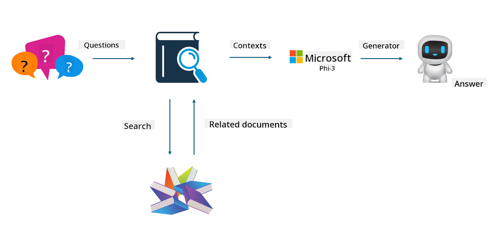

<!--
CO_OP_TRANSLATOR_METADATA:
{
  "original_hash": "743d7e9cb9c4e8ea642d77bee657a7fa",
  "translation_date": "2025-07-17T09:50:39+00:00",
  "source_file": "md/03.FineTuning/LetPhi3gotoIndustriy.md",
  "language_code": "en"
}
-->
# **Let Phi-3 become an industry expert**

To apply the Phi-3 model in an industry, you need to incorporate industry-specific business data into the Phi-3 model. There are two main approaches: the first is RAG (Retrieval Augmented Generation) and the second is Fine-Tuning.

## **RAG vs Fine-Tuning**

### **Retrieval Augmented Generation**

RAG combines data retrieval with text generation. Both structured and unstructured enterprise data are stored in a vector database. When searching for relevant information, the system finds related summaries and content to form a context, then uses the text completion capabilities of LLM/SLM to generate content.

### **Fine-tuning**

Fine-tuning involves improving an existing model. It doesn’t require starting from the model’s algorithm, but it does require continuous data accumulation. If you want more precise terminology and language expression for industry applications, fine-tuning is the better choice. However, if your data changes frequently, fine-tuning can become complex.

### **How to choose**

1. If your answers require incorporating external data, RAG is the best choice.

2. If you need to deliver stable and precise industry knowledge, fine-tuning is a good option. RAG focuses on retrieving relevant content but may not always capture specialized nuances perfectly.

3. Fine-tuning requires a high-quality dataset, and if the data scope is small, it may not make much difference. RAG is more flexible.

4. Fine-tuning is a black box and can be difficult to understand internally. RAG, on the other hand, makes it easier to trace the data source, which helps reduce hallucinations or content errors and provides better transparency.

### **Scenarios**

1. For vertical industries requiring specific professional vocabulary and expressions, ***Fine-tuning*** is the best choice.

2. For QA systems that involve synthesizing different knowledge points, ***RAG*** is the best choice.

3. For combining automated business workflows, ***RAG + Fine-tuning*** is the best choice.

## **How to use RAG**

A vector database stores data in mathematical form. Vector databases help machine learning models remember previous inputs, enabling use cases like search, recommendations, and text generation. Data is identified based on similarity metrics rather than exact matches, allowing models to understand the context.

The vector database is key to implementing RAG. We convert data into vector form using vector models such as text-embedding-3, jina-ai-embedding, and others.

Learn more about creating RAG applications at [https://github.com/microsoft/Phi-3CookBook](https://github.com/microsoft/Phi-3CookBook?WT.mc_id=aiml-138114-kinfeylo)

## **How to use Fine-tuning**

Common algorithms used in Fine-tuning are Lora and QLora. How to choose?
- [Learn More with this sample notebook](../../../../code/04.Finetuning/Phi_3_Inference_Finetuning.ipynb)
- [Example of Python FineTuning Sample](../../../../code/04.Finetuning/FineTrainingScript.py)

### **Lora and QLora**

LoRA (Low-Rank Adaptation) and QLoRA (Quantized Low-Rank Adaptation) are techniques for fine-tuning large language models (LLMs) using Parameter Efficient Fine Tuning (PEFT). PEFT methods train models more efficiently than traditional approaches.

LoRA is a standalone fine-tuning method that reduces memory usage by applying a low-rank approximation to the weight update matrix. It offers fast training times while maintaining performance close to traditional fine-tuning.

QLoRA extends LoRA by adding quantization to further reduce memory usage. It quantizes the precision of the pre-trained LLM’s weight parameters to 4-bit precision, which is more memory efficient than LoRA. However, QLoRA training is about 30% slower than LoRA due to extra quantization and dequantization steps.

QLoRA uses LoRA to correct errors introduced during quantization. QLoRA enables fine-tuning of massive models with billions of parameters on relatively small, widely available GPUs. For example, QLoRA can fine-tune a 70B parameter model that would otherwise require 36 GPUs with only 2 GPUs.

**Disclaimer**:  
This document has been translated using AI translation service [Co-op Translator](https://github.com/Azure/co-op-translator). While we strive for accuracy, please be aware that automated translations may contain errors or inaccuracies. The original document in its native language should be considered the authoritative source. For critical information, professional human translation is recommended. We are not liable for any misunderstandings or misinterpretations arising from the use of this translation.