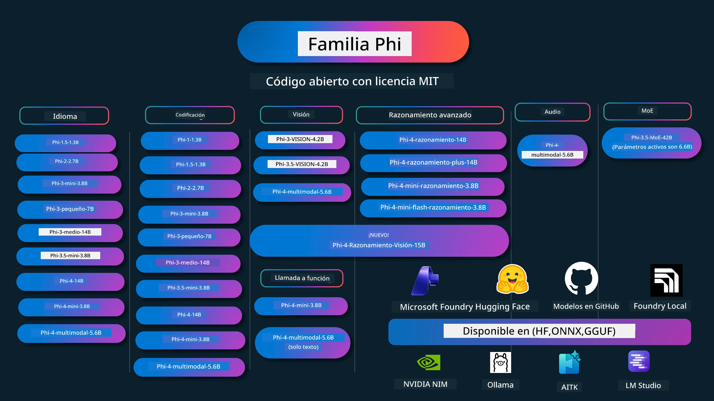

# Phi Cookbook: Ejemplos Prácticos con los Modelos Phi de Microsoft

[](https://codespaces.new/microsoft/phicookbook)
[](https://vscode.dev/redirect?url=vscode://ms-vscode-remote.remote-containers/cloneInVolume?url=https://github.com/microsoft/phicookbook)

[](https://GitHub.com/microsoft/phicookbook/graphs/contributors/?WT.mc_id=aiml-137032-kinfeylo)
[](https://GitHub.com/microsoft/phicookbook/issues/?WT.mc_id=aiml-137032-kinfeylo)
[](https://GitHub.com/microsoft/phicookbook/pulls/?WT.mc_id=aiml-137032-kinfeylo)
[](http://makeapullrequest.com?WT.mc_id=aiml-137032-kinfeylo)

[](https://GitHub.com/microsoft/phicookbook/watchers/?WT.mc_id=aiml-137032-kinfeylo)
[](https://GitHub.com/microsoft/phicookbook/network/?WT.mc_id=aiml-137032-kinfeylo)
[](https://GitHub.com/microsoft/phicookbook/stargazers/?WT.mc_id=aiml-137032-kinfeylo)

[](https://discord.com/invite/ByRwuEEgH4)

Phi es una serie de modelos de IA de código abierto desarrollados por Microsoft.

Actualmente, Phi es el modelo de lenguaje pequeño (SLM) más poderoso y rentable, con muy buenos resultados en múltiples idiomas, razonamiento, generación de texto/chat, codificación, imágenes, audio y otros escenarios.

Puedes desplegar Phi en la nube o en dispositivos edge, y puedes construir fácilmente aplicaciones de IA generativa con potencia computacional limitada.

Sigue estos pasos para comenzar a usar estos recursos:
1. **Haz fork del repositorio**: Haz clic en [](https://GitHub.com/microsoft/phicookbook/network/?WT.mc_id=aiml-137032-kinfeylo)
2. **Clona el repositorio**:   `git clone https://github.com/microsoft/PhiCookBook.git`
3. [**Únete a la Comunidad Discord de Microsoft AI y conoce expertos y otros desarrolladores**](https://discord.com/invite/ByRwuEEgH4?WT.mc_id=aiml-137032-kinfeylo)



### 🌐 Soporte Multilingüe

#### Soportado a través de GitHub Action (Automatizado y Siempre Actualizado)

<!-- CO-OP TRANSLATOR LANGUAGES TABLE START -->
[Árabe](../ar/README.md) | [Bengalí](../bn/README.md) | [Búlgaro](../bg/README.md) | [Birmano (Myanmar)](../my/README.md) | [Chino (Simplificado)](../zh-CN/README.md) | [Chino (Tradicional, Hong Kong)](../zh-HK/README.md) | [Chino (Tradicional, Macao)](../zh-MO/README.md) | [Chino (Tradicional, Taiwán)](../zh-TW/README.md) | [Croata](../hr/README.md) | [Checo](../cs/README.md) | [Danés](../da/README.md) | [Neerlandés](../nl/README.md) | [Estonio](../et/README.md) | [Finlandés](../fi/README.md) | [Francés](../fr/README.md) | [Alemán](../de/README.md) | [Griego](../el/README.md) | [Hebreo](../he/README.md) | [Hindi](../hi/README.md) | [Húngaro](../hu/README.md) | [Indonesio](../id/README.md) | [Italiano](../it/README.md) | [Japonés](../ja/README.md) | [Kannada](../kn/README.md) | [Coreano](../ko/README.md) | [Lituano](../lt/README.md) | [Malayo](../ms/README.md) | [Malabar](../ml/README.md) | [Maratí](../mr/README.md) | [Nepalí](../ne/README.md) | [Pidgin Nigeriano](../pcm/README.md) | [Noruego](../no/README.md) | [Persa (Farsi)](../fa/README.md) | [Polaco](../pl/README.md) | [Portugués (Brasil)](../pt-BR/README.md) | [Portugués (Portugal)](../pt-PT/README.md) | [Punjabi (Gurmukhi)](../pa/README.md) | [Rumano](../ro/README.md) | [Ruso](../ru/README.md) | [Serbio (Cirílico)](../sr/README.md) | [Eslovaco](../sk/README.md) | [Esloveno](../sl/README.md) | [Español](./README.md) | [Swahili](../sw/README.md) | [Sueco](../sv/README.md) | [Tagalo (Filipino)](../tl/README.md) | [Tamil](../ta/README.md) | [Telugu](../te/README.md) | [Tailandés](../th/README.md) | [Turco](../tr/README.md) | [Ucraniano](../uk/README.md) | [Urdu](../ur/README.md) | [Vietnamita](../vi/README.md)

> **¿Prefieres clonar localmente?**
>
> Este repositorio incluye más de 50 traducciones al idioma que aumentan significativamente el tamaño de la descarga. Para clonar sin traducciones, usa sparse checkout:
>
> **Bash / macOS / Linux:**
> ```bash
> git clone --filter=blob:none --sparse https://github.com/microsoft/PhiCookBook.git
> cd PhiCookBook
> git sparse-checkout set --no-cone '/*' '!translations' '!translated_images'
> ```
>
> **CMD (Windows):**
> ```cmd
> git clone --filter=blob:none --sparse https://github.com/microsoft/PhiCookBook.git
> cd PhiCookBook
> git sparse-checkout set --no-cone "/*" "!translations" "!translated_images"
> ```
>
> Esto te da todo lo que necesitas para completar el curso con una descarga mucho más rápida.
<!-- CO-OP TRANSLATOR LANGUAGES TABLE END -->

## Tabla de Contenidos

- Introducción
  - [Bienvenido a la Familia Phi](./md/01.Introduction/01/01.PhiFamily.md)
  - [Configurando tu entorno](./md/01.Introduction/01/01.EnvironmentSetup.md)
  - [Entendiendo Tecnologías Clave](./md/01.Introduction/01/01.Understandingtech.md)
  - [Seguridad en IA para los Modelos Phi](./md/01.Introduction/01/01.AISafety.md)
  - [Soporte de Hardware para Phi](./md/01.Introduction/01/01.Hardwaresupport.md)
  - [Modelos Phi y Disponibilidad en diferentes plataformas](./md/01.Introduction/01/01.Edgeandcloud.md)
  - [Uso de Guidance-ai y Phi](./md/01.Introduction/01/01.Guidance.md)
  - [Modelos en GitHub Marketplace](https://github.com/marketplace/models)
  - [Catálogo de Modelos de Azure AI](https://ai.azure.com)

- Inferencia Phi en diferentes entornos
    -  [Hugging face](./md/01.Introduction/02/01.HF.md)
    -  [Modelos GitHub](./md/01.Introduction/02/02.GitHubModel.md)
    -  [Catálogo de Modelos Azure AI Foundry](./md/01.Introduction/02/03.AzureAIFoundry.md)
    -  [Ollama](./md/01.Introduction/02/04.Ollama.md)
    -  [AI Toolkit VSCode (AITK)](./md/01.Introduction/02/05.AITK.md)
    -  [NVIDIA NIM](./md/01.Introduction/02/06.NVIDIA.md)
    -  [Foundry Local](./md/01.Introduction/02/07.FoundryLocal.md)

- Inferencia Familia Phi
    - [Inferencia Phi en iOS](./md/01.Introduction/03/iOS_Inference.md)
    - [Inferencia Phi en Android](./md/01.Introduction/03/Android_Inference.md)
    - [Inferencia Phi en Jetson](./md/01.Introduction/03/Jetson_Inference.md)
    - [Inferencia Phi en AI PC](./md/01.Introduction/03/AIPC_Inference.md)
    - [Inferencia Phi con Apple MLX Framework](./md/01.Introduction/03/MLX_Inference.md)
    - [Inferencia Phi en Servidor Local](./md/01.Introduction/03/Local_Server_Inference.md)
    - [Inferencia Phi en Servidor Remoto usando AI Toolkit](./md/01.Introduction/03/Remote_Interence.md)
    - [Inferencia Phi con Rust](./md/01.Introduction/03/Rust_Inference.md)
    - [Inferencia Phi--Visión en Local](./md/01.Introduction/03/Vision_Inference.md)
    - [Inferencia Phi con Kaito AKS, Azure Containers(soporte oficial)](./md/01.Introduction/03/Kaito_Inference.md)
-  [Cuantificación Familia Phi](./md/01.Introduction/04/QuantifyingPhi.md)
    - [Cuantificando Phi-3.5 / 4 usando llama.cpp](./md/01.Introduction/04/UsingLlamacppQuantifyingPhi.md)
    - [Cuantificando Phi-3.5 / 4 usando extensiones de IA generativa para onnxruntime](./md/01.Introduction/04/UsingORTGenAIQuantifyingPhi.md)
    - [Cuantificando Phi-3.5 / 4 usando Intel OpenVINO](./md/01.Introduction/04/UsingIntelOpenVINOQuantifyingPhi.md)
    - [Cuantificando Phi-3.5 / 4 usando Apple MLX Framework](./md/01.Introduction/04/UsingAppleMLXQuantifyingPhi.md)

-  Evaluación Phi
    - [IA Responsable](./md/01.Introduction/05/ResponsibleAI.md)
    - [Azure AI Foundry para Evaluación](./md/01.Introduction/05/AIFoundry.md)
    - [Uso de Promptflow para Evaluación](./md/01.Introduction/05/Promptflow.md)
 
- RAG con Azure AI Search
    - [Cómo usar Phi-4-mini y Phi-4-multimodal (RAG) con Azure AI Search](https://github.com/microsoft/PhiCookBook/blob/main/code/06.E2E/E2E_Phi-4-RAG-Azure-AI-Search.ipynb)

- Muestras de desarrollo de aplicaciones Phi
  - Aplicaciones de Texto y Chat
    - Muestras Phi-4 🆕
      - [📓] [Chat con el Modelo Phi-4-mini ONNX](./md/02.Application/01.TextAndChat/Phi4/ChatWithPhi4ONNX/README.md)
      - [Chat con Modelo local ONNX Phi-4 .NET](../../md/04.HOL/dotnet/src/LabsPhi4-Chat-01OnnxRuntime)
      - [Aplicación Console Chat .NET con Phi-4 ONNX usando Semantic Kernel](../../md/04.HOL/dotnet/src/LabsPhi4-Chat-02SK)
    - Muestras Phi-3 / 3.5
      - [Chatbot local en el navegador usando Phi3, ONNX Runtime Web y WebGPU](https://github.com/microsoft/onnxruntime-inference-examples/tree/main/js/chat)
      - [Chat OpenVino](./md/02.Application/01.TextAndChat/Phi3/E2E_OpenVino_Chat.md)
      - [Modelo múltiple - Phi-3-mini interactivo y OpenAI Whisper](./md/02.Application/01.TextAndChat/Phi3/E2E_Phi-3-mini_with_whisper.md)
      - [MLFlow - Creando un wrapper y usando Phi-3 con MLFlow](./md//02.Application/01.TextAndChat/Phi3/E2E_Phi-3-MLflow.md)
      - [Optimización de modelos - Cómo optimizar el modelo Phi-3-min para ONNX Runtime Web con Olive](https://github.com/microsoft/Olive/tree/main/examples/phi3)
      - [Aplicación WinUI3 con Phi-3 mini-4k-instruct-onnx](https://github.com/microsoft/Phi3-Chat-WinUI3-Sample/)
      - [Ejemplo de aplicación de notas con AI Multimodelo en WinUI3](https://github.com/microsoft/ai-powered-notes-winui3-sample)
      - [Ajuste fino e integración de modelos personalizados Phi-3 con Prompt flow](./md/02.Application/01.TextAndChat/Phi3/E2E_Phi-3-FineTuning_PromptFlow_Integration.md)
      - [Ajuste fino e integración de modelos personalizados Phi-3 con Prompt flow en Azure AI Foundry](./md/02.Application/01.TextAndChat/Phi3/E2E_Phi-3-FineTuning_PromptFlow_Integration_AIFoundry.md)
      - [Evaluación del modelo Phi-3 / Phi-3.5 ajustado fino en Azure AI Foundry con enfoque en los principios de IA responsable de Microsoft](./md/02.Application/01.TextAndChat/Phi3/E2E_Phi-3-Evaluation_AIFoundry.md)
      - [📓] [Ejemplo de predicción de lenguaje Phi-3.5-mini-instruct (chino/inglés)](./md/02.Application/01.TextAndChat/Phi3/phi3-instruct-demo.ipynb)
      - [Chatbot RAG Phi-3.5-Instruct WebGPU](./md/02.Application/01.TextAndChat/Phi3/WebGPUWithPhi35Readme.md)
      - [Uso de GPU de Windows para crear solución Prompt flow con Phi-3.5-Instruct ONNX](./md/02.Application/01.TextAndChat/Phi3/UsingPromptFlowWithONNX.md)
      - [Uso de Microsoft Phi-3.5 tflite para crear una app Android](./md/02.Application/01.TextAndChat/Phi3/UsingPhi35TFLiteCreateAndroidApp.md)
      - [Ejemplo Q&A .NET usando modelo ONNX Phi-3 local con Microsoft.ML.OnnxRuntime](../../md/04.HOL/dotnet/src/LabsPhi301)
      - [App consola chat .NET con Semantic Kernel y Phi-3](../../md/04.HOL/dotnet/src/LabsPhi302)

  - Ejemplos de código del SDK de Inferencia Azure AI 
    - Ejemplos Phi-4 🆕
      - [📓] [Generar código de proyecto usando Phi-4-multimodal](./md/02.Application/02.Code/Phi4/GenProjectCode/README.md)
    - Ejemplos Phi-3 / 3.5
      - [Construye tu propio Chat Copilot en Visual Studio Code con Microsoft Phi-3 Family](./md/02.Application/02.Code/Phi3/VSCodeExt/README.md)
      - [Crea tu propio agente Chat Copilot en Visual Studio Code con Phi-3.5 usando modelos GitHub](/md/02.Application/02.Code/Phi3/CreateVSCodeChatAgentWithGitHubModels.md)

  - Ejemplos de razonamiento avanzado
    - Ejemplos Phi-4 🆕
      - [📓] [Ejemplos de razonamiento Phi-4-mini o Phi-4](./md/02.Application/03.AdvancedReasoning/Phi4/AdvancedResoningPhi4mini/README.md)
      - [📓] [Ajuste fino de Phi-4-mini-reasoning con Microsoft Olive](./md/02.Application/03.AdvancedReasoning/Phi4/AdvancedResoningPhi4mini/olive_ft_phi_4_reasoning_with_medicaldata.ipynb)
      - [📓] [Ajuste fino de Phi-4-mini-reasoning con Apple MLX](./md/02.Application/03.AdvancedReasoning/Phi4/AdvancedResoningPhi4mini/mlx_ft_phi_4_reasoning_with_medicaldata.ipynb)
      - [📓] [Phi-4-mini-reasoning con modelos GitHub](./md/02.Application/02.Code/Phi4r/github_models_inference.ipynb)
      - [📓] [Phi-4-mini-reasoning con modelos Azure AI Foundry](./md/02.Application/02.Code/Phi4r/azure_models_inference.ipynb)
  - Demos
      - [Demos Phi-4-mini alojados en Hugging Face Spaces](https://huggingface.co/spaces/microsoft/phi-4-mini?WT.mc_id=aiml-137032-kinfeylo)
      - [Demos Phi-4-multimodal alojados en Hugging Face Spaces](https://huggingface.co/spaces/microsoft/phi-4-multimodal?WT.mc_id=aiml-137032-kinfeylo)
  - Ejemplos de visión
    - Ejemplos Phi-4 🆕
      - [📓] [Uso de Phi-4-multimodal para leer imágenes y generar código](./md/02.Application/04.Vision/Phi4/CreateFrontend/README.md) 
    - Ejemplos Phi-3 / 3.5
      -  [📓][Phi-3-vision-Texto de imagen a texto](./md/02.Application/04.Vision/Phi3/E2E_Phi-3-vision-image-text-to-text-online-endpoint.ipynb)
      - [Phi-3-vision-ONNX](https://onnxruntime.ai/docs/genai/tutorials/phi3-v.html)
      - [📓][Phi-3-vision Embedding CLIP](./md/02.Application/04.Vision/Phi3/E2E_Phi-3-vision-image-text-to-text-online-endpoint.ipynb)
      - [DEMO: Reciclaje Phi-3](https://github.com/jennifermarsman/PhiRecycling/)
      - [Phi-3-vision - Asistente de lenguaje visual - con Phi3-Vision y OpenVINO](https://docs.openvino.ai/nightly/notebooks/phi-3-vision-with-output.html)
      - [Phi-3 Vision Nvidia NIM](./md/02.Application/04.Vision/Phi3/E2E_Nvidia_NIM_Vision.md)
      - [Phi-3 Vision OpenVino](./md/02.Application/04.Vision/Phi3/E2E_OpenVino_Phi3Vision.md)
      - [📓][Ejemplo Phi-3.5 Vision multi-frame o multi-imagen](./md/02.Application/04.Vision/Phi3/phi3-vision-demo.ipynb)
      - [Modelo ONNX local Phi-3 Vision usando Microsoft.ML.OnnxRuntime .NET](../../md/04.HOL/dotnet/src/LabsPhi303)
      - [Modelo ONNX local Phi-3 Vision basado en menú usando Microsoft.ML.OnnxRuntime .NET](../../md/04.HOL/dotnet/src/LabsPhi304)

  - Ejemplos de matemáticas
    -  Ejemplos Phi-4-Mini-Flash-Reasoning-Instruct 🆕 [Demo de matemáticas con Phi-4-Mini-Flash-Reasoning-Instruct](./md/02.Application/09.Math/MathDemo.ipynb)

  - Ejemplos de audio
    - Ejemplos Phi-4 🆕
      - [📓] [Extracción de transcripciones de audio usando Phi-4-multimodal](./md/02.Application/05.Audio/Phi4/Transciption/README.md)
      - [📓] [Ejemplo de audio Phi-4-multimodal](./md/02.Application/05.Audio/Phi4/Siri/demo.ipynb)
      - [📓] [Ejemplo de traducción de habla Phi-4-multimodal](./md/02.Application/05.Audio/Phi4/Translate/demo.ipynb)
      - [Aplicación consola .NET usando audio Phi-4-multimodal para analizar archivo de audio y generar transcripción](../../md/04.HOL/dotnet/src/LabsPhi4-MultiModal-02Audio)

  - Ejemplos MOE
    - Ejemplos Phi-3 / 3.5
      - [📓] [Modelos mezcla de expertos Phi-3.5 (MoEs) ejemplo en redes sociales](./md/02.Application/06.MoE/Phi3/phi3_moe_demo.ipynb)
      - [📓] [Creación de un pipeline RAG con NVIDIA NIM Phi-3 MOE, Azure AI Search y LlamaIndex](./md/02.Application/06.MoE/Phi3/azure-ai-search-nvidia-rag.ipynb)
      - 
  - Ejemplos de llamadas a funciones
    - Ejemplos Phi-4 🆕
      -  [📓] [Uso de llamadas a funciones con Phi-4-mini](./md/02.Application/07.FunctionCalling/Phi4/FunctionCallingBasic/README.md)
      -  [📓] [Uso de llamadas a funciones para crear multi-agentes con Phi-4-mini](./md/02.Application/07.FunctionCalling/Phi4/Multiagents/Phi_4_mini_multiagent.ipynb)
      -  [📓] [Uso de llamadas a funciones con Ollama](./md/02.Application/07.FunctionCalling/Phi4/Ollama/ollama_functioncalling.ipynb)
      -  [📓] [Uso de llamadas a funciones con ONNX](./md/02.Application/07.FunctionCalling/Phi4/ONNX/onnx_parallel_functioncalling.ipynb)
  - Ejemplos de mezcla multimodal
    - Ejemplos Phi-4 🆕
      -  [📓] [Uso de Phi-4-multimodal como periodista tecnológico](./md/02.Application/08.Multimodel/Phi4/TechJournalist/phi_4_mm_audio_text_publish_news.ipynb)
      - [Aplicación consola .NET usando Phi-4-multimodal para analizar imágenes](../../md/04.HOL/dotnet/src/LabsPhi4-MultiModal-01Images)

- Ejemplos de ajuste fino Phi
  - [Escenarios de ajuste fino](./md/03.FineTuning/FineTuning_Scenarios.md)
  - [Ajuste fino vs RAG](./md/03.FineTuning/FineTuning_vs_RAG.md)
  - [Permitir que Phi-3 se convierta en un experto en la industria](./md/03.FineTuning/LetPhi3gotoIndustriy.md)
  - [Ajuste fino de Phi-3 con AI Toolkit para VS Code](./md/03.FineTuning/Finetuning_VSCodeaitoolkit.md)
  - [Ajuste fino de Phi-3 con Azure Machine Learning Service](./md/03.FineTuning/Introduce_AzureML.md)
  - [Ajuste fino de Phi-3 con Lora](./md/03.FineTuning/FineTuning_Lora.md)
  - [Ajuste fino de Phi-3 con QLora](./md/03.FineTuning/FineTuning_Qlora.md)
  - [Ajuste fino de Phi-3 con Azure AI Foundry](./md/03.FineTuning/FineTuning_AIFoundry.md)
  - [Ajuste fino de Phi-3 con Azure ML CLI/SDK](./md/03.FineTuning/FineTuning_MLSDK.md)
  - [Ajuste fino con Microsoft Olive](./md/03.FineTuning/FineTuning_MicrosoftOlive.md)
  - [Laboratorio práctico de ajuste fino con Microsoft Olive](./md/03.FineTuning/olive-lab/readme.md)
  - [Ajuste fino de Phi-3-vision con Weights and Bias](./md/03.FineTuning/FineTuning_Phi-3-visionWandB.md)
  - [Ajuste fino de Phi-3 con Apple MLX Framework](./md/03.FineTuning/FineTuning_MLX.md)
  - [Ajuste fino de Phi-3-vision (soporte oficial)](./md/03.FineTuning/FineTuning_Vision.md)
  - [Ajuste fino Phi-3 con Kaito AKS, Azure Containers (soporte oficial)](./md/03.FineTuning/FineTuning_Kaito.md)
  - [Ajuste fino Phi-3 y 3.5 Vision](https://github.com/2U1/Phi3-Vision-Finetune)

- Laboratorio práctico
  - [Explorando modelos de vanguardia: LLMs, SLMs, desarrollo local y más](https://github.com/microsoft/aitour-exploring-cutting-edge-models)
  - [Desbloqueando el potencial NLP: Ajuste fino con Microsoft Olive](https://github.com/azure/Ignite_FineTuning_workshop)
- Artículos Académicos y Publicaciones
  - [Los libros de texto son todo lo que necesitas II: informe técnico de phi-1.5](https://arxiv.org/abs/2309.05463)
  - [Informe Técnico Phi-3: Un modelo de lenguaje altamente capaz localmente en tu teléfono](https://arxiv.org/abs/2404.14219)
  - [Informe Técnico Phi-4](https://arxiv.org/abs/2412.08905)
  - [Informe Técnico Phi-4-Mini: Modelos de lenguaje multimodales compactos pero potentes mediante mezcla de LoRAs](https://arxiv.org/abs/2503.01743)
  - [Optimización de modelos de lenguaje pequeños para llamadas de función en vehículos](https://arxiv.org/abs/2501.02342)
  - [(WhyPHI) Ajuste fino de PHI-3 para respuestas a preguntas de opción múltiple: metodología, resultados y desafíos](https://arxiv.org/abs/2501.01588)
  - [Informe Técnico Phi-4-razón](https://www.microsoft.com/en-us/research/wp-content/uploads/2025/04/phi_4_reasoning.pdf)
  - [Informe Técnico Phi-4-mini-razón](https://huggingface.co/microsoft/Phi-4-mini-reasoning/blob/main/Phi-4-Mini-Reasoning.pdf)

## Uso de modelos Phi

### Phi en Azure AI Foundry

Puedes aprender cómo usar Microsoft Phi y cómo construir soluciones E2E en tus diferentes dispositivos de hardware. Para experimentar Phi por ti mismo, empieza a jugar con los modelos y personalizar Phi para tus escenarios utilizando el [Catálogo de Modelos de Azure AI Foundry](https://aka.ms/phi3-azure-ai). Puedes aprender más en Comenzando con [Azure AI Foundry](/md/02.QuickStart/AzureAIFoundry_QuickStart.md)

**Playground**  
Cada modelo tiene un playground dedicado para probar el modelo en [Azure AI Playground](https://aka.ms/try-phi3).

### Phi en modelos de GitHub

Puedes aprender cómo usar Microsoft Phi y cómo construir soluciones E2E en tus diferentes dispositivos de hardware. Para experimentar Phi por ti mismo, empieza a jugar con el modelo y personalizar Phi para tus escenarios usando el [Catálogo de modelos de GitHub](https://github.com/marketplace/models?WT.mc_id=aiml-137032-kinfeylo). Puedes aprender más en Comenzando con [Catálogo de modelos de GitHub](/md/02.QuickStart/GitHubModel_QuickStart.md)

**Playground**  
Cada modelo tiene un [playground dedicado para probar el modelo](/md/02.QuickStart/GitHubModel_QuickStart.md).

### Phi en Hugging Face

También puedes encontrar el modelo en [Hugging Face](https://huggingface.co/microsoft)

**Playground**  
[Playground de Hugging Chat](https://huggingface.co/chat/models/microsoft/Phi-3-mini-4k-instruct)

## 🎒 Otros cursos

¡Nuestro equipo produce otros cursos! Consulta:

<!-- CO-OP TRANSLATOR OTHER COURSES START -->
### LangChain
[](https://aka.ms/langchain4j-for-beginners)
[](https://aka.ms/langchainjs-for-beginners?WT.mc_id=m365-94501-dwahlin)
[](https://github.com/microsoft/langchain-for-beginners?WT.mc_id=m365-94501-dwahlin)
---

### Azure / Edge / MCP / Agentes
[](https://github.com/microsoft/AZD-for-beginners?WT.mc_id=academic-105485-koreyst)
[](https://github.com/microsoft/edgeai-for-beginners?WT.mc_id=academic-105485-koreyst)
[](https://github.com/microsoft/mcp-for-beginners?WT.mc_id=academic-105485-koreyst)
[](https://github.com/microsoft/ai-agents-for-beginners?WT.mc_id=academic-105485-koreyst)

---

### Serie de IA generativa
[](https://github.com/microsoft/generative-ai-for-beginners?WT.mc_id=academic-105485-koreyst)
[-9333EA?style=for-the-badge&labelColor=E5E7EB&color=9333EA)](https://github.com/microsoft/Generative-AI-for-beginners-dotnet?WT.mc_id=academic-105485-koreyst)
[-C084FC?style=for-the-badge&labelColor=E5E7EB&color=C084FC)](https://github.com/microsoft/generative-ai-for-beginners-java?WT.mc_id=academic-105485-koreyst)
[-E879F9?style=for-the-badge&labelColor=E5E7EB&color=E879F9)](https://github.com/microsoft/generative-ai-with-javascript?WT.mc_id=academic-105485-koreyst)

---

### Aprendizaje básico  
[](https://aka.ms/ml-beginners?WT.mc_id=academic-105485-koreyst)
[](https://aka.ms/datascience-beginners?WT.mc_id=academic-105485-koreyst)
[](https://aka.ms/ai-beginners?WT.mc_id=academic-105485-koreyst)
[](https://github.com/microsoft/Security-101?WT.mc_id=academic-96948-sayoung)
[](https://aka.ms/webdev-beginners?WT.mc_id=academic-105485-koreyst)
[](https://aka.ms/iot-beginners?WT.mc_id=academic-105485-koreyst)
[](https://github.com/microsoft/xr-development-for-beginners?WT.mc_id=academic-105485-koreyst)

---

### Serie Copilot
[](https://aka.ms/GitHubCopilotAI?WT.mc_id=academic-105485-koreyst)
[](https://github.com/microsoft/mastering-github-copilot-for-dotnet-csharp-developers?WT.mc_id=academic-105485-koreyst)
[](https://github.com/microsoft/CopilotAdventures?WT.mc_id=academic-105485-koreyst)
<!-- CO-OP TRANSLATOR OTHER COURSES END -->

## IA Responsable

Microsoft está comprometido en ayudar a nuestros clientes a usar nuestros productos de IA de manera responsable, compartiendo nuestros aprendizajes y construyendo alianzas basadas en la confianza mediante herramientas como Notas de Transparencia y Evaluaciones de Impacto. Muchos de estos recursos pueden encontrarse en [https://aka.ms/RAI](https://aka.ms/RAI).  
El enfoque de Microsoft hacia la IA responsable se fundamenta en nuestros principios de IA de justicia, fiabilidad y seguridad, privacidad y protección, inclusividad, transparencia y responsabilidad.

Los modelos a gran escala de lenguaje natural, imagen y voz —como los utilizados en este ejemplo— pueden potencialmente comportarse de manera injusta, poco fiable o ofensiva, causando daños. Por favor, consulta la [nota de transparencia del servicio Azure OpenAI](https://learn.microsoft.com/legal/cognitive-services/openai/transparency-note?tabs=text) para estar informado sobre riesgos y limitaciones.

El enfoque recomendado para mitigar estos riesgos es incluir un sistema de seguridad en tu arquitectura que pueda detectar y prevenir comportamientos dañinos. [Azure AI Content Safety](https://learn.microsoft.com/azure/ai-services/content-safety/overview) proporciona una capa independiente de protección, capaz de detectar contenido dañino generado por usuarios y por IA en aplicaciones y servicios. Azure AI Content Safety incluye APIs de texto e imagen que permiten detectar material dañino. Dentro de Azure AI Foundry, el servicio Content Safety permite ver, explorar y probar código de muestra para detectar contenido dañino a través de diferentes modalidades. La siguiente [documentación de inicio rápido](https://learn.microsoft.com/azure/ai-services/content-safety/quickstart-text?tabs=visual-studio%2Clinux&pivots=programming-language-rest) te guía para hacer solicitudes al servicio.
Otro aspecto a tener en cuenta es el rendimiento general de la aplicación. Con aplicaciones multimodales y multimodelos, consideramos que el rendimiento significa que el sistema funciona como tú y tus usuarios esperan, incluyendo no generar resultados dañinos. Es importante evaluar el rendimiento de toda tu aplicación utilizando los [evaluadores de Rendimiento, Calidad, Riesgo y Seguridad](https://learn.microsoft.com/azure/ai-studio/concepts/evaluation-metrics-built-in). También tienes la capacidad de crear y evaluar con [evaluadores personalizados](https://learn.microsoft.com/azure/ai-studio/how-to/develop/evaluate-sdk#custom-evaluators).

Puedes evaluar tu aplicación de IA en tu entorno de desarrollo utilizando el [Azure AI Evaluation SDK](https://microsoft.github.io/promptflow/index.html). Dado un conjunto de datos de prueba o un objetivo, las generaciones de tu aplicación de IA generativa se miden cuantitativamente con evaluadores integrados o evaluadores personalizados de tu elección. Para comenzar con el azure ai evaluation sdk para evaluar tu sistema, puedes seguir la [guía de inicio rápido](https://learn.microsoft.com/azure/ai-studio/how-to/develop/flow-evaluate-sdk). Una vez que ejecutes una evaluación, puedes [visualizar los resultados en Azure AI Foundry](https://learn.microsoft.com/azure/ai-studio/how-to/evaluate-flow-results). 

## Marcas registradas

Este proyecto puede contener marcas registradas o logotipos de proyectos, productos o servicios. El uso autorizado de marcas o logotipos de Microsoft está sujeto a y debe seguir las [Directrices de marcas y marcas comerciales de Microsoft](https://www.microsoft.com/legal/intellectualproperty/trademarks/usage/general).
El uso de marcas o logotipos de Microsoft en versiones modificadas de este proyecto no debe causar confusión ni implicar patrocinio por parte de Microsoft. Cualquier uso de marcas o logotipos de terceros está sujeto a las políticas de esos terceros.

## Obtener ayuda

Si te quedas atascado o tienes alguna pregunta sobre cómo crear aplicaciones de IA, únete a:

[](https://aka.ms/foundry/discord)

Si tienes comentarios sobre el producto o errores durante la creación, visita:

[](https://aka.ms/foundry/forum)

---

<!-- CO-OP TRANSLATOR DISCLAIMER START -->
**Aviso legal**:
Este documento ha sido traducido utilizando el servicio de traducción automática [Co-op Translator](https://github.com/Azure/co-op-translator). Aunque nos esforzamos por la precisión, tenga en cuenta que las traducciones automatizadas pueden contener errores o inexactitudes. El documento original en su idioma nativo debe considerarse la fuente autorizada. Para información crítica, se recomienda una traducción profesional realizada por humanos. No nos hacemos responsables de malentendidos o interpretaciones erróneas derivadas del uso de esta traducción.
<!-- CO-OP TRANSLATOR DISCLAIMER END -->