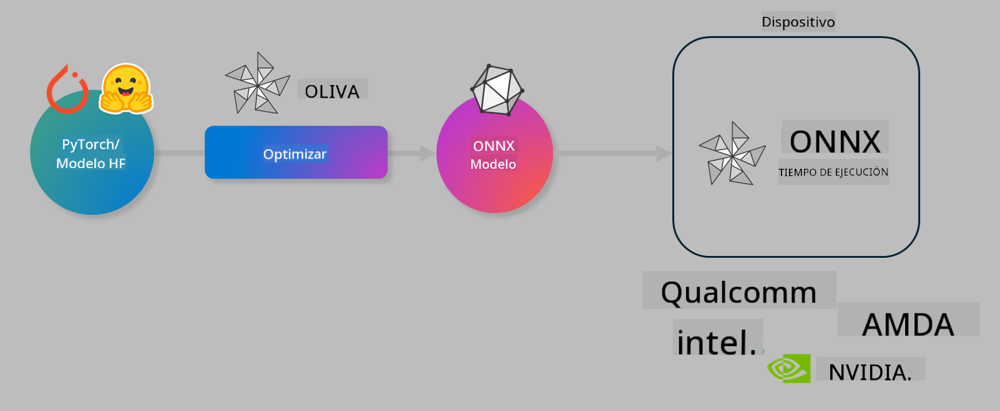

<!--
CO_OP_TRANSLATOR_METADATA:
{
  "original_hash": "6bbe47de3b974df7eea29dfeccf6032b",
  "translation_date": "2025-05-07T10:13:38+00:00",
  "source_file": "code/04.Finetuning/olive-lab/readme.md",
  "language_code": "es"
}
-->
# Lab. Optimiza modelos de IA para inferencia en el dispositivo

## Introducción

> [!IMPORTANT]
> Este laboratorio requiere una **GPU Nvidia A10 o A100** con los controladores asociados y el toolkit CUDA (versión 12+) instalados.

> [!NOTE]
> Este es un laboratorio de **35 minutos** que te ofrecerá una introducción práctica a los conceptos clave para optimizar modelos para inferencia en el dispositivo usando OLIVE.

## Objetivos de aprendizaje

Al finalizar este laboratorio, podrás usar OLIVE para:

- Cuantizar un modelo de IA usando el método de cuantización AWQ.
- Afinar un modelo de IA para una tarea específica.
- Generar adaptadores LoRA (modelo afinado) para una inferencia eficiente en el dispositivo con ONNX Runtime.

### Qué es Olive

Olive (*O*NNX *live*) es un toolkit de optimización de modelos con una CLI que te permite desplegar modelos para ONNX runtime +++https://onnxruntime.ai+++ con calidad y rendimiento.



La entrada a Olive suele ser un modelo PyTorch o Hugging Face y la salida es un modelo ONNX optimizado que se ejecuta en un dispositivo (objetivo de despliegue) que corre ONNX runtime. Olive optimiza el modelo para el acelerador AI del objetivo de despliegue (NPU, GPU, CPU) proporcionado por un fabricante de hardware como Qualcomm, AMD, Nvidia o Intel.

Olive ejecuta un *workflow*, que es una secuencia ordenada de tareas individuales de optimización de modelos llamadas *passes* - algunos ejemplos de passes incluyen: compresión de modelo, captura de grafo, cuantización, optimización de grafo. Cada pass tiene un conjunto de parámetros que pueden ajustarse para lograr las mejores métricas, como precisión y latencia, que son evaluadas por el evaluador correspondiente. Olive emplea una estrategia de búsqueda que usa un algoritmo para autoajustar cada pass uno a uno o un conjunto de passes juntos.

#### Beneficios de Olive

- **Reduce la frustración y el tiempo** de experimentación manual por prueba y error con diferentes técnicas para optimización de grafo, compresión y cuantización. Define tus restricciones de calidad y rendimiento y deja que Olive encuentre automáticamente el mejor modelo para ti.
- **Más de 40 componentes integrados de optimización de modelos** que cubren técnicas avanzadas en cuantización, compresión, optimización de grafo y afinamiento.
- **CLI fácil de usar** para tareas comunes de optimización de modelos. Por ejemplo, olive quantize, olive auto-opt, olive finetune.
- Empaquetado y despliegue de modelos incorporados.
- Soporta generación de modelos para **Multi LoRA serving**.
- Construye workflows usando YAML/JSON para orquestar tareas de optimización y despliegue de modelos.
- Integración con **Hugging Face** y **Azure AI**.
- Mecanismo de **caché** incorporado para **ahorrar costos**.

## Instrucciones del laboratorio

> [!NOTE]
> Asegúrate de haber provisionado tu Azure AI Hub y Proyecto y configurado tu cómputo A100 según el Lab 1.

### Paso 0: Conéctate a tu Azure AI Compute

Te conectarás al cómputo Azure AI usando la función remota en **VS Code.**

1. Abre la aplicación de escritorio **VS Code**:
1. Abre la **paleta de comandos** con **Shift+Ctrl+P**
1. En la paleta de comandos busca **AzureML - remote: Connect to compute instance in New Window**.
1. Sigue las instrucciones en pantalla para conectarte al Compute. Esto implicará seleccionar tu Suscripción de Azure, Grupo de Recursos, Proyecto y el nombre del Cómputo que configuraste en el Lab 1.
1. Una vez conectado a tu nodo Azure ML Compute, esto se mostrará en la **parte inferior izquierda de Visual Code** `><Azure ML: Compute Name`

### Paso 1: Clona este repositorio

En VS Code, puedes abrir una nueva terminal con **Ctrl+J** y clonar este repositorio:

En la terminal deberías ver el prompt

```
azureuser@computername:~/cloudfiles/code$ 
```
Clona la solución

```bash
cd ~/localfiles
git clone https://github.com/microsoft/phi-3cookbook.git
```

### Paso 2: Abre la carpeta en VS Code

Para abrir VS Code en la carpeta correspondiente ejecuta el siguiente comando en la terminal, lo que abrirá una nueva ventana:

```bash
code phi-3cookbook/code/04.Finetuning/Olive-lab
```

Alternativamente, puedes abrir la carpeta seleccionando **Archivo** > **Abrir carpeta**.

### Paso 3: Dependencias

Abre una ventana de terminal en VS Code en tu instancia de Azure AI Compute (atajo: **Ctrl+J**) y ejecuta los siguientes comandos para instalar las dependencias:

```bash
conda create -n olive-ai python=3.11 -y
conda activate olive-ai
pip install -r requirements.txt
az extension remove -n azure-cli-ml
az extension add -n ml
```

> [!NOTE]
> La instalación de todas las dependencias tomará aproximadamente 5 minutos.

En este laboratorio descargarás y subirás modelos al catálogo de modelos de Azure AI. Para acceder al catálogo de modelos, necesitas iniciar sesión en Azure usando:

```bash
az login
```

> [!NOTE]
> Al iniciar sesión te pedirán seleccionar tu suscripción. Asegúrate de configurar la suscripción proporcionada para este laboratorio.

### Paso 4: Ejecuta comandos Olive

Abre una terminal en VS Code en tu instancia Azure AI Compute (atajo: **Ctrl+J**) y asegúrate de que el entorno conda `olive-ai` esté activado:

```bash
conda activate olive-ai
```

Luego, ejecuta los siguientes comandos de Olive en la línea de comandos.

1. **Inspecciona los datos:** En este ejemplo, vas a afinar el modelo Phi-3.5-Mini para que se especialice en responder preguntas relacionadas con viajes. El código a continuación muestra los primeros registros del conjunto de datos, que están en formato JSON lines:

    ```bash
    head data/data_sample_travel.jsonl
    ```

1. **Cuantiza el modelo:** Antes de entrenar el modelo, primero lo cuantizas con el siguiente comando que usa una técnica llamada Active Aware Quantization (AWQ) +++https://arxiv.org/abs/2306.00978+++. AWQ cuantiza los pesos de un modelo considerando las activaciones producidas durante la inferencia. Esto significa que el proceso de cuantización toma en cuenta la distribución real de datos en las activaciones, lo que lleva a una mejor preservación de la precisión del modelo comparado con métodos tradicionales de cuantización de pesos.

    ```bash
    olive quantize \
       --model_name_or_path microsoft/Phi-3.5-mini-instruct \
       --trust_remote_code \
       --algorithm awq \
       --output_path models/phi/awq \
       --log_level 1
    ```

    Toma **~8 minutos** completar la cuantización AWQ, lo que **reducirá el tamaño del modelo de ~7.5GB a ~2.5GB**.

   En este laboratorio, mostramos cómo ingresar modelos desde Hugging Face (por ejemplo: `microsoft/Phi-3.5-mini-instruct`). However, Olive also allows you to input models from the Azure AI catalog by updating the `model_name_or_path` argument to an Azure AI asset ID (for example:  `azureml://registries/azureml/models/Phi-3.5-mini-instruct/versions/4`). 

1. **Train the model:** Next, the `olive finetune` afina el modelo cuantizado. Cuantizar el modelo *antes* de afinarlo en lugar de después ofrece mejor precisión ya que el proceso de afinamiento recupera parte de la pérdida causada por la cuantización.

    ```bash
    olive finetune \
        --method lora \
        --model_name_or_path models/phi/awq \
        --data_files "data/data_sample_travel.jsonl" \
        --data_name "json" \
        --text_template "<|user|>\n{prompt}<|end|>\n<|assistant|>\n{response}<|end|>" \
        --max_steps 100 \
        --output_path ./models/phi/ft \
        --log_level 1
    ```

    Toma **~6 minutos** completar el afinamiento (con 100 pasos).

1. **Optimiza:** Con el modelo entrenado, ahora optimízalo usando los argumentos `auto-opt` command, which will capture the ONNX graph and automatically perform a number of optimizations to improve the model performance for CPU by compressing the model and doing fusions. It should be noted, that you can also optimize for other devices such as NPU or GPU by just updating the `--device` and `--provider` de Olive, pero para este laboratorio usaremos CPU.

    ```bash
    olive auto-opt \
       --model_name_or_path models/phi/ft/model \
       --adapter_path models/phi/ft/adapter \
       --device cpu \
       --provider CPUExecutionProvider \
       --use_ort_genai \
       --output_path models/phi/onnx-ao \
       --log_level 1
    ```

    Toma **~5 minutos** completar la optimización.

### Paso 5: Prueba rápida de inferencia del modelo

Para probar la inferencia del modelo, crea un archivo Python en tu carpeta llamado **app.py** y copia y pega el siguiente código:

```python
import onnxruntime_genai as og
import numpy as np

print("loading model and adapters...", end="", flush=True)
model = og.Model("models/phi/onnx-ao/model")
adapters = og.Adapters(model)
adapters.load("models/phi/onnx-ao/model/adapter_weights.onnx_adapter", "travel")
print("DONE!")

tokenizer = og.Tokenizer(model)
tokenizer_stream = tokenizer.create_stream()

params = og.GeneratorParams(model)
params.set_search_options(max_length=100, past_present_share_buffer=False)
user_input = "what is the best thing to see in chicago"
params.input_ids = tokenizer.encode(f"<|user|>\n{user_input}<|end|>\n<|assistant|>\n")

generator = og.Generator(model, params)

generator.set_active_adapter(adapters, "travel")

print(f"{user_input}")

while not generator.is_done():
    generator.compute_logits()
    generator.generate_next_token()

    new_token = generator.get_next_tokens()[0]
    print(tokenizer_stream.decode(new_token), end='', flush=True)

print("\n")
```

Ejecuta el código usando:

```bash
python app.py
```

### Paso 6: Sube el modelo a Azure AI

Subir el modelo a un repositorio de modelos de Azure AI hace que el modelo sea compartible con otros miembros de tu equipo de desarrollo y también maneja el control de versiones del modelo. Para subir el modelo ejecuta el siguiente comando:

> [!NOTE]
> Actualiza los valores de `{}` placeholders with the name of your resource group and Azure AI Project Name. 

To find your resource group `` para `"resourceGroup"` y el nombre del Proyecto Azure AI, luego ejecuta el siguiente comando

```
az ml workspace show
```

O bien, ingresa a +++ai.azure.com+++ y selecciona **management center** **project** **overview**

Actualiza los marcadores de posición `{}` con el nombre de tu grupo de recursos y nombre del Proyecto Azure AI.

```bash
az ml model create \
    --name ft-for-travel \
    --version 1 \
    --path ./models/phi/onnx-ao \
    --resource-group {RESOURCE_GROUP_NAME} \
    --workspace-name {PROJECT_NAME}
```

Luego podrás ver tu modelo subido y desplegarlo en https://ml.azure.com/model/list

**Descargo de responsabilidad**:  
Este documento ha sido traducido utilizando el servicio de traducción automática [Co-op Translator](https://github.com/Azure/co-op-translator). Aunque nos esforzamos por la precisión, tenga en cuenta que las traducciones automáticas pueden contener errores o inexactitudes. El documento original en su idioma nativo debe considerarse la fuente autorizada. Para información crítica, se recomienda una traducción profesional realizada por humanos. No nos hacemos responsables de ningún malentendido o interpretación errónea derivada del uso de esta traducción.