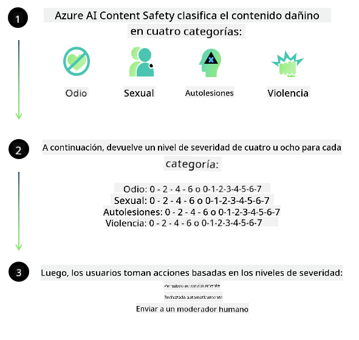

<!--
CO_OP_TRANSLATOR_METADATA:
{
  "original_hash": "839ccc4b3886ef10cfd4e64977f5792d",
  "translation_date": "2026-01-04T06:37:29+00:00",
  "source_file": "md/01.Introduction/01/01.AISafety.md",
  "language_code": "es"
}
-->
# Seguridad de IA para modelos Phi
La familia de modelos Phi se desarrolló de acuerdo con el [Estándar de IA Responsable de Microsoft](https://www.microsoft.com/ai/principles-and-approach#responsible-ai-standard), que es un conjunto de requisitos aplicable a toda la compañía basado en los siguientes seis principios: responsabilidad, transparencia, equidad, fiabilidad y seguridad, privacidad y seguridad, e inclusión, que forman los [Principios de IA Responsable de Microsoft](https://www.microsoft.com/ai/responsible-ai). 

Al igual que los modelos Phi anteriores, se adoptó un enfoque multifacético de evaluación de seguridad y post-entrenamiento de seguridad, con medidas adicionales para tener en cuenta las capacidades multilingües de esta versión. Nuestro enfoque para el entrenamiento y las evaluaciones de seguridad, que incluye pruebas en múltiples idiomas y categorías de riesgo, se describe en el [Phi Safety Post-Training Paper](https://arxiv.org/abs/2407.13833). Aunque los modelos Phi se benefician de este enfoque, los desarrolladores deben aplicar las mejores prácticas de IA responsable, incluyendo mapear, medir y mitigar los riesgos asociados con su caso de uso específico y el contexto cultural y lingüístico.

## Mejores prácticas

Al igual que otros modelos, la familia de modelos Phi puede comportarse potencialmente de maneras que sean injustas, poco fiables u ofensivas.

Algunos de los comportamientos limitantes de SLM y LLM que debes conocer incluyen:

- **Calidad del servicio:** Los modelos Phi están entrenados principalmente con texto en inglés. Los idiomas distintos del inglés experimentarán un rendimiento inferior. Las variedades de inglés con menor representación en los datos de entrenamiento podrían tener un rendimiento peor que el inglés estadounidense estándar.
- **Representación de daños y perpetuación de estereotipos:** Estos modelos pueden sobre- o sub-representar grupos de personas, borrar la representación de algunos grupos o reforzar estereotipos denigrantes o negativos. A pesar del post-entrenamiento de seguridad, estas limitaciones pueden seguir presentes debido a niveles de representación distintos de diferentes grupos o a la prevalencia de ejemplos de estereotipos negativos en los datos de entrenamiento que reflejan patrones del mundo real y sesgos sociales.
- **Contenido inapropiado u ofensivo:** Estos modelos pueden producir otros tipos de contenido inapropiado u ofensivo, lo que puede hacer que no sea apropiado desplegarlos en contextos sensibles sin mitigaciones adicionales específicas para el caso de uso.
Information Reliability: Los modelos de lenguaje pueden generar contenido sin sentido o fabricar contenido que puede sonar razonable pero que es inexacto o está desactualizado.
- **Alcance limitado para código:** La mayoría de los datos de entrenamiento de Phi-3 se basan en Python y utilizan paquetes comunes como "typing, math, random, collections, datetime, itertools". Si el modelo genera scripts Python que utilizan otros paquetes o scripts en otros lenguajes, recomendamos encarecidamente que los usuarios verifiquen manualmente todos los usos de las API.

Los desarrolladores deben aplicar las mejores prácticas de IA responsable y son responsables de garantizar que un caso de uso específico cumpla con las leyes y regulaciones pertinentes (p. ej., privacidad, comercio, etc.). 

## Consideraciones de IA responsable

Al igual que otros modelos de lenguaje, los modelos de la serie Phi pueden comportarse potencialmente de maneras que sean injustas, poco fiables u ofensivas. Algunos de los comportamientos limitantes a tener en cuenta incluyen:

**Calidad del servicio:** Los modelos Phi están entrenados principalmente con texto en inglés. Los idiomas distintos del inglés experimentarán un rendimiento inferior. Las variedades de inglés con menor representación en los datos de entrenamiento podrían tener un rendimiento peor que el inglés estadounidense estándar.

**Representación de daños y perpetuación de estereotipos:** Estos modelos pueden sobre- o sub-representar grupos de personas, borrar la representación de algunos grupos o reforzar estereotipos denigrantes o negativos. A pesar del post-entrenamiento de seguridad, estas limitaciones pueden seguir presentes debido a niveles de representación distintos de diferentes grupos o a la prevalencia de ejemplos de estereotipos negativos en los datos de entrenamiento que reflejan patrones del mundo real y sesgos sociales.

**Contenido inapropiado u ofensivo:** Estos modelos pueden producir otros tipos de contenido inapropiado u ofensivo, lo que puede hacer que no sea apropiado desplegarlos en contextos sensibles sin mitigaciones adicionales específicas para el caso de uso.
Information Reliability: Los modelos de lenguaje pueden generar contenido sin sentido o fabricar contenido que puede sonar razonable pero que es inexacto o está desactualizado.

**Alcance limitado para código:** La mayoría de los datos de entrenamiento de Phi-3 se basan en Python y utilizan paquetes comunes como "typing, math, random, collections, datetime, itertools". Si el modelo genera scripts Python que utilizan otros paquetes o scripts en otros lenguajes, recomendamos encarecidamente que los usuarios verifiquen manualmente todos los usos de las API.

Los desarrolladores deben aplicar las mejores prácticas de IA responsable y son responsables de garantizar que un caso de uso específico cumpla con las leyes y regulaciones pertinentes (p. ej., privacidad, comercio, etc.). Las áreas importantes a considerar incluyen:

**Asignación:** Los modelos pueden no ser adecuados para escenarios que podrían tener un impacto trascendental en el estatus legal o en la asignación de recursos u oportunidades vitales (p. ej.: vivienda, empleo, crédito, etc.) sin evaluaciones adicionales y técnicas adicionales de reducción de sesgos.

**Escenarios de alto riesgo:** Los desarrolladores deben evaluar la idoneidad de usar modelos en escenarios de alto riesgo donde salidas injustas, poco fiables u ofensivas puedan ser extremadamente costosas o causar daño. Esto incluye ofrecer asesoramiento en dominios sensibles o especializados donde la precisión y la fiabilidad son críticas (p. ej.: asesoría legal o de salud). Se deben implementar salvaguardas adicionales a nivel de aplicación según el contexto de despliegue.

**Desinformación:** Los modelos pueden producir información inexacta. Los desarrolladores deben seguir las mejores prácticas de transparencia e informar a los usuarios finales que están interactuando con un sistema de IA. A nivel de aplicación, los desarrolladores pueden construir mecanismos de retroalimentación y canalizaciones para fundamentar las respuestas en información contextual específica del caso de uso, una técnica conocida como Generación Aumentada mediante Recuperación (RAG).

**Generación de contenido dañino:** Los desarrolladores deben evaluar las salidas en su contexto y utilizar clasificadores de seguridad disponibles o soluciones personalizadas apropiadas para su caso de uso.

**Uso indebido:** Pueden ser posibles otras formas de uso indebido, como fraude, spam o producción de malware, y los desarrolladores deben asegurarse de que sus aplicaciones no violen leyes y regulaciones aplicables.

### Ajuste fino y seguridad de contenido de IA

Después de ajustar finamente un modelo, recomendamos encarecidamente aprovechar las medidas de [Azure AI Content Safety](https://learn.microsoft.com/azure/ai-services/content-safety/overview) para supervisar el contenido generado por los modelos, identificar y bloquear riesgos potenciales, amenazas y problemas de calidad.

[Azure AI Content Safety](https://learn.microsoft.com/azure/ai-services/content-safety/overview) admite tanto contenido de texto como de imagen. Puede implementarse en la nube, en contenedores desconectados y en dispositivos edge/embebidos.

## Descripción general de Azure AI Content Safety

- **Azure AI Content Safety**
- **Microsoft Developer**
- **5 videos**

El servicio Azure AI Content Safety detecta contenido dañino generado por usuarios y por IA en aplicaciones y servicios. Incluye API de texto e imagen que permiten detectar material dañino o inapropiado.

[Lista de reproducción de AI Content Safety](https://www.youtube.com/playlist?list=PLlrxD0HtieHjaQ9bJjyp1T7FeCbmVcPkQ)

---

<!-- CO-OP TRANSLATOR DISCLAIMER START -->
Descargo de responsabilidad:
Este documento ha sido traducido utilizando el servicio de traducción por IA Co-op Translator (https://github.com/Azure/co-op-translator). Aunque nos esforzamos por la precisión, tenga en cuenta que las traducciones automatizadas pueden contener errores o inexactitudes. El documento original en su idioma nativo debe considerarse la fuente autorizada. Para información crítica, se recomienda una traducción profesional realizada por un traductor humano. No nos hacemos responsables de ningún malentendido o interpretación errónea que surja del uso de esta traducción.
<!-- CO-OP TRANSLATOR DISCLAIMER END -->