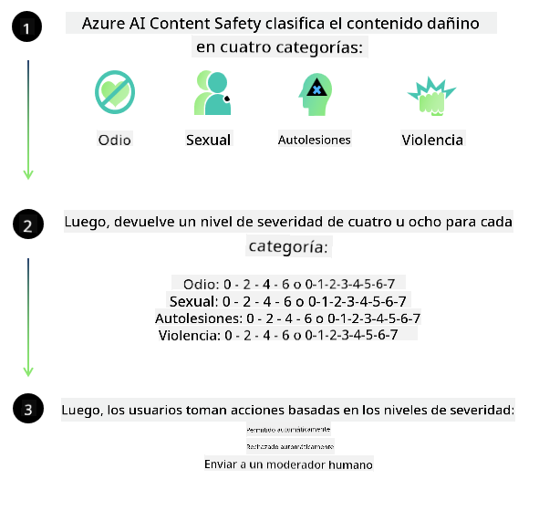
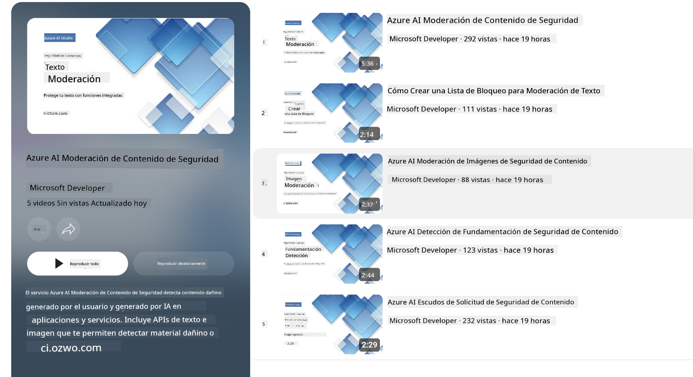

<!--
CO_OP_TRANSLATOR_METADATA:
{
  "original_hash": "c8273672cc57df2be675407a1383aaf0",
  "translation_date": "2025-07-16T17:41:32+00:00",
  "source_file": "md/01.Introduction/01/01.AISafety.md",
  "language_code": "es"
}
-->
# Seguridad de IA para modelos Phi  
La familia de modelos Phi fue desarrollada conforme al [Microsoft Responsible AI Standard](https://query.prod.cms.rt.microsoft.com/cms/api/am/binary/RE5cmFl), un conjunto de requisitos a nivel empresa basado en seis principios: responsabilidad, transparencia, equidad, fiabilidad y seguridad, privacidad y protección, e inclusión, que conforman los [principios de IA responsable de Microsoft](https://www.microsoft.com/ai/responsible-ai).

Al igual que con los modelos Phi anteriores, se adoptó un enfoque multifacético de evaluación de seguridad y post-entrenamiento, con medidas adicionales para tener en cuenta las capacidades multilingües de esta versión. Nuestro enfoque para el entrenamiento y evaluación de seguridad, incluyendo pruebas en múltiples idiomas y categorías de riesgo, se detalla en el [Documento de Seguridad Post-Entrenamiento de Phi](https://arxiv.org/abs/2407.13833). Aunque los modelos Phi se benefician de este enfoque, los desarrolladores deben aplicar las mejores prácticas de IA responsable, incluyendo mapear, medir y mitigar los riesgos asociados con su caso de uso específico y el contexto cultural y lingüístico.

## Mejores Prácticas

Al igual que otros modelos, la familia Phi puede comportarse de maneras que resulten injustas, poco fiables o ofensivas.

Algunos comportamientos limitantes de SLM y LLM que debes conocer incluyen:

- **Calidad del Servicio:** Los modelos Phi están entrenados principalmente con texto en inglés. Los idiomas distintos al inglés tendrán un rendimiento inferior. Las variedades del inglés con menor representación en los datos de entrenamiento podrían tener un desempeño peor que el inglés americano estándar.  
- **Representación de Daños y Perpetuación de Estereotipos:** Estos modelos pueden sobre- o sub-representar grupos de personas, eliminar la representación de algunos grupos o reforzar estereotipos denigrantes o negativos. A pesar del post-entrenamiento de seguridad, estas limitaciones pueden persistir debido a diferentes niveles de representación de grupos o a la prevalencia de ejemplos de estereotipos negativos en los datos de entrenamiento que reflejan patrones reales y sesgos sociales.  
- **Contenido Inapropiado u Ofensivo:** Estos modelos pueden generar otros tipos de contenido inapropiado u ofensivo, lo que puede hacer que no sea adecuado su despliegue en contextos sensibles sin mitigaciones adicionales específicas para el caso de uso.  
- **Fiabilidad de la Información:** Los modelos de lenguaje pueden generar contenido sin sentido o inventar información que puede sonar razonable pero es inexacta o desactualizada.  
- **Alcance Limitado para Código:** La mayoría de los datos de entrenamiento de Phi-3 están basados en Python y utilizan paquetes comunes como "typing, math, random, collections, datetime, itertools". Si el modelo genera scripts en Python que usan otros paquetes o scripts en otros lenguajes, recomendamos encarecidamente que los usuarios verifiquen manualmente todos los usos de API.

Los desarrolladores deben aplicar las mejores prácticas de IA responsable y son responsables de asegurar que un caso de uso específico cumpla con las leyes y regulaciones aplicables (por ejemplo, privacidad, comercio, etc.).

## Consideraciones de IA Responsable

Al igual que otros modelos de lenguaje, los modelos de la serie Phi pueden comportarse de maneras injustas, poco fiables u ofensivas. Algunos comportamientos limitantes a tener en cuenta incluyen:

**Calidad del Servicio:** Los modelos Phi están entrenados principalmente con texto en inglés. Los idiomas distintos al inglés tendrán un rendimiento inferior. Las variedades del inglés con menor representación en los datos de entrenamiento podrían tener un desempeño peor que el inglés americano estándar.

**Representación de Daños y Perpetuación de Estereotipos:** Estos modelos pueden sobre- o sub-representar grupos de personas, eliminar la representación de algunos grupos o reforzar estereotipos denigrantes o negativos. A pesar del post-entrenamiento de seguridad, estas limitaciones pueden persistir debido a diferentes niveles de representación de grupos o a la prevalencia de ejemplos de estereotipos negativos en los datos de entrenamiento que reflejan patrones reales y sesgos sociales.

**Contenido Inapropiado u Ofensivo:** Estos modelos pueden generar otros tipos de contenido inapropiado u ofensivo, lo que puede hacer que no sea adecuado su despliegue en contextos sensibles sin mitigaciones adicionales específicas para el caso de uso.  
**Fiabilidad de la Información:** Los modelos de lenguaje pueden generar contenido sin sentido o inventar información que puede sonar razonable pero es inexacta o desactualizada.

**Alcance Limitado para Código:** La mayoría de los datos de entrenamiento de Phi-3 están basados en Python y utilizan paquetes comunes como "typing, math, random, collections, datetime, itertools". Si el modelo genera scripts en Python que usan otros paquetes o scripts en otros lenguajes, recomendamos encarecidamente que los usuarios verifiquen manualmente todos los usos de API.

Los desarrolladores deben aplicar las mejores prácticas de IA responsable y son responsables de asegurar que un caso de uso específico cumpla con las leyes y regulaciones aplicables (por ejemplo, privacidad, comercio, etc.). Áreas importantes a considerar incluyen:

**Asignación:** Los modelos pueden no ser adecuados para escenarios que puedan tener un impacto significativo en el estatus legal o en la asignación de recursos u oportunidades de vida (ej: vivienda, empleo, crédito, etc.) sin evaluaciones adicionales y técnicas de reducción de sesgos.

**Escenarios de Alto Riesgo:** Los desarrolladores deben evaluar la idoneidad de usar modelos en escenarios de alto riesgo donde resultados injustos, poco fiables u ofensivos puedan ser extremadamente costosos o causar daño. Esto incluye brindar asesoría en dominios sensibles o expertos donde la precisión y fiabilidad son críticas (ej: asesoría legal o médica). Se deben implementar salvaguardas adicionales a nivel de aplicación según el contexto de despliegue.

**Desinformación:** Los modelos pueden generar información inexacta. Los desarrolladores deben seguir las mejores prácticas de transparencia e informar a los usuarios finales que están interactuando con un sistema de IA. A nivel de aplicación, los desarrolladores pueden construir mecanismos de retroalimentación y pipelines para fundamentar las respuestas en información contextual y específica del caso de uso, una técnica conocida como Retrieval Augmented Generation (RAG).

**Generación de Contenido Dañino:** Los desarrolladores deben evaluar las salidas según su contexto y usar clasificadores de seguridad disponibles o soluciones personalizadas apropiadas para su caso de uso.

**Uso Indebido:** Otras formas de uso indebido como fraude, spam o producción de malware pueden ser posibles, y los desarrolladores deben asegurarse de que sus aplicaciones no violen leyes y regulaciones aplicables.

### Afinamiento y Seguridad de Contenido de IA

Después de afinar un modelo, recomendamos encarecidamente aprovechar las medidas de [Azure AI Content Safety](https://learn.microsoft.com/azure/ai-services/content-safety/overview) para monitorear el contenido generado por los modelos, identificar y bloquear riesgos potenciales, amenazas y problemas de calidad.

[Azure AI Content Safety](https://learn.microsoft.com/azure/ai-services/content-safety/overview) soporta contenido tanto de texto como de imagen. Puede desplegarse en la nube, en contenedores desconectados y en dispositivos edge/embebidos.

## Resumen de Azure AI Content Safety

Azure AI Content Safety no es una solución única para todos; puede personalizarse para alinearse con las políticas específicas de cada empresa. Además, sus modelos multilingües le permiten comprender varios idiomas simultáneamente.

- **Azure AI Content Safety**  
- **Microsoft Developer**  
- **5 videos**

El servicio Azure AI Content Safety detecta contenido dañino generado por usuarios y por IA en aplicaciones y servicios. Incluye APIs de texto e imagen que permiten detectar material dañino o inapropiado.

[AI Content Safety Playlist](https://www.youtube.com/playlist?list=PLlrxD0HtieHjaQ9bJjyp1T7FeCbmVcPkQ)

**Aviso legal**:  
Este documento ha sido traducido utilizando el servicio de traducción automática [Co-op Translator](https://github.com/Azure/co-op-translator). Aunque nos esforzamos por la precisión, tenga en cuenta que las traducciones automáticas pueden contener errores o inexactitudes. El documento original en su idioma nativo debe considerarse la fuente autorizada. Para información crítica, se recomienda la traducción profesional realizada por humanos. No nos hacemos responsables de malentendidos o interpretaciones erróneas derivadas del uso de esta traducción.