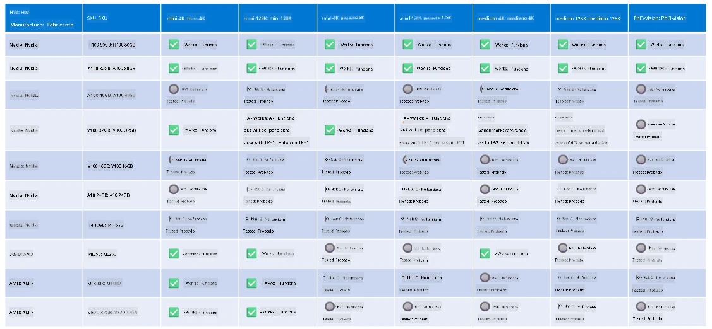

# Soporte de Hardware Phi

Microsoft Phi ha sido optimizado para ONNX Runtime y es compatible con Windows DirectML. Funciona bien en diversos tipos de hardware, incluyendo GPUs, CPUs e incluso dispositivos móviles.

## Hardware del Dispositivo  
Específicamente, el hardware soportado incluye:

- GPU SKU: RTX 4090 (DirectML)
- GPU SKU: 1 A100 80GB (CUDA)
- CPU SKU: Standard F64s v2 (64 vCPUs, 128 GiB de memoria)

## SKU Móvil

- Android - Samsung Galaxy S21
- Apple iPhone 14 o superior con procesador A16/A17

## Especificaciones del Hardware Phi

- Configuración mínima requerida.
- Windows: GPU compatible con DirectX 12 y un mínimo de 4GB de RAM combinada

CUDA: GPU NVIDIA con capacidad de cómputo >= 7.02



## Ejecutando onnxruntime en múltiples GPUs

Actualmente, los modelos Phi ONNX disponibles son solo para 1 GPU. Es posible soportar multi-GPU para modelos Phi, pero ORT con 2 GPUs no garantiza que ofrezca mayor rendimiento comparado con 2 instancias de ort. Por favor, consulta [ONNX Runtime](https://onnxruntime.ai/) para las últimas actualizaciones.

En [Build 2024 el equipo GenAI ONNX](https://youtu.be/WLW4SE8M9i8?si=EtG04UwDvcjunyfC) anunció que habilitaron multi-instancia en lugar de multi-GPU para los modelos Phi.

Actualmente, esto te permite ejecutar una instancia de onnxruntime o onnxruntime-genai con la variable de entorno CUDA_VISIBLE_DEVICES de esta manera.

```Python
CUDA_VISIBLE_DEVICES=0 python infer.py
CUDA_VISIBLE_DEVICES=1 python infer.py
```

No dudes en explorar más sobre Phi en [Azure AI Foundry](https://ai.azure.com)

**Aviso legal**:  
Este documento ha sido traducido utilizando el servicio de traducción automática [Co-op Translator](https://github.com/Azure/co-op-translator). Aunque nos esforzamos por la precisión, tenga en cuenta que las traducciones automáticas pueden contener errores o inexactitudes. El documento original en su idioma nativo debe considerarse la fuente autorizada. Para información crítica, se recomienda la traducción profesional realizada por humanos. No nos hacemos responsables de malentendidos o interpretaciones erróneas derivadas del uso de esta traducción.