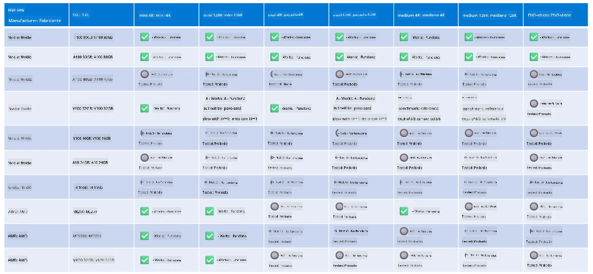

# Soporte de Hardware Phi

Microsoft Phi ha sido optimizado para ONNX Runtime y es compatible con Windows DirectML. Funciona bien en varios tipos de hardware, incluyendo GPUs, CPUs e incluso dispositivos móviles.

## Hardware del Dispositivo
Específicamente, el hardware soportado incluye:

- SKU de GPU: RTX 4090 (DirectML)
- SKU de GPU: 1 A100 80GB (CUDA)
- SKU de CPU: Standard F64s v2 (64 vCPUs, 128 GiB de memoria)

## SKU Móvil

- Android - Samsung Galaxy S21
- Apple iPhone 14 o superior con procesador A16/A17

## Especificaciones de Hardware Phi

- Configuración mínima requerida.
- Windows: GPU compatible con DirectX 12 y un mínimo de 4GB de RAM combinada

CUDA: GPU NVIDIA con Capacidad de Cómputo >= 7.02



## Ejecución de onnxruntime en múltiples GPUs

Actualmente los modelos Phi ONNX disponibles son solo para 1 GPU. Es posible soportar multi-gpu para el modelo Phi, pero ORT con 2 GPUs no garantiza que ofrezca mayor rendimiento comparado con 2 instancias de ORT. Por favor, consulte [ONNX Runtime](https://onnxruntime.ai/) para las últimas actualizaciones.

En [Build 2024, el equipo GenAI ONNX](https://youtu.be/WLW4SE8M9i8?si=EtG04UwDvcjunyfC) anunció que han habilitado multi-instancia en lugar de multi-gpu para modelos Phi.

En la actualidad, esto permite ejecutar una instancia de onnxruntime u onnxruntime-genai con la variable de entorno CUDA_VISIBLE_DEVICES de esta forma.

```Python
CUDA_VISIBLE_DEVICES=0 python infer.py
CUDA_VISIBLE_DEVICES=1 python infer.py
```

Siéntase libre de explorar Phi más a fondo en [Microsoft Foundry](https://ai.azure.com)

---

<!-- CO-OP TRANSLATOR DISCLAIMER START -->
**Descargo de responsabilidad**:
Este documento ha sido traducido utilizando el servicio de traducción automática [Co-op Translator](https://github.com/Azure/co-op-translator). Aunque nos esforzamos por la precisión, tenga en cuenta que las traducciones automáticas pueden contener errores o inexactitudes. El documento original en su idioma nativo debe considerarse la fuente autorizada. Para información crítica, se recomienda una traducción profesional realizada por humanos. No nos hacemos responsables por malentendidos o interpretaciones erróneas derivadas del uso de esta traducción.
<!-- CO-OP TRANSLATOR DISCLAIMER END -->