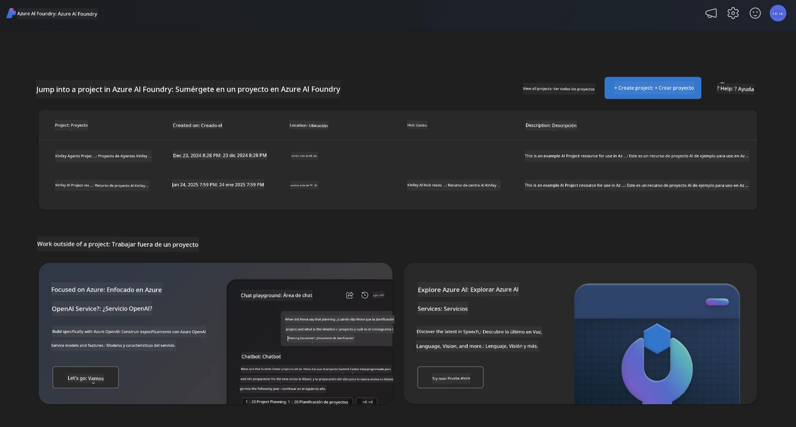
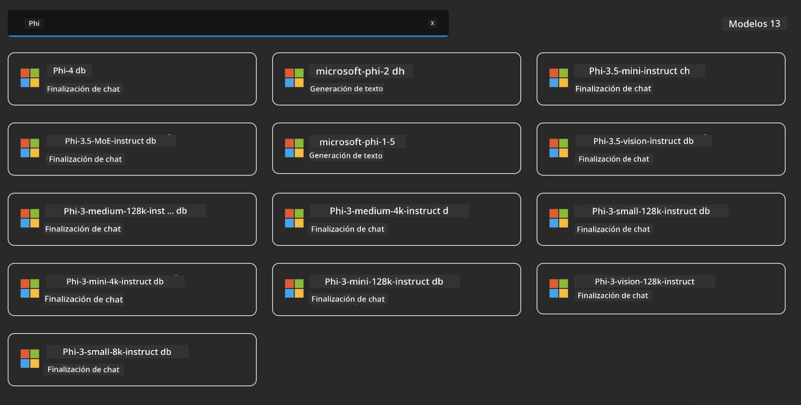
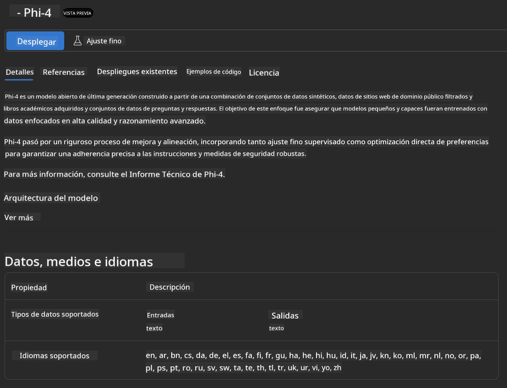
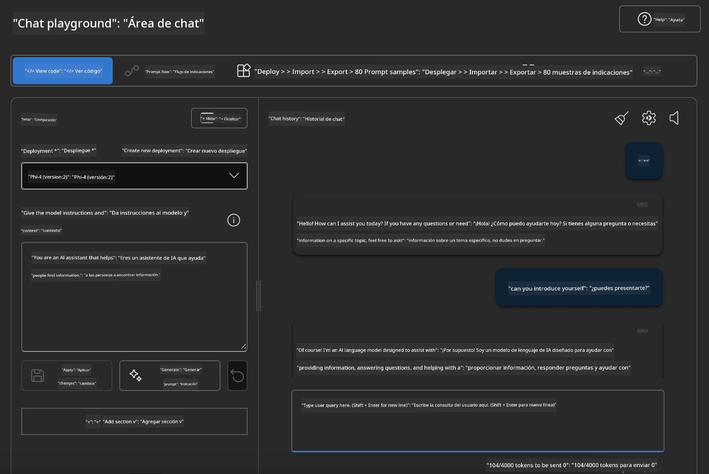

## Familia Phi en Microsoft Foundry

[Microsoft Foundry](https://ai.azure.com) es una plataforma confiable que capacita a los desarrolladores para impulsar la innovación y moldear el futuro con IA de manera segura, protegida y responsable.


[Microsoft Foundry](https://ai.azure.com) está diseñada para que los desarrolladores:

- Construyan aplicaciones de IA generativa en una plataforma de nivel empresarial.
- Exploren, construyan, prueben y desplieguen utilizando herramientas de IA de vanguardia y modelos de ML, basados en prácticas responsables de IA.
- Colaboren con un equipo durante el ciclo completo de desarrollo de aplicaciones.

Con Microsoft Foundry, puedes explorar una amplia variedad de modelos, servicios y capacidades, y comenzar a construir aplicaciones de IA que mejor sirvan a tus objetivos. La plataforma Microsoft Foundry facilita la escalabilidad para transformar pruebas de concepto en aplicaciones de producción completas con facilidad. El monitoreo continuo y la refinación apoyan el éxito a largo plazo.



Además de usar el Servicio AOAI de Azure en Microsoft Foundry, también puedes utilizar modelos de terceros en el Catálogo de Modelos de Microsoft Foundry. Esta es una buena opción si deseas utilizar Microsoft Foundry como tu plataforma de soluciones de IA.

Podemos desplegar rápidamente los Modelos de la Familia Phi a través del Catálogo de Modelos en Microsoft Foundry

[Modelos Microsoft Phi en Modelos Microsoft Foundry](https://ai.azure.com/explore/models/?selectedCollection=phi)



### **Desplegar Phi-4 en Microsoft Foundry**




### **Probar Phi-4 en el Playground de Microsoft Foundry**



### **Ejecutar código Python para llamar a Microsoft Foundry Phi-4**


```python

import os  
import base64
from openai import AzureOpenAI  
from azure.identity import DefaultAzureCredential, get_bearer_token_provider  
        
endpoint = os.getenv("ENDPOINT_URL", "Your Azure AOAI Service Endpoint")  
deployment = os.getenv("DEPLOYMENT_NAME", "Phi-4")  
      
token_provider = get_bearer_token_provider(  
    DefaultAzureCredential(),  
    "https://cognitiveservices.azure.com/.default"  
)  
  
client = AzureOpenAI(  
    azure_endpoint=endpoint,  
    azure_ad_token_provider=token_provider,  
    api_version="2024-05-01-preview",  
)  
  

chat_prompt = [
    {
        "role": "system",
        "content": "You are an AI assistant that helps people find information."
    },
    {
        "role": "user",
        "content": "can you introduce yourself"
    }
] 
    
# Incluir resultado de voz si la voz está habilitada
messages = chat_prompt 

completion = client.chat.completions.create(  
    model=deployment,  
    messages=messages,
    max_tokens=800,  
    temperature=0.7,  
    top_p=0.95,  
    frequency_penalty=0,  
    presence_penalty=0,
    stop=None,  
    stream=False  
)  
  
print(completion.to_json())  

```

---

<!-- CO-OP TRANSLATOR DISCLAIMER START -->
**Aviso Legal**:
Este documento ha sido traducido utilizando el servicio de traducción automática [Co-op Translator](https://github.com/Azure/co-op-translator). Aunque nos esforzamos por lograr la precisión, tenga en cuenta que las traducciones automáticas pueden contener errores o inexactitudes. El documento original en su idioma nativo debe considerarse la fuente autorizada. Para información crítica, se recomienda una traducción profesional realizada por humanos. No nos hacemos responsables de ningún malentendido o interpretación errónea derivada del uso de esta traducción.
<!-- CO-OP TRANSLATOR DISCLAIMER END -->