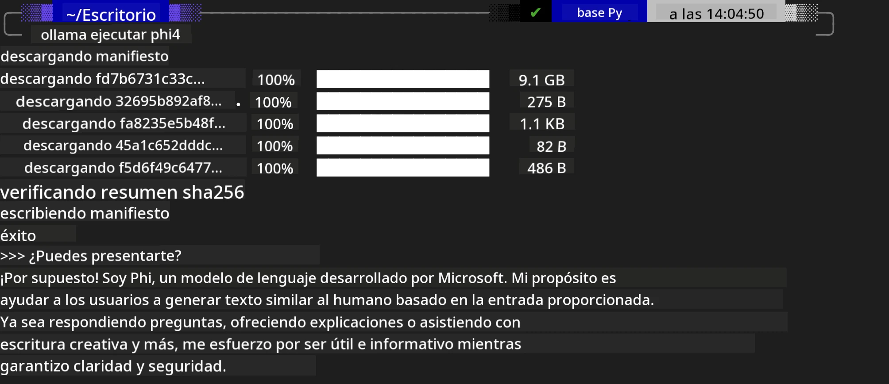
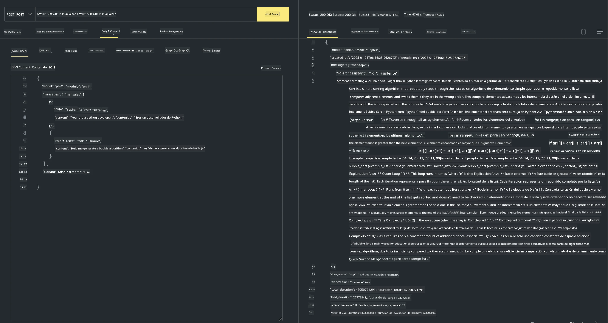

<!--
CO_OP_TRANSLATOR_METADATA:
{
  "original_hash": "2aa35f3c8b437fd5dc9995d53909d495",
  "translation_date": "2025-12-21T09:47:22+00:00",
  "source_file": "md/01.Introduction/02/04.Ollama.md",
  "language_code": "es"
}
-->
## Familia Phi en Ollama


[Ollama](https://ollama.com) permite que más personas desplieguen directamente modelos LLM o SLM de código abierto mediante scripts sencillos, y también puede crear APIs para ayudar en escenarios de aplicación Copilot locales.

## **1. Instalación**

Ollama admite su ejecución en Windows, macOS y Linux. Puede instalar Ollama a través de este enlace ([https://ollama.com/download](https://ollama.com/download)). Después de la instalación correctamente, puede usar directamente el script de Ollama para llamar a Phi-3 desde una ventana de terminal. Puede ver todas las [bibliotecas disponibles en Ollama](https://ollama.com/library). Si abre este repositorio en un Codespace, ya tendrá Ollama instalado.

```bash

ollama run phi4

```

> [!NOTE]
> El modelo se descargará primero cuando lo ejecute por primera vez. Por supuesto, también puede especificar directamente el modelo Phi-4 ya descargado. Tomamos WSL como ejemplo para ejecutar el comando. Después de que el modelo se descargue con éxito, puede interactuar directamente en la terminal.



## **2. Llamar a la API phi-4 desde Ollama**

Si desea invocar la API Phi-4 generada por Ollama, puede usar este comando en la terminal para iniciar el servidor de Ollama.

```bash

ollama serve

```

> [!NOTE]
> Si ejecuta MacOS o Linux, tenga en cuenta que puede encontrar el siguiente error **"Error: listen tcp 127.0.0.1:11434: bind: address already in use"**. Puede obtener este error al ejecutar el comando. Puede ignorar ese error, ya que normalmente indica que el servidor ya se está ejecutando, o puede detener y reiniciar Ollama:

**macOS**

```bash

brew services restart ollama

```

**Linux**

```bash

sudo systemctl stop ollama

```

Ollama admite dos API: generate y chat. Puede llamar a la API del modelo que proporciona Ollama según sus necesidades, enviando solicitudes al servicio local que se ejecuta en el puerto 11434.

**Chat**

```bash

curl http://127.0.0.1:11434/api/chat -d '{
  "model": "phi3",
  "messages": [
    {
      "role": "system",
      "content": "Your are a python developer."
    },
    {
      "role": "user",
      "content": "Help me generate a bubble algorithm"
    }
  ],
  "stream": false
  
}'
```

Este es el resultado en Postman



## Recursos adicionales

Consulte la lista de modelos disponibles en Ollama en [su biblioteca](https://ollama.com/library).

Extraiga su modelo del servidor de Ollama usando este comando

```bash
ollama pull phi4
```

Ejecute el modelo usando este comando

```bash
ollama run phi4
```

***Nota:*** Visite este enlace [https://github.com/ollama/ollama/blob/main/docs/api.md](https://github.com/ollama/ollama/blob/main/docs/api.md) para obtener más información

## Llamar a Ollama desde Python

Puede usar `requests` o `urllib3` para realizar solicitudes a los endpoints del servidor local mencionados arriba. Sin embargo, una forma popular de usar Ollama en Python es a través del SDK [openai](https://pypi.org/project/openai/), ya que Ollama también proporciona endpoints de servidor compatibles con OpenAI.

Aquí hay un ejemplo para phi3-mini:

```python
import openai

client = openai.OpenAI(
    base_url="http://localhost:11434/v1",
    api_key="nokeyneeded",
)

response = client.chat.completions.create(
    model="phi4",
    temperature=0.7,
    n=1,
    messages=[
        {"role": "system", "content": "You are a helpful assistant."},
        {"role": "user", "content": "Write a haiku about a hungry cat"},
    ],
)

print("Response:")
print(response.choices[0].message.content)
```

## Llamar a Ollama desde JavaScript 

```javascript
// Ejemplo de resumir un archivo con Phi-4
script({
    model: "ollama:phi4",
    title: "Summarize with Phi-4",
    system: ["system"],
})

// Ejemplo de resumir
const file = def("FILE", env.files)
$`Summarize ${file} in a single paragraph.`
```

## Llamar a Ollama desde C#

Cree una nueva aplicación de consola C# y agregue el siguiente paquete NuGet:

```bash
dotnet add package Microsoft.SemanticKernel --version 1.34.0
```

Luego reemplace este código en el archivo `Program.cs`

```csharp
using Microsoft.SemanticKernel;
using Microsoft.SemanticKernel.ChatCompletion;

// add chat completion service using the local ollama server endpoint
#pragma warning disable SKEXP0001, SKEXP0003, SKEXP0010, SKEXP0011, SKEXP0050, SKEXP0052
builder.AddOpenAIChatCompletion(
    modelId: "phi4",
    endpoint: new Uri("http://localhost:11434/"),
    apiKey: "non required");

// invoke a simple prompt to the chat service
string prompt = "Write a joke about kittens";
var response = await kernel.InvokePromptAsync(prompt);
Console.WriteLine(response.GetValue<string>());
```

Ejecute la aplicación con el comando:

```bash
dotnet run
```

---

<!-- CO-OP TRANSLATOR DISCLAIMER START -->
Descargo de responsabilidad:
Este documento ha sido traducido mediante el servicio de traducción automática con IA [Co-op Translator](https://github.com/Azure/co-op-translator). Aunque nos esforzamos por la exactitud, tenga en cuenta que las traducciones automatizadas pueden contener errores o imprecisiones. El documento original en su idioma nativo debe considerarse la fuente autorizada. Para información crítica, se recomienda una traducción profesional realizada por un traductor humano. No nos hacemos responsables de ningún malentendido o interpretación errónea que pueda derivarse del uso de esta traducción.
<!-- CO-OP TRANSLATOR DISCLAIMER END -->