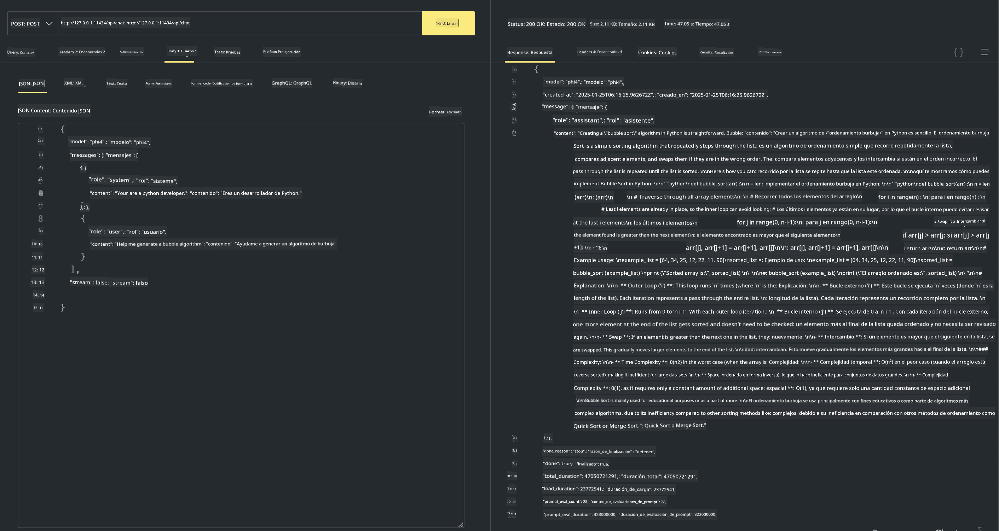

<!--
CO_OP_TRANSLATOR_METADATA:
{
  "original_hash": "0b38834693bb497f96bf53f0d941f9a1",
  "translation_date": "2025-07-16T19:12:25+00:00",
  "source_file": "md/01.Introduction/02/04.Ollama.md",
  "language_code": "es"
}
-->
## Familia Phi en Ollama


[Ollama](https://ollama.com) permite que más personas desplieguen directamente LLM o SLM de código abierto mediante scripts sencillos, y también puede crear APIs para ayudar en escenarios de aplicaciones locales tipo Copilot.

## **1. Instalación**

Ollama es compatible con Windows, macOS y Linux. Puedes instalar Ollama a través de este enlace ([https://ollama.com/download](https://ollama.com/download)). Después de una instalación exitosa, puedes usar directamente el script de Ollama para llamar a Phi-3 desde una ventana de terminal. Puedes ver todas las [bibliotecas disponibles en Ollama](https://ollama.com/library). Si abres este repositorio en un Codespace, Ollama ya estará instalado.

```bash

ollama run phi4

```

> [!NOTE]
> El modelo se descargará la primera vez que lo ejecutes. Por supuesto, también puedes especificar directamente el modelo Phi-4 descargado. Tomamos WSL como ejemplo para ejecutar el comando. Una vez que el modelo se haya descargado correctamente, puedes interactuar directamente desde la terminal.


## **2. Llamar a la API phi-4 desde Ollama**

Si quieres llamar a la API Phi-4 generada por Ollama, puedes usar este comando en la terminal para iniciar el servidor de Ollama.

```bash

ollama serve

```

> [!NOTE]
> Si usas MacOS o Linux, ten en cuenta que podrías encontrar el siguiente error **"Error: listen tcp 127.0.0.1:11434: bind: address already in use"**. Este error puede aparecer al ejecutar el comando. Puedes ignorarlo, ya que normalmente indica que el servidor ya está en ejecución, o bien puedes detener y reiniciar Ollama:

**macOS**

```bash

brew services restart ollama

```

**Linux**

```bash

sudo systemctl stop ollama

```

Ollama soporta dos APIs: generate y chat. Puedes llamar a la API del modelo que Ollama ofrece según tus necesidades, enviando solicitudes al servicio local que corre en el puerto 11434.

**Chat**

```bash

curl http://127.0.0.1:11434/api/chat -d '{
  "model": "phi3",
  "messages": [
    {
      "role": "system",
      "content": "Your are a python developer."
    },
    {
      "role": "user",
      "content": "Help me generate a bubble algorithm"
    }
  ],
  "stream": false
  
}'

This is the result in Postman



## Additional Resources

Check the list of available models in Ollama in [their library](https://ollama.com/library).

Pull your model from the Ollama server using this command

```bash
ollama pull phi4
```

Run the model using this command

```bash
ollama run phi4
```

***Note:*** Visit this link [https://github.com/ollama/ollama/blob/main/docs/api.md](https://github.com/ollama/ollama/blob/main/docs/api.md) to learn more

## Calling Ollama from Python

You can use `requests` or `urllib3` to make requests to the local server endpoints used above. However, a popular way to use Ollama in Python is via the [openai](https://pypi.org/project/openai/) SDK, since Ollama provides OpenAI-compatible server endpoints as well.

Here is an example for phi3-mini:

```python
import openai

client = openai.OpenAI(
    base_url="http://localhost:11434/v1",
    api_key="nokeyneeded",
)

response = client.chat.completions.create(
    model="phi4",
    temperature=0.7,
    n=1,
    messages=[
        {"role": "system", "content": "Eres un asistente útil."},
        {"role": "user", "content": "Escribe un haiku sobre un gato hambriento"},
    ],
)

print("Respuesta:")
print(response.choices[0].message.content)
```

## Calling Ollama from JavaScript 

```javascript
// Ejemplo de resumir un archivo con Phi-4
script({
    model: "ollama:phi4",
    title: "Resumir con Phi-4",
    system: ["system"],
})

// Ejemplo de resumen
const file = def("FILE", env.files)
$`Resume ${file} en un solo párrafo.`
```

## Calling Ollama from C#

Create a new C# Console application and add the following NuGet package:

```bash
dotnet add package Microsoft.SemanticKernel --version 1.34.0
```

Then replace this code in the `Program.cs` file

```csharp
using Microsoft.SemanticKernel;
using Microsoft.SemanticKernel.ChatCompletion;

// agregar servicio de chat completion usando el endpoint local de ollama
#pragma warning disable SKEXP0001, SKEXP0003, SKEXP0010, SKEXP0011, SKEXP0050, SKEXP0052
builder.AddOpenAIChatCompletion(
    modelId: "phi4",
    endpoint: new Uri("http://localhost:11434/"),
    apiKey: "non required");

// invocar un prompt simple al servicio de chat
string prompt = "Escribe un chiste sobre gatitos";
var response = await kernel.InvokePromptAsync(prompt);
Console.WriteLine(response.GetValue<string>());
```

Run the app with the command:

```bash
dotnet run
```

**Aviso legal**:  
Este documento ha sido traducido utilizando el servicio de traducción automática [Co-op Translator](https://github.com/Azure/co-op-translator). Aunque nos esforzamos por la precisión, tenga en cuenta que las traducciones automáticas pueden contener errores o inexactitudes. El documento original en su idioma nativo debe considerarse la fuente autorizada. Para información crítica, se recomienda una traducción profesional realizada por humanos. No nos hacemos responsables de malentendidos o interpretaciones erróneas derivadas del uso de esta traducción.