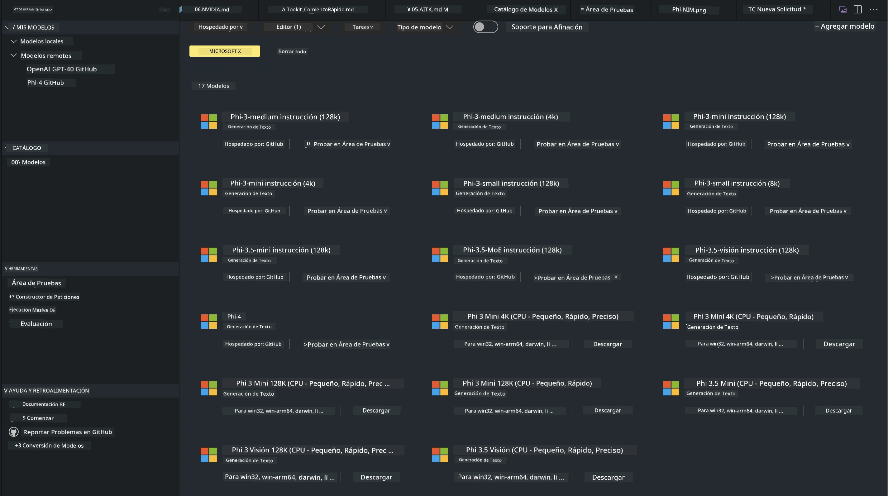
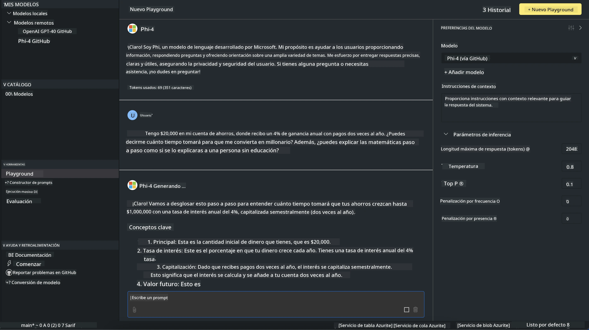

# Familia Phi en AITK

[AI Toolkit para VS Code](https://marketplace.visualstudio.com/items?itemName=ms-windows-ai-studio.windows-ai-studio) facilita el desarrollo de aplicaciones de IA generativa al reunir herramientas y modelos de desarrollo de IA de vanguardia del Azure AI Foundry Catalog y otros catálogos como Hugging Face. Podrás explorar el catálogo de modelos de IA impulsado por GitHub Models y Azure AI Foundry Model Catalogs, descargarlos local o remotamente, afinarlos, probarlos y usarlos en tu aplicación.

La versión preliminar de AI Toolkit se ejecutará localmente. La inferencia local o el ajuste fino dependen del modelo que selecciones; es posible que necesites una GPU como NVIDIA CUDA GPU. También puedes ejecutar modelos de GitHub directamente con AITK.

## Primeros pasos

[Aprende más sobre cómo instalar el Subsistema de Windows para Linux](https://learn.microsoft.com/windows/wsl/install?WT.mc_id=aiml-137032-kinfeylo)

y [cómo cambiar la distribución predeterminada](https://learn.microsoft.com/windows/wsl/install#change-the-default-linux-distribution-installed).

[Repositorio de AI Toolkit en GitHub](https://github.com/microsoft/vscode-ai-toolkit/)

- Windows, Linux, macOS
  
- Para el ajuste fino tanto en Windows como en Linux, necesitarás una GPU Nvidia. Además, **Windows** requiere el Subsistema de Windows para Linux con la distribución Ubuntu 18.4 o superior. [Aprende más sobre cómo instalar el Subsistema de Windows para Linux](https://learn.microsoft.com/windows/wsl/install) y [cómo cambiar la distribución predeterminada](https://learn.microsoft.com/windows/wsl/install#change-the-default-linux-distribution-installed).

### Instalar AI Toolkit

AI Toolkit se distribuye como una [extensión de Visual Studio Code](https://code.visualstudio.com/docs/setup/additional-components#_vs-code-extensions), por lo que primero debes instalar [VS Code](https://code.visualstudio.com/docs/setup/windows?WT.mc_id=aiml-137032-kinfeylo) y descargar AI Toolkit desde el [VS Marketplace](https://marketplace.visualstudio.com/items?itemName=ms-windows-ai-studio.windows-ai-studio).
El [AI Toolkit está disponible en el Visual Studio Marketplace](https://marketplace.visualstudio.com/items?itemName=ms-windows-ai-studio.windows-ai-studio) y puede instalarse como cualquier otra extensión de VS Code.

Si no estás familiarizado con la instalación de extensiones en VS Code, sigue estos pasos:

### Iniciar sesión

1. En la barra de actividades de VS Code selecciona **Extensiones**
1. En la barra de búsqueda de extensiones escribe "AI Toolkit"
1. Selecciona "AI Toolkit for Visual Studio code"
1. Selecciona **Instalar**

¡Ahora estás listo para usar la extensión!

Se te pedirá iniciar sesión en GitHub, así que haz clic en "Permitir" para continuar. Serás redirigido a la página de inicio de sesión de GitHub.

Por favor, inicia sesión y sigue los pasos del proceso. Tras completarlo con éxito, serás redirigido a VS Code.

Una vez instalada la extensión, verás el icono de AI Toolkit aparecer en tu barra de actividades.

¡Vamos a explorar las acciones disponibles!

### Acciones disponibles

La barra lateral principal de AI Toolkit está organizada en  

- **Models**
- **Resources**
- **Playground**  
- **Fine-tuning**
- **Evaluation**

Están disponibles en la sección Resources. Para comenzar, selecciona **Model Catalog**.

### Descargar un modelo del catálogo

Al iniciar AI Toolkit desde la barra lateral de VS Code, puedes elegir entre las siguientes opciones:



- Buscar un modelo compatible en **Model Catalog** y descargarlo localmente
- Probar la inferencia del modelo en el **Model Playground**
- Afinar el modelo local o remotamente en **Model Fine-tuning**
- Desplegar modelos afinados en la nube mediante la paleta de comandos de AI Toolkit
- Evaluar modelos

> [!NOTE]
>
> **GPU vs CPU**
>
> Notarás que las tarjetas de los modelos muestran el tamaño del modelo, la plataforma y el tipo de acelerador (CPU, GPU). Para un rendimiento optimizado en **dispositivos Windows que tengan al menos una GPU**, selecciona versiones de modelos que solo apunten a Windows.
>
> Esto asegura que tengas un modelo optimizado para el acelerador DirectML.
>
> Los nombres de los modelos tienen el formato
>
> - `{model_name}-{accelerator}-{quantization}-{format}`.
>
>Para verificar si tienes una GPU en tu dispositivo Windows, abre el **Administrador de tareas** y luego selecciona la pestaña **Rendimiento**. Si tienes GPU(s), aparecerán listadas con nombres como "GPU 0" o "GPU 1".

### Ejecutar el modelo en el playground

Después de configurar todos los parámetros, haz clic en **Generate Project**.

Una vez que tu modelo se haya descargado, selecciona **Load in Playground** en la tarjeta del modelo en el catálogo:

- Iniciar la descarga del modelo
- Instalar todos los prerrequisitos y dependencias
- Crear el espacio de trabajo en VS Code



### Usar la API REST en tu aplicación

AI Toolkit incluye un servidor web local de API REST **en el puerto 5272** que utiliza el [formato de chat completions de OpenAI](https://platform.openai.com/docs/api-reference/chat/create).

Esto te permite probar tu aplicación localmente sin depender de un servicio de modelo de IA en la nube. Por ejemplo, el siguiente archivo JSON muestra cómo configurar el cuerpo de la solicitud:

```json
{
    "model": "Phi-4",
    "messages": [
        {
            "role": "user",
            "content": "what is the golden ratio?"
        }
    ],
    "temperature": 0.7,
    "top_p": 1,
    "top_k": 10,
    "max_tokens": 100,
    "stream": true
}
```

Puedes probar la API REST usando (por ejemplo) [Postman](https://www.postman.com/) o la utilidad CURL (Client URL):

```bash
curl -vX POST http://127.0.0.1:5272/v1/chat/completions -H 'Content-Type: application/json' -d @body.json
```

### Usando la biblioteca cliente OpenAI para Python

```python
from openai import OpenAI

client = OpenAI(
    base_url="http://127.0.0.1:5272/v1/", 
    api_key="x" # required for the API but not used
)

chat_completion = client.chat.completions.create(
    messages=[
        {
            "role": "user",
            "content": "what is the golden ratio?",
        }
    ],
    model="Phi-4",
)

print(chat_completion.choices[0].message.content)
```

### Usando la biblioteca cliente Azure OpenAI para .NET

Agrega la [biblioteca cliente Azure OpenAI para .NET](https://www.nuget.org/packages/Azure.AI.OpenAI/) a tu proyecto usando NuGet:

```bash
dotnet add {project_name} package Azure.AI.OpenAI --version 1.0.0-beta.17
```

Agrega un archivo C# llamado **OverridePolicy.cs** a tu proyecto y pega el siguiente código:

```csharp
// OverridePolicy.cs
using Azure.Core.Pipeline;
using Azure.Core;

internal partial class OverrideRequestUriPolicy(Uri overrideUri)
    : HttpPipelineSynchronousPolicy
{
    private readonly Uri _overrideUri = overrideUri;

    public override void OnSendingRequest(HttpMessage message)
    {
        message.Request.Uri.Reset(_overrideUri);
    }
}
```

Luego, pega el siguiente código en tu archivo **Program.cs**:

```csharp
// Program.cs
using Azure.AI.OpenAI;

Uri localhostUri = new("http://localhost:5272/v1/chat/completions");

OpenAIClientOptions clientOptions = new();
clientOptions.AddPolicy(
    new OverrideRequestUriPolicy(localhostUri),
    Azure.Core.HttpPipelinePosition.BeforeTransport);
OpenAIClient client = new(openAIApiKey: "unused", clientOptions);

ChatCompletionsOptions options = new()
{
    DeploymentName = "Phi-4",
    Messages =
    {
        new ChatRequestSystemMessage("You are a helpful assistant. Be brief and succinct."),
        new ChatRequestUserMessage("What is the golden ratio?"),
    }
};

StreamingResponse<StreamingChatCompletionsUpdate> streamingChatResponse
    = await client.GetChatCompletionsStreamingAsync(options);

await foreach (StreamingChatCompletionsUpdate chatChunk in streamingChatResponse)
{
    Console.Write(chatChunk.ContentUpdate);
}
```


## Ajuste fino con AI Toolkit

- Comienza con el descubrimiento de modelos y el playground.
- Ajuste fino e inferencia de modelos usando recursos de cómputo locales.
- Ajuste fino e inferencia remotos usando recursos de Azure.

[Ajuste fino con AI Toolkit](../../03.FineTuning/Finetuning_VSCodeaitoolkit.md)

## Recursos de preguntas y respuestas de AI Toolkit

Consulta nuestra [página de preguntas y respuestas](https://github.com/microsoft/vscode-ai-toolkit/blob/main/archive/QA.md) para los problemas y soluciones más comunes

**Aviso legal**:  
Este documento ha sido traducido utilizando el servicio de traducción automática [Co-op Translator](https://github.com/Azure/co-op-translator). Aunque nos esforzamos por la precisión, tenga en cuenta que las traducciones automáticas pueden contener errores o inexactitudes. El documento original en su idioma nativo debe considerarse la fuente autorizada. Para información crítica, se recomienda la traducción profesional realizada por humanos. No nos hacemos responsables de ningún malentendido o interpretación errónea derivada del uso de esta traducción.