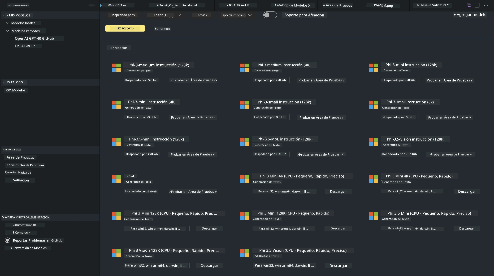
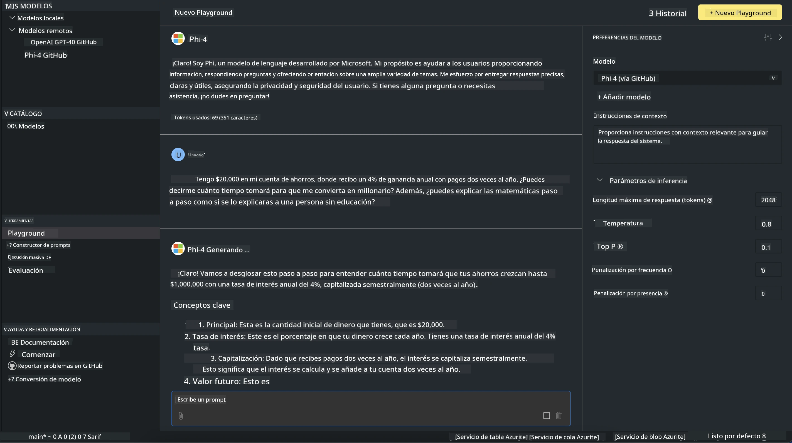

# Familia Phi en AITK

[AI Toolkit for VS Code](https://marketplace.visualstudio.com/items?itemName=ms-windows-ai-studio.windows-ai-studio) simplifica el desarrollo de aplicaciones de IA generativa al reunir herramientas y modelos de desarrollo de IA de vanguardia de Microsoft Foundry Catalog y otros catálogos como Hugging Face. Podrás explorar el catálogo de modelos de IA impulsado por GitHub Models y Microsoft Foundry Model Catalogs, descargarlos localmente o remotamente, ajustarlos, probarlos y usarlos en tu aplicación.

AI Toolkit Preview se ejecutará localmente. La inferencia local o el ajuste fino, depende del modelo que seleccionaste, es posible que necesites tener una GPU como NVIDIA CUDA GPU. También puedes ejecutar GitHub Models directamente con AITK.

## Comenzando

[Aprende más sobre cómo instalar el Subsistema de Windows para Linux](https://learn.microsoft.com/windows/wsl/install?WT.mc_id=aiml-137032-kinfeylo)

y [cambiar la distribución predeterminada](https://learn.microsoft.com/windows/wsl/install#change-the-default-linux-distribution-installed).

[Repositorio de AI Tooklit en GitHub](https://github.com/microsoft/vscode-ai-toolkit/)

- Windows, Linux, macOS

- Para ajustar finamente en Windows y Linux, necesitarás una GPU Nvidia. Además, **Windows** requiere el Subsistema para Linux con una distribución Ubuntu 18.4 o superior. [Aprende más sobre cómo instalar el Subsistema de Windows para Linux](https://learn.microsoft.com/windows/wsl/install) y [cambiar la distribución predeterminada](https://learn.microsoft.com/windows/wsl/install#change-the-default-linux-distribution-installed).

### Instalar AI Toolkit

AI Toolkit se distribuye como una [extensión de Visual Studio Code](https://code.visualstudio.com/docs/setup/additional-components#_vs-code-extensions), por lo que primero necesitas instalar [VS Code](https://code.visualstudio.com/docs/setup/windows?WT.mc_id=aiml-137032-kinfeylo), y descargar AI Toolkit desde el [mercado de VS](https://marketplace.visualstudio.com/items?itemName=ms-windows-ai-studio.windows-ai-studio).
El [AI Toolkit está disponible en el Visual Studio Marketplace](https://marketplace.visualstudio.com/items?itemName=ms-windows-ai-studio.windows-ai-studio) y se puede instalar como cualquier otra extensión de VS Code.

Si no estás familiarizado con la instalación de extensiones de VS Code, sigue estos pasos:

### Iniciar sesión

1. En la barra de actividades de VS Code selecciona **Extensiones**
1. En la barra de búsqueda de extensiones escribe "AI Toolkit"
1. Selecciona "AI Toolkit for Visual Studio code"
1. Selecciona **Instalar**

¡Ahora estás listo para usar la extensión!

Se te pedirá iniciar sesión en GitHub, así que por favor haz clic en "Permitir" para continuar. Serás redirigido a la página de inicio de sesión de GitHub.

Por favor inicia sesión y sigue los pasos del proceso. Después de completarlo con éxito, serás redirigido a VS Code.

Una vez que la extensión esté instalada verás el icono de AI Toolkit aparecer en tu barra de actividades.

¡Exploramos las acciones disponibles!

### Acciones disponibles

La barra lateral principal de AI Toolkit está organizada en  

- **Modelos**
- **Recursos**
- **Área de pruebas**  
- **Ajuste fino**
- **Evaluación**

Están disponibles en la sección de Recursos. Para comenzar selecciona **Catálogo de modelos**.

### Descargar un modelo del catálogo

Al iniciar AI Toolkit desde la barra lateral de VS Code, puedes seleccionar entre las siguientes opciones:



- Encontrar un modelo compatible en **Catálogo de modelos** y descargarlo localmente
- Probar la inferencia del modelo en el **Área de pruebas**
- Ajustar finamente el modelo local o remotamente en **Ajuste fino del modelo**
- Desplegar modelos ajustados finamente a la nube vía la paleta de comandos de AI Toolkit
- Evaluar modelos

> [!NOTE]
>
> **GPU Vs CPU**
>
> Notarás que las tarjetas de los modelos muestran el tamaño del modelo, la plataforma y el tipo de acelerador (CPU, GPU). Para un rendimiento optimizado en **dispositivos Windows que tengan al menos una GPU**, selecciona versiones de modelos que solo apunten a Windows.
>
> Esto asegura que tienes un modelo optimizado para el acelerador DirectML.
>
> Los nombres de los modelos están en el formato
>
> - `{model_name}-{accelerator}-{quantization}-{format}`.
>
>Para verificar si tienes una GPU en tu dispositivo Windows, abre el **Administrador de tareas** y luego selecciona la pestaña **Rendimiento**. Si tienes GPU(s), aparecerán listadas bajo nombres como "GPU 0" o "GPU 1".

### Ejecutar el modelo en el área de pruebas

Después de establecer todos los parámetros, haz clic en **Generar proyecto**.

Una vez que tu modelo se haya descargado, selecciona **Cargar en Área de pruebas** en la tarjeta del modelo en el catálogo:

- Iniciar la descarga del modelo
- Instalar todos los prerrequisitos y dependencias
- Crear espacio de trabajo en VS Code



### Usar la API REST en tu aplicación 

AI Toolkit viene con un servidor web local de API REST **en el puerto 5272** que usa el [formato de completado de chat de OpenAI](https://platform.openai.com/docs/api-reference/chat/create).

Esto te permite probar tu aplicación localmente sin depender de un servicio de modelo de IA en la nube. Por ejemplo, el siguiente archivo JSON muestra cómo configurar el cuerpo de la solicitud:

```json
{
    "model": "Phi-4",
    "messages": [
        {
            "role": "user",
            "content": "what is the golden ratio?"
        }
    ],
    "temperature": 0.7,
    "top_p": 1,
    "top_k": 10,
    "max_tokens": 100,
    "stream": true
}
```

Puedes probar la API REST usando (por ejemplo) [Postman](https://www.postman.com/) o la utilidad CURL (Client URL):

```bash
curl -vX POST http://127.0.0.1:5272/v1/chat/completions -H 'Content-Type: application/json' -d @body.json
```

### Usando la biblioteca cliente de OpenAI para Python

```python
from openai import OpenAI

client = OpenAI(
    base_url="http://127.0.0.1:5272/v1/", 
    api_key="x" # requerido para la API pero no utilizado
)

chat_completion = client.chat.completions.create(
    messages=[
        {
            "role": "user",
            "content": "what is the golden ratio?",
        }
    ],
    model="Phi-4",
)

print(chat_completion.choices[0].message.content)
```

### Usando la biblioteca cliente Azure OpenAI para .NET

Agrega la [biblioteca cliente Azure OpenAI para .NET](https://www.nuget.org/packages/Azure.AI.OpenAI/) a tu proyecto usando NuGet:

```bash
dotnet add {project_name} package Azure.AI.OpenAI --version 1.0.0-beta.17
```

Agrega un archivo C# llamado **OverridePolicy.cs** a tu proyecto y pega el siguiente código:

```csharp
// OverridePolicy.cs
using Azure.Core.Pipeline;
using Azure.Core;

internal partial class OverrideRequestUriPolicy(Uri overrideUri)
    : HttpPipelineSynchronousPolicy
{
    private readonly Uri _overrideUri = overrideUri;

    public override void OnSendingRequest(HttpMessage message)
    {
        message.Request.Uri.Reset(_overrideUri);
    }
}
```

Luego, pega el siguiente código en tu archivo **Program.cs**:

```csharp
// Program.cs
using Azure.AI.OpenAI;

Uri localhostUri = new("http://localhost:5272/v1/chat/completions");

OpenAIClientOptions clientOptions = new();
clientOptions.AddPolicy(
    new OverrideRequestUriPolicy(localhostUri),
    Azure.Core.HttpPipelinePosition.BeforeTransport);
OpenAIClient client = new(openAIApiKey: "unused", clientOptions);

ChatCompletionsOptions options = new()
{
    DeploymentName = "Phi-4",
    Messages =
    {
        new ChatRequestSystemMessage("You are a helpful assistant. Be brief and succinct."),
        new ChatRequestUserMessage("What is the golden ratio?"),
    }
};

StreamingResponse<StreamingChatCompletionsUpdate> streamingChatResponse
    = await client.GetChatCompletionsStreamingAsync(options);

await foreach (StreamingChatCompletionsUpdate chatChunk in streamingChatResponse)
{
    Console.Write(chatChunk.ContentUpdate);
}
```


## Ajuste fino con AI Toolkit

- Comienza con el descubrimiento de modelos y el área de pruebas.
- Ajuste fino del modelo e inferencia usando recursos locales.
- Ajuste fino remoto e inferencia usando recursos de Azure

[Ajuste fino con AI Toolkit](../../03.FineTuning/Finetuning_VSCodeaitoolkit.md)

## Recursos de preguntas frecuentes de AI Toolkit

Por favor consulta nuestra [página de preguntas frecuentes](https://github.com/microsoft/vscode-ai-toolkit/blob/main/archive/QA.md) para los problemas y resoluciones más comunes

---

<!-- CO-OP TRANSLATOR DISCLAIMER START -->
**Aviso Legal**:  
Este documento ha sido traducido utilizando el servicio de traducción automática [Co-op Translator](https://github.com/Azure/co-op-translator). Aunque nos esforzamos por garantizar la exactitud, tenga en cuenta que las traducciones automáticas pueden contener errores o inexactitudes. El documento original en su idioma nativo debe considerarse la fuente autorizada. Para información crítica, se recomienda la traducción profesional realizada por humanos. No nos hacemos responsables de ningún malentendido o interpretación errónea que pueda derivarse del uso de esta traducción.
<!-- CO-OP TRANSLATOR DISCLAIMER END -->