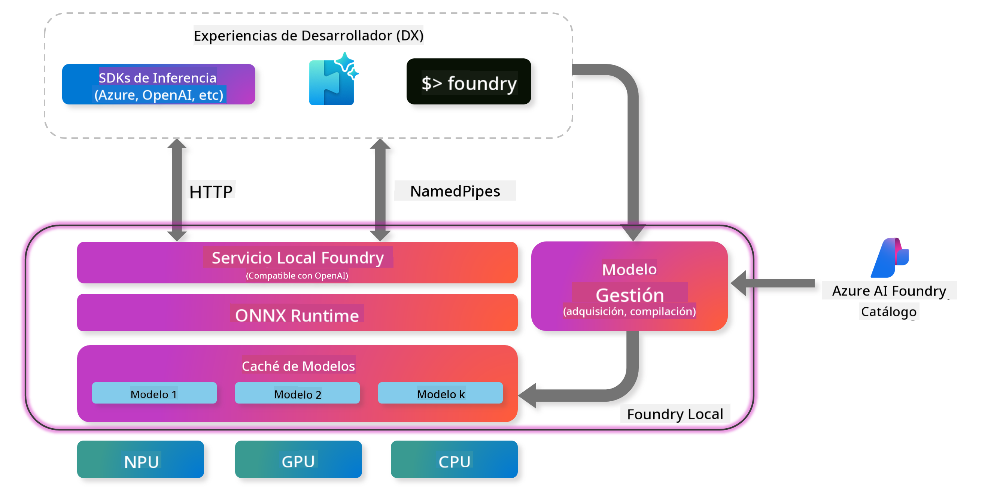
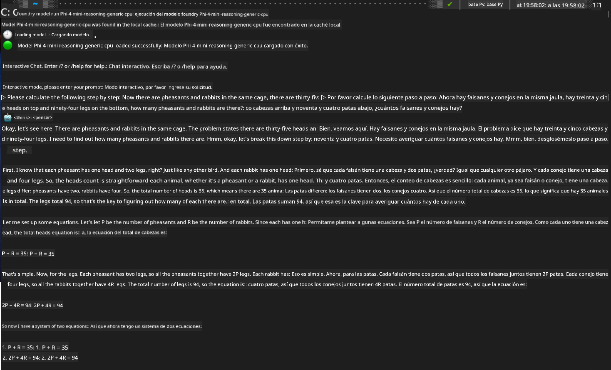

<!--
CO_OP_TRANSLATOR_METADATA:
{
  "original_hash": "52973a5680a65a810aa80b7036afd31f",
  "translation_date": "2025-07-16T19:41:36+00:00",
  "source_file": "md/01.Introduction/02/07.FoundryLocal.md",
  "language_code": "es"
}
-->
## Comenzando con los Modelos Phi-Family en Foundry Local

### Introducción a Foundry Local

Foundry Local es una potente solución de inferencia de IA en el dispositivo que lleva capacidades de IA de nivel empresarial directamente a tu hardware local. Este tutorial te guiará en la configuración y uso de los modelos Phi-Family con Foundry Local, ofreciéndote control total sobre tus cargas de trabajo de IA, manteniendo la privacidad y reduciendo costos.

Foundry Local ofrece ventajas en rendimiento, privacidad, personalización y costos al ejecutar modelos de IA localmente en tu dispositivo. Se integra perfectamente en tus flujos de trabajo y aplicaciones existentes a través de una CLI intuitiva, SDK y API REST.




### ¿Por qué elegir Foundry Local?

Comprender los beneficios de Foundry Local te ayudará a tomar decisiones informadas sobre tu estrategia de despliegue de IA:

- **Inferencia en el dispositivo:** Ejecuta modelos localmente en tu propio hardware, reduciendo costos y manteniendo todos tus datos en tu dispositivo.

- **Personalización de modelos:** Elige entre modelos predefinidos o usa los tuyos propios para cumplir con requisitos y casos de uso específicos.

- **Eficiencia en costos:** Elimina costos recurrentes de servicios en la nube usando tu hardware existente, haciendo la IA más accesible.

- **Integración sin complicaciones:** Conéctate con tus aplicaciones mediante un SDK, puntos finales API o la CLI, con fácil escalabilidad a Azure AI Foundry conforme crecen tus necesidades.

> **Nota para comenzar:** Este tutorial se centra en el uso de Foundry Local a través de las interfaces CLI y SDK. Aprenderás ambos métodos para ayudarte a elegir el más adecuado para tu caso.

## Parte 1: Configurando Foundry Local CLI

### Paso 1: Instalación

La CLI de Foundry Local es tu puerta de entrada para gestionar y ejecutar modelos de IA localmente. Comencemos instalándola en tu sistema.

**Plataformas soportadas:** Windows y macOS

Para instrucciones detalladas de instalación, consulta la [documentación oficial de Foundry Local](https://github.com/microsoft/Foundry-Local/blob/main/README.md).

### Paso 2: Explorando los Modelos Disponibles

Una vez que tengas instalada la CLI de Foundry Local, puedes descubrir qué modelos están disponibles para tu caso de uso. Este comando te mostrará todos los modelos soportados:


```bash
foundry model list
```

### Paso 3: Entendiendo los Modelos Phi Family

La familia Phi ofrece una variedad de modelos optimizados para diferentes casos de uso y configuraciones de hardware. Aquí están los modelos Phi disponibles en Foundry Local:

**Modelos Phi disponibles:** 

- **phi-3.5-mini** - Modelo compacto para tareas básicas
- **phi-3-mini-128k** - Versión con contexto extendido para conversaciones más largas
- **phi-3-mini-4k** - Modelo con contexto estándar para uso general
- **phi-4** - Modelo avanzado con capacidades mejoradas
- **phi-4-mini** - Versión ligera de Phi-4
- **phi-4-mini-reasoning** - Especializado en tareas de razonamiento complejo

> **Compatibilidad de hardware:** Cada modelo puede configurarse para diferentes aceleraciones de hardware (CPU, GPU) según las capacidades de tu sistema.

### Paso 4: Ejecutando tu Primer Modelo Phi

Comencemos con un ejemplo práctico. Ejecutaremos el modelo `phi-4-mini-reasoning`, que destaca en resolver problemas complejos paso a paso.


**Comando para ejecutar el modelo:**

```bash
foundry model run Phi-4-mini-reasoning-generic-cpu
```

> **Configuración inicial:** Al ejecutar un modelo por primera vez, Foundry Local lo descargará automáticamente en tu dispositivo local. El tiempo de descarga varía según la velocidad de tu red, así que ten paciencia durante esta configuración inicial.

### Paso 5: Probando el Modelo con un Problema Real

Ahora probemos nuestro modelo con un clásico problema de lógica para ver cómo realiza el razonamiento paso a paso:

**Problema de ejemplo:**

```txt
Please calculate the following step by step: Now there are pheasants and rabbits in the same cage, there are thirty-five heads on top and ninety-four legs on the bottom, how many pheasants and rabbits are there?
```

**Comportamiento esperado:** El modelo debería desglosar este problema en pasos lógicos, usando el hecho de que los faisanes tienen 2 patas y los conejos 4 para resolver el sistema de ecuaciones.

**Resultados:**



## Parte 2: Construyendo Aplicaciones con Foundry Local SDK

### ¿Por qué usar el SDK?

Mientras que la CLI es perfecta para pruebas e interacciones rápidas, el SDK te permite integrar Foundry Local en tus aplicaciones de forma programática. Esto abre posibilidades para:

- Construir aplicaciones personalizadas impulsadas por IA
- Crear flujos de trabajo automatizados
- Integrar capacidades de IA en sistemas existentes
- Desarrollar chatbots y herramientas interactivas

### Lenguajes de Programación Soportados

Foundry Local ofrece soporte SDK para varios lenguajes de programación que se adaptan a tus preferencias de desarrollo:

**📦 SDKs disponibles:**

- **C# (.NET):** [Documentación y ejemplos del SDK](https://github.com/microsoft/Foundry-Local/tree/main/sdk/cs)
- **Python:** [Documentación y ejemplos del SDK](https://github.com/microsoft/Foundry-Local/tree/main/sdk/python)
- **JavaScript:** [Documentación y ejemplos del SDK](https://github.com/microsoft/Foundry-Local/tree/main/sdk/js)
- **Rust:** [Documentación y ejemplos del SDK](https://github.com/microsoft/Foundry-Local/tree/main/sdk/rust)

### Próximos pasos

1. **Elige el SDK que prefieras** según tu entorno de desarrollo
2. **Sigue la documentación específica del SDK** para guías detalladas de implementación
3. **Comienza con ejemplos simples** antes de construir aplicaciones complejas
4. **Explora el código de ejemplo** proporcionado en cada repositorio del SDK

## Conclusión

Ahora has aprendido a:
- ✅ Instalar y configurar Foundry Local CLI
- ✅ Descubrir y ejecutar modelos Phi Family
- ✅ Probar modelos con problemas del mundo real
- ✅ Entender las opciones de SDK para desarrollo de aplicaciones

Foundry Local ofrece una base poderosa para llevar capacidades de IA directamente a tu entorno local, dándote control sobre el rendimiento, la privacidad y los costos, mientras mantienes la flexibilidad para escalar a soluciones en la nube cuando sea necesario.

**Aviso legal**:  
Este documento ha sido traducido utilizando el servicio de traducción automática [Co-op Translator](https://github.com/Azure/co-op-translator). Aunque nos esforzamos por la precisión, tenga en cuenta que las traducciones automáticas pueden contener errores o inexactitudes. El documento original en su idioma nativo debe considerarse la fuente autorizada. Para información crítica, se recomienda la traducción profesional realizada por humanos. No nos hacemos responsables de ningún malentendido o interpretación errónea derivada del uso de esta traducción.