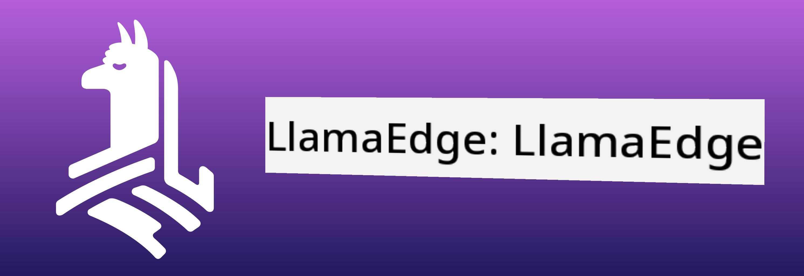
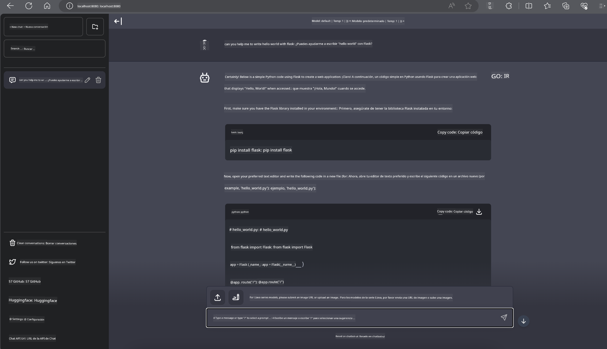

<!--
CO_OP_TRANSLATOR_METADATA:
{
  "original_hash": "be4101a30d98e95a71d42c276e8bcd37",
  "translation_date": "2025-07-16T20:38:49+00:00",
  "source_file": "md/01.Introduction/03/Jetson_Inference.md",
  "language_code": "es"
}
-->
# **Inferencia Phi-3 en Nvidia Jetson**

Nvidia Jetson es una serie de placas de computación embebida de Nvidia. Los modelos Jetson TK1, TX1 y TX2 cuentan con un procesador Tegra (o SoC) de Nvidia que integra una unidad central de procesamiento (CPU) con arquitectura ARM. Jetson es un sistema de bajo consumo diseñado para acelerar aplicaciones de aprendizaje automático. Nvidia Jetson es utilizado por desarrolladores profesionales para crear productos innovadores de IA en diversas industrias, así como por estudiantes y entusiastas para aprender IA de forma práctica y realizar proyectos sorprendentes. SLM se despliega en dispositivos edge como Jetson, lo que permitirá una mejor implementación de escenarios industriales de aplicaciones generativas de IA.

## Despliegue en NVIDIA Jetson:
Los desarrolladores que trabajan en robótica autónoma y dispositivos embebidos pueden aprovechar Phi-3 Mini. Su tamaño relativamente pequeño lo hace ideal para despliegues en el edge. Los parámetros han sido ajustados meticulosamente durante el entrenamiento, garantizando una alta precisión en las respuestas.

### Optimización TensorRT-LLM:
La [librería TensorRT-LLM de NVIDIA](https://github.com/NVIDIA/TensorRT-LLM?WT.mc_id=aiml-138114-kinfeylo) optimiza la inferencia de modelos de lenguaje grandes. Soporta la ventana de contexto extendida de Phi-3 Mini, mejorando tanto el rendimiento como la latencia. Las optimizaciones incluyen técnicas como LongRoPE, FP8 y batching en vuelo.

### Disponibilidad y Despliegue:
Los desarrolladores pueden explorar Phi-3 Mini con la ventana de contexto de 128K en [NVIDIA AI](https://www.nvidia.com/en-us/ai-data-science/generative-ai/). Está empaquetado como un NVIDIA NIM, un microservicio con una API estándar que puede desplegarse en cualquier lugar. Además, las [implementaciones de TensorRT-LLM en GitHub](https://github.com/NVIDIA/TensorRT-LLM).

## **1. Preparación**

a. Jetson Orin NX / Jetson NX

b. JetPack 5.1.2+

c. Cuda 11.8

d. Python 3.8+

## **2. Ejecutando Phi-3 en Jetson**

Podemos elegir [Ollama](https://ollama.com) o [LlamaEdge](https://llamaedge.com)

Si quieres usar gguf en la nube y en dispositivos edge al mismo tiempo, LlamaEdge puede entenderse como WasmEdge (WasmEdge es un runtime WebAssembly ligero, de alto rendimiento y escalable, adecuado para aplicaciones nativas en la nube, edge y descentralizadas. Soporta aplicaciones serverless, funciones embebidas, microservicios, contratos inteligentes y dispositivos IoT). Puedes desplegar el modelo cuantitativo gguf en dispositivos edge y en la nube a través de LlamaEdge.



Aquí están los pasos para usarlo

1. Instalar y descargar las librerías y archivos relacionados

```bash

curl -sSf https://raw.githubusercontent.com/WasmEdge/WasmEdge/master/utils/install.sh | bash -s -- --plugin wasi_nn-ggml

curl -LO https://github.com/LlamaEdge/LlamaEdge/releases/latest/download/llama-api-server.wasm

curl -LO https://github.com/LlamaEdge/chatbot-ui/releases/latest/download/chatbot-ui.tar.gz

tar xzf chatbot-ui.tar.gz

```

**Nota**: llama-api-server.wasm y chatbot-ui deben estar en el mismo directorio

2. Ejecutar los scripts en la terminal

```bash

wasmedge --dir .:. --nn-preload default:GGML:AUTO:{Your gguf path} llama-api-server.wasm -p phi-3-chat

```

Aquí está el resultado de la ejecución



***Código de ejemplo*** [Phi-3 mini WASM Notebook Sample](https://github.com/Azure-Samples/Phi-3MiniSamples/tree/main/wasm)

En resumen, Phi-3 Mini representa un avance significativo en el modelado de lenguaje, combinando eficiencia, conciencia del contexto y la capacidad de optimización de NVIDIA. Ya sea que estés construyendo robots o aplicaciones edge, Phi-3 Mini es una herramienta poderosa a tener en cuenta.

**Aviso legal**:  
Este documento ha sido traducido utilizando el servicio de traducción automática [Co-op Translator](https://github.com/Azure/co-op-translator). Aunque nos esforzamos por la precisión, tenga en cuenta que las traducciones automáticas pueden contener errores o inexactitudes. El documento original en su idioma nativo debe considerarse la fuente autorizada. Para información crítica, se recomienda la traducción profesional realizada por humanos. No nos hacemos responsables de malentendidos o interpretaciones erróneas derivadas del uso de esta traducción.