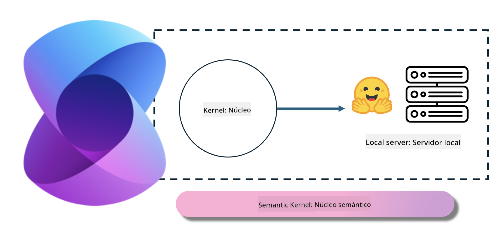

<!--
CO_OP_TRANSLATOR_METADATA:
{
  "original_hash": "bcf5dd7031db0031abdb9dd0c05ba118",
  "translation_date": "2025-07-16T20:54:51+00:00",
  "source_file": "md/01.Introduction/03/Local_Server_Inference.md",
  "language_code": "es"
}
-->
# **Inferencia Phi-3 en Servidor Local**

Podemos desplegar Phi-3 en un servidor local. Los usuarios pueden elegir las soluciones de [Ollama](https://ollama.com) o [LM Studio](https://llamaedge.com), o pueden escribir su propio código. Puedes conectar los servicios locales de Phi-3 a través de [Semantic Kernel](https://github.com/microsoft/semantic-kernel?WT.mc_id=aiml-138114-kinfeylo) o [Langchain](https://www.langchain.com/) para crear aplicaciones Copilot.

## **Usar Semantic Kernel para acceder a Phi-3-mini**

En la aplicación Copilot, creamos aplicaciones mediante Semantic Kernel / LangChain. Este tipo de framework de aplicación es generalmente compatible con Azure OpenAI Service / modelos OpenAI, y también puede soportar modelos de código abierto en Hugging Face y modelos locales. ¿Qué debemos hacer si queremos usar Semantic Kernel para acceder a Phi-3-mini? Usando .NET como ejemplo, podemos combinarlo con el Hugging Face Connector en Semantic Kernel. Por defecto, puede corresponder al id del modelo en Hugging Face (la primera vez que se usa, el modelo se descargará desde Hugging Face, lo que toma bastante tiempo). También puedes conectarte al servicio local construido. En comparación con ambos, recomendamos usar el segundo porque ofrece un mayor grado de autonomía, especialmente en aplicaciones empresariales.

En la figura, acceder a servicios locales a través de Semantic Kernel puede conectar fácilmente con el servidor del modelo Phi-3-mini autoconstruido. Aquí está el resultado de la ejecución:

***Código de ejemplo*** https://github.com/kinfey/Phi3MiniSamples/tree/main/semantickernel

**Aviso legal**:  
Este documento ha sido traducido utilizando el servicio de traducción automática [Co-op Translator](https://github.com/Azure/co-op-translator). Aunque nos esforzamos por la precisión, tenga en cuenta que las traducciones automáticas pueden contener errores o inexactitudes. El documento original en su idioma nativo debe considerarse la fuente autorizada. Para información crítica, se recomienda la traducción profesional realizada por humanos. No nos hacemos responsables de malentendidos o interpretaciones erróneas derivadas del uso de esta traducción.