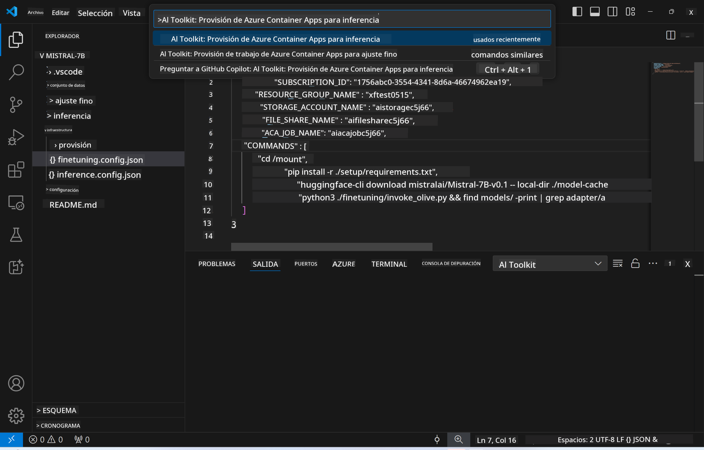

<!--
CO_OP_TRANSLATOR_METADATA:
{
  "original_hash": "a54cd3d65b6963e4e8ce21e143c3ab04",
  "translation_date": "2025-05-07T10:45:38+00:00",
  "source_file": "md/01.Introduction/03/Remote_Interence.md",
  "language_code": "es"
}
-->
# Inferencia remota con el modelo afinado

Después de entrenar los adapters en el entorno remoto, utiliza una sencilla aplicación Gradio para interactuar con el modelo.


### Provisionar recursos de Azure  
Debes configurar los recursos de Azure para la inferencia remota ejecutando el `AI Toolkit: Provision Azure Container Apps for inference` desde la paleta de comandos. Durante esta configuración, se te pedirá seleccionar tu suscripción de Azure y el grupo de recursos.  


Por defecto, la suscripción y el grupo de recursos para la inferencia deberían coincidir con los usados para el fine-tuning. La inferencia utilizará el mismo entorno Azure Container App y accederá al modelo y al adapter almacenados en Azure Files, que se generaron durante el paso de fine-tuning.

## Uso de AI Toolkit

### Despliegue para inferencia  
Si deseas modificar el código de inferencia o recargar el modelo de inferencia, ejecuta el comando `AI Toolkit: Deploy for inference`. Esto sincronizará tu código más reciente con ACA y reiniciará la réplica.


Tras completar exitosamente el despliegue, el modelo estará listo para evaluación usando este endpoint.

### Acceso a la API de inferencia

Puedes acceder a la API de inferencia haciendo clic en el botón "*Go to Inference Endpoint*" que aparece en la notificación de VSCode. Alternativamente, el endpoint web de la API se encuentra bajo `ACA_APP_ENDPOINT` en `./infra/inference.config.json` y en el panel de salida.


> **Note:** El endpoint de inferencia puede tardar unos minutos en estar completamente operativo.

## Componentes de inferencia incluidos en la plantilla

| Carpeta | Contenido |
| ------ |--------- |
| `infra` | Contiene todas las configuraciones necesarias para operaciones remotas. |
| `infra/provision/inference.parameters.json` | Contiene parámetros para las plantillas bicep, usadas para provisionar recursos de Azure para inferencia. |
| `infra/provision/inference.bicep` | Contiene plantillas para provisionar recursos de Azure para inferencia. |
| `infra/inference.config.json` | Archivo de configuración, generado por el comando `AI Toolkit: Provision Azure Container Apps for inference`. Se usa como entrada para otras paletas de comandos remotos. |

### Uso de AI Toolkit para configurar la provisión de recursos de Azure  
Configura el [AI Toolkit](https://marketplace.visualstudio.com/items?itemName=ms-windows-ai-studio.windows-ai-studio)

Provisiona Azure Container Apps para inferencia ` command.

You can find configuration parameters in `./infra/provision/inference.parameters.json` file. Here are the details:
| Parameter | Description |
| --------- |------------ |
| `defaultCommands` | This is the commands to initiate a web API. |
| `maximumInstanceCount` | This parameter sets the maximum capacity of GPU instances. |
| `location` | This is the location where Azure resources are provisioned. The default value is the same as the chosen resource group's location. |
| `storageAccountName`, `fileShareName` `acaEnvironmentName`, `acaEnvironmentStorageName`, `acaAppName`,  `acaLogAnalyticsName` | These parameters are used to name the Azure resources for provision. By default, they will be same to the fine-tuning resource name. You can input a new, unused resource name to create your own custom-named resources, or you can input the name of an already existing Azure resource if you'd prefer to use that. For details, refer to the section [Using existing Azure Resources](../../../../../md/01.Introduction/03). |

### Using Existing Azure Resources

By default, the inference provision use the same Azure Container App Environment, Storage Account, Azure File Share, and Azure Log Analytics that were used for fine-tuning. A separate Azure Container App is created solely for the inference API. 

If you have customized the Azure resources during the fine-tuning step or want to use your own existing Azure resources for inference, specify their names in the `./infra/inference.parameters.json`. Luego, ejecuta el comando `AI Toolkit: Provision Azure Container Apps for inference` desde la paleta de comandos. Esto actualiza los recursos especificados y crea los que falten.

Por ejemplo, si ya tienes un entorno de contenedor Azure existente, tu `./infra/finetuning.parameters.json` debería verse así:

```json
{
    "$schema": "https://schema.management.azure.com/schemas/2019-04-01/deploymentParameters.json#",
    "contentVersion": "1.0.0.0",
    "parameters": {
      ...
      "acaEnvironmentName": {
        "value": "<your-aca-env-name>"
      },
      "acaEnvironmentStorageName": {
        "value": null
      },
      ...
    }
  }
```

### Provisión manual  
Si prefieres configurar manualmente los recursos de Azure, puedes usar los archivos bicep proporcionados en el archivo `./infra/provision` folders. If you have already set up and configured all the Azure resources without using the AI Toolkit command palette, you can simply enter the resource names in the `inference.config.json`.

Por ejemplo:

```json
{
  "SUBSCRIPTION_ID": "<your-subscription-id>",
  "RESOURCE_GROUP_NAME": "<your-resource-group-name>",
  "STORAGE_ACCOUNT_NAME": "<your-storage-account-name>",
  "FILE_SHARE_NAME": "<your-file-share-name>",
  "ACA_APP_NAME": "<your-aca-name>",
  "ACA_APP_ENDPOINT": "<your-aca-endpoint>"
}
```

**Aviso legal**:  
Este documento ha sido traducido utilizando el servicio de traducción automática [Co-op Translator](https://github.com/Azure/co-op-translator). Aunque nos esforzamos por la precisión, tenga en cuenta que las traducciones automáticas pueden contener errores o inexactitudes. El documento original en su idioma nativo debe considerarse la fuente autorizada. Para información crítica, se recomienda la traducción profesional realizada por humanos. No nos hacemos responsables por malentendidos o interpretaciones erróneas derivadas del uso de esta traducción.