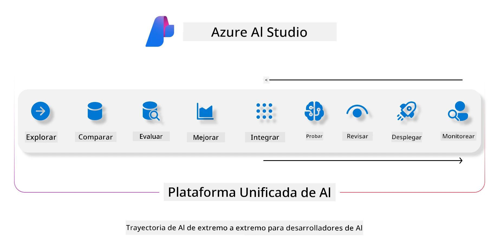
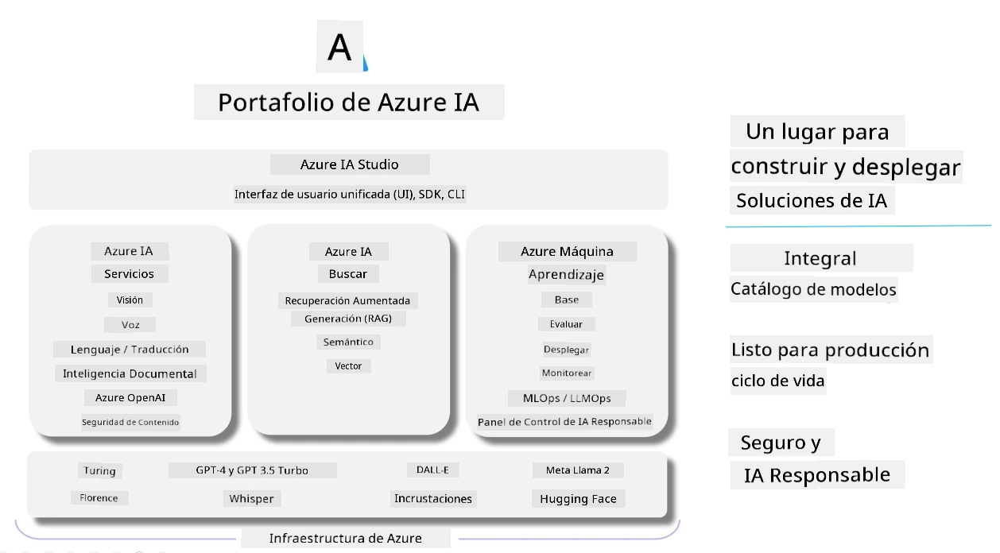

<!--
CO_OP_TRANSLATOR_METADATA:
{
  "original_hash": "7b4235159486df4000e16b7b46ddfec3",
  "translation_date": "2025-07-16T22:28:16+00:00",
  "source_file": "md/01.Introduction/05/AIFoundry.md",
  "language_code": "es"
}
-->
# **Uso de Azure AI Foundry para evaluación**

Cómo evaluar tu aplicación de IA generativa usando [Azure AI Foundry](https://ai.azure.com?WT.mc_id=aiml-138114-kinfeylo). Ya sea que estés evaluando conversaciones de un solo turno o de múltiples turnos, Azure AI Foundry ofrece herramientas para medir el rendimiento y la seguridad del modelo.

## Cómo evaluar aplicaciones de IA generativa con Azure AI Foundry
Para instrucciones más detalladas, consulta la [Documentación de Azure AI Foundry](https://learn.microsoft.com/azure/ai-studio/how-to/evaluate-generative-ai-app?WT.mc_id=aiml-138114-kinfeylo)

Aquí están los pasos para comenzar:

## Evaluación de modelos de IA generativa en Azure AI Foundry

**Requisitos previos**

- Un conjunto de datos de prueba en formato CSV o JSON.
- Un modelo de IA generativa desplegado (como Phi-3, GPT 3.5, GPT 4 o modelos Davinci).
- Un entorno de ejecución con una instancia de cómputo para realizar la evaluación.

## Métricas de evaluación integradas

Azure AI Foundry te permite evaluar tanto conversaciones de un solo turno como conversaciones complejas de múltiples turnos.  
Para escenarios de Retrieval Augmented Generation (RAG), donde el modelo se basa en datos específicos, puedes medir el rendimiento usando las métricas de evaluación integradas.  
Además, puedes evaluar escenarios generales de preguntas y respuestas de un solo turno (no RAG).

## Creación de una ejecución de evaluación

Desde la interfaz de Azure AI Foundry, navega a la página Evaluate o a la página Prompt Flow.  
Sigue el asistente para crear una evaluación. Puedes asignar un nombre opcional a tu evaluación.  
Selecciona el escenario que se ajuste a los objetivos de tu aplicación.  
Elige una o más métricas de evaluación para valorar la salida del modelo.

## Flujo de evaluación personalizado (Opcional)

Para mayor flexibilidad, puedes crear un flujo de evaluación personalizado. Ajusta el proceso de evaluación según tus necesidades específicas.

## Visualización de resultados

Después de ejecutar la evaluación, registra, visualiza y analiza las métricas detalladas en Azure AI Foundry. Obtén información sobre las capacidades y limitaciones de tu aplicación.

**Note** Azure AI Foundry está actualmente en vista previa pública, por lo que se recomienda usarlo para experimentación y desarrollo. Para cargas de trabajo en producción, considera otras opciones. Explora la [documentación oficial de AI Foundry](https://learn.microsoft.com/azure/ai-studio/?WT.mc_id=aiml-138114-kinfeylo) para más detalles e instrucciones paso a paso.

**Aviso legal**:  
Este documento ha sido traducido utilizando el servicio de traducción automática [Co-op Translator](https://github.com/Azure/co-op-translator). Aunque nos esforzamos por la precisión, tenga en cuenta que las traducciones automáticas pueden contener errores o inexactitudes. El documento original en su idioma nativo debe considerarse la fuente autorizada. Para información crítica, se recomienda la traducción profesional realizada por humanos. No nos hacemos responsables de malentendidos o interpretaciones erróneas derivadas del uso de esta traducción.