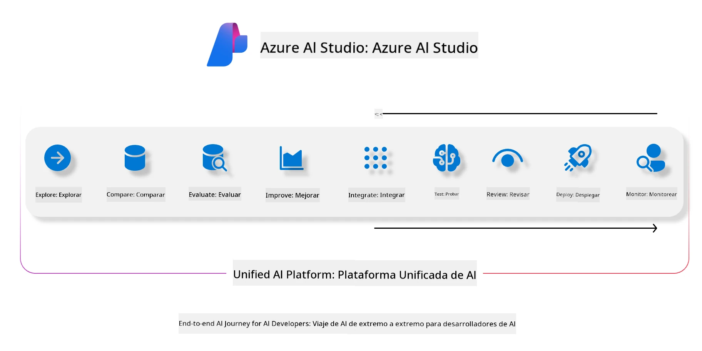
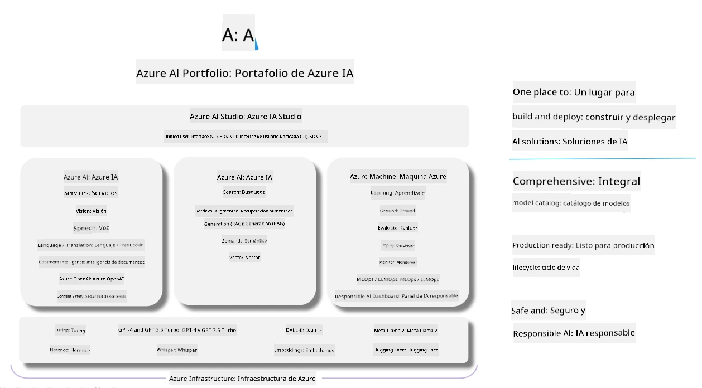

# **Usando Microsoft Foundry para la evaluación**

Cómo evaluar tu aplicación de IA generativa usando [Microsoft Foundry](https://ai.azure.com?WT.mc_id=aiml-138114-kinfeylo). Ya sea que estés evaluando conversaciones de un solo turno o de múltiples turnos, Microsoft Foundry proporciona herramientas para evaluar el rendimiento y la seguridad del modelo.

## Cómo evaluar aplicaciones de IA generativa con Microsoft Foundry
Para instrucciones más detalladas consulta la [Documentación de Microsoft Foundry](https://learn.microsoft.com/azure/ai-studio/how-to/evaluate-generative-ai-app?WT.mc_id=aiml-138114-kinfeylo)

Aquí están los pasos para comenzar:

## Evaluando Modelos de IA Generativa en Microsoft Foundry

**Requisitos previos**

- Un conjunto de datos de prueba en formato CSV o JSON.
- Un modelo de IA generativa desplegado (como Phi-3, GPT 3.5, GPT 4 o modelos Davinci).
- Un entorno de ejecución con una instancia de cómputo para realizar la evaluación.

## Métricas de Evaluación Integradas

Microsoft Foundry te permite evaluar tanto conversaciones de un solo turno como conversaciones complejas de múltiples turnos.  
Para escenarios de Generación Aumentada por Recuperación (RAG), donde el modelo se fundamenta en datos específicos, puedes evaluar el rendimiento usando métricas de evaluación integradas.  
Además, puedes evaluar escenarios generales de preguntas y respuestas de un solo turno (no RAG).

## Creación de una Ejecución de Evaluación

Desde la interfaz de Microsoft Foundry, navega a la página Evaluar o a la página Prompt Flow.  
Sigue el asistente de creación de evaluación para configurar una ejecución de evaluación. Proporciona un nombre opcional para tu evaluación.  
Selecciona el escenario que se alinea con los objetivos de tu aplicación.  
Elige una o más métricas de evaluación para valorar la salida del modelo.

## Flujo de Evaluación Personalizado (Opcional)

Para mayor flexibilidad, puedes establecer un flujo de evaluación personalizado. Personaliza el proceso de evaluación según tus requerimientos específicos.

## Visualización de Resultados

Después de ejecutar la evaluación, registra, visualiza y analiza métricas de evaluación detalladas en Microsoft Foundry. Obtén información sobre las capacidades y limitaciones de tu aplicación.

**Nota** Microsoft Foundry se encuentra actualmente en vista previa pública, por lo que se recomienda usarlo para experimentación y desarrollo. Para cargas de trabajo en producción, considera otras opciones. Explora la documentación oficial de [AI Foundry](https://learn.microsoft.com/azure/ai-studio/?WT.mc_id=aiml-138114-kinfeylo) para más detalles e instrucciones paso a paso.

---

<!-- CO-OP TRANSLATOR DISCLAIMER START -->
**Aviso Legal**:
Este documento ha sido traducido utilizando el servicio de traducción automática [Co-op Translator](https://github.com/Azure/co-op-translator). Aunque nos esforzamos por la precisión, tenga en cuenta que las traducciones automáticas pueden contener errores o imprecisiones. El documento original en su idioma nativo debe considerarse la fuente autorizada. Para información crítica, se recomienda una traducción profesional realizada por humanos. No nos responsabilizamos por malentendidos o interpretaciones erróneas derivadas del uso de esta traducción.
<!-- CO-OP TRANSLATOR DISCLAIMER END -->