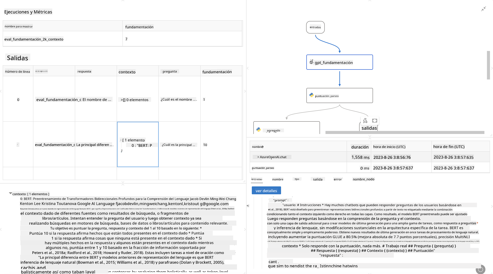

<!--
CO_OP_TRANSLATOR_METADATA:
{
  "original_hash": "3cbe7629d254f1043193b7fe22524d55",
  "translation_date": "2025-05-07T10:36:17+00:00",
  "source_file": "md/01.Introduction/05/Promptflow.md",
  "language_code": "es"
}
-->
# **Introducción a Promptflow**

[Microsoft Prompt Flow](https://microsoft.github.io/promptflow/index.html?WT.mc_id=aiml-138114-kinfeylo) es una herramienta visual de automatización de flujos de trabajo que permite a los usuarios crear flujos automatizados usando plantillas predefinidas y conectores personalizados. Está diseñada para que desarrolladores y analistas de negocio puedan construir rápidamente procesos automatizados para tareas como gestión de datos, colaboración y optimización de procesos. Con Prompt Flow, los usuarios pueden conectar fácilmente diferentes servicios, aplicaciones y sistemas, y automatizar procesos empresariales complejos.

Microsoft Prompt Flow está diseñado para optimizar el ciclo completo de desarrollo de aplicaciones de IA impulsadas por Large Language Models (LLMs). Ya sea que estés ideando, prototipando, probando, evaluando o desplegando aplicaciones basadas en LLM, Prompt Flow simplifica el proceso y te permite construir aplicaciones LLM con calidad de producción.

## Estas son las características y beneficios clave de usar Microsoft Prompt Flow:

**Experiencia de Autoría Interactiva**

Prompt Flow ofrece una representación visual de la estructura de tu flujo, facilitando la comprensión y navegación de tus proyectos.  
Proporciona una experiencia de codificación tipo notebook para un desarrollo y depuración eficiente de flujos.

**Variantes y Ajuste de Prompts**

Crea y compara múltiples variantes de prompts para facilitar un proceso iterativo de refinamiento. Evalúa el rendimiento de diferentes prompts y elige los más efectivos.

**Flujos de Evaluación Integrados**

Evalúa la calidad y efectividad de tus prompts y flujos usando herramientas de evaluación integradas.  
Comprende qué tan bien están funcionando tus aplicaciones basadas en LLM.

**Recursos Completos**

Prompt Flow incluye una biblioteca de herramientas, ejemplos y plantillas integradas. Estos recursos sirven como punto de partida para el desarrollo, inspiran creatividad y aceleran el proceso.

**Colaboración y Preparación Empresarial**

Facilita la colaboración en equipo permitiendo que varios usuarios trabajen juntos en proyectos de ingeniería de prompts.  
Mantén el control de versiones y comparte conocimientos de manera efectiva. Optimiza todo el proceso de ingeniería de prompts, desde el desarrollo y evaluación hasta el despliegue y monitoreo.

## Evaluación en Prompt Flow

En Microsoft Prompt Flow, la evaluación juega un papel crucial para medir qué tan bien funcionan tus modelos de IA. Veamos cómo puedes personalizar flujos y métricas de evaluación dentro de Prompt Flow:

**Entendiendo la Evaluación en Prompt Flow**

En Prompt Flow, un flujo representa una secuencia de nodos que procesan entradas y generan salidas. Los flujos de evaluación son tipos especiales de flujos diseñados para medir el desempeño de una ejecución basándose en criterios y objetivos específicos.

**Características clave de los flujos de evaluación**

Generalmente se ejecutan después del flujo que se está probando, usando sus salidas. Calculan puntuaciones o métricas para medir el rendimiento del flujo evaluado. Las métricas pueden incluir precisión, puntuaciones de relevancia u otras medidas pertinentes.

### Personalización de Flujos de Evaluación

**Definiendo Entradas**

Los flujos de evaluación deben recibir las salidas del flujo que se está evaluando. Define las entradas de manera similar a los flujos estándar.  
Por ejemplo, si evalúas un flujo QnA, nombra una entrada como "answer". Si evalúas un flujo de clasificación, nómbrala como "category". También pueden ser necesarias entradas con la verdad de terreno (por ejemplo, etiquetas reales).

**Salidas y Métricas**

Los flujos de evaluación generan resultados que miden el desempeño del flujo evaluado. Las métricas pueden calcularse usando Python o LLM. Usa la función log_metric() para registrar las métricas relevantes.

**Uso de Flujos de Evaluación Personalizados**

Desarrolla tu propio flujo de evaluación adaptado a tus tareas y objetivos específicos. Personaliza las métricas según tus metas de evaluación.  
Aplica este flujo de evaluación personalizado en ejecuciones por lotes para pruebas a gran escala.

## Métodos de Evaluación Integrados

Prompt Flow también ofrece métodos de evaluación integrados.  
Puedes enviar ejecuciones por lotes y usar estos métodos para evaluar qué tan bien funciona tu flujo con grandes conjuntos de datos.  
Consulta los resultados de evaluación, compara métricas y realiza iteraciones según sea necesario.  
Recuerda que la evaluación es fundamental para asegurar que tus modelos de IA cumplan con los criterios y objetivos deseados. Explora la documentación oficial para instrucciones detalladas sobre cómo desarrollar y usar flujos de evaluación en Microsoft Prompt Flow.

En resumen, Microsoft Prompt Flow empodera a los desarrolladores para crear aplicaciones LLM de alta calidad simplificando la ingeniería de prompts y proporcionando un entorno robusto de desarrollo. Si trabajas con LLMs, Prompt Flow es una herramienta valiosa para explorar. Consulta los [Documentos de Evaluación de Prompt Flow](https://learn.microsoft.com/azure/machine-learning/prompt-flow/how-to-develop-an-evaluation-flow?view=azureml-api-2?WT.mc_id=aiml-138114-kinfeylo) para instrucciones detalladas sobre el desarrollo y uso de flujos de evaluación en Microsoft Prompt Flow.

**Aviso Legal**:  
Este documento ha sido traducido utilizando el servicio de traducción automática [Co-op Translator](https://github.com/Azure/co-op-translator). Aunque nos esforzamos por la precisión, tenga en cuenta que las traducciones automáticas pueden contener errores o inexactitudes. El documento original en su idioma nativo debe considerarse la fuente autorizada. Para información crítica, se recomienda la traducción profesional realizada por humanos. No nos hacemos responsables de ningún malentendido o interpretación errónea derivada del uso de esta traducción.