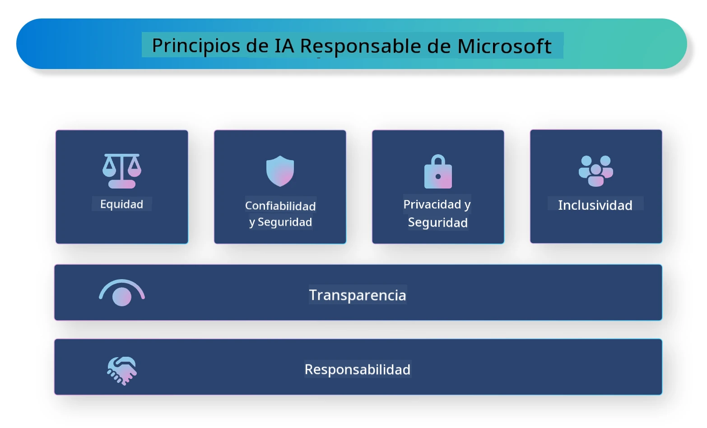

# **Introducción a la IA Responsable**

[Microsoft Responsible AI](https://www.microsoft.com/ai/responsible-ai?WT.mc_id=aiml-138114-kinfeylo) es una iniciativa que tiene como objetivo ayudar a desarrolladores y organizaciones a construir sistemas de IA que sean transparentes, confiables y responsables. La iniciativa proporciona orientación y recursos para desarrollar soluciones de IA responsables que se alineen con principios éticos, como la privacidad, la equidad y la transparencia. También exploraremos algunos de los desafíos y mejores prácticas asociados con la construcción de sistemas de IA responsables.

## Visión general de Microsoft Responsible AI

**Principios éticos**

Microsoft Responsible AI está guiado por un conjunto de principios éticos, como la privacidad, la equidad, la transparencia, la responsabilidad y la seguridad. Estos principios están diseñados para garantizar que los sistemas de IA se desarrollen de manera ética y responsable.

**IA transparente**

Microsoft Responsible AI enfatiza la importancia de la transparencia en los sistemas de IA. Esto incluye proporcionar explicaciones claras de cómo funcionan los modelos de IA, así como asegurar que las fuentes de datos y los algoritmos estén disponibles públicamente.

**IA responsable**

[Microsoft Responsible AI](https://www.microsoft.com/ai/responsible-ai?WT.mc_id=aiml-138114-kinfeylo) promueve el desarrollo de sistemas de IA responsables, que puedan proporcionar información sobre cómo los modelos de IA toman decisiones. Esto puede ayudar a los usuarios a entender y confiar en los resultados de los sistemas de IA.

**Inclusividad**

Los sistemas de IA deben diseñarse para beneficiar a todos. Microsoft busca crear una IA inclusiva que considere perspectivas diversas y evite sesgos o discriminación.

**Confiabilidad y seguridad**

Garantizar que los sistemas de IA sean confiables y seguros es crucial. Microsoft se enfoca en construir modelos robustos que funcionen de manera consistente y eviten resultados dañinos.

**Equidad en la IA**

Microsoft Responsible AI reconoce que los sistemas de IA pueden perpetuar sesgos si se entrenan con datos o algoritmos sesgados. La iniciativa ofrece orientación para desarrollar sistemas de IA justos que no discriminen por factores como raza, género o edad.

**Privacidad y seguridad**

Microsoft Responsible AI enfatiza la importancia de proteger la privacidad del usuario y la seguridad de los datos en los sistemas de IA. Esto incluye implementar un cifrado fuerte de datos y controles de acceso, así como auditar regularmente los sistemas de IA para detectar vulnerabilidades.

**Responsabilidad y rendición de cuentas**

Microsoft Responsible AI promueve la responsabilidad y la rendición de cuentas en el desarrollo y la implementación de IA. Esto incluye asegurar que los desarrolladores y las organizaciones sean conscientes de los riesgos potenciales asociados con los sistemas de IA y tomen medidas para mitigar esos riesgos.

## Mejores prácticas para construir sistemas de IA responsables

**Desarrollar modelos de IA usando conjuntos de datos diversos**

Para evitar sesgos en los sistemas de IA, es importante usar conjuntos de datos diversos que representen una variedad de perspectivas y experiencias.

**Usar técnicas de IA explicable**

Las técnicas de IA explicable pueden ayudar a los usuarios a entender cómo los modelos de IA toman decisiones, lo que puede aumentar la confianza en el sistema.

**Auditar regularmente los sistemas de IA para detectar vulnerabilidades**

Las auditorías regulares de los sistemas de IA pueden ayudar a identificar riesgos y vulnerabilidades potenciales que deben abordarse.

**Implementar un cifrado fuerte de datos y controles de acceso**

El cifrado de datos y los controles de acceso pueden ayudar a proteger la privacidad y la seguridad del usuario en los sistemas de IA.

**Seguir principios éticos en el desarrollo de IA**

Seguir principios éticos, como la equidad, la transparencia y la responsabilidad, puede ayudar a generar confianza en los sistemas de IA y asegurar que se desarrollen de manera responsable.

## Uso de AI Foundry para IA Responsable

[Microsoft Foundry](https://ai.azure.com?WT.mc_id=aiml-138114-kinfeylo) es una plataforma poderosa que permite a desarrolladores y organizaciones crear rápidamente aplicaciones inteligentes, de vanguardia, listas para el mercado y responsables. Estas son algunas características y capacidades clave de Microsoft Foundry:

**APIs y modelos listos para usar**

Microsoft Foundry proporciona APIs y modelos preconstruidos y personalizables. Estos cubren una amplia gama de tareas de IA, incluida la IA generativa, el procesamiento de lenguaje natural para conversaciones, búsqueda, monitoreo, traducción, voz, visión y toma de decisiones.

**Prompt Flow**

Prompt flow en Microsoft Foundry permite crear experiencias de IA conversacional. Te permite diseñar y gestionar flujos conversacionales, facilitando la creación de chatbots, asistentes virtuales y otras aplicaciones interactivas.

**Generación aumentada por recuperación (RAG)**

RAG es una técnica que combina enfoques basados en recuperación y en generación. Mejora la calidad de las respuestas generadas aprovechando tanto el conocimiento preexistente (recuperación) como la generación creativa (generación).

**Métricas de evaluación y monitoreo para IA generativa**

Microsoft Foundry proporciona herramientas para evaluar y monitorear modelos de IA generativa. Puedes evaluar su rendimiento, equidad y otras métricas importantes para garantizar un despliegue responsable. Además, si has creado un panel de control, puedes usar la interfaz sin código en Azure Machine Learning Studio para personalizar y generar un Panel de IA Responsable y una tarjeta de puntuación asociada basada en las librerías de Python de la [Responsible AI Toolbox](https://responsibleaitoolbox.ai/?WT.mc_id=aiml-138114-kinfeylo). Esta tarjeta de puntuación te ayuda a compartir conocimientos clave relacionados con la equidad, la importancia de características y otras consideraciones de despliegue responsable con partes interesadas técnicas y no técnicas.

Para usar AI Foundry con IA responsable, puedes seguir estas mejores prácticas:

**Define el problema y los objetivos de tu sistema de IA**

Antes de comenzar el proceso de desarrollo, es importante definir claramente el problema u objetivo que tu sistema de IA pretende resolver. Esto te ayudará a identificar los datos, algoritmos y recursos necesarios para construir un modelo efectivo.

**Recopila y preprocesa datos relevantes**

La calidad y cantidad de los datos usados para entrenar un sistema de IA pueden tener un impacto significativo en su rendimiento. Por lo tanto, es importante recopilar datos relevantes, limpiarlos, preprocesarlos y asegurarse de que sean representativos de la población o problema que intentas resolver.

**Elige una evaluación apropiada**

Existen varios algoritmos de evaluación disponibles. Es importante elegir el algoritmo más adecuado según tus datos y problema.

**Evalúa e interpreta el modelo**

Una vez que hayas construido un modelo de IA, es importante evaluar su rendimiento usando métricas apropiadas e interpretar los resultados de manera transparente. Esto te ayudará a identificar sesgos o limitaciones en el modelo y realizar mejoras cuando sea necesario.

**Asegura la transparencia y explicabilidad**

Los sistemas de IA deben ser transparentes y explicables para que los usuarios puedan entender cómo funcionan y cómo se toman las decisiones. Esto es especialmente importante para aplicaciones que tienen impactos significativos en la vida humana, como salud, finanzas y sistemas legales.

**Monitorea y actualiza el modelo**

Los sistemas de IA deben ser monitoreados y actualizados continuamente para garantizar que sigan siendo precisos y efectivos con el tiempo. Esto requiere mantenimiento, pruebas y reentrenamiento constantes del modelo.

En conclusión, Microsoft Responsible AI es una iniciativa que tiene como objetivo ayudar a desarrolladores y organizaciones a construir sistemas de IA que sean transparentes, confiables y responsables. Recuerda que la implementación responsable de la IA es crucial, y Microsoft Foundry busca hacerla práctica para las organizaciones. Siguiendo principios éticos y mejores prácticas, podemos asegurar que los sistemas de IA se desarrollen y desplieguen de forma responsable, beneficiando a la sociedad en su conjunto.

---

<!-- CO-OP TRANSLATOR DISCLAIMER START -->
**Aviso Legal**:  
Este documento ha sido traducido utilizando el servicio de traducción automática [Co-op Translator](https://github.com/Azure/co-op-translator). Aunque nos esforzamos por garantizar la exactitud, tenga en cuenta que las traducciones automáticas pueden contener errores o inexactitudes. El documento original en su idioma nativo debe considerarse la fuente autorizada. Para información crítica, se recomienda una traducción profesional realizada por humanos. No somos responsables de ningún malentendido o interpretación errónea derivada del uso de esta traducción.
<!-- CO-OP TRANSLATOR DISCLAIMER END -->