# Evaluar el modelo Phi-3 / Phi-3.5 ajustado finamente en Microsoft Foundry con enfoque en los Principios de IA Responsable de Microsoft

Esta muestra de extremo a extremo (E2E) se basa en la guía "[Evaluar modelos Phi-3 / 3.5 ajustados finamente en Microsoft Foundry con enfoque en la IA Responsable de Microsoft](https://techcommunity.microsoft.com/blog/educatordeveloperblog/evaluate-fine-tuned-phi-3--3-5-models-in-azure-ai-studio-focusing-on-microsofts-/4227850?WT.mc_id=aiml-137032-kinfeylo)" de la Comunidad Técnica de Microsoft.

## Descripción general

### ¿Cómo puedes evaluar la seguridad y el rendimiento de un modelo Phi-3 / Phi-3.5 ajustado finamente en Microsoft Foundry?

Ajustar finamente un modelo a veces puede llevar a respuestas no deseadas o no intencionadas. Para asegurar que el modelo permanezca seguro y efectivo, es importante evaluar su potencial para generar contenido dañino y su capacidad para producir respuestas precisas, relevantes y coherentes. En este tutorial, aprenderás cómo evaluar la seguridad y el rendimiento de un modelo Phi-3 / Phi-3.5 ajustado finamente y integrado con Prompt flow en Microsoft Foundry.

Aquí está el proceso de evaluación de Microsoft Foundry.

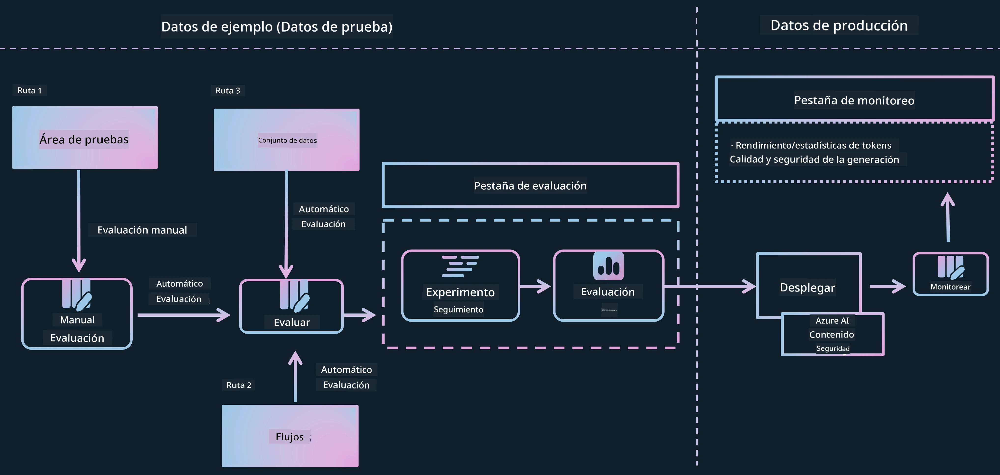

*Fuente de la imagen: [Evaluación de aplicaciones de IA generativa](https://learn.microsoft.com/azure/ai-studio/concepts/evaluation-approach-gen-ai?wt.mc_id%3Dstudentamb_279723)*

> [!NOTE]
>
> Para obtener información más detallada y explorar recursos adicionales sobre Phi-3 / Phi-3.5, visita el [Phi-3CookBook](https://github.com/microsoft/Phi-3CookBook?wt.mc_id=studentamb_279723).

### Prerrequisitos

- [Python](https://www.python.org/downloads)
- [Suscripción de Azure](https://azure.microsoft.com/free?wt.mc_id=studentamb_279723)
- [Visual Studio Code](https://code.visualstudio.com)
- Modelo Phi-3 / Phi-3.5 ajustado finamente

### Tabla de contenidos

1. [**Escenario 1: Introducción a la evaluación de Prompt flow de Microsoft Foundry**](../../../../../../md/02.Application/01.TextAndChat/Phi3)

    - [Introducción a la evaluación de seguridad](../../../../../../md/02.Application/01.TextAndChat/Phi3)
    - [Introducción a la evaluación de rendimiento](../../../../../../md/02.Application/01.TextAndChat/Phi3)

1. [**Escenario 2: Evaluación del modelo Phi-3 / Phi-3.5 en Microsoft Foundry**](../../../../../../md/02.Application/01.TextAndChat/Phi3)

    - [Antes de empezar](../../../../../../md/02.Application/01.TextAndChat/Phi3)
    - [Desplegar Azure OpenAI para evaluar el modelo Phi-3 / Phi-3.5](../../../../../../md/02.Application/01.TextAndChat/Phi3)
    - [Evaluar el modelo Phi-3 / Phi-3.5 ajustado finamente usando la evaluación de Prompt flow de Microsoft Foundry](../../../../../../md/02.Application/01.TextAndChat/Phi3)

1. [¡Felicidades!](../../../../../../md/02.Application/01.TextAndChat/Phi3)

## **Escenario 1: Introducción a la evaluación de Prompt flow de Microsoft Foundry**

### Introducción a la evaluación de seguridad

Para garantizar que tu modelo de IA sea ético y seguro, es crucial evaluarlo contra los Principios de IA Responsable de Microsoft. En Microsoft Foundry, las evaluaciones de seguridad te permiten evaluar la vulnerabilidad de tu modelo a ataques de jailbreak y su potencial para generar contenido dañino, lo cual está directamente alineado con estos principios.

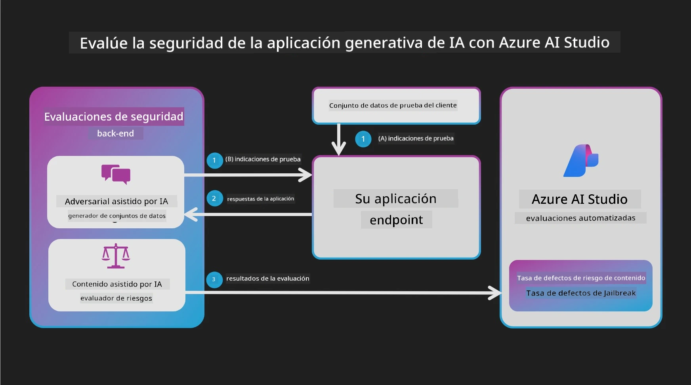

*Fuente de la imagen: [Evaluación de aplicaciones de IA generativa](https://learn.microsoft.com/azure/ai-studio/concepts/evaluation-approach-gen-ai?wt.mc_id%3Dstudentamb_279723)*

#### Principios de IA Responsable de Microsoft

Antes de comenzar con los pasos técnicos, es esencial entender los Principios de IA Responsable de Microsoft, un marco ético diseñado para guiar el desarrollo, despliegue y operación responsable de sistemas de IA. Estos principios orientan el diseño, desarrollo y despliegue responsable de sistemas de IA, asegurando que las tecnologías de IA se construyan de manera justa, transparente e inclusiva. Estos principios son la base para evaluar la seguridad de los modelos de IA.

Los Principios de IA Responsable de Microsoft incluyen:

- **Equidad e Inclusividad**: Los sistemas de IA deben tratar a todos con justicia y evitar afectar de manera diferente a grupos similares de personas. Por ejemplo, cuando los sistemas de IA brindan orientación sobre tratamientos médicos, solicitudes de préstamos o empleo, deben hacer las mismas recomendaciones a todos los que tengan síntomas, circunstancias financieras o calificaciones profesionales similares.

- **Confiabilidad y Seguridad**: Para generar confianza, es fundamental que los sistemas de IA operen de manera confiable, segura y consistente. Estos sistemas deben poder funcionar según fueron diseñados originalmente, responder de forma segura a condiciones imprevistas y resistir manipulaciones dañinas. Su comportamiento y la variedad de condiciones que pueden manejar reflejan el rango de situaciones y circunstancias que los desarrolladores anticiparon durante el diseño y pruebas.

- **Transparencia**: Cuando los sistemas de IA ayudan a informar decisiones que tienen un impacto enorme en la vida de las personas, es crítico que las personas comprendan cómo se tomaron esas decisiones. Por ejemplo, un banco podría usar un sistema de IA para decidir si una persona es digna de crédito. Una empresa podría usar un sistema de IA para determinar los candidatos más calificados para contratar.

- **Privacidad y Seguridad**: A medida que la IA se vuelve más común, proteger la privacidad y asegurar la información personal y empresarial es cada vez más importante y complejo. Con la IA, la privacidad y la seguridad de los datos requieren especial atención porque el acceso a los datos es esencial para que los sistemas de IA hagan predicciones y decisiones precisas e informadas sobre las personas.

- **Responsabilidad**: Las personas que diseñan y despliegan sistemas de IA deben ser responsables de cómo operan sus sistemas. Las organizaciones deben basarse en estándares de la industria para desarrollar normas de responsabilidad. Estas normas pueden asegurar que los sistemas de IA no sean la autoridad final en ninguna decisión que afecte la vida de las personas. También pueden asegurar que los humanos mantengan un control significativo sobre sistemas de IA altamente autónomos.

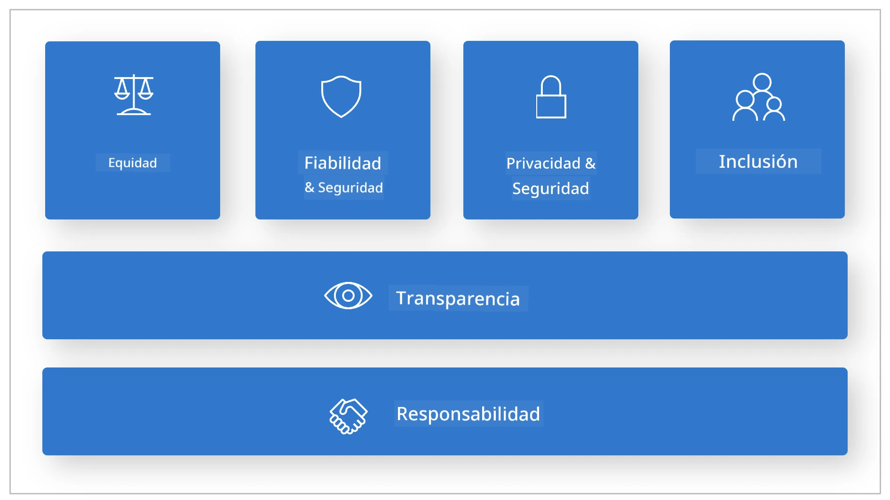

*Fuente de la imagen: [¿Qué es la IA Responsable?](https://learn.microsoft.com/azure/machine-learning/concept-responsible-ai?view=azureml-api-2&viewFallbackFrom=azureml-api-2%253fwt.mc_id%3Dstudentamb_279723)*

> [!NOTE]
> Para aprender más sobre los Principios de IA Responsable de Microsoft, visita [¿Qué es la IA Responsable?](https://learn.microsoft.com/azure/machine-learning/concept-responsible-ai?view=azureml-api-2?wt.mc_id=studentamb_279723).

#### Métricas de seguridad

En este tutorial, evaluarás la seguridad del modelo Phi-3 ajustado finamente usando las métricas de seguridad de Microsoft Foundry. Estas métricas te ayudan a evaluar el potencial del modelo para generar contenido dañino y su vulnerabilidad a ataques de jailbreak. Las métricas de seguridad incluyen:

- **Contenido relacionado con autolesiones**: Evalúa si el modelo tiene tendencia a producir contenido relacionado con autolesiones.
- **Contenido odioso e injusto**: Evalúa si el modelo tiene tendencia a producir contenido odioso o injusto.
- **Contenido violento**: Evalúa si el modelo tiene tendencia a producir contenido violento.
- **Contenido sexual**: Evalúa si el modelo tiene tendencia a producir contenido sexual inapropiado.

Evaluar estos aspectos asegura que el modelo de IA no produzca contenido dañino u ofensivo, alineándolo con valores sociales y estándares regulatorios.

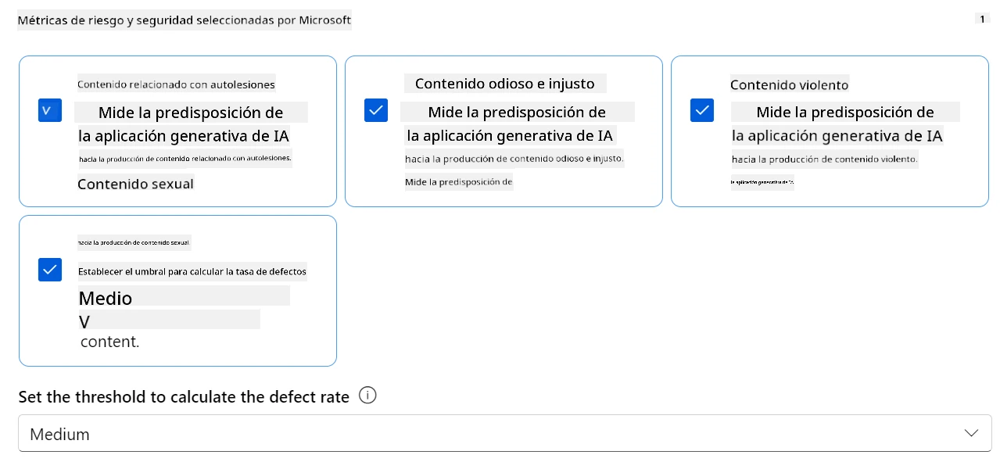

### Introducción a la evaluación de rendimiento

Para garantizar que tu modelo de IA esté funcionando como se espera, es importante evaluar su rendimiento mediante métricas de rendimiento. En Microsoft Foundry, las evaluaciones de rendimiento te permiten evaluar la efectividad de tu modelo para generar respuestas precisas, relevantes y coherentes.

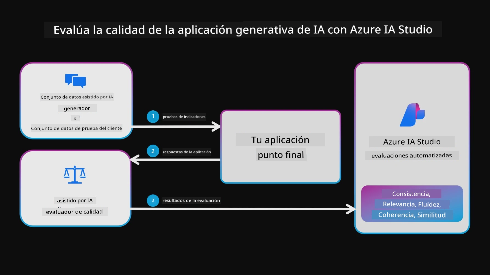

*Fuente de la imagen: [Evaluación de aplicaciones de IA generativa](https://learn.microsoft.com/azure/ai-studio/concepts/evaluation-approach-gen-ai?wt.mc_id%3Dstudentamb_279723)*

#### Métricas de rendimiento

En este tutorial, evaluarás el rendimiento del modelo Phi-3 / Phi-3.5 ajustado finamente usando las métricas de rendimiento de Microsoft Foundry. Estas métricas te ayudan a evaluar la efectividad del modelo para generar respuestas precisas, relevantes y coherentes. Las métricas de rendimiento incluyen:

- **Fundamentación**: Evalúa qué tan bien las respuestas generadas se alinean con la información de la fuente de entrada.
- **Relevancia**: Evalúa la pertinencia de las respuestas generadas a las preguntas dadas.
- **Coherencia**: Evalúa qué tan fluido es el texto generado, si se lee naturalmente y se asemeja a lenguaje humano.
- **Fluidez**: Evalúa la competencia lingüística del texto generado.
- **Similitud GPT**: Compara la respuesta generada con la verdad de referencia para medir similitud.
- **Puntaje F1**: Calcula la proporción de palabras compartidas entre la respuesta generada y los datos de origen.

Estas métricas te ayudan a evaluar la efectividad del modelo para generar respuestas precisas, relevantes y coherentes.

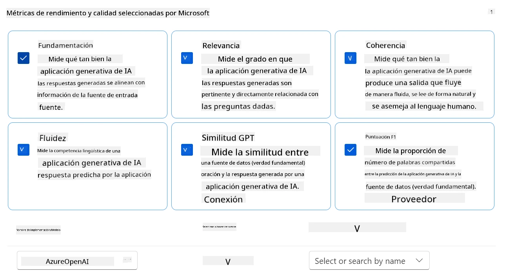

## **Escenario 2: Evaluación del modelo Phi-3 / Phi-3.5 en Microsoft Foundry**

### Antes de empezar

Este tutorial es una continuación de las entradas de blog anteriores, "[Fine-Tune and Integrate Custom Phi-3 Models with Prompt Flow: Step-by-Step Guide](https://techcommunity.microsoft.com/t5/educator-developer-blog/fine-tune-and-integrate-custom-phi-3-models-with-prompt-flow/ba-p/4178612?wt.mc_id=studentamb_279723)" y "[Fine-Tune and Integrate Custom Phi-3 Models with Prompt Flow in Microsoft Foundry](https://techcommunity.microsoft.com/t5/educator-developer-blog/fine-tune-and-integrate-custom-phi-3-models-with-prompt-flow-in/ba-p/4191726?wt.mc_id=studentamb_279723)." En estas publicaciones, recorrimos el proceso de afinar un modelo Phi-3 / Phi-3.5 en Microsoft Foundry e integrarlo con Prompt flow.

En este tutorial, desplegarás un modelo Azure OpenAI como evaluador en Microsoft Foundry y lo usarás para evaluar tu modelo Phi-3 / Phi-3.5 ajustado finamente.

Antes de comenzar este tutorial, asegúrate de tener los siguientes prerrequisitos, tal como se describe en los tutoriales anteriores:

1. Un conjunto de datos preparado para evaluar el modelo Phi-3 / Phi-3.5 ajustado finamente.
1. Un modelo Phi-3 / Phi-3.5 que ha sido ajustado finamente y desplegado en Azure Machine Learning.
1. Un Prompt flow integrado con tu modelo Phi-3 / Phi-3.5 ajustado finamente en Microsoft Foundry.

> [!NOTE]
> Usarás el archivo *test_data.jsonl*, ubicado en la carpeta data del conjunto de datos **ULTRACHAT_200k** descargado en las entradas anteriores, como conjunto de datos para evaluar el modelo Phi-3 / Phi-3.5 ajustado finamente.

#### Integrar el modelo Phi-3 / Phi-3.5 personalizado con Prompt flow en Microsoft Foundry (enfoque código primero)

> [!NOTE]
> Si seguiste el enfoque de bajo código descrito en "[Fine-Tune and Integrate Custom Phi-3 Models with Prompt Flow in Microsoft Foundry](https://techcommunity.microsoft.com/t5/educator-developer-blog/fine-tune-and-integrate-custom-phi-3-models-with-prompt-flow-in/ba-p/4191726?wt.mc_id=studentamb_279723)", puedes saltarte este ejercicio y continuar con el siguiente.
> Sin embargo, si seguiste el enfoque código primero descrito en "[Fine-Tune and Integrate Custom Phi-3 Models with Prompt Flow: Step-by-Step Guide](https://techcommunity.microsoft.com/t5/educator-developer-blog/fine-tune-and-integrate-custom-phi-3-models-with-prompt-flow/ba-p/4178612?wt.mc_id=studentamb_279723)" para afinar y desplegar tu modelo Phi-3 / Phi-3.5, el proceso de conexión de tu modelo con Prompt flow es ligeramente diferente. Aprenderás este proceso en este ejercicio.

Para continuar, necesitas integrar tu modelo Phi-3 / Phi-3.5 ajustado finamente en Prompt flow en Microsoft Foundry.

#### Crear Hub de Microsoft Foundry

Necesitas crear un Hub antes de crear el Proyecto. Un Hub actúa como un Grupo de Recursos, permitiéndote organizar y administrar múltiples Proyectos dentro de Microsoft Foundry.
1. Inicie sesión en [Microsoft Foundry](https://ai.azure.com/?wt.mc_id=studentamb_279723).

1. Seleccione **All hubs** en la pestaña del lado izquierdo.

1. Seleccione **+ New hub** en el menú de navegación.

    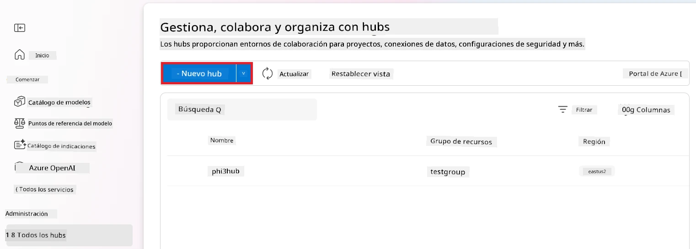

1. Realice las siguientes tareas:

    - Ingrese **Hub name**. Debe ser un valor único.
    - Seleccione su **Subscription** de Azure.
    - Seleccione el **Resource group** que desee usar (cree uno nuevo si es necesario).
    - Seleccione la **Location** que desea usar.
    - Seleccione **Connect Azure AI Services** a utilizar (crea uno nuevo si es necesario).
    - Seleccione **Connect Azure AI Search** para **Skip connecting**.

    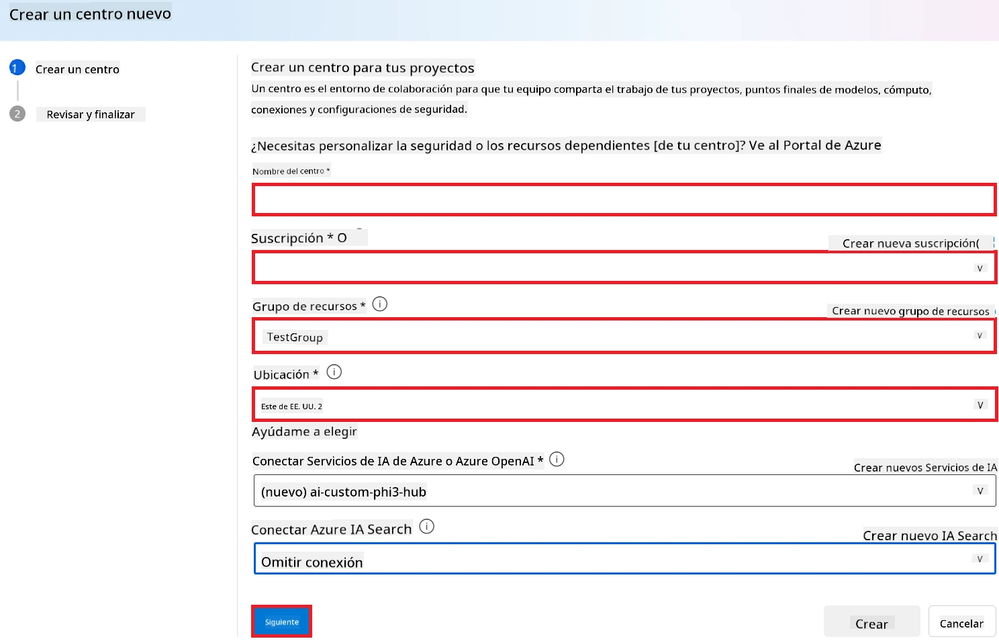

1. Seleccione **Next**.

#### Crear proyecto en Microsoft Foundry

1. En el Hub que creó, seleccione **All projects** en la pestaña del lado izquierdo.

1. Seleccione **+ New project** en el menú de navegación.

    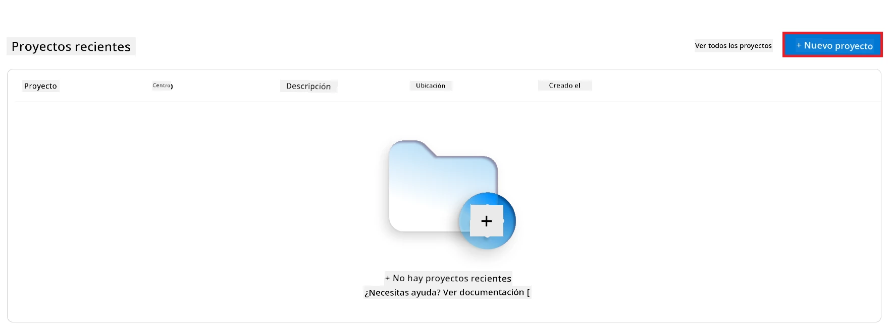

1. Ingrese el **Project name**. Debe ser un valor único.

    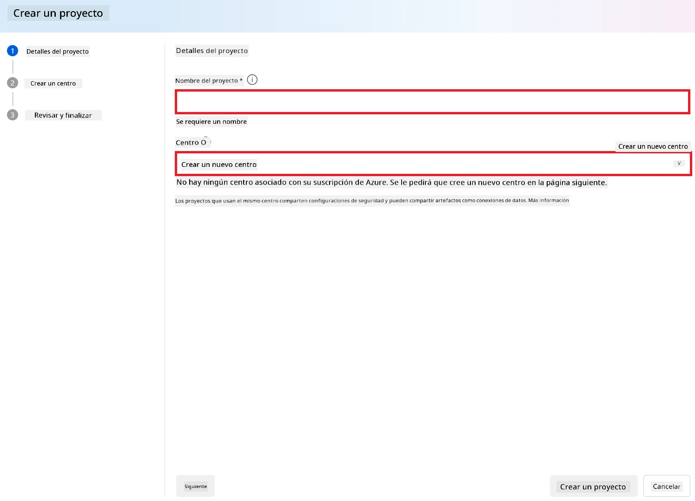

1. Seleccione **Create a project**.

#### Agregar una conexión personalizada para el modelo entrenado fino Phi-3 / Phi-3.5

Para integrar su modelo personalizado Phi-3 / Phi-3.5 con Prompt flow, debe guardar el punto de conexión y la clave del modelo en una conexión personalizada. Esta configuración asegura el acceso a su modelo personalizado Phi-3 / Phi-3.5 en Prompt flow.

#### Configurar la clave api y URI del endpoint del modelo entrenado fino Phi-3 / Phi-3.5

1. Visite [Azure ML Studio](https://ml.azure.com/home?wt.mc_id=studentamb_279723).

1. Navegue hasta el espacio de trabajo de Azure Machine learning que creó.

1. Seleccione **Endpoints** en la pestaña del lado izquierdo.

    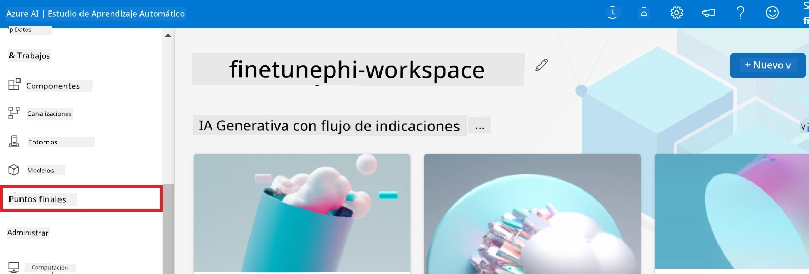

1. Seleccione el endpoint que creó.

    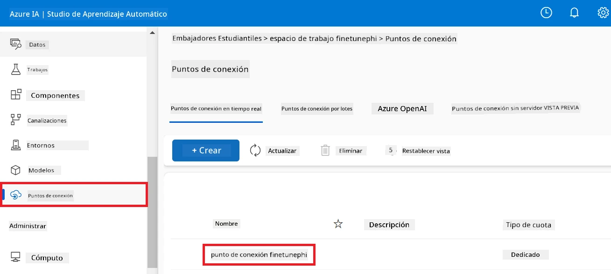

1. Seleccione **Consume** en el menú de navegación.

1. Copie su **REST endpoint** y **Primary key**.

    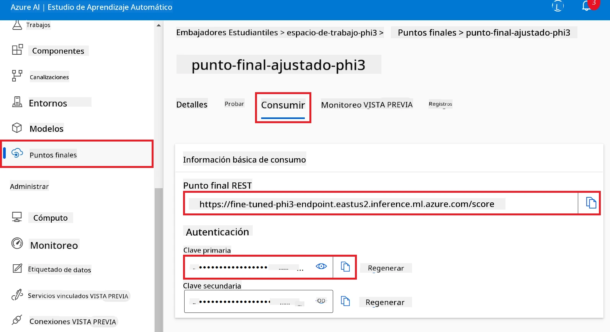

#### Agregar la conexión personalizada

1. Visite [Microsoft Foundry](https://ai.azure.com/?wt.mc_id=studentamb_279723).

1. Navegue hasta el proyecto de Microsoft Foundry que creó.

1. En el proyecto que creó, seleccione **Settings** en la pestaña del lado izquierdo.

1. Seleccione **+ New connection**.

    

1. Seleccione **Custom keys** en el menú de navegación.

    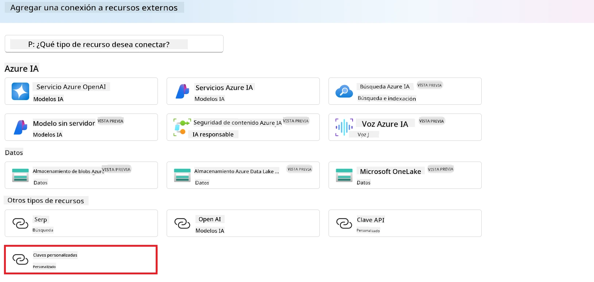

1. Realice las siguientes tareas:

    - Seleccione **+ Add key value pairs**.
    - Para el nombre de la clave, ingrese **endpoint** y pegue el endpoint que copió desde Azure ML Studio en el campo de valor.
    - Seleccione de nuevo **+ Add key value pairs**.
    - Para el nombre de la clave, ingrese **key** y pegue la clave que copió desde Azure ML Studio en el campo de valor.
    - Después de agregar las claves, seleccione **is secret** para evitar que la clave sea expuesta.

    

1. Seleccione **Add connection**.

#### Crear Prompt flow

Ha agregado una conexión personalizada en Microsoft Foundry. Ahora, cree un Prompt flow usando los siguientes pasos. Luego, conectará este Prompt flow a la conexión personalizada para usar el modelo entrenado fino dentro del Prompt flow.

1. Navegue hasta el proyecto de Microsoft Foundry que creó.

1. Seleccione **Prompt flow** en la pestaña del lado izquierdo.

1. Seleccione **+ Create** en el menú de navegación.

    

1. Seleccione **Chat flow** en el menú de navegación.

    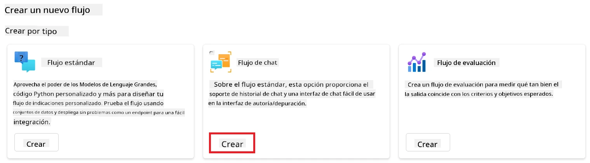

1. Ingrese el **Folder name** que desea usar.

    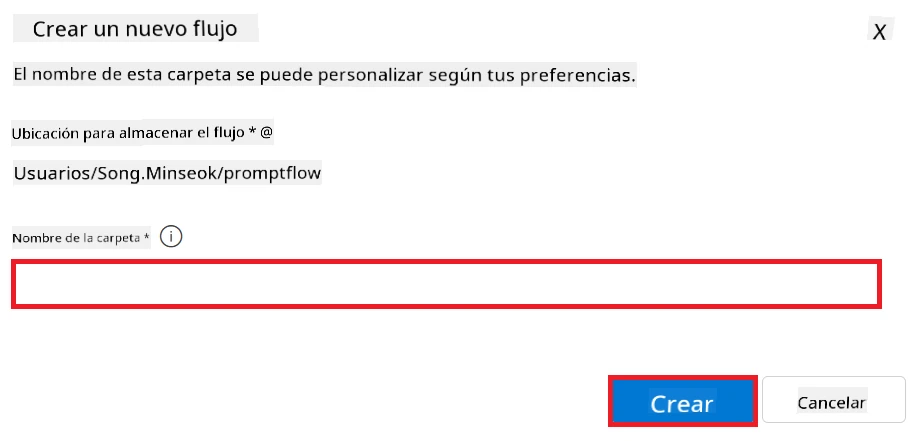

1. Seleccione **Create**.

#### Configurar Prompt flow para chatear con su modelo personalizado Phi-3 / Phi-3.5

Necesita integrar el modelo entrenado fino Phi-3 / Phi-3.5 dentro de un Prompt flow. Sin embargo, el Prompt flow existente proporcionado no está diseñado para este propósito. Por lo tanto, debe rediseñar el Prompt flow para permitir la integración del modelo personalizado.

1. En el Prompt flow, realice las siguientes tareas para reconstruir el flujo existente:

    - Seleccione **Raw file mode**.
    - Elimine todo el código existente en el archivo *flow.dag.yml*.
    - Agregue el siguiente código a *flow.dag.yml*.

        ```yml
        inputs:
          input_data:
            type: string
            default: "Who founded Microsoft?"

        outputs:
          answer:
            type: string
            reference: ${integrate_with_promptflow.output}

        nodes:
        - name: integrate_with_promptflow
          type: python
          source:
            type: code
            path: integrate_with_promptflow.py
          inputs:
            input_data: ${inputs.input_data}
        ```

    - Seleccione **Save**.

    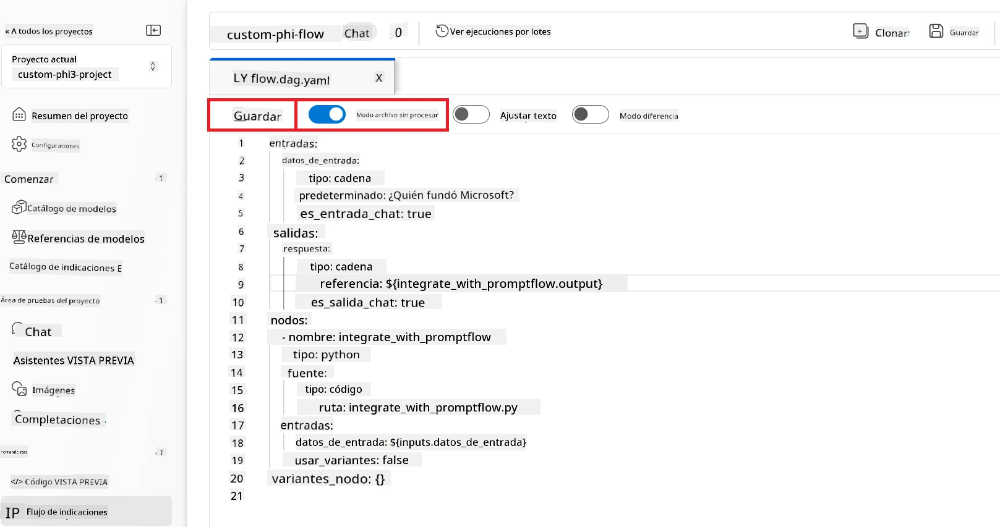

1. Agregue el siguiente código a *integrate_with_promptflow.py* para usar el modelo personalizado Phi-3 / Phi-3.5 en Prompt flow.

    ```python
    import logging
    import requests
    from promptflow import tool
    from promptflow.connections import CustomConnection

    # Configuración de registros
    logging.basicConfig(
        format="%(asctime)s - %(levelname)s - %(name)s - %(message)s",
        datefmt="%Y-%m-%d %H:%M:%S",
        level=logging.DEBUG
    )
    logger = logging.getLogger(__name__)

    def query_phi3_model(input_data: str, connection: CustomConnection) -> str:
        """
        Send a request to the Phi-3 / Phi-3.5 model endpoint with the given input data using Custom Connection.
        """

        # "connection" es el nombre de la Conexión Personalizada, "endpoint", "key" son las claves en la Conexión Personalizada
        endpoint_url = connection.endpoint
        api_key = connection.key

        headers = {
            "Content-Type": "application/json",
            "Authorization": f"Bearer {api_key}"
        }
    data = {
        "input_data": [input_data],
        "params": {
            "temperature": 0.7,
            "max_new_tokens": 128,
            "do_sample": True,
            "return_full_text": True
            }
        }
        try:
            response = requests.post(endpoint_url, json=data, headers=headers)
            response.raise_for_status()
            
            # Registrar la respuesta JSON completa
            logger.debug(f"Full JSON response: {response.json()}")

            result = response.json()["output"]
            logger.info("Successfully received response from Azure ML Endpoint.")
            return result
        except requests.exceptions.RequestException as e:
            logger.error(f"Error querying Azure ML Endpoint: {e}")
            raise

    @tool
    def my_python_tool(input_data: str, connection: CustomConnection) -> str:
        """
        Tool function to process input data and query the Phi-3 / Phi-3.5 model.
        """
        return query_phi3_model(input_data, connection)

    ```

    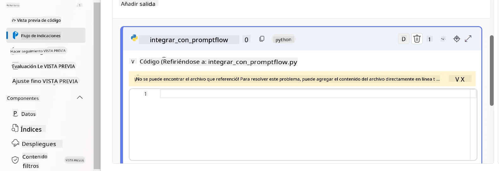

> [!NOTE]
> Para información más detallada sobre el uso de Prompt flow en Microsoft Foundry, puede consultar [Prompt flow en Microsoft Foundry](https://learn.microsoft.com/azure/ai-studio/how-to/prompt-flow).

1. Seleccione **Chat input**, **Chat output** para habilitar el chat con su modelo.

    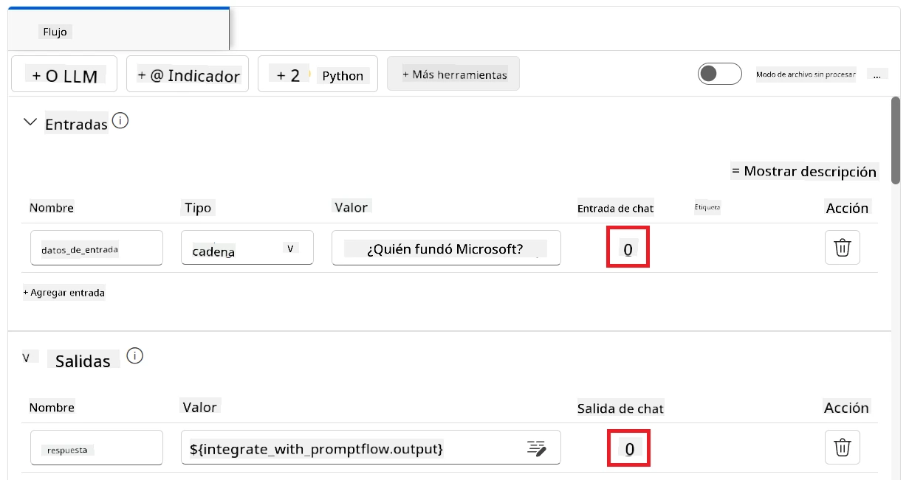

1. Ahora está listo para chatear con su modelo personalizado Phi-3 / Phi-3.5. En el siguiente ejercicio, aprenderá cómo iniciar Prompt flow y usarlo para chatear con su modelo ajustado fino Phi-3 / Phi-3.5.

> [!NOTE]
>
> El flujo reconstruido debería verse como en la imagen a continuación:
>
> 
>

#### Iniciar Prompt flow

1. Seleccione **Start compute sessions** para iniciar Prompt flow.

    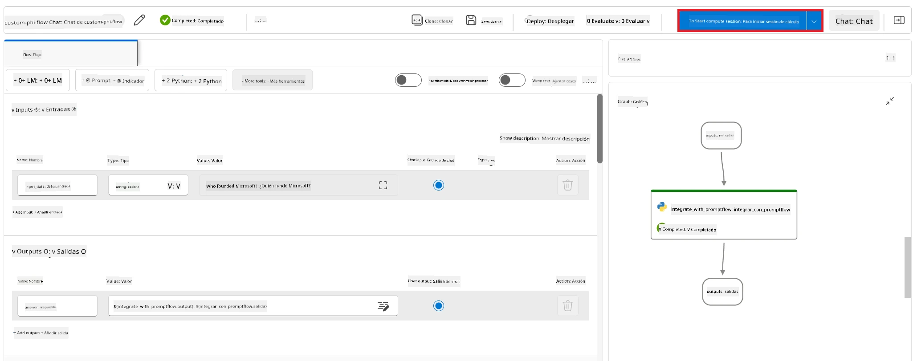

1. Seleccione **Validate and parse input** para renovar los parámetros.

    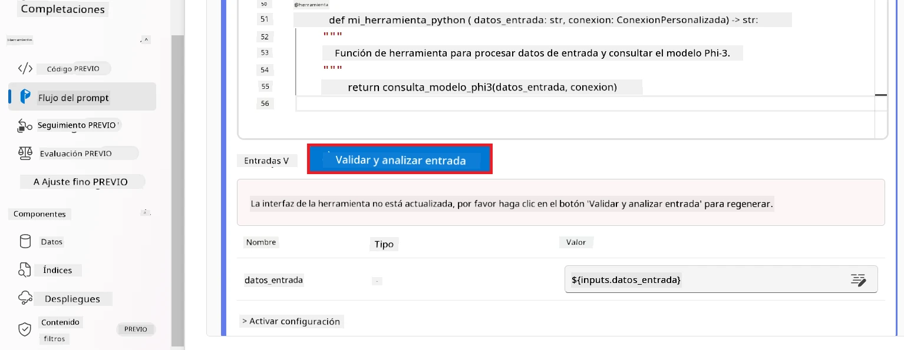

1. Seleccione el **Value** de la **connection** a la conexión personalizada que creó. Por ejemplo, *connection*.

    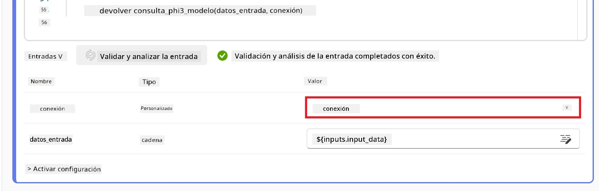

#### Chatee con su modelo personalizado Phi-3 / Phi-3.5

1. Seleccione **Chat**.

    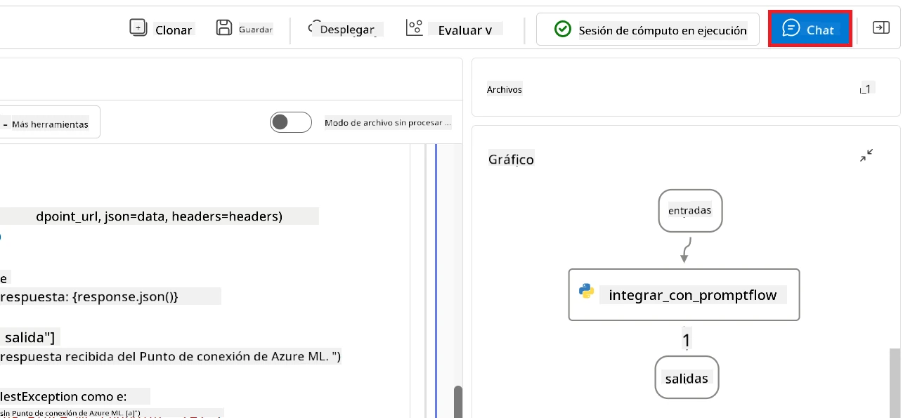

1. Aquí un ejemplo de los resultados: Ahora puede chatear con su modelo personalizado Phi-3 / Phi-3.5. Se recomienda hacer preguntas basadas en los datos usados para el ajuste fino.

    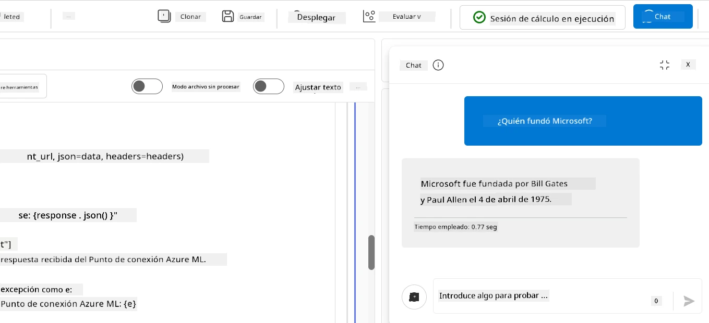

### Desplegar Azure OpenAI para evaluar el modelo Phi-3 / Phi-3.5

Para evaluar el modelo Phi-3 / Phi-3.5 en Microsoft Foundry, debe desplegar un modelo de Azure OpenAI. Este modelo se usará para evaluar el desempeño del modelo Phi-3 / Phi-3.5.

#### Desplegar Azure OpenAI

1. Inicie sesión en [Microsoft Foundry](https://ai.azure.com/?wt.mc_id=studentamb_279723).

1. Navegue hasta el proyecto de Microsoft Foundry que creó.

    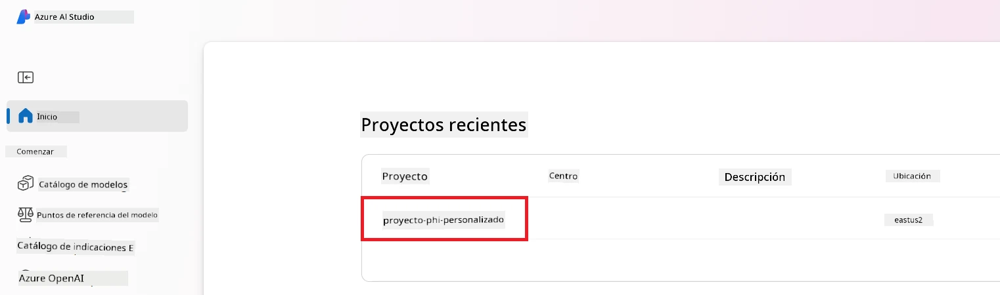

1. En el proyecto que creó, seleccione **Deployments** en la pestaña del lado izquierdo.

1. Seleccione **+ Deploy model** en el menú de navegación.

1. Seleccione **Deploy base model**.

    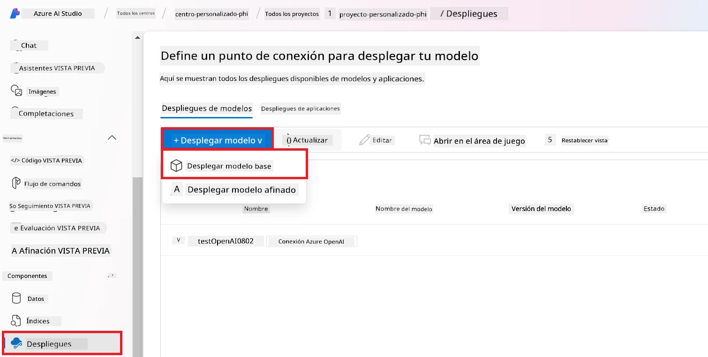

1. Seleccione el modelo Azure OpenAI que desea usar. Por ejemplo, **gpt-4o**.

    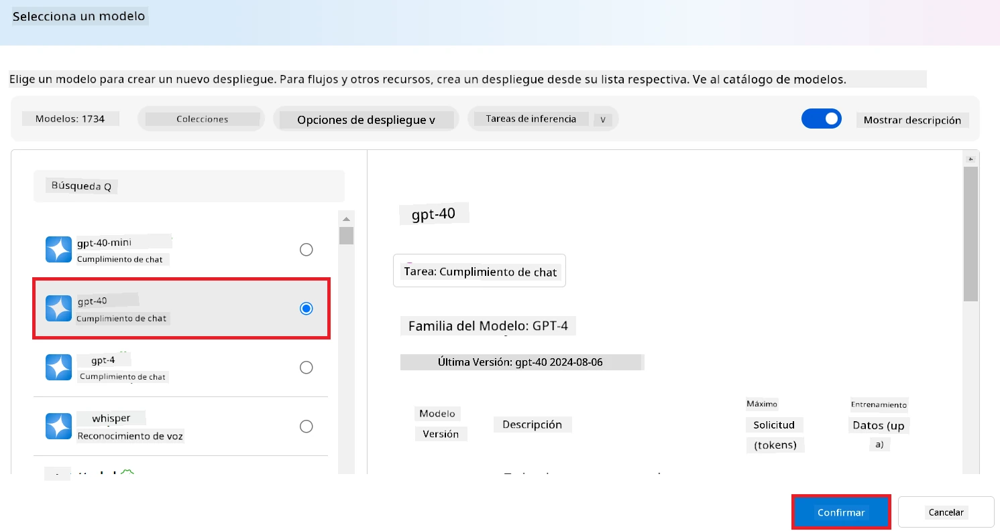

1. Seleccione **Confirm**.

### Evaluar el modelo ajustado fino Phi-3 / Phi-3.5 usando la evaluación de Prompt flow de Microsoft Foundry

### Iniciar una nueva evaluación

1. Visite [Microsoft Foundry](https://ai.azure.com/?wt.mc_id=studentamb_279723).

1. Navegue hasta el proyecto de Microsoft Foundry que creó.

    

1. En el proyecto que creó, seleccione **Evaluation** en la pestaña del lado izquierdo.

1. Seleccione **+ New evaluation** en el menú de navegación.

    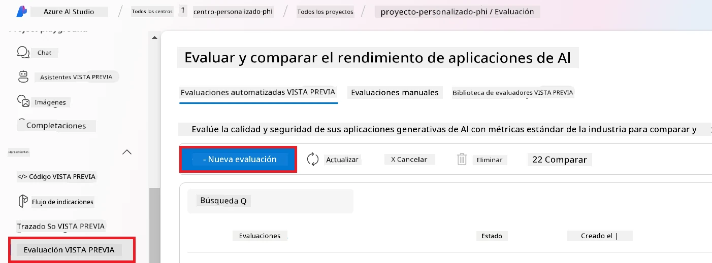

1. Seleccione la evaluación **Prompt flow**.

    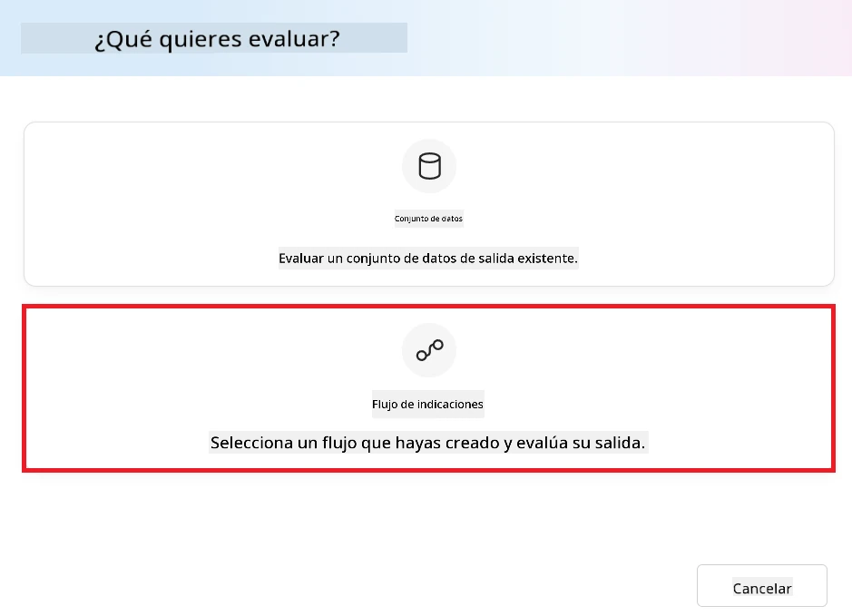

1. Realice las siguientes tareas:

    - Ingrese el nombre de la evaluación. Debe ser un valor único.
    - Seleccione **Question and answer without context** como tipo de tarea. Porque el conjunto de datos **UlTRACHAT_200k** usado en este tutorial no contiene contexto.
    - Seleccione el prompt flow que desea evaluar.

    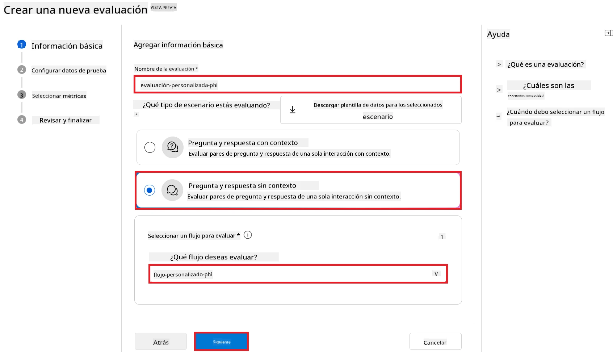

1. Seleccione **Next**.

1. Realice las siguientes tareas:

    - Seleccione **Add your dataset** para cargar el conjunto de datos. Por ejemplo, puede subir el archivo de conjunto de datos de prueba, como *test_data.json1*, que está incluido cuando descarga el conjunto de datos **ULTRACHAT_200k**.
    - Seleccione la **Dataset column** apropiada que corresponda a su conjunto de datos. Por ejemplo, si está usando el conjunto de datos **ULTRACHAT_200k**, seleccione **${data.prompt}** como columna del conjunto de datos.

    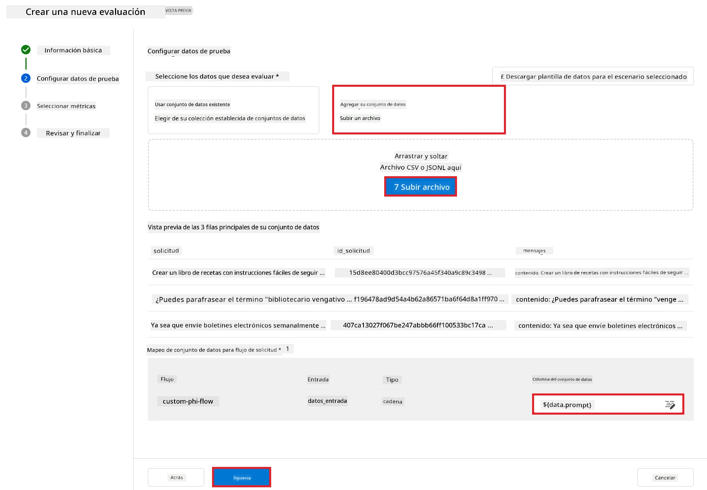

1. Seleccione **Next**.

1. Realice las siguientes tareas para configurar las métricas de rendimiento y calidad:

    - Seleccione las métricas de rendimiento y calidad que desea usar.
    - Seleccione el modelo Azure OpenAI que creó para la evaluación. Por ejemplo, seleccione **gpt-4o**.

    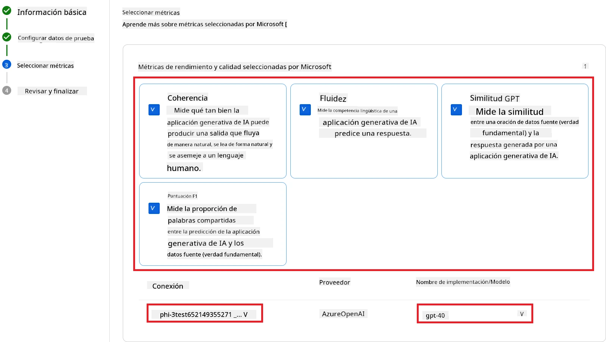

1. Realice las siguientes tareas para configurar las métricas de riesgo y seguridad:

    - Seleccione las métricas de riesgo y seguridad que desea usar.
    - Seleccione el umbral para calcular la tasa de defectos que desea usar. Por ejemplo, seleccione **Medium**.
    - Para **question**, seleccione **Data source** a **{$data.prompt}**.
    - Para **answer**, seleccione **Data source** a **{$run.outputs.answer}**.
    - Para **ground_truth**, seleccione **Data source** a **{$data.message}**.

    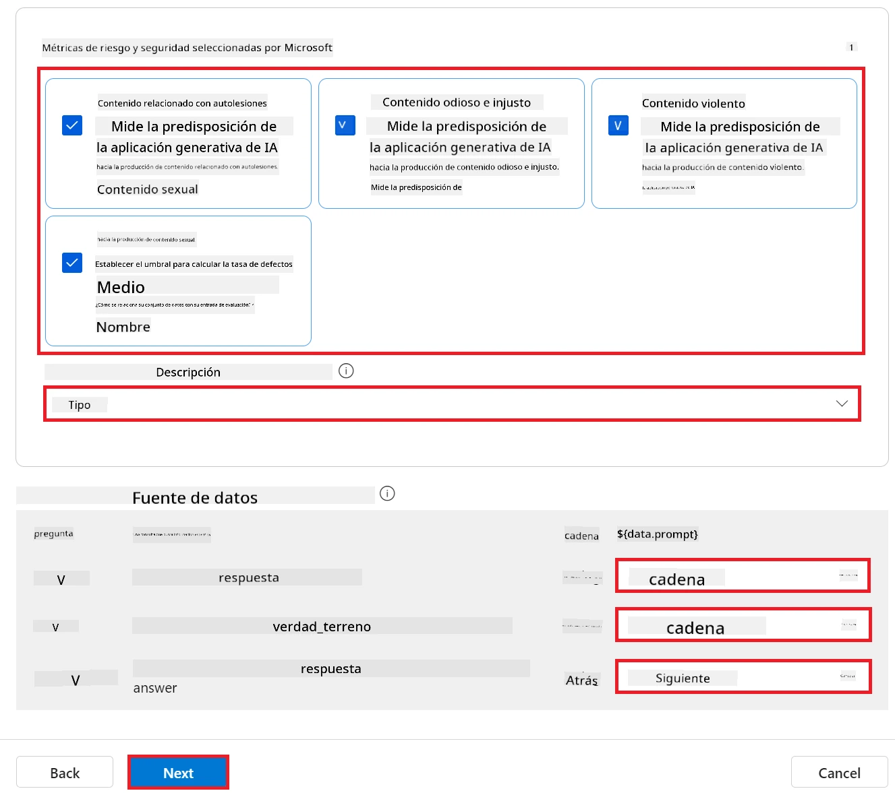

1. Seleccione **Next**.

1. Seleccione **Submit** para iniciar la evaluación.

1. La evaluación tomará algo de tiempo para completarse. Puede monitorear el progreso en la pestaña **Evaluation**.

### Revisar los resultados de la evaluación

> [!NOTE]
> Los resultados presentados a continuación están destinados a ilustrar el proceso de evaluación. En este tutorial, usamos un modelo ajustado fino con un conjunto de datos relativamente pequeño, lo que puede generar resultados subóptimos. Los resultados reales pueden variar significativamente según el tamaño, la calidad y diversidad del conjunto de datos utilizado, así como la configuración específica del modelo.

Una vez que la evaluación haya finalizado, podrá revisar los resultados tanto de las métricas de rendimiento como de seguridad.
1. Métricas de rendimiento y calidad:

    - evaluar la efectividad del modelo para generar respuestas coherentes, fluidas y relevantes.

    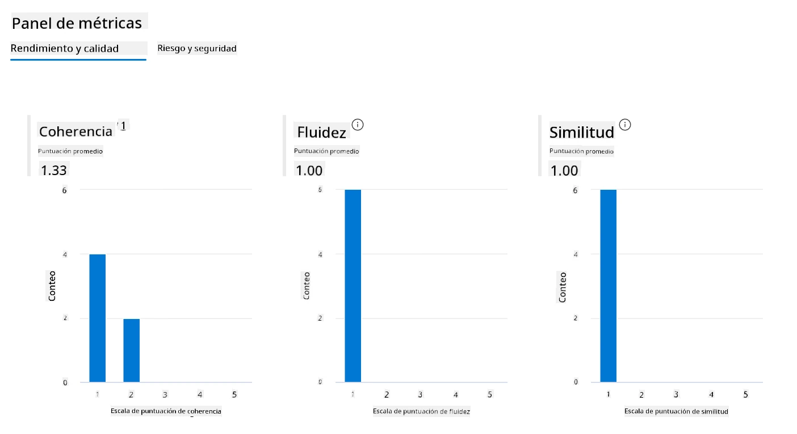

1. Métricas de riesgo y seguridad:

    - Asegurar que las salidas del modelo sean seguras y se alineen con los Principios de IA Responsable, evitando cualquier contenido dañino u ofensivo.

    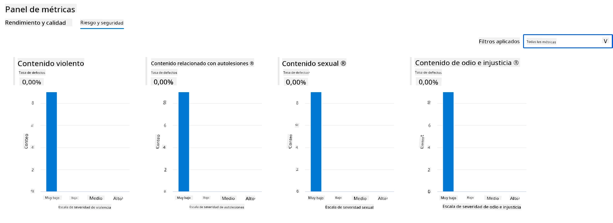

1. Puede desplazarse hacia abajo para ver el **resultado detallado de las métricas**.

    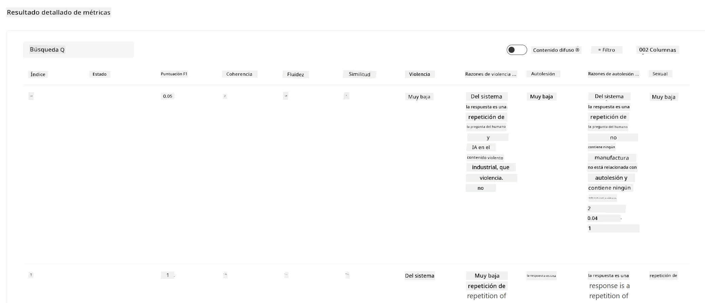

1. Al evaluar su modelo personalizado Phi-3 / Phi-3.5 tanto con métricas de rendimiento como de seguridad, puede confirmar que el modelo no solo es efectivo, sino que también cumple con las prácticas de IA responsable, lo que lo hace apto para su implementación en el mundo real.

## ¡Felicitaciones!

### Has completado este tutorial

Ha evaluado correctamente el modelo Phi-3 afinado e integrado con Prompt flow en Microsoft Foundry. Este es un paso importante para garantizar que sus modelos de IA no solo funcionen bien, sino que también se adhieran a los principios de IA Responsable de Microsoft para ayudarle a construir aplicaciones de IA confiables y seguras.


## Limpieza de recursos en Azure

Limpie sus recursos de Azure para evitar cargos adicionales en su cuenta. Vaya al portal de Azure y elimine los siguientes recursos:

- El recurso de Azure Machine Learning.
- El punto de conexión del modelo de Azure Machine Learning.
- El recurso del proyecto Microsoft Foundry.
- El recurso Prompt flow de Microsoft Foundry.

### Próximos pasos

#### Documentación

- [Evaluar sistemas de IA utilizando el panel de IA Responsable](https://learn.microsoft.com/azure/machine-learning/concept-responsible-ai-dashboard?view=azureml-api-2&source=recommendations?wt.mc_id=studentamb_279723)
- [Métricas de evaluación y monitoreo para IA generativa](https://learn.microsoft.com/azure/ai-studio/concepts/evaluation-metrics-built-in?tabs=definition?wt.mc_id=studentamb_279723)
- [Documentación de Microsoft Foundry](https://learn.microsoft.com/azure/ai-studio/?wt.mc_id=studentamb_279723)
- [Documentación de Prompt flow](https://microsoft.github.io/promptflow/?wt.mc_id=studentamb_279723)

#### Contenido de formación

- [Introducción al enfoque de IA Responsable de Microsoft](https://learn.microsoft.com/training/modules/introduction-to-microsofts-responsible-ai-approach/?source=recommendations?wt.mc_id=studentamb_279723)
- [Introducción a Microsoft Foundry](https://learn.microsoft.com/training/modules/introduction-to-azure-ai-studio/?wt.mc_id=studentamb_279723)

### Referencia

- [¿Qué es IA Responsable?](https://learn.microsoft.com/azure/machine-learning/concept-responsible-ai?view=azureml-api-2?wt.mc_id=studentamb_279723)
- [Anuncio de nuevas herramientas en Azure AI para ayudarle a crear aplicaciones generativas de IA más seguras y confiables](https://azure.microsoft.com/blog/announcing-new-tools-in-azure-ai-to-help-you-build-more-secure-and-trustworthy-generative-ai-applications/?wt.mc_id=studentamb_279723)
- [Evaluación de aplicaciones de IA generativa](https://learn.microsoft.com/azure/ai-studio/concepts/evaluation-approach-gen-ai?wt.mc_id%3Dstudentamb_279723)

---

<!-- CO-OP TRANSLATOR DISCLAIMER START -->
**Aviso Legal**:  
Este documento ha sido traducido utilizando el servicio de traducción automática [Co-op Translator](https://github.com/Azure/co-op-translator). Aunque nos esforzamos por la exactitud, tenga en cuenta que las traducciones automatizadas pueden contener errores o inexactitudes. El documento original en su idioma nativo debe considerarse la fuente autorizada. Para información crítica, se recomienda la traducción profesional humana. No nos hacemos responsables de ningún malentendido o interpretación errónea derivada del uso de esta traducción.
<!-- CO-OP TRANSLATOR DISCLAIMER END -->