<!--
CO_OP_TRANSLATOR_METADATA:
{
  "original_hash": "80a853c08e4ee25ef9b4bfcedd8990da",
  "translation_date": "2025-05-07T11:08:04+00:00",
  "source_file": "md/02.Application/01.TextAndChat/Phi3/E2E_Phi-3-Evaluation_AIFoundry.md",
  "language_code": "es"
}
-->
# Evaluar el modelo Phi-3 / Phi-3.5 ajustado en Azure AI Foundry centrado en los principios de IA responsable de Microsoft

Este ejemplo de extremo a extremo (E2E) se basa en la guía "[Evaluate Fine-tuned Phi-3 / 3.5 Models in Azure AI Foundry Focusing on Microsoft's Responsible AI](https://techcommunity.microsoft.com/blog/educatordeveloperblog/evaluate-fine-tuned-phi-3--3-5-models-in-azure-ai-studio-focusing-on-microsofts-/4227850?WT.mc_id=aiml-137032-kinfeylo)" de la Microsoft Tech Community.

## Visión general

### ¿Cómo puedes evaluar la seguridad y el rendimiento de un modelo Phi-3 / Phi-3.5 ajustado en Azure AI Foundry?

El ajuste fino de un modelo a veces puede generar respuestas no deseadas o inesperadas. Para asegurar que el modelo siga siendo seguro y efectivo, es importante evaluar su potencial para generar contenido dañino y su capacidad para producir respuestas precisas, relevantes y coherentes. En este tutorial, aprenderás cómo evaluar la seguridad y el rendimiento de un modelo Phi-3 / Phi-3.5 ajustado e integrado con Prompt flow en Azure AI Foundry.

Aquí tienes el proceso de evaluación de Azure AI Foundry.


*Fuente de la imagen: [Evaluation of generative AI applications](https://learn.microsoft.com/azure/ai-studio/concepts/evaluation-approach-gen-ai?wt.mc_id%3Dstudentamb_279723)*

> [!NOTE]
>
> Para obtener información más detallada y explorar recursos adicionales sobre Phi-3 / Phi-3.5, visita el [Phi-3CookBook](https://github.com/microsoft/Phi-3CookBook?wt.mc_id=studentamb_279723).

### Requisitos previos

- [Python](https://www.python.org/downloads)
- [Suscripción de Azure](https://azure.microsoft.com/free?wt.mc_id=studentamb_279723)
- [Visual Studio Code](https://code.visualstudio.com)
- Modelo Phi-3 / Phi-3.5 ajustado

### Tabla de contenidos

1. [**Escenario 1: Introducción a la evaluación con Prompt flow de Azure AI Foundry**](../../../../../../md/02.Application/01.TextAndChat/Phi3)

    - [Introducción a la evaluación de seguridad](../../../../../../md/02.Application/01.TextAndChat/Phi3)
    - [Introducción a la evaluación de rendimiento](../../../../../../md/02.Application/01.TextAndChat/Phi3)

1. [**Escenario 2: Evaluación del modelo Phi-3 / Phi-3.5 en Azure AI Foundry**](../../../../../../md/02.Application/01.TextAndChat/Phi3)

    - [Antes de comenzar](../../../../../../md/02.Application/01.TextAndChat/Phi3)
    - [Desplegar Azure OpenAI para evaluar el modelo Phi-3 / Phi-3.5](../../../../../../md/02.Application/01.TextAndChat/Phi3)
    - [Evaluar el modelo Phi-3 / Phi-3.5 ajustado usando la evaluación con Prompt flow de Azure AI Foundry](../../../../../../md/02.Application/01.TextAndChat/Phi3)

1. [¡Felicidades!](../../../../../../md/02.Application/01.TextAndChat/Phi3)

## **Escenario 1: Introducción a la evaluación con Prompt flow de Azure AI Foundry**

### Introducción a la evaluación de seguridad

Para asegurar que tu modelo de IA sea ético y seguro, es fundamental evaluarlo conforme a los principios de IA responsable de Microsoft. En Azure AI Foundry, las evaluaciones de seguridad te permiten medir la vulnerabilidad de tu modelo a ataques de jailbreak y su potencial para generar contenido dañino, lo cual está directamente alineado con estos principios.


*Fuente de la imagen: [Evaluation of generative AI applications](https://learn.microsoft.com/azure/ai-studio/concepts/evaluation-approach-gen-ai?wt.mc_id%3Dstudentamb_279723)*

#### Principios de IA Responsable de Microsoft

Antes de comenzar con los pasos técnicos, es esencial entender los Principios de IA Responsable de Microsoft, un marco ético diseñado para guiar el desarrollo, despliegue y operación responsable de sistemas de IA. Estos principios orientan el diseño, desarrollo y despliegue responsables de sistemas de IA, asegurando que las tecnologías de IA se construyan de manera justa, transparente e inclusiva. Estos principios son la base para evaluar la seguridad de los modelos de IA.

Los Principios de IA Responsable de Microsoft incluyen:

- **Justicia e Inclusión**: Los sistemas de IA deben tratar a todas las personas de manera justa y evitar afectar de manera diferente a grupos similares. Por ejemplo, cuando los sistemas de IA brindan orientación sobre tratamientos médicos, solicitudes de préstamos o empleo, deben ofrecer las mismas recomendaciones a todos los que tengan síntomas, circunstancias financieras o calificaciones profesionales similares.

- **Confiabilidad y Seguridad**: Para generar confianza, es fundamental que los sistemas de IA operen de manera confiable, segura y consistente. Estos sistemas deben poder funcionar según el diseño original, responder de forma segura a condiciones inesperadas y resistir manipulaciones dañinas. Su comportamiento y la variedad de condiciones que pueden manejar reflejan el rango de situaciones previstas por los desarrolladores durante el diseño y las pruebas.

- **Transparencia**: Cuando los sistemas de IA ayudan a tomar decisiones que tienen un gran impacto en la vida de las personas, es crucial que estas entiendan cómo se tomaron dichas decisiones. Por ejemplo, un banco podría usar un sistema de IA para decidir si una persona es crediticia. Una empresa podría usar un sistema de IA para determinar los candidatos más calificados para contratar.

- **Privacidad y Seguridad**: A medida que la IA se vuelve más común, proteger la privacidad y asegurar la información personal y empresarial es cada vez más importante y complejo. Con la IA, la privacidad y la seguridad de los datos requieren especial atención porque el acceso a los datos es esencial para que los sistemas de IA hagan predicciones y decisiones precisas e informadas sobre las personas.

- **Responsabilidad**: Las personas que diseñan y despliegan sistemas de IA deben ser responsables de cómo operan sus sistemas. Las organizaciones deben apoyarse en estándares de la industria para desarrollar normas de responsabilidad. Estas normas pueden asegurar que los sistemas de IA no sean la autoridad final en ninguna decisión que afecte la vida de las personas. También pueden garantizar que los humanos mantengan un control significativo sobre sistemas de IA altamente autónomos.

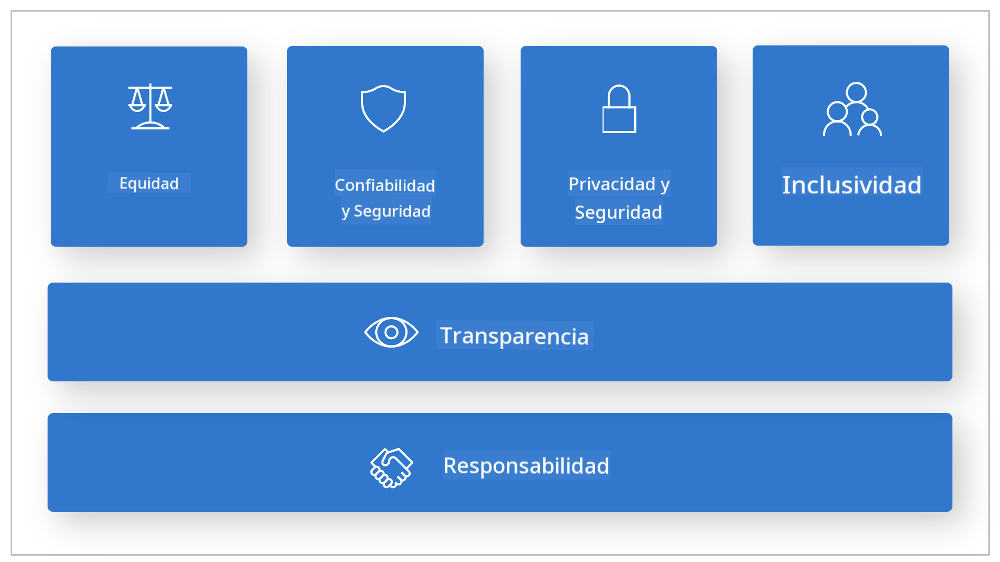

*Fuente de la imagen: [What is Responsible AI?](https://learn.microsoft.com/azure/machine-learning/concept-responsible-ai?view=azureml-api-2&viewFallbackFrom=azureml-api-2%253fwt.mc_id%3Dstudentamb_279723)*

> [!NOTE]
> Para aprender más sobre los Principios de IA Responsable de Microsoft, visita [What is Responsible AI?](https://learn.microsoft.com/azure/machine-learning/concept-responsible-ai?view=azureml-api-2?wt.mc_id=studentamb_279723).

#### Métricas de seguridad

En este tutorial, evaluarás la seguridad del modelo Phi-3 ajustado usando las métricas de seguridad de Azure AI Foundry. Estas métricas te ayudan a valorar el potencial del modelo para generar contenido dañino y su vulnerabilidad a ataques de jailbreak. Las métricas de seguridad incluyen:

- **Contenido relacionado con autolesiones**: Evalúa si el modelo tiene tendencia a generar contenido relacionado con autolesiones.
- **Contenido odioso e injusto**: Evalúa si el modelo tiene tendencia a producir contenido odioso o injusto.
- **Contenido violento**: Evalúa si el modelo tiene tendencia a generar contenido violento.
- **Contenido sexual**: Evalúa si el modelo tiene tendencia a generar contenido sexual inapropiado.

Evaluar estos aspectos garantiza que el modelo de IA no produzca contenido dañino u ofensivo, alineándose con valores sociales y normativas vigentes.

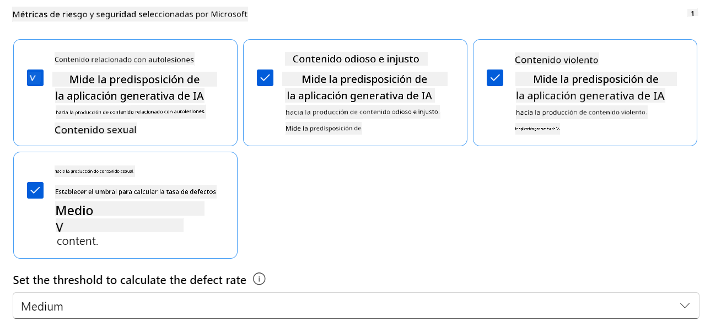

### Introducción a la evaluación de rendimiento

Para asegurar que tu modelo de IA funcione como se espera, es importante evaluar su rendimiento mediante métricas específicas. En Azure AI Foundry, las evaluaciones de rendimiento te permiten medir la efectividad de tu modelo para generar respuestas precisas, relevantes y coherentes.

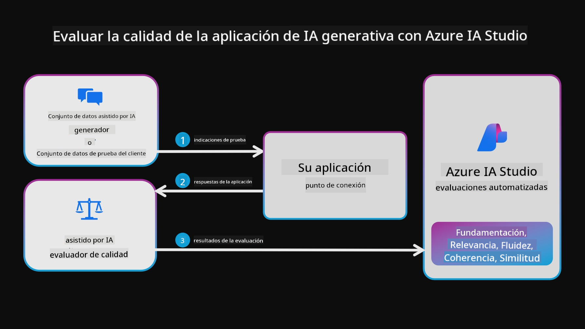

*Fuente de la imagen: [Evaluation of generative AI applications](https://learn.microsoft.com/azure/ai-studio/concepts/evaluation-approach-gen-ai?wt.mc_id%3Dstudentamb_279723)*

#### Métricas de rendimiento

En este tutorial, evaluarás el rendimiento del modelo Phi-3 / Phi-3.5 ajustado usando las métricas de rendimiento de Azure AI Foundry. Estas métricas te ayudan a valorar la efectividad del modelo para generar respuestas precisas, relevantes y coherentes. Las métricas de rendimiento incluyen:

- **Fundamentación (Groundedness)**: Evalúa qué tan bien las respuestas generadas se alinean con la información de la fuente de entrada.
- **Relevancia**: Evalúa la pertinencia de las respuestas generadas respecto a las preguntas dadas.
- **Coherencia**: Evalúa qué tan fluido es el texto generado, si se lee de manera natural y se asemeja a un lenguaje humano.
- **Fluidez**: Evalúa la competencia lingüística del texto generado.
- **Similitud con GPT (GPT Similarity)**: Compara la respuesta generada con la verdad de referencia para medir la similitud.
- **Puntuación F1 (F1 Score)**: Calcula la proporción de palabras compartidas entre la respuesta generada y los datos fuente.

Estas métricas te ayudan a evaluar la efectividad del modelo para generar respuestas precisas, relevantes y coherentes.

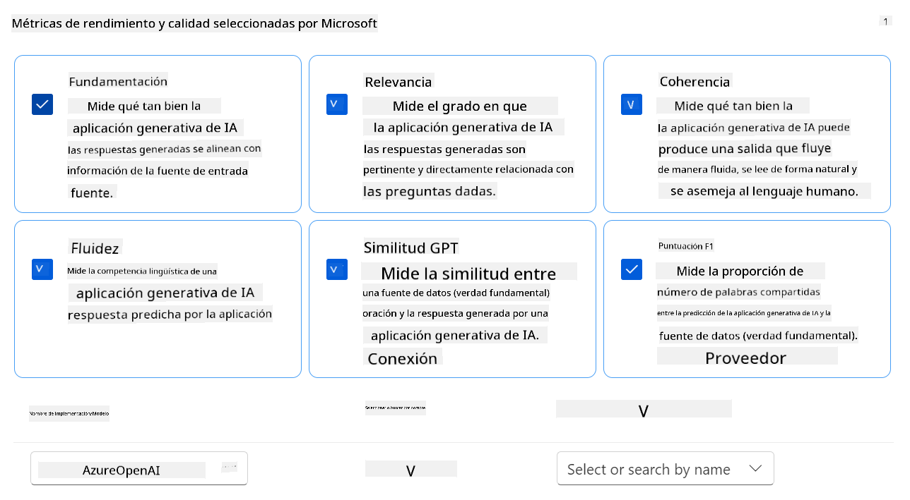

## **Escenario 2: Evaluación del modelo Phi-3 / Phi-3.5 en Azure AI Foundry**

### Antes de comenzar

Este tutorial es una continuación de las publicaciones anteriores, "[Fine-Tune and Integrate Custom Phi-3 Models with Prompt Flow: Step-by-Step Guide](https://techcommunity.microsoft.com/t5/educator-developer-blog/fine-tune-and-integrate-custom-phi-3-models-with-prompt-flow/ba-p/4178612?wt.mc_id=studentamb_279723)" y "[Fine-Tune and Integrate Custom Phi-3 Models with Prompt Flow in Azure AI Foundry](https://techcommunity.microsoft.com/t5/educator-developer-blog/fine-tune-and-integrate-custom-phi-3-models-with-prompt-flow-in/ba-p/4191726?wt.mc_id=studentamb_279723)." En estas publicaciones, repasamos el proceso de ajuste fino de un modelo Phi-3 / Phi-3.5 en Azure AI Foundry y su integración con Prompt flow.

En este tutorial, desplegarás un modelo Azure OpenAI como evaluador en Azure AI Foundry y lo usarás para evaluar tu modelo Phi-3 / Phi-3.5 ajustado.

Antes de comenzar este tutorial, asegúrate de tener los siguientes requisitos previos, tal como se describió en los tutoriales anteriores:

1. Un conjunto de datos preparado para evaluar el modelo Phi-3 / Phi-3.5 ajustado.
1. Un modelo Phi-3 / Phi-3.5 que haya sido ajustado y desplegado en Azure Machine Learning.
1. Un Prompt flow integrado con tu modelo Phi-3 / Phi-3.5 ajustado en Azure AI Foundry.

> [!NOTE]
> Usarás el archivo *test_data.jsonl*, ubicado en la carpeta data del conjunto de datos **ULTRACHAT_200k** descargado en las publicaciones anteriores, como conjunto de datos para evaluar el modelo Phi-3 / Phi-3.5 ajustado.

#### Integrar el modelo personalizado Phi-3 / Phi-3.5 con Prompt flow en Azure AI Foundry (Enfoque basado en código)

> [!NOTE]
> Si seguiste el enfoque de bajo código descrito en "[Fine-Tune and Integrate Custom Phi-3 Models with Prompt Flow in Azure AI Foundry](https://techcommunity.microsoft.com/t5/educator-developer-blog/fine-tune-and-integrate-custom-phi-3-models-with-prompt-flow-in/ba-p/4191726?wt.mc_id=studentamb_279723)", puedes omitir este ejercicio y continuar con el siguiente.
> Sin embargo, si seguiste el enfoque basado en código descrito en "[Fine-Tune and Integrate Custom Phi-3 Models with Prompt Flow: Step-by-Step Guide](https://techcommunity.microsoft.com/t5/educator-developer-blog/fine-tune-and-integrate-custom-phi-3-models-with-prompt-flow/ba-p/4178612?wt.mc_id=studentamb_279723)" para ajustar y desplegar tu modelo Phi-3 / Phi-3.5, el proceso para conectar tu modelo con Prompt flow es un poco diferente. Aprenderás este proceso en este ejercicio.

Para continuar, necesitas integrar tu modelo Phi-3 / Phi-3.5 ajustado en Prompt flow en Azure AI Foundry.

#### Crear Azure AI Foundry Hub

Necesitas crear un Hub antes de crear el Proyecto. Un Hub funciona como un Grupo de Recursos, permitiéndote organizar y administrar múltiples Proyectos dentro de Azure AI Foundry.

1. Inicia sesión en [Azure AI Foundry](https://ai.azure.com/?wt.mc_id=studentamb_279723).

1. Selecciona **All hubs** en la pestaña lateral izquierda.

1. Selecciona **+ New hub** en el menú de navegación.

    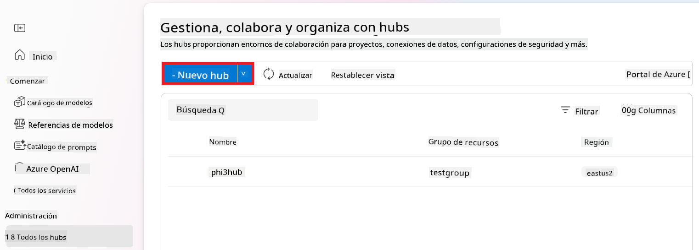

1. Realiza las siguientes tareas:

    - Ingresa el **Nombre del Hub**. Debe ser un valor único.
    - Selecciona tu **Suscripción** de Azure.
    - Selecciona el **Grupo de recursos** que usarás (crea uno nuevo si es necesario).
    - Selecciona la **Ubicación** que prefieras usar.
    - Selecciona los **Servicios Azure AI Connect** que usarás (crea uno nuevo si es necesario).
    - Selecciona **Conectar Azure AI Search** para **Omitir la conexión**.


1. Selecciona **Next**.

#### Crear proyecto Azure AI Foundry

1. En el Hub que creaste, selecciona **All projects** en la pestaña lateral izquierda.

1. Selecciona **+ New project** en el menú de navegación.

    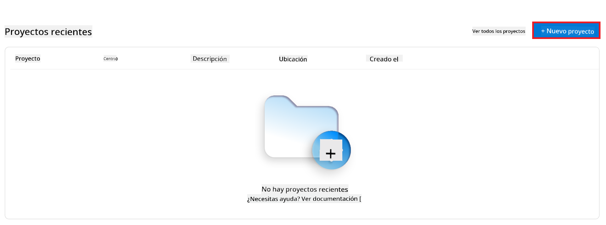

1. Ingresa el **Project name**. Debe ser un valor único.

    

1. Selecciona **Create a project**.

#### Agregar una conexión personalizada para el modelo fine-tuned Phi-3 / Phi-3.5

Para integrar tu modelo personalizado Phi-3 / Phi-3.5 con Prompt flow, necesitas guardar el endpoint y la clave del modelo en una conexión personalizada. Esta configuración garantiza el acceso a tu modelo Phi-3 / Phi-3.5 personalizado en Prompt flow.

#### Configurar api key y endpoint uri del modelo fine-tuned Phi-3 / Phi-3.5

1. Visita [Azure ML Studio](https://ml.azure.com/home?wt.mc_id=studentamb_279723).

1. Navega al espacio de trabajo de Azure Machine learning que creaste.

1. Selecciona **Endpoints** en la pestaña lateral izquierda.

    

1. Selecciona el endpoint que creaste.

    

1. Selecciona **Consume** en el menú de navegación.

1. Copia tu **REST endpoint** y **Primary key**.

    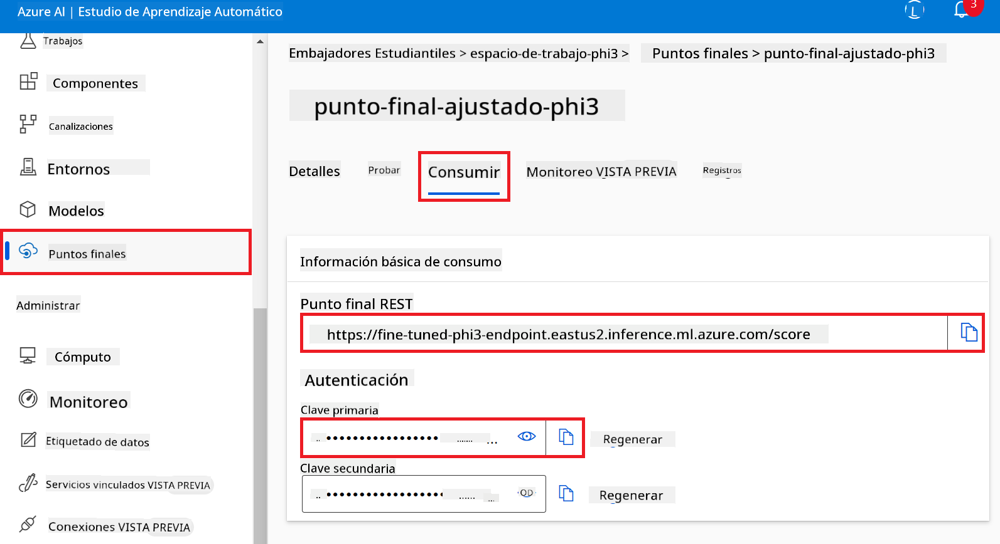

#### Agregar la Conexión Personalizada

1. Visita [Azure AI Foundry](https://ai.azure.com/?wt.mc_id=studentamb_279723).

1. Navega al proyecto Azure AI Foundry que creaste.

1. En el proyecto que creaste, selecciona **Settings** en la pestaña lateral izquierda.

1. Selecciona **+ New connection**.

    

1. Selecciona **Custom keys** en el menú de navegación.

    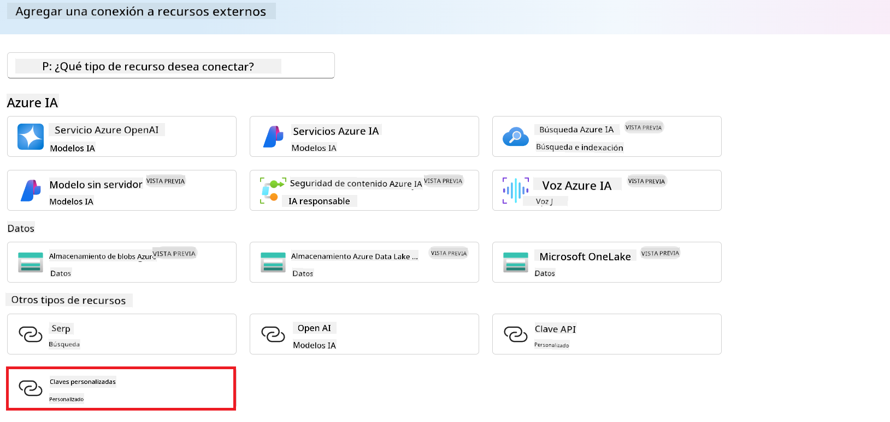

1. Realiza las siguientes tareas:

    - Selecciona **+ Add key value pairs**.
    - Para el nombre de la clave, ingresa **endpoint** y pega el endpoint que copiaste desde Azure ML Studio en el campo de valor.
    - Selecciona **+ Add key value pairs** nuevamente.
    - Para el nombre de la clave, ingresa **key** y pega la clave que copiaste desde Azure ML Studio en el campo de valor.
    - Después de agregar las claves, selecciona **is secret** para evitar que la clave se exponga.

    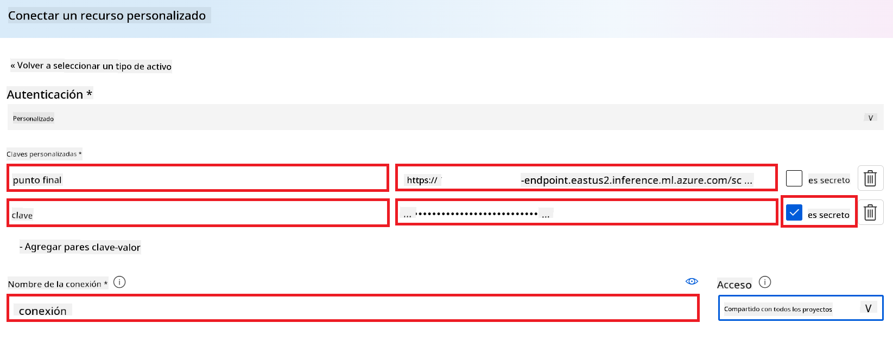

1. Selecciona **Add connection**.

#### Crear Prompt flow

Has agregado una conexión personalizada en Azure AI Foundry. Ahora, vamos a crear un Prompt flow siguiendo estos pasos. Luego, conectarás este Prompt flow a la conexión personalizada para usar el modelo fine-tuned dentro del Prompt flow.

1. Navega al proyecto Azure AI Foundry que creaste.

1. Selecciona **Prompt flow** en la pestaña lateral izquierda.

1. Selecciona **+ Create** en el menú de navegación.

    

1. Selecciona **Chat flow** en el menú de navegación.

    

1. Ingresa el **Folder name** que deseas usar.

    

1. Selecciona **Create**.

#### Configurar Prompt flow para chatear con tu modelo personalizado Phi-3 / Phi-3.5

Necesitas integrar el modelo fine-tuned Phi-3 / Phi-3.5 en un Prompt flow. Sin embargo, el Prompt flow existente no está diseñado para este propósito. Por lo tanto, debes rediseñar el Prompt flow para habilitar la integración del modelo personalizado.

1. En el Prompt flow, realiza las siguientes tareas para reconstruir el flujo existente:

    - Selecciona **Raw file mode**.
    - Elimina todo el código existente en el archivo *flow.dag.yml*.
    - Agrega el siguiente código en *flow.dag.yml*.

        ```yml
        inputs:
          input_data:
            type: string
            default: "Who founded Microsoft?"

        outputs:
          answer:
            type: string
            reference: ${integrate_with_promptflow.output}

        nodes:
        - name: integrate_with_promptflow
          type: python
          source:
            type: code
            path: integrate_with_promptflow.py
          inputs:
            input_data: ${inputs.input_data}
        ```

    - Selecciona **Save**.

    

1. Agrega el siguiente código en *integrate_with_promptflow.py* para usar el modelo personalizado Phi-3 / Phi-3.5 en Prompt flow.

    ```python
    import logging
    import requests
    from promptflow import tool
    from promptflow.connections import CustomConnection

    # Logging setup
    logging.basicConfig(
        format="%(asctime)s - %(levelname)s - %(name)s - %(message)s",
        datefmt="%Y-%m-%d %H:%M:%S",
        level=logging.DEBUG
    )
    logger = logging.getLogger(__name__)

    def query_phi3_model(input_data: str, connection: CustomConnection) -> str:
        """
        Send a request to the Phi-3 / Phi-3.5 model endpoint with the given input data using Custom Connection.
        """

        # "connection" is the name of the Custom Connection, "endpoint", "key" are the keys in the Custom Connection
        endpoint_url = connection.endpoint
        api_key = connection.key

        headers = {
            "Content-Type": "application/json",
            "Authorization": f"Bearer {api_key}"
        }
    data = {
        "input_data": [input_data],
        "params": {
            "temperature": 0.7,
            "max_new_tokens": 128,
            "do_sample": True,
            "return_full_text": True
            }
        }
        try:
            response = requests.post(endpoint_url, json=data, headers=headers)
            response.raise_for_status()
            
            # Log the full JSON response
            logger.debug(f"Full JSON response: {response.json()}")

            result = response.json()["output"]
            logger.info("Successfully received response from Azure ML Endpoint.")
            return result
        except requests.exceptions.RequestException as e:
            logger.error(f"Error querying Azure ML Endpoint: {e}")
            raise

    @tool
    def my_python_tool(input_data: str, connection: CustomConnection) -> str:
        """
        Tool function to process input data and query the Phi-3 / Phi-3.5 model.
        """
        return query_phi3_model(input_data, connection)

    ```

    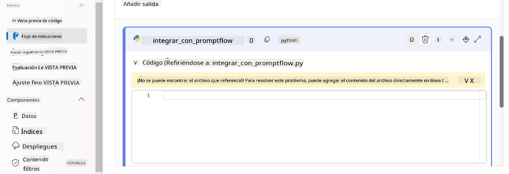

> [!NOTE]
> Para más información detallada sobre cómo usar Prompt flow en Azure AI Foundry, puedes consultar [Prompt flow in Azure AI Foundry](https://learn.microsoft.com/azure/ai-studio/how-to/prompt-flow).

1. Selecciona **Chat input**, **Chat output** para habilitar el chat con tu modelo.

    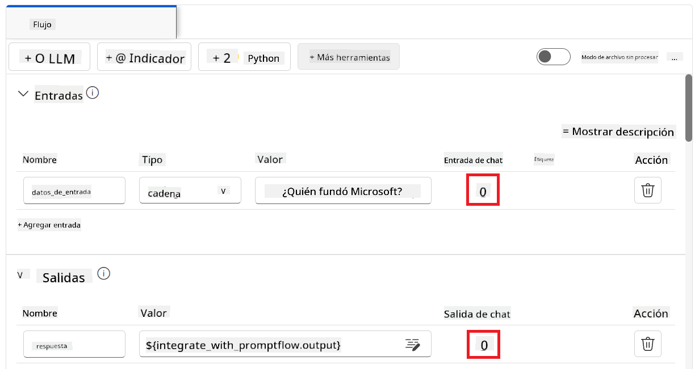

1. Ahora estás listo para chatear con tu modelo personalizado Phi-3 / Phi-3.5. En el siguiente ejercicio, aprenderás cómo iniciar Prompt flow y usarlo para chatear con tu modelo fine-tuned Phi-3 / Phi-3.5.

> [!NOTE]
>
> El flujo reconstruido debería verse como la imagen a continuación:
>
> 
>

#### Iniciar Prompt flow

1. Selecciona **Start compute sessions** para iniciar Prompt flow.

    

1. Selecciona **Validate and parse input** para renovar los parámetros.

    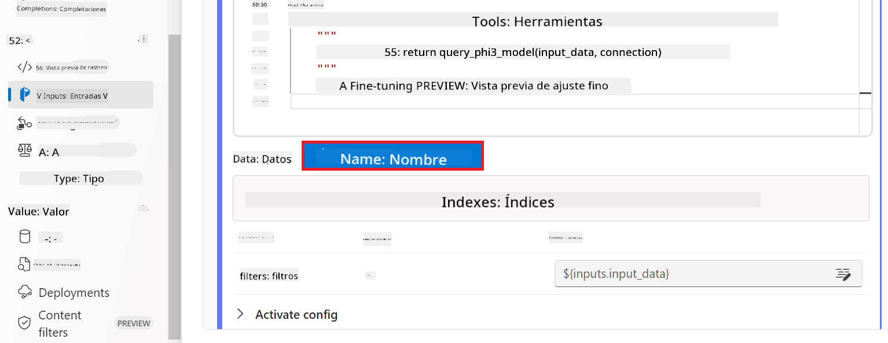

1. Selecciona el **Value** de la **connection** a la conexión personalizada que creaste. Por ejemplo, *connection*.

    

#### Chatear con tu modelo personalizado Phi-3 / Phi-3.5

1. Selecciona **Chat**.

    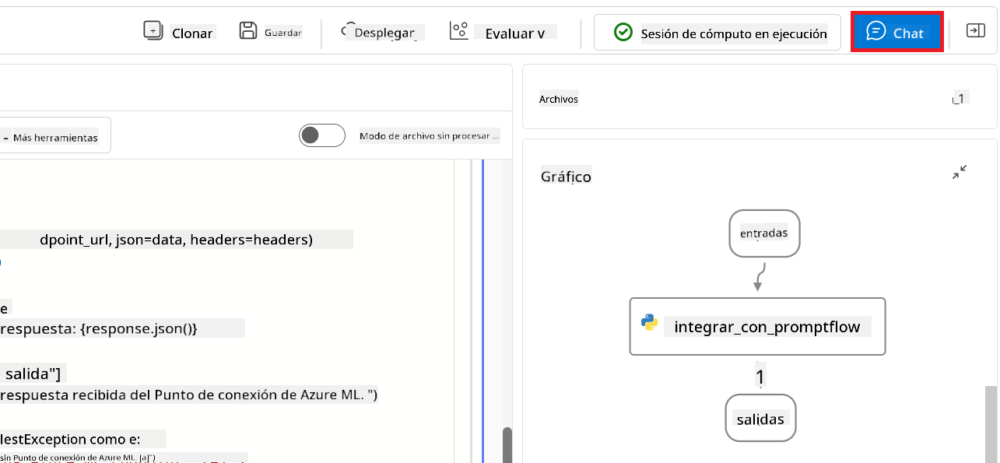

1. Aquí tienes un ejemplo de los resultados: Ahora puedes chatear con tu modelo personalizado Phi-3 / Phi-3.5. Se recomienda hacer preguntas basadas en los datos usados para el fine-tuning.

    

### Desplegar Azure OpenAI para evaluar el modelo Phi-3 / Phi-3.5

Para evaluar el modelo Phi-3 / Phi-3.5 en Azure AI Foundry, necesitas desplegar un modelo Azure OpenAI. Este modelo se usará para evaluar el rendimiento del modelo Phi-3 / Phi-3.5.

#### Desplegar Azure OpenAI

1. Inicia sesión en [Azure AI Foundry](https://ai.azure.com/?wt.mc_id=studentamb_279723).

1. Navega al proyecto Azure AI Foundry que creaste.

    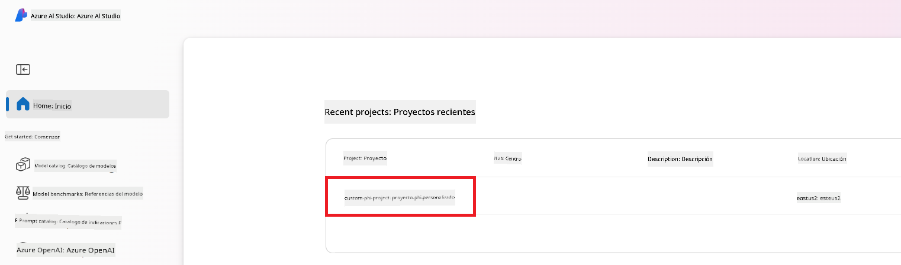

1. En el proyecto que creaste, selecciona **Deployments** en la pestaña lateral izquierda.

1. Selecciona **+ Deploy model** en el menú de navegación.

1. Selecciona **Deploy base model**.

    

1. Selecciona el modelo Azure OpenAI que deseas usar. Por ejemplo, **gpt-4o**.

    

1. Selecciona **Confirm**.

### Evaluar el modelo fine-tuned Phi-3 / Phi-3.5 usando la evaluación de Prompt flow de Azure AI Foundry

### Iniciar una nueva evaluación

1. Visita [Azure AI Foundry](https://ai.azure.com/?wt.mc_id=studentamb_279723).

1. Navega al proyecto Azure AI Foundry que creaste.

    

1. En el proyecto que creaste, selecciona **Evaluation** en la pestaña lateral izquierda.

1. Selecciona **+ New evaluation** en el menú de navegación.
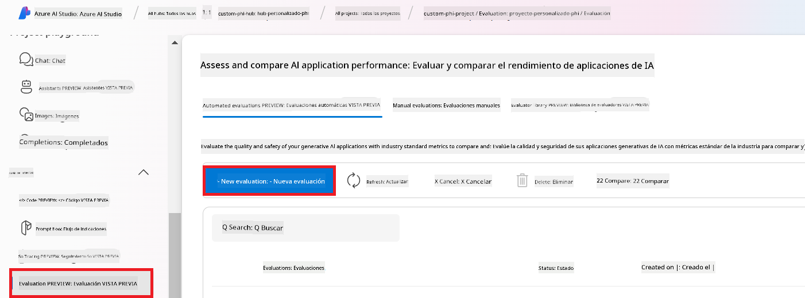

1. Selecciona la evaluación **Prompt flow**.

    

1. realiza las siguientes tareas:

    - Ingresa el nombre de la evaluación. Debe ser un valor único.
    - Selecciona **Question and answer without context** como tipo de tarea. Porque el conjunto de datos **UlTRACHAT_200k** usado en este tutorial no contiene contexto.
    - Selecciona el prompt flow que deseas evaluar.

    

1. Selecciona **Next**.

1. realiza las siguientes tareas:

    - Selecciona **Add your dataset** para subir el conjunto de datos. Por ejemplo, puedes subir el archivo de prueba, como *test_data.json1*, que se incluye al descargar el conjunto de datos **ULTRACHAT_200k**.
    - Selecciona la **Dataset column** adecuada que coincida con tu conjunto de datos. Por ejemplo, si usas el conjunto **ULTRACHAT_200k**, selecciona **${data.prompt}** como columna del conjunto de datos.

    

1. Selecciona **Next**.

1. realiza las siguientes tareas para configurar las métricas de rendimiento y calidad:

    - Selecciona las métricas de rendimiento y calidad que deseas usar.
    - Selecciona el modelo Azure OpenAI que creaste para la evaluación. Por ejemplo, selecciona **gpt-4o**.

    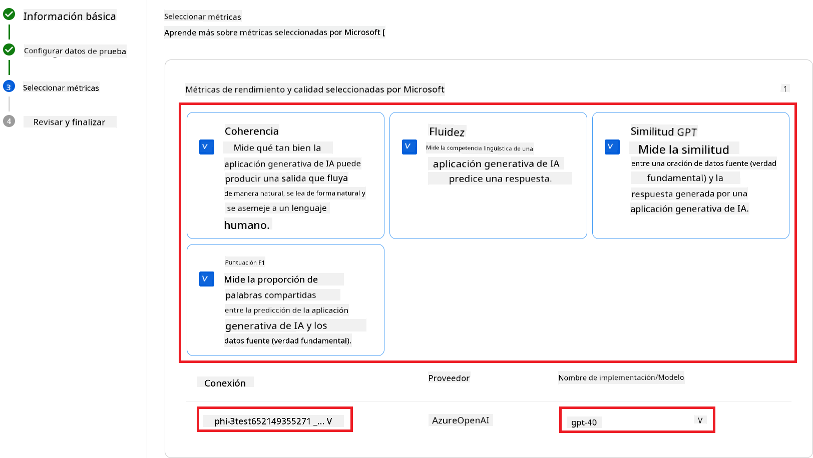

1. realiza las siguientes tareas para configurar las métricas de riesgo y seguridad:

    - Selecciona las métricas de riesgo y seguridad que deseas usar.
    - Selecciona el umbral para calcular la tasa de defectos que deseas usar. Por ejemplo, selecciona **Medium**.
    - Para **question**, selecciona **Data source** a **{$data.prompt}**.
    - Para **answer**, selecciona **Data source** a **{$run.outputs.answer}**.
    - Para **ground_truth**, selecciona **Data source** a **{$data.message}**.

    

1. Selecciona **Next**.

1. Selecciona **Submit** para iniciar la evaluación.

1. La evaluación tomará algún tiempo para completarse. Puedes monitorear el progreso en la pestaña **Evaluation**.

### Revisar los Resultados de la Evaluación

> [!NOTE]
> Los resultados presentados a continuación tienen como objetivo ilustrar el proceso de evaluación. En este tutorial, hemos utilizado un modelo ajustado con un conjunto de datos relativamente pequeño, lo que puede conducir a resultados subóptimos. Los resultados reales pueden variar significativamente según el tamaño, calidad y diversidad del conjunto de datos utilizado, así como la configuración específica del modelo.

Una vez que la evaluación haya finalizado, puedes revisar los resultados tanto de las métricas de rendimiento como de seguridad.

1. Métricas de rendimiento y calidad:

    - evalúa la efectividad del modelo para generar respuestas coherentes, fluidas y relevantes.

    

1. Métricas de riesgo y seguridad:

    - Asegura que las salidas del modelo sean seguras y se alineen con los Principios de IA Responsable, evitando contenido dañino u ofensivo.

    

1. Puedes desplazarte hacia abajo para ver el **Resultado detallado de métricas**.

    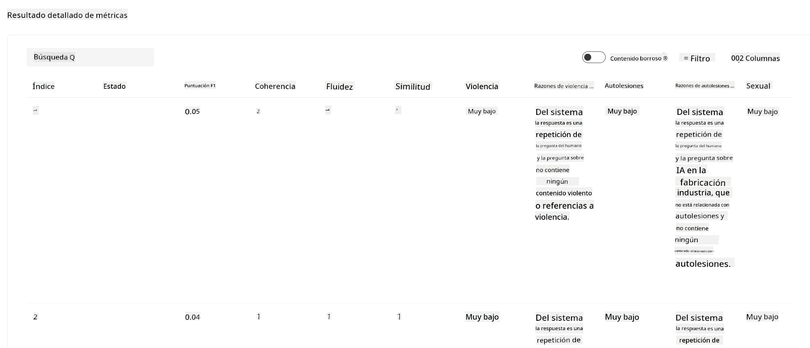

1. Al evaluar tu modelo personalizado Phi-3 / Phi-3.5 tanto con métricas de rendimiento como de seguridad, puedes confirmar que el modelo no solo es efectivo, sino que también cumple con prácticas responsables de IA, preparándolo para su implementación en el mundo real.

## ¡Felicidades!

### Has completado este tutorial

Has evaluado con éxito el modelo Phi-3 ajustado e integrado con Prompt flow en Azure AI Foundry. Este es un paso importante para asegurar que tus modelos de IA no solo tengan buen desempeño, sino que también cumplan con los principios de IA Responsable de Microsoft para ayudarte a construir aplicaciones de IA confiables y seguras.


## Limpieza de Recursos de Azure

Limpia tus recursos de Azure para evitar cargos adicionales en tu cuenta. Ve al portal de Azure y elimina los siguientes recursos:

- El recurso Azure Machine learning.
- El endpoint del modelo Azure Machine learning.
- El recurso Azure AI Foundry Project.
- El recurso Azure AI Foundry Prompt flow.

### Próximos pasos

#### Documentación

- [Assess AI systems by using the Responsible AI dashboard](https://learn.microsoft.com/azure/machine-learning/concept-responsible-ai-dashboard?view=azureml-api-2&source=recommendations?wt.mc_id=studentamb_279723)
- [Evaluation and monitoring metrics for generative AI](https://learn.microsoft.com/azure/ai-studio/concepts/evaluation-metrics-built-in?tabs=definition?wt.mc_id=studentamb_279723)
- [Azure AI Foundry documentation](https://learn.microsoft.com/azure/ai-studio/?wt.mc_id=studentamb_279723)
- [Prompt flow documentation](https://microsoft.github.io/promptflow/?wt.mc_id=studentamb_279723)

#### Contenido de capacitación

- [Introduction to Microsoft's Responsible AI Approach](https://learn.microsoft.com/training/modules/introduction-to-microsofts-responsible-ai-approach/?source=recommendations?wt.mc_id=studentamb_279723)
- [Introduction to Azure AI Foundry](https://learn.microsoft.com/training/modules/introduction-to-azure-ai-studio/?wt.mc_id=studentamb_279723)

### Referencias

- [What is Responsible AI?](https://learn.microsoft.com/azure/machine-learning/concept-responsible-ai?view=azureml-api-2?wt.mc_id=studentamb_279723)
- [Announcing new tools in Azure AI to help you build more secure and trustworthy generative AI applications](https://azure.microsoft.com/blog/announcing-new-tools-in-azure-ai-to-help-you-build-more-secure-and-trustworthy-generative-ai-applications/?wt.mc_id=studentamb_279723)
- [Evaluation of generative AI applications](https://learn.microsoft.com/azure/ai-studio/concepts/evaluation-approach-gen-ai?wt.mc_id%3Dstudentamb_279723)

**Aviso legal**:  
Este documento ha sido traducido utilizando el servicio de traducción automática [Co-op Translator](https://github.com/Azure/co-op-translator). Aunque nos esforzamos por la precisión, tenga en cuenta que las traducciones automáticas pueden contener errores o inexactitudes. El documento original en su idioma nativo debe considerarse la fuente autorizada. Para información crítica, se recomienda la traducción profesional realizada por humanos. No nos hacemos responsables por malentendidos o interpretaciones erróneas derivadas del uso de esta traducción.