# Ajustar y integrar modelos Phi-3 personalizados con Prompt flow

Esta muestra de extremo a extremo (E2E) se basa en la guía "[Fine-Tune and Integrate Custom Phi-3 Models with Prompt Flow: Step-by-Step Guide](https://techcommunity.microsoft.com/t5/educator-developer-blog/fine-tune-and-integrate-custom-phi-3-models-with-prompt-flow/ba-p/4178612?WT.mc_id=aiml-137032-kinfeylo)" de la Comunidad Técnica de Microsoft. Introduce los procesos de ajuste fino, despliegue e integración de modelos Phi-3 personalizados con Prompt flow.

## Resumen

En esta muestra E2E, aprenderá cómo ajustar finamente el modelo Phi-3 y cómo integrarlo con Prompt flow. Aprovechando Azure Machine Learning y Prompt flow, establecerá un flujo de trabajo para desplegar y utilizar modelos de IA personalizados. Esta muestra E2E está dividida en tres escenarios:

**Escenario 1: Configurar recursos de Azure y prepararse para el ajuste fino**

**Escenario 2: Ajustar finamente el modelo Phi-3 y desplegar en Azure Machine Learning Studio**

**Escenario 3: Integrar con Prompt flow y chatear con su modelo personalizado**

Aquí hay una visión general de esta muestra E2E.

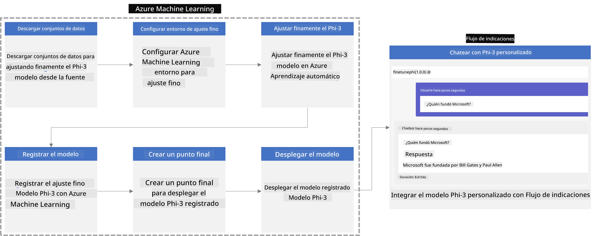

### Tabla de contenidos

1. **[Escenario 1: Configurar recursos de Azure y Prepararse para el ajuste fino](../../../../../../md/02.Application/01.TextAndChat/Phi3)**
    - [Crear un espacio de trabajo de Azure Machine Learning](../../../../../../md/02.Application/01.TextAndChat/Phi3)
    - [Solicitar cuotas de GPU en la suscripción de Azure](../../../../../../md/02.Application/01.TextAndChat/Phi3)
    - [Agregar asignación de rol](../../../../../../md/02.Application/01.TextAndChat/Phi3)
    - [Configurar proyecto](../../../../../../md/02.Application/01.TextAndChat/Phi3)
    - [Preparar conjunto de datos para ajuste fino](../../../../../../md/02.Application/01.TextAndChat/Phi3)

1. **[Escenario 2: Ajustar finamente el modelo Phi-3 y desplegar en Azure Machine Learning Studio](../../../../../../md/02.Application/01.TextAndChat/Phi3)**
    - [Configurar Azure CLI](../../../../../../md/02.Application/01.TextAndChat/Phi3)
    - [Ajustar finamente el modelo Phi-3](../../../../../../md/02.Application/01.TextAndChat/Phi3)
    - [Desplegar el modelo ajustado](../../../../../../md/02.Application/01.TextAndChat/Phi3)

1. **[Escenario 3: Integrar con Prompt flow y chatear con su modelo personalizado](../../../../../../md/02.Application/01.TextAndChat/Phi3)**
    - [Integrar el modelo Phi-3 personalizado con Prompt flow](../../../../../../md/02.Application/01.TextAndChat/Phi3)
    - [Chatear con su modelo personalizado](../../../../../../md/02.Application/01.TextAndChat/Phi3)

## Escenario 1: Configurar recursos de Azure y Prepararse para el ajuste fino

### Crear un espacio de trabajo de Azure Machine Learning

1. Escriba *azure machine learning* en la **barra de búsqueda** en la parte superior de la página del portal y seleccione **Azure Machine Learning** en las opciones que aparecen.

    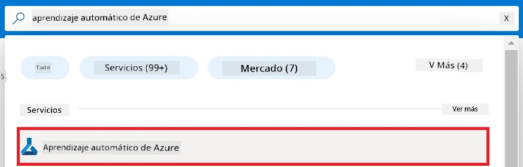

1. Seleccione **+ Crear** en el menú de navegación.

1. Seleccione **Nuevo espacio de trabajo** en el menú de navegación.

    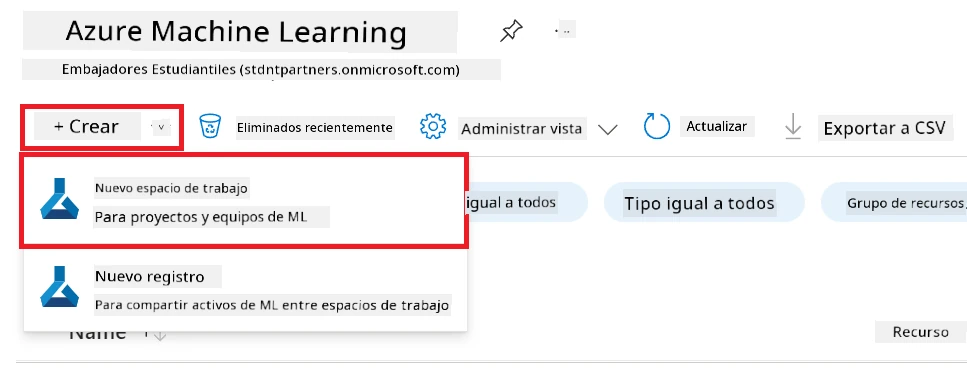

1. Realice las siguientes tareas:

    - Seleccione su **Suscripción** de Azure.
    - Seleccione el **Grupo de recursos** a usar (cree uno nuevo si es necesario).
    - Ingrese el **Nombre del espacio de trabajo**. Debe ser un valor único.
    - Seleccione la **Región** que desea usar.
    - Seleccione la **Cuenta de almacenamiento** a usar (cree una nueva si es necesario).
    - Seleccione el **Almacén de claves** a usar (cree uno nuevo si es necesario).
    - Seleccione las **Informaciones de aplicación** a usar (cree una nueva si es necesario).
    - Seleccione el **Registro de contenedores** a usar (cree uno nuevo si es necesario).

    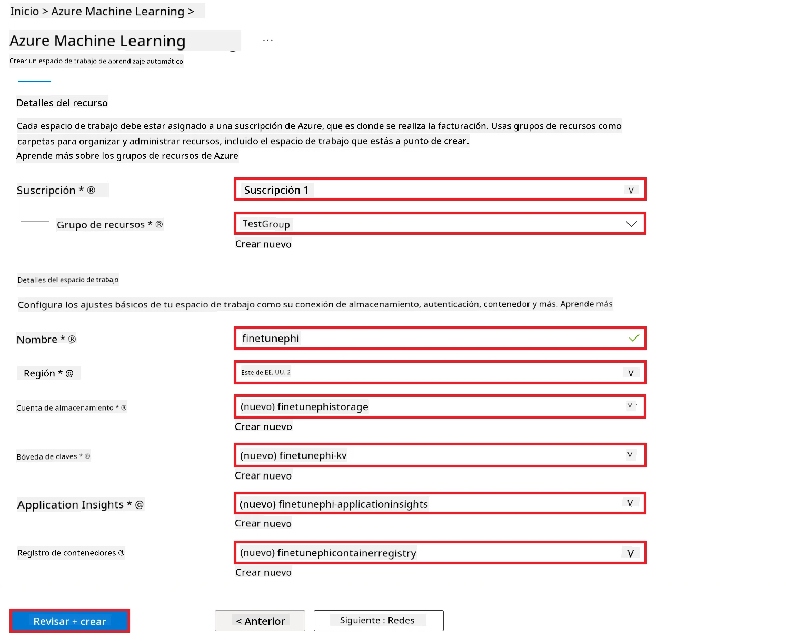

1. Seleccione **Revisar + crear**.

1. Seleccione **Crear**.

### Solicitar cuotas de GPU en la suscripción de Azure

En esta muestra E2E, usará la *GPU Standard_NC24ads_A100_v4* para el ajuste fino, lo que requiere una solicitud de cuota, y la *CPU Standard_E4s_v3* para el despliegue, que no requiere solicitud de cuota.

> [!NOTE]
>
> Solo las suscripciones de Pago por uso (tipo de suscripción estándar) son elegibles para asignación de GPU; las suscripciones de beneficio no están actualmente soportadas.
>
> Para quienes usen suscripciones de beneficio (como Visual Studio Enterprise Subscription) o quieran probar rápidamente el proceso de ajuste fino y despliegue, este tutorial también ofrece orientación para ajustar finamente con un conjunto mínimo de datos usando una CPU. Sin embargo, es importante destacar que los resultados del ajuste fino son significativamente mejores cuando se usa una GPU con conjuntos de datos más grandes.

1. Visite [Azure ML Studio](https://ml.azure.com/home?wt.mc_id=studentamb_279723).

1. Realice las siguientes tareas para solicitar la cuota de la familia *Standard NCADSA100v4*:

    - Seleccione **Cuota** en la pestaña lateral izquierda.
    - Seleccione la **Familia de máquinas virtuales** que desea usar. Por ejemplo, seleccione **Standard NCADSA100v4 Family Cluster Dedicated vCPUs**, que incluye la GPU *Standard_NC24ads_A100_v4*.
    - Seleccione la **Solicitud de cuota** en el menú de navegación.

        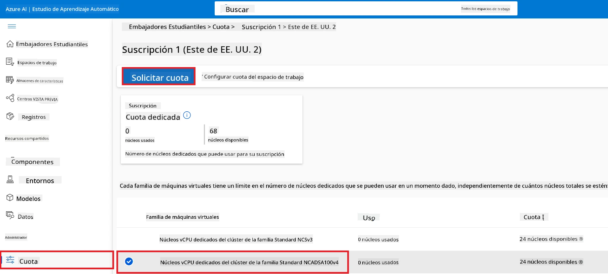

    - Dentro de la página de Solicitud de cuota, ingrese el **Límite de núcleos nuevos** que desea usar. Por ejemplo, 24.
    - Dentro de la página de Solicitud de cuota, seleccione **Enviar** para solicitar la cuota de GPU.

> [!NOTE]
> Puede seleccionar la GPU o CPU apropiada para sus necesidades consultando el documento [Tamaños para máquinas virtuales en Azure](https://learn.microsoft.com/azure/virtual-machines/sizes/overview?tabs=breakdownseries%2Cgeneralsizelist%2Ccomputesizelist%2Cmemorysizelist%2Cstoragesizelist%2Cgpusizelist%2Cfpgasizelist%2Chpcsizelist).

### Agregar asignación de rol

Para ajustar finamente y desplegar sus modelos, primero debe crear una Identidad Administrada Asignada por Usuario (UAI) y asignarle los permisos adecuados. Esta UAI se usará para la autenticación durante el despliegue.

#### Crear Identidad Administrada Asignada por Usuario (UAI)

1. Escriba *managed identities* en la **barra de búsqueda** en la parte superior de la página del portal y seleccione **Managed Identities** en las opciones que aparecen.

    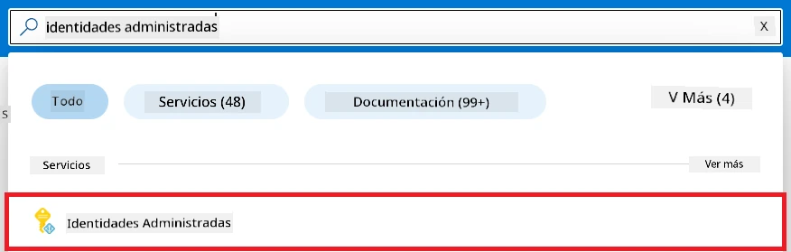

1. Seleccione **+ Crear**.

    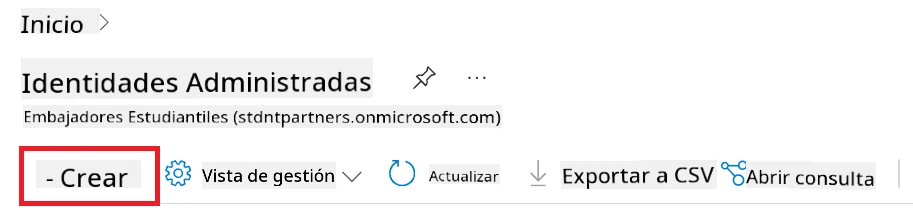

1. Realice las siguientes tareas:

    - Seleccione su **Suscripción** de Azure.
    - Seleccione el **Grupo de recursos** a usar (cree uno nuevo si es necesario).
    - Seleccione la **Región** que desea usar.
    - Ingrese el **Nombre**. Debe ser un valor único.

1. Seleccione **Revisar + crear**.

1. Seleccione **+ Crear**.

#### Agregar asignación de rol de Colaborador a la Identidad Administrada

1. Navegue al recurso de Identidad Administrada que creó.

1. Seleccione **Asignaciones de roles de Azure** en la pestaña lateral izquierda.

1. Seleccione **+ Agregar asignación de rol** en el menú de navegación.

1. Dentro de la página Agregar asignación de rol, realice las siguientes tareas:
    - Seleccione el **Ámbito** como **Grupo de recursos**.
    - Seleccione su **Suscripción** de Azure.
    - Seleccione el **Grupo de recursos** a usar.
    - Seleccione el **Rol** como **Colaborador**.

    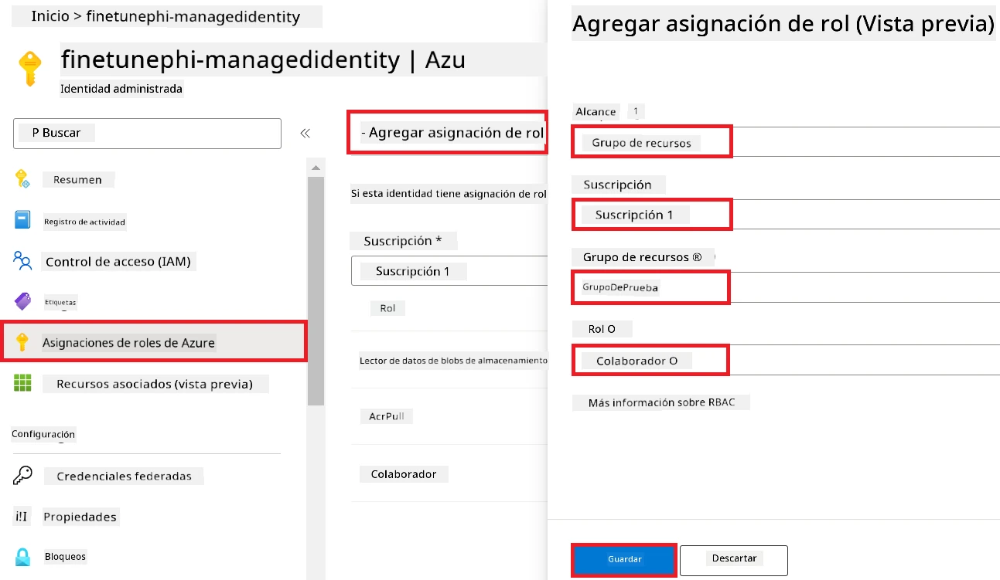

1. Seleccione **Guardar**.

#### Agregar asignación de rol de Lector de datos de Blob de almacenamiento a la Identidad Administrada

1. Escriba *storage accounts* en la **barra de búsqueda** en la parte superior de la página del portal y seleccione **Storage accounts** en las opciones que aparecen.

    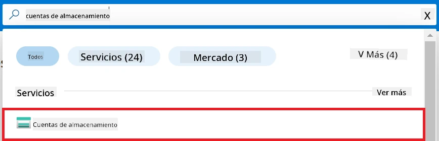

1. Seleccione la cuenta de almacenamiento asociada con el espacio de trabajo de Azure Machine Learning que creó. Por ejemplo, *finetunephistorage*.

1. Realice las siguientes tareas para navegar a la página Agregar asignación de rol:

    - Navegue a la cuenta de almacenamiento de Azure que creó.
    - Seleccione **Control de acceso (IAM)** en la pestaña lateral izquierda.
    - Seleccione **+ Agregar** en el menú de navegación.
    - Seleccione **Agregar asignación de rol** en el menú de navegación.

    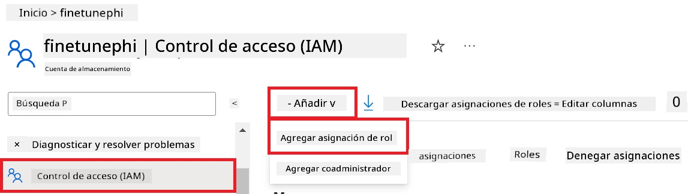

1. Dentro de la página Agregar asignación de rol, realice las siguientes tareas:

    - Dentro de la página de Rol, escriba *Storage Blob Data Reader* en la **barra de búsqueda** y seleccione **Storage Blob Data Reader** en las opciones que aparecen.
    - Dentro de la página de Rol, seleccione **Siguiente**.
    - Dentro de la página de Miembros, seleccione **Asignar acceso a** **Identidad administrada**.
    - Dentro de la página de Miembros, seleccione **+ Seleccionar miembros**.
    - Dentro de la página Seleccionar identidades administradas, seleccione su **Suscripción** de Azure.
    - Dentro de la página Seleccionar identidades administradas, seleccione la **Identidad administrada** para **Managed Identity**.
    - Dentro de la página Seleccionar identidades administradas, seleccione la Identidad administrada que creó. Por ejemplo, *finetunephi-managedidentity*.
    - Dentro de la página Seleccionar identidades administradas, seleccione **Seleccionar**.

    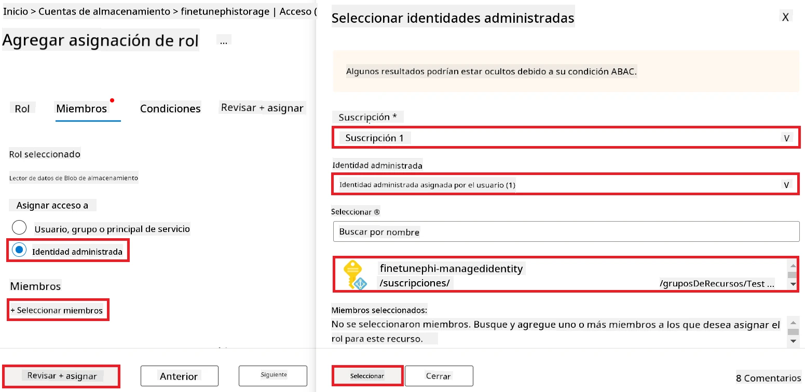

1. Seleccione **Revisar + asignar**.

#### Agregar asignación de rol AcrPull a la Identidad Administrada

1. Escriba *container registries* en la **barra de búsqueda** en la parte superior de la página del portal y seleccione **Container registries** en las opciones que aparecen.

    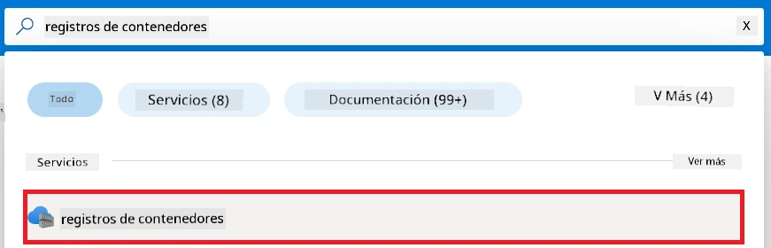

1. Seleccione el registro de contenedores asociado con el espacio de trabajo de Azure Machine Learning. Por ejemplo, *finetunephicontainerregistries*.

1. Realice las siguientes tareas para navegar a la página Agregar asignación de rol:

    - Seleccione **Control de acceso (IAM)** en la pestaña lateral izquierda.
    - Seleccione **+ Agregar** en el menú de navegación.
    - Seleccione **Agregar asignación de rol** en el menú de navegación.

1. Dentro de la página Agregar asignación de rol, realice las siguientes tareas:

    - Dentro de la página de Rol, escriba *AcrPull* en la **barra de búsqueda** y seleccione **AcrPull** en las opciones que aparecen.
    - Dentro de la página de Rol, seleccione **Siguiente**.
    - Dentro de la página de Miembros, seleccione **Asignar acceso a** **Identidad administrada**.
    - Dentro de la página de Miembros, seleccione **+ Seleccionar miembros**.
    - Dentro de la página Seleccionar identidades administradas, seleccione su **Suscripción** de Azure.
    - Dentro de la página Seleccionar identidades administradas, seleccione la **Identidad administrada** para **Managed Identity**.
    - Dentro de la página Seleccionar identidades administradas, seleccione la Identidad administrada que creó. Por ejemplo, *finetunephi-managedidentity*.
    - Dentro de la página Seleccionar identidades administradas, seleccione **Seleccionar**.
    - Seleccione **Revisar + asignar**.

### Configurar proyecto

Ahora, creará una carpeta para trabajar dentro de ella y configurará un entorno virtual para desarrollar un programa que interactúe con usuarios y use el historial de chat almacenado en Azure Cosmos DB para informar sus respuestas.

#### Crear una carpeta para trabajar dentro de ella

1. Abra una ventana de terminal y escriba el siguiente comando para crear una carpeta llamada *finetune-phi* en la ruta predeterminada.

    ```console
    mkdir finetune-phi
    ```

1. Escriba el siguiente comando dentro de su terminal para navegar a la carpeta *finetune-phi* que creó.

    ```console
    cd finetune-phi
    ```

#### Crear un entorno virtual

1. Escriba el siguiente comando dentro de su terminal para crear un entorno virtual llamado *.venv*.

    ```console
    python -m venv .venv
    ```

1. Escriba el siguiente comando dentro de su terminal para activar el entorno virtual.

    ```console
    .venv\Scripts\activate.bat
    ```

> [!NOTE]
>
> Si funcionó, debería ver *(.venv)* antes del cursor del comando.

#### Instalar los paquetes requeridos

1. Escriba los siguientes comandos dentro de su terminal para instalar los paquetes requeridos.

    ```console
    pip install datasets==2.19.1
    pip install transformers==4.41.1
    pip install azure-ai-ml==1.16.0
    pip install torch==2.3.1
    pip install trl==0.9.4
    pip install promptflow==1.12.0
    ```

#### Crear archivos del proyecto
En este ejercicio, crearás los archivos esenciales para nuestro proyecto. Estos archivos incluyen scripts para descargar el conjunto de datos, configurar el entorno de Azure Machine Learning, ajustar el modelo Phi-3 y desplegar el modelo ajustado. También crearás un archivo *conda.yml* para configurar el entorno de ajuste fino.

En este ejercicio, deberás:

- Crear un archivo *download_dataset.py* para descargar el conjunto de datos.
- Crear un archivo *setup_ml.py* para configurar el entorno de Azure Machine Learning.
- Crear un archivo *fine_tune.py* en la carpeta *finetuning_dir* para ajustar el modelo Phi-3 usando el conjunto de datos.
- Crear un archivo *conda.yml* para configurar el entorno de ajuste fino.
- Crear un archivo *deploy_model.py* para desplegar el modelo ajustado.
- Crear un archivo *integrate_with_promptflow.py*, para integrar el modelo ajustado y ejecutar el modelo usando Prompt flow.
- Crear un archivo flow.dag.yml, para configurar la estructura del flujo de trabajo para Prompt flow.
- Crear un archivo *config.py* para ingresar la información de Azure.

> [!NOTE]
>
> Estructura completa de carpetas:
>
> ```text
> └── YourUserName
> .    └── finetune-phi
> .        ├── finetuning_dir
> .        │      └── fine_tune.py
> .        ├── conda.yml
> .        ├── config.py
> .        ├── deploy_model.py
> .        ├── download_dataset.py
> .        ├── flow.dag.yml
> .        ├── integrate_with_promptflow.py
> .        └── setup_ml.py
> ```

1. Abre **Visual Studio Code**.

1. Selecciona **Archivo** en la barra de menú.

1. Selecciona **Abrir carpeta**.

1. Selecciona la carpeta *finetune-phi* que creaste, ubicada en *C:\Users\tuUsuario\finetune-phi*.

    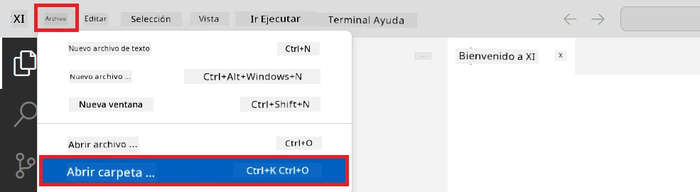

1. En el panel izquierdo de Visual Studio Code, haz clic derecho y selecciona **Nuevo archivo** para crear un nuevo archivo llamado *download_dataset.py*.

1. En el panel izquierdo de Visual Studio Code, haz clic derecho y selecciona **Nuevo archivo** para crear un nuevo archivo llamado *setup_ml.py*.

1. En el panel izquierdo de Visual Studio Code, haz clic derecho y selecciona **Nuevo archivo** para crear un nuevo archivo llamado *deploy_model.py*.

    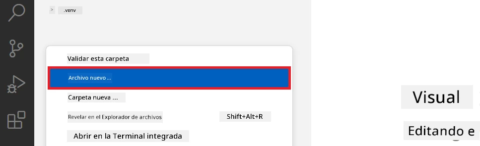

1. En el panel izquierdo de Visual Studio Code, haz clic derecho y selecciona **Nueva carpeta** para crear una nueva carpeta llamada *finetuning_dir*.

1. En la carpeta *finetuning_dir*, crea un nuevo archivo llamado *fine_tune.py*.

#### Crear y configurar el archivo *conda.yml*

1. En el panel izquierdo de Visual Studio Code, haz clic derecho y selecciona **Nuevo archivo** para crear un nuevo archivo llamado *conda.yml*.

1. Añade el siguiente código al archivo *conda.yml* para configurar el entorno de ajuste fino para el modelo Phi-3.

    ```yml
    name: phi-3-training-env
    channels:
      - defaults
      - conda-forge
    dependencies:
      - python=3.10
      - pip
      - numpy<2.0
      - pip:
          - torch==2.4.0
          - torchvision==0.19.0
          - trl==0.8.6
          - transformers==4.41
          - datasets==2.21.0
          - azureml-core==1.57.0
          - azure-storage-blob==12.19.0
          - azure-ai-ml==1.16
          - azure-identity==1.17.1
          - accelerate==0.33.0
          - mlflow==2.15.1
          - azureml-mlflow==1.57.0
    ```

#### Crear y configurar el archivo *config.py*

1. En el panel izquierdo de Visual Studio Code, haz clic derecho y selecciona **Nuevo archivo** para crear un nuevo archivo llamado *config.py*.

1. Añade el siguiente código al archivo *config.py* para incluir tu información de Azure.

    ```python
    # Configuraciones de Azure
    AZURE_SUBSCRIPTION_ID = "your_subscription_id"
    AZURE_RESOURCE_GROUP_NAME = "your_resource_group_name" # "TestGroup"

    # Configuraciones de Azure Machine Learning
    AZURE_ML_WORKSPACE_NAME = "your_workspace_name" # "finetunephi-workspace"

    # Configuraciones de Identidad Administrada de Azure
    AZURE_MANAGED_IDENTITY_CLIENT_ID = "your_azure_managed_identity_client_id"
    AZURE_MANAGED_IDENTITY_NAME = "your_azure_managed_identity_name" # "finetunephi-mangedidentity"
    AZURE_MANAGED_IDENTITY_RESOURCE_ID = f"/subscriptions/{AZURE_SUBSCRIPTION_ID}/resourceGroups/{AZURE_RESOURCE_GROUP_NAME}/providers/Microsoft.ManagedIdentity/userAssignedIdentities/{AZURE_MANAGED_IDENTITY_NAME}"

    # Rutas de archivos del conjunto de datos
    TRAIN_DATA_PATH = "data/train_data.jsonl"
    TEST_DATA_PATH = "data/test_data.jsonl"

    # Configuraciones del modelo afinado
    AZURE_MODEL_NAME = "your_fine_tuned_model_name" # "finetune-phi-model"
    AZURE_ENDPOINT_NAME = "your_fine_tuned_model_endpoint_name" # "finetune-phi-endpoint"
    AZURE_DEPLOYMENT_NAME = "your_fine_tuned_model_deployment_name" # "finetune-phi-deployment"

    AZURE_ML_API_KEY = "your_fine_tuned_model_api_key"
    AZURE_ML_ENDPOINT = "your_fine_tuned_model_endpoint_uri" # "https://{your-endpoint-name}.{your-region}.inference.ml.azure.com/score"
    ```

#### Añadir variables de entorno de Azure

1. Realiza las siguientes tareas para añadir el ID de suscripción de Azure:

    - Escribe *subscriptions* en la **barra de búsqueda** en la parte superior de la página del portal y selecciona **Suscripciones** de las opciones que aparecen.
    - Selecciona la suscripción de Azure que estás usando actualmente.
    - Copia y pega tu ID de suscripción en el archivo *config.py*.

    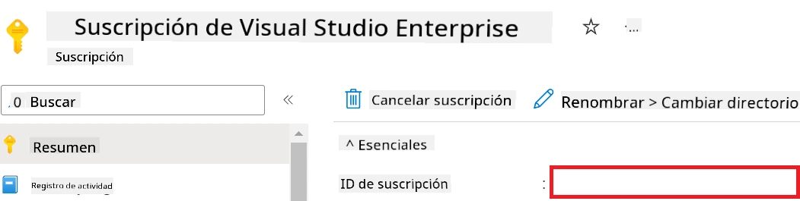

1. Realiza las siguientes tareas para añadir el nombre del espacio de trabajo de Azure:

    - Navega al recurso de Azure Machine Learning que creaste.
    - Copia y pega el nombre de tu cuenta en el archivo *config.py*.

    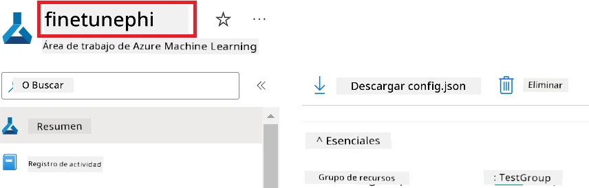

1. Realiza las siguientes tareas para añadir el nombre del grupo de recursos de Azure:

    - Navega al recurso de Azure Machine Learning que creaste.
    - Copia y pega el nombre de tu grupo de recursos de Azure en el archivo *config.py*.

    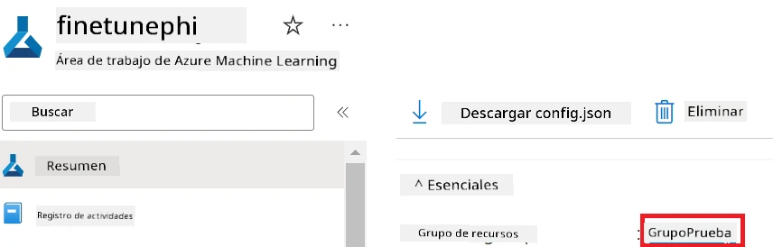

2. Realiza las siguientes tareas para añadir el nombre de Identidad Administrada de Azure

    - Navega al recurso de Identidades Gestionadas que creaste.
    - Copia y pega el nombre de tu Identidad Administrada de Azure en el archivo *config.py*.

    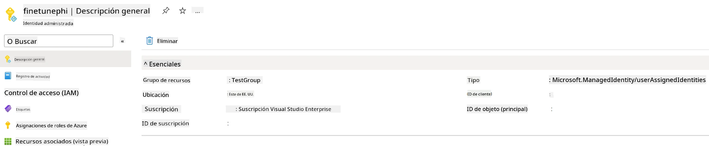

### Preparar conjunto de datos para ajuste fino

En este ejercicio, ejecutarás el archivo *download_dataset.py* para descargar los conjuntos de datos *ULTRACHAT_200k* en tu entorno local. Luego usarás estos conjuntos para ajustar el modelo Phi-3 en Azure Machine Learning.

#### Descarga tu conjunto de datos usando *download_dataset.py*

1. Abre el archivo *download_dataset.py* en Visual Studio Code.

1. Añade el siguiente código en *download_dataset.py*.

    ```python
    import json
    import os
    from datasets import load_dataset
    from config import (
        TRAIN_DATA_PATH,
        TEST_DATA_PATH)

    def load_and_split_dataset(dataset_name, config_name, split_ratio):
        """
        Load and split a dataset.
        """
        # Cargar el conjunto de datos con el nombre, configuración y proporción de división especificados
        dataset = load_dataset(dataset_name, config_name, split=split_ratio)
        print(f"Original dataset size: {len(dataset)}")
        
        # Dividir el conjunto de datos en conjuntos de entrenamiento y prueba (80% entrenamiento, 20% prueba)
        split_dataset = dataset.train_test_split(test_size=0.2)
        print(f"Train dataset size: {len(split_dataset['train'])}")
        print(f"Test dataset size: {len(split_dataset['test'])}")
        
        return split_dataset

    def save_dataset_to_jsonl(dataset, filepath):
        """
        Save a dataset to a JSONL file.
        """
        # Crear el directorio si no existe
        os.makedirs(os.path.dirname(filepath), exist_ok=True)
        
        # Abrir el archivo en modo escritura
        with open(filepath, 'w', encoding='utf-8') as f:
            # Iterar sobre cada registro en el conjunto de datos
            for record in dataset:
                # Volcar el registro como un objeto JSON y escribirlo en el archivo
                json.dump(record, f)
                # Escribir un carácter de nueva línea para separar registros
                f.write('\n')
        
        print(f"Dataset saved to {filepath}")

    def main():
        """
        Main function to load, split, and save the dataset.
        """
        # Cargar y dividir el conjunto de datos ULTRACHAT_200k con una configuración y proporción específicas
        dataset = load_and_split_dataset("HuggingFaceH4/ultrachat_200k", 'default', 'train_sft[:1%]')
        
        # Extraer los conjuntos de datos de entrenamiento y prueba de la división
        train_dataset = dataset['train']
        test_dataset = dataset['test']

        # Guardar el conjunto de datos de entrenamiento en un archivo JSONL
        save_dataset_to_jsonl(train_dataset, TRAIN_DATA_PATH)
        
        # Guardar el conjunto de datos de prueba en un archivo JSONL separado
        save_dataset_to_jsonl(test_dataset, TEST_DATA_PATH)

    if __name__ == "__main__":
        main()

    ```

> [!TIP]
>
> **Guía para ajuste fino con un conjunto de datos mínimo usando CPU**
>
> Si deseas usar un CPU para el ajuste fino, este enfoque es ideal para quienes tienen suscripciones de beneficios (como Visual Studio Enterprise Subscription) o para probar rápidamente el proceso de ajuste fino y despliegue.
>
> Reemplaza `dataset = load_and_split_dataset("HuggingFaceH4/ultrachat_200k", 'default', 'train_sft[:1%]')` por `dataset = load_and_split_dataset("HuggingFaceH4/ultrachat_200k", 'default', 'train_sft[:10]')`
>

1. Escribe el siguiente comando en tu terminal para ejecutar el script y descargar el conjunto de datos en tu entorno local.

    ```console
    python download_data.py
    ```

1. Verifica que los conjuntos de datos se hayan guardado correctamente en tu directorio local *finetune-phi/data*.

> [!NOTE]
>
> **Tamaño del conjunto de datos y tiempo de ajuste fino**
>
> En este ejemplo E2E, usas solamente el 1% del conjunto de datos (`train_sft[:1%]`). Esto reduce significativamente la cantidad de datos, acelerando tanto la carga como los procesos de ajuste fino. Puedes ajustar el porcentaje para encontrar el equilibrio adecuado entre el tiempo de entrenamiento y el rendimiento del modelo. Usar un subconjunto más pequeño del conjunto de datos reduce el tiempo requerido para el ajuste fino, haciendo que el proceso sea más manejable para un ejemplo E2E.

## Escenario 2: Ajustar el modelo Phi-3 y desplegarlo en Azure Machine Learning Studio

### Configura Azure CLI

Necesitas configurar Azure CLI para autenticar tu entorno. Azure CLI te permite administrar recursos de Azure directamente desde la línea de comandos y proporciona las credenciales necesarias para que Azure Machine Learning acceda a estos recursos. Para comenzar, instala [Azure CLI](https://learn.microsoft.com/cli/azure/install-azure-cli)

1. Abre una ventana de terminal y escribe el siguiente comando para iniciar sesión en tu cuenta de Azure.

    ```console
    az login
    ```

1. Selecciona tu cuenta de Azure para usar.

1. Selecciona la suscripción de Azure que usarás.

    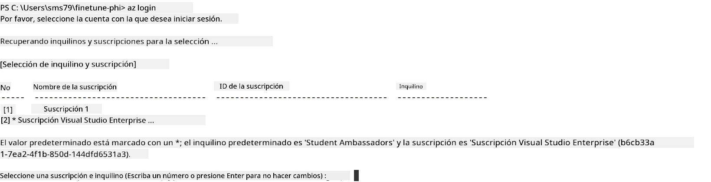

> [!TIP]
>
> Si tienes problemas para iniciar sesión en Azure, intenta usar un código de dispositivo. Abre una ventana de terminal y escribe el siguiente comando para iniciar sesión en tu cuenta de Azure:
>
> ```console
> az login --use-device-code
> ```
>

### Ajustar el modelo Phi-3

En este ejercicio, ajustarás el modelo Phi-3 usando el conjunto de datos proporcionado. Primero, definirás el proceso de ajuste fino en el archivo *fine_tune.py*. Luego, configurarás el entorno de Azure Machine Learning e iniciarás el proceso de ajuste fino ejecutando el archivo *setup_ml.py*. Este script asegura que el ajuste fino ocurra dentro del entorno de Azure Machine Learning.

Al ejecutar *setup_ml.py*, ejecutarás el proceso de ajuste fino en el entorno de Azure Machine Learning.

#### Añade código al archivo *fine_tune.py*

1. Navega a la carpeta *finetuning_dir* y abre el archivo *fine_tune.py* en Visual Studio Code.

1. Añade el siguiente código en *fine_tune.py*.

    ```python
    import argparse
    import sys
    import logging
    import os
    from datasets import load_dataset
    import torch
    import mlflow
    from transformers import AutoModelForCausalLM, AutoTokenizer, TrainingArguments
    from trl import SFTTrainer

    # Para evitar el error INVALID_PARAMETER_VALUE en MLflow, deshabilite la integración de MLflow
    os.environ["DISABLE_MLFLOW_INTEGRATION"] = "True"

    # Configuración de registro
    logging.basicConfig(
        format="%(asctime)s - %(levelname)s - %(name)s - %(message)s",
        datefmt="%Y-%m-%d %H:%M:%S",
        handlers=[logging.StreamHandler(sys.stdout)],
        level=logging.WARNING
    )
    logger = logging.getLogger(__name__)

    def initialize_model_and_tokenizer(model_name, model_kwargs):
        """
        Initialize the model and tokenizer with the given pretrained model name and arguments.
        """
        model = AutoModelForCausalLM.from_pretrained(model_name, **model_kwargs)
        tokenizer = AutoTokenizer.from_pretrained(model_name)
        tokenizer.model_max_length = 2048
        tokenizer.pad_token = tokenizer.unk_token
        tokenizer.pad_token_id = tokenizer.convert_tokens_to_ids(tokenizer.pad_token)
        tokenizer.padding_side = 'right'
        return model, tokenizer

    def apply_chat_template(example, tokenizer):
        """
        Apply a chat template to tokenize messages in the example.
        """
        messages = example["messages"]
        if messages[0]["role"] != "system":
            messages.insert(0, {"role": "system", "content": ""})
        example["text"] = tokenizer.apply_chat_template(
            messages, tokenize=False, add_generation_prompt=False
        )
        return example

    def load_and_preprocess_data(train_filepath, test_filepath, tokenizer):
        """
        Load and preprocess the dataset.
        """
        train_dataset = load_dataset('json', data_files=train_filepath, split='train')
        test_dataset = load_dataset('json', data_files=test_filepath, split='train')
        column_names = list(train_dataset.features)

        train_dataset = train_dataset.map(
            apply_chat_template,
            fn_kwargs={"tokenizer": tokenizer},
            num_proc=10,
            remove_columns=column_names,
            desc="Applying chat template to train dataset",
        )

        test_dataset = test_dataset.map(
            apply_chat_template,
            fn_kwargs={"tokenizer": tokenizer},
            num_proc=10,
            remove_columns=column_names,
            desc="Applying chat template to test dataset",
        )

        return train_dataset, test_dataset

    def train_and_evaluate_model(train_dataset, test_dataset, model, tokenizer, output_dir):
        """
        Train and evaluate the model.
        """
        training_args = TrainingArguments(
            bf16=True,
            do_eval=True,
            output_dir=output_dir,
            eval_strategy="epoch",
            learning_rate=5.0e-06,
            logging_steps=20,
            lr_scheduler_type="cosine",
            num_train_epochs=3,
            overwrite_output_dir=True,
            per_device_eval_batch_size=4,
            per_device_train_batch_size=4,
            remove_unused_columns=True,
            save_steps=500,
            seed=0,
            gradient_checkpointing=True,
            gradient_accumulation_steps=1,
            warmup_ratio=0.2,
        )

        trainer = SFTTrainer(
            model=model,
            args=training_args,
            train_dataset=train_dataset,
            eval_dataset=test_dataset,
            max_seq_length=2048,
            dataset_text_field="text",
            tokenizer=tokenizer,
            packing=True
        )

        train_result = trainer.train()
        trainer.log_metrics("train", train_result.metrics)

        mlflow.transformers.log_model(
            transformers_model={"model": trainer.model, "tokenizer": tokenizer},
            artifact_path=output_dir,
        )

        tokenizer.padding_side = 'left'
        eval_metrics = trainer.evaluate()
        eval_metrics["eval_samples"] = len(test_dataset)
        trainer.log_metrics("eval", eval_metrics)

    def main(train_file, eval_file, model_output_dir):
        """
        Main function to fine-tune the model.
        """
        model_kwargs = {
            "use_cache": False,
            "trust_remote_code": True,
            "torch_dtype": torch.bfloat16,
            "device_map": None,
            "attn_implementation": "eager"
        }

        # pretrained_model_name = "microsoft/Phi-3-mini-4k-instruct"
        pretrained_model_name = "microsoft/Phi-3.5-mini-instruct"

        with mlflow.start_run():
            model, tokenizer = initialize_model_and_tokenizer(pretrained_model_name, model_kwargs)
            train_dataset, test_dataset = load_and_preprocess_data(train_file, eval_file, tokenizer)
            train_and_evaluate_model(train_dataset, test_dataset, model, tokenizer, model_output_dir)

    if __name__ == "__main__":
        parser = argparse.ArgumentParser()
        parser.add_argument("--train-file", type=str, required=True, help="Path to the training data")
        parser.add_argument("--eval-file", type=str, required=True, help="Path to the evaluation data")
        parser.add_argument("--model_output_dir", type=str, required=True, help="Directory to save the fine-tuned model")
        args = parser.parse_args()
        main(args.train_file, args.eval_file, args.model_output_dir)

    ```

1. Guarda y cierra el archivo *fine_tune.py*.

> [!TIP]
> **Puedes ajustar el modelo Phi-3.5**
>
> En el archivo *fine_tune.py*, puedes cambiar el valor de `pretrained_model_name` de `"microsoft/Phi-3-mini-4k-instruct"` a cualquier modelo que quieras ajustar. Por ejemplo, si lo cambias a `"microsoft/Phi-3.5-mini-instruct"`, estarás usando el modelo Phi-3.5-mini-instruct para el ajuste fino. Para encontrar y usar el nombre del modelo que prefieras, visita [Hugging Face](https://huggingface.co/), busca el modelo que te interese y luego copia y pega su nombre en el campo `pretrained_model_name` en tu script.
>
> <image type="content" src="../../../../imgs/02/FineTuning-PromptFlow/finetunephi3.5.png" alt-text="Ajustar Phi-3.5.">
>

#### Añade código al archivo *setup_ml.py*

1. Abre el archivo *setup_ml.py* en Visual Studio Code.

1. Añade el siguiente código en *setup_ml.py*.

    ```python
    import logging
    from azure.ai.ml import MLClient, command, Input
    from azure.ai.ml.entities import Environment, AmlCompute
    from azure.identity import AzureCliCredential
    from config import (
        AZURE_SUBSCRIPTION_ID,
        AZURE_RESOURCE_GROUP_NAME,
        AZURE_ML_WORKSPACE_NAME,
        TRAIN_DATA_PATH,
        TEST_DATA_PATH
    )

    # Constantes

    # Descomenta las siguientes líneas para usar una instancia CPU para el entrenamiento
    # COMPUTE_INSTANCE_TYPE = "Standard_E16s_v3" # cpu
    # COMPUTE_NAME = "cpu-e16s-v3"
    # DOCKER_IMAGE_NAME = "mcr.microsoft.com/azureml/openmpi4.1.0-ubuntu20.04:latest"

    # Descomenta las siguientes líneas para usar una instancia GPU para el entrenamiento
    COMPUTE_INSTANCE_TYPE = "Standard_NC24ads_A100_v4"
    COMPUTE_NAME = "gpu-nc24s-a100-v4"
    DOCKER_IMAGE_NAME = "mcr.microsoft.com/azureml/curated/acft-hf-nlp-gpu:59"

    CONDA_FILE = "conda.yml"
    LOCATION = "eastus2" # Reemplaza con la ubicación de tu clúster de computación
    FINETUNING_DIR = "./finetuning_dir" # Ruta al script de ajuste fino
    TRAINING_ENV_NAME = "phi-3-training-environment" # Nombre del entorno de entrenamiento
    MODEL_OUTPUT_DIR = "./model_output" # Ruta al directorio de salida del modelo en Azure ML

    # Configuración de registro para rastrear el proceso
    logger = logging.getLogger(__name__)
    logging.basicConfig(
        format="%(asctime)s - %(levelname)s - %(name)s - %(message)s",
        datefmt="%Y-%m-%d %H:%M:%S",
        level=logging.WARNING
    )

    def get_ml_client():
        """
        Initialize the ML Client using Azure CLI credentials.
        """
        credential = AzureCliCredential()
        return MLClient(credential, AZURE_SUBSCRIPTION_ID, AZURE_RESOURCE_GROUP_NAME, AZURE_ML_WORKSPACE_NAME)

    def create_or_get_environment(ml_client):
        """
        Create or update the training environment in Azure ML.
        """
        env = Environment(
            image=DOCKER_IMAGE_NAME,  # Imagen Docker para el entorno
            conda_file=CONDA_FILE,  # Archivo de entorno Conda
            name=TRAINING_ENV_NAME,  # Nombre del entorno
        )
        return ml_client.environments.create_or_update(env)

    def create_or_get_compute_cluster(ml_client, compute_name, COMPUTE_INSTANCE_TYPE, location):
        """
        Create or update the compute cluster in Azure ML.
        """
        try:
            compute_cluster = ml_client.compute.get(compute_name)
            logger.info(f"Compute cluster '{compute_name}' already exists. Reusing it for the current run.")
        except Exception:
            logger.info(f"Compute cluster '{compute_name}' does not exist. Creating a new one with size {COMPUTE_INSTANCE_TYPE}.")
            compute_cluster = AmlCompute(
                name=compute_name,
                size=COMPUTE_INSTANCE_TYPE,
                location=location,
                tier="Dedicated",  # Nivel del clúster de computación
                min_instances=0,  # Número mínimo de instancias
                max_instances=1  # Número máximo de instancias
            )
            ml_client.compute.begin_create_or_update(compute_cluster).wait()  # Esperar a que se cree el clúster
        return compute_cluster

    def create_fine_tuning_job(env, compute_name):
        """
        Set up the fine-tuning job in Azure ML.
        """
        return command(
            code=FINETUNING_DIR,  # Ruta a fine_tune.py
            command=(
                "python fine_tune.py "
                "--train-file ${{inputs.train_file}} "
                "--eval-file ${{inputs.eval_file}} "
                "--model_output_dir ${{inputs.model_output}}"
            ),
            environment=env,  # Entorno de entrenamiento
            compute=compute_name,  # Clúster de computación a usar
            inputs={
                "train_file": Input(type="uri_file", path=TRAIN_DATA_PATH),  # Ruta al archivo de datos de entrenamiento
                "eval_file": Input(type="uri_file", path=TEST_DATA_PATH),  # Ruta al archivo de datos de evaluación
                "model_output": MODEL_OUTPUT_DIR
            }
        )

    def main():
        """
        Main function to set up and run the fine-tuning job in Azure ML.
        """
        # Inicializar ML Client
        ml_client = get_ml_client()

        # Crear entorno
        env = create_or_get_environment(ml_client)
        
        # Crear o obtener clúster de computación existente
        create_or_get_compute_cluster(ml_client, COMPUTE_NAME, COMPUTE_INSTANCE_TYPE, LOCATION)

        # Crear y enviar trabajo de ajuste fino
        job = create_fine_tuning_job(env, COMPUTE_NAME)
        returned_job = ml_client.jobs.create_or_update(job)  # Enviar el trabajo
        ml_client.jobs.stream(returned_job.name)  # Transmitir los registros del trabajo
        
        # Capturar el nombre del trabajo
        job_name = returned_job.name
        print(f"Job name: {job_name}")

    if __name__ == "__main__":
        main()

    ```

1. Reemplaza `COMPUTE_INSTANCE_TYPE`, `COMPUTE_NAME` y `LOCATION` con tus detalles específicos.

    ```python
   # Descomenta las siguientes líneas para usar una instancia GPU para el entrenamiento
    COMPUTE_INSTANCE_TYPE = "Standard_NC24ads_A100_v4"
    COMPUTE_NAME = "gpu-nc24s-a100-v4"
    ...
    LOCATION = "eastus2" # Reemplaza con la ubicación de tu clúster de cómputo
    ```

> [!TIP]
>
> **Guía para ajuste fino con un conjunto de datos mínimo usando CPU**
>
> Si deseas usar un CPU para el ajuste fino, este enfoque es ideal para quienes tienen suscripciones de beneficios (como Visual Studio Enterprise Subscription) o para probar rápidamente el proceso de ajuste fino y despliegue.
>
> 1. Abre el archivo *setup_ml*.
> 1. Reemplaza `COMPUTE_INSTANCE_TYPE`, `COMPUTE_NAME` y `DOCKER_IMAGE_NAME` con lo siguiente. Si no tienes acceso a *Standard_E16s_v3*, puedes usar una instancia CPU equivalente o solicitar una nueva cuota.
> 1. Reemplaza `LOCATION` con tus detalles específicos.
>
>    ```python
>    # Uncomment the following lines to use a CPU instance for training
>    COMPUTE_INSTANCE_TYPE = "Standard_E16s_v3" # cpu
>    COMPUTE_NAME = "cpu-e16s-v3"
>    DOCKER_IMAGE_NAME = "mcr.microsoft.com/azureml/openmpi4.1.0-ubuntu20.04:latest"
>    LOCATION = "eastus2" # Replace with the location of your compute cluster
>    ```
>

1. Escribe el siguiente comando para ejecutar el script *setup_ml.py* e iniciar el proceso de ajuste fino en Azure Machine Learning.

    ```python
    python setup_ml.py
    ```

1. En este ejercicio, has ajustado con éxito el modelo Phi-3 usando Azure Machine Learning. Al ejecutar el script *setup_ml.py*, configuraste el entorno de Azure Machine Learning e iniciaste el proceso de ajuste fino definido en el archivo *fine_tune.py*. Ten en cuenta que el proceso de ajuste fino puede tomar un tiempo considerable. Después de ejecutar el comando `python setup_ml.py`, debes esperar a que el proceso termine. Puedes monitorear el estado del trabajo de ajuste fino siguiendo el enlace proporcionado en el terminal hacia el portal de Azure Machine Learning.

    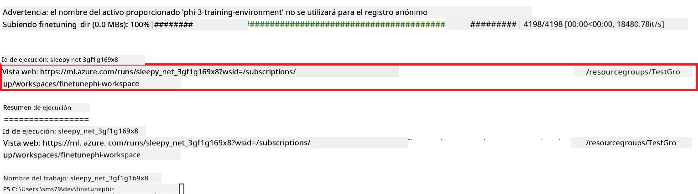

### Desplegar el modelo ajustado

Para integrar el modelo Phi-3 ajustado con Prompt Flow, necesitas desplegar el modelo para que esté accesible para inferencia en tiempo real. Este proceso implica registrar el modelo, crear un endpoint en línea y desplegar el modelo.

#### Configura el nombre del modelo, nombre del endpoint y nombre del despliegue para despliegue

1. Abre el archivo *config.py*.

1. Reemplaza `AZURE_MODEL_NAME = "your_fine_tuned_model_name"` por el nombre deseado para tu modelo.

1. Reemplaza `AZURE_ENDPOINT_NAME = "your_fine_tuned_model_endpoint_name"` por el nombre deseado para tu endpoint.

1. Reemplaza `AZURE_DEPLOYMENT_NAME = "your_fine_tuned_model_deployment_name"` por el nombre deseado para tu despliegue.

#### Añade código al archivo *deploy_model.py*

Ejecutar el archivo *deploy_model.py* automatiza todo el proceso de despliegue. Registra el modelo, crea un endpoint y ejecuta el despliegue basado en las configuraciones especificadas en el archivo *config.py*, que incluye el nombre del modelo, nombre del endpoint y nombre del despliegue.

1. Abre el archivo *deploy_model.py* en Visual Studio Code.

1. Añade el siguiente código en *deploy_model.py*.

    ```python
    import logging
    from azure.identity import AzureCliCredential
    from azure.ai.ml import MLClient
    from azure.ai.ml.entities import Model, ProbeSettings, ManagedOnlineEndpoint, ManagedOnlineDeployment, IdentityConfiguration, ManagedIdentityConfiguration, OnlineRequestSettings
    from azure.ai.ml.constants import AssetTypes

    # Importaciones de configuración
    from config import (
        AZURE_SUBSCRIPTION_ID,
        AZURE_RESOURCE_GROUP_NAME,
        AZURE_ML_WORKSPACE_NAME,
        AZURE_MANAGED_IDENTITY_RESOURCE_ID,
        AZURE_MANAGED_IDENTITY_CLIENT_ID,
        AZURE_MODEL_NAME,
        AZURE_ENDPOINT_NAME,
        AZURE_DEPLOYMENT_NAME
    )

    # Constantes
    JOB_NAME = "your-job-name"
    COMPUTE_INSTANCE_TYPE = "Standard_E4s_v3"

    deployment_env_vars = {
        "SUBSCRIPTION_ID": AZURE_SUBSCRIPTION_ID,
        "RESOURCE_GROUP_NAME": AZURE_RESOURCE_GROUP_NAME,
        "UAI_CLIENT_ID": AZURE_MANAGED_IDENTITY_CLIENT_ID,
    }

    # Configuración de registro
    logging.basicConfig(
        format="%(asctime)s - %(levelname)s - %(name)s - %(message)s",
        datefmt="%Y-%m-%d %H:%M:%S",
        level=logging.DEBUG
    )
    logger = logging.getLogger(__name__)

    def get_ml_client():
        """Initialize and return the ML Client."""
        credential = AzureCliCredential()
        return MLClient(credential, AZURE_SUBSCRIPTION_ID, AZURE_RESOURCE_GROUP_NAME, AZURE_ML_WORKSPACE_NAME)

    def register_model(ml_client, model_name, job_name):
        """Register a new model."""
        model_path = f"azureml://jobs/{job_name}/outputs/artifacts/paths/model_output"
        logger.info(f"Registering model {model_name} from job {job_name} at path {model_path}.")
        run_model = Model(
            path=model_path,
            name=model_name,
            description="Model created from run.",
            type=AssetTypes.MLFLOW_MODEL,
        )
        model = ml_client.models.create_or_update(run_model)
        logger.info(f"Registered model ID: {model.id}")
        return model

    def delete_existing_endpoint(ml_client, endpoint_name):
        """Delete existing endpoint if it exists."""
        try:
            endpoint_result = ml_client.online_endpoints.get(name=endpoint_name)
            logger.info(f"Deleting existing endpoint {endpoint_name}.")
            ml_client.online_endpoints.begin_delete(name=endpoint_name).result()
            logger.info(f"Deleted existing endpoint {endpoint_name}.")
        except Exception as e:
            logger.info(f"No existing endpoint {endpoint_name} found to delete: {e}")

    def create_or_update_endpoint(ml_client, endpoint_name, description=""):
        """Create or update an endpoint."""
        delete_existing_endpoint(ml_client, endpoint_name)
        logger.info(f"Creating new endpoint {endpoint_name}.")
        endpoint = ManagedOnlineEndpoint(
            name=endpoint_name,
            description=description,
            identity=IdentityConfiguration(
                type="user_assigned",
                user_assigned_identities=[ManagedIdentityConfiguration(resource_id=AZURE_MANAGED_IDENTITY_RESOURCE_ID)]
            )
        )
        endpoint_result = ml_client.online_endpoints.begin_create_or_update(endpoint).result()
        logger.info(f"Created new endpoint {endpoint_name}.")
        return endpoint_result

    def create_or_update_deployment(ml_client, endpoint_name, deployment_name, model):
        """Create or update a deployment."""

        logger.info(f"Creating deployment {deployment_name} for endpoint {endpoint_name}.")
        deployment = ManagedOnlineDeployment(
            name=deployment_name,
            endpoint_name=endpoint_name,
            model=model.id,
            instance_type=COMPUTE_INSTANCE_TYPE,
            instance_count=1,
            environment_variables=deployment_env_vars,
            request_settings=OnlineRequestSettings(
                max_concurrent_requests_per_instance=3,
                request_timeout_ms=180000,
                max_queue_wait_ms=120000
            ),
            liveness_probe=ProbeSettings(
                failure_threshold=30,
                success_threshold=1,
                period=100,
                initial_delay=500,
            ),
            readiness_probe=ProbeSettings(
                failure_threshold=30,
                success_threshold=1,
                period=100,
                initial_delay=500,
            ),
        )
        deployment_result = ml_client.online_deployments.begin_create_or_update(deployment).result()
        logger.info(f"Created deployment {deployment.name} for endpoint {endpoint_name}.")
        return deployment_result

    def set_traffic_to_deployment(ml_client, endpoint_name, deployment_name):
        """Set traffic to the specified deployment."""
        try:
            # Obtener los detalles del endpoint actual
            endpoint = ml_client.online_endpoints.get(name=endpoint_name)
            
            # Registrar la asignación de tráfico actual para depuración
            logger.info(f"Current traffic allocation: {endpoint.traffic}")
            
            # Establecer la asignación de tráfico para la implementación
            endpoint.traffic = {deployment_name: 100}
            
            # Actualizar el endpoint con la nueva asignación de tráfico
            endpoint_poller = ml_client.online_endpoints.begin_create_or_update(endpoint)
            updated_endpoint = endpoint_poller.result()
            
            # Registrar la asignación de tráfico actualizada para depuración
            logger.info(f"Updated traffic allocation: {updated_endpoint.traffic}")
            logger.info(f"Set traffic to deployment {deployment_name} at endpoint {endpoint_name}.")
            return updated_endpoint
        except Exception as e:
            # Registrar cualquier error que ocurra durante el proceso
            logger.error(f"Failed to set traffic to deployment: {e}")
            raise


    def main():
        ml_client = get_ml_client()

        registered_model = register_model(ml_client, AZURE_MODEL_NAME, JOB_NAME)
        logger.info(f"Registered model ID: {registered_model.id}")

        endpoint = create_or_update_endpoint(ml_client, AZURE_ENDPOINT_NAME, "Endpoint for finetuned Phi-3 model")
        logger.info(f"Endpoint {AZURE_ENDPOINT_NAME} is ready.")

        try:
            deployment = create_or_update_deployment(ml_client, AZURE_ENDPOINT_NAME, AZURE_DEPLOYMENT_NAME, registered_model)
            logger.info(f"Deployment {AZURE_DEPLOYMENT_NAME} is created for endpoint {AZURE_ENDPOINT_NAME}.")

            set_traffic_to_deployment(ml_client, AZURE_ENDPOINT_NAME, AZURE_DEPLOYMENT_NAME)
            logger.info(f"Traffic is set to deployment {AZURE_DEPLOYMENT_NAME} at endpoint {AZURE_ENDPOINT_NAME}.")
        except Exception as e:
            logger.error(f"Failed to create or update deployment: {e}")

    if __name__ == "__main__":
        main()

    ```

1. Realiza las siguientes tareas para obtener el `JOB_NAME`:

    - Navega al recurso de Azure Machine Learning que creaste.
    - Selecciona **Studio web URL** para abrir el espacio de trabajo de Azure Machine Learning.
    - Selecciona **Trabajos** (Jobs) en la pestaña izquierda.
    - Selecciona el experimento de ajuste fino. Por ejemplo, *finetunephi*.
    - Selecciona el trabajo que creaste.
- Copia y pega el Nombre de tu trabajo en `JOB_NAME = "your-job-name"` en el archivo *deploy_model.py*.

1. Reemplaza `COMPUTE_INSTANCE_TYPE` con tus detalles específicos.

1. Escribe el siguiente comando para ejecutar el script *deploy_model.py* y comenzar el proceso de implementación en Azure Machine Learning.

    ```python
    python deploy_model.py
    ```

> [!WARNING]
> Para evitar cargos adicionales en tu cuenta, asegúrate de eliminar el endpoint creado en el espacio de trabajo de Azure Machine Learning.
>

#### Verificar el estado de la implementación en Azure Machine Learning Workspace

1. Visita [Azure ML Studio](https://ml.azure.com/home?wt.mc_id=studentamb_279723).

1. Navega al espacio de trabajo de Azure Machine Learning que creaste.

1. Selecciona **Studio web URL** para abrir el espacio de trabajo de Azure Machine Learning.

1. Selecciona **Endpoints** en la pestaña del lado izquierdo.

    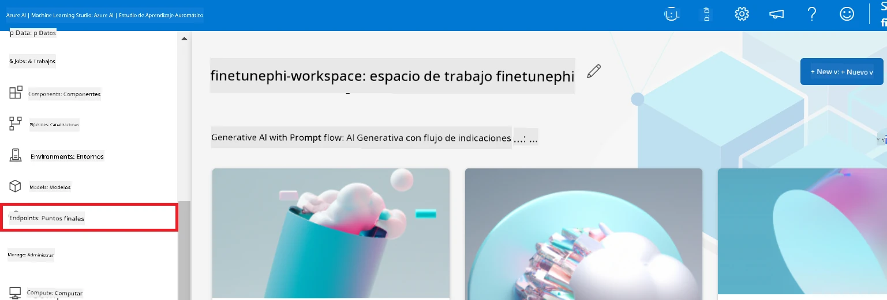

2. Selecciona el endpoint que creaste.

    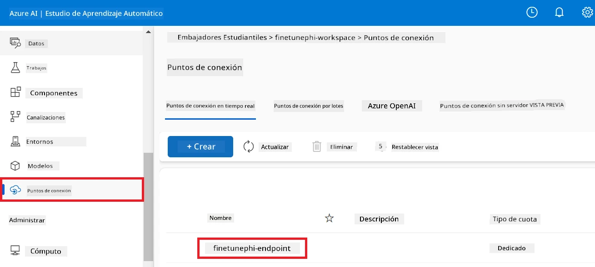

3. En esta página, puedes administrar los endpoints creados durante el proceso de implementación.

## Escenario 3: Integrar con Prompt flow y chatear con tu modelo personalizado

### Integrar el modelo personalizado Phi-3 con Prompt flow

Después de implementar con éxito tu modelo afinado, ahora puedes integrarlo con Prompt flow para usar tu modelo en aplicaciones en tiempo real, permitiendo una variedad de tareas interactivas con tu modelo personalizado Phi-3.

#### Configurar la clave api y la URI del endpoint del modelo Phi-3 afinado

1. Navega al espacio de trabajo de Azure Machine Learning que creaste.
1. Selecciona **Endpoints** en la pestaña del lado izquierdo.
1. Selecciona el endpoint que creaste.
1. Selecciona **Consume** en el menú de navegación.
1. Copia y pega tu **endpoint REST** en el archivo *config.py*, reemplazando `AZURE_ML_ENDPOINT = "your_fine_tuned_model_endpoint_uri"` con tu **endpoint REST**.
1. Copia y pega tu **Clave primaria** en el archivo *config.py*, reemplazando `AZURE_ML_API_KEY = "your_fine_tuned_model_api_key"` con tu **Clave primaria**.

    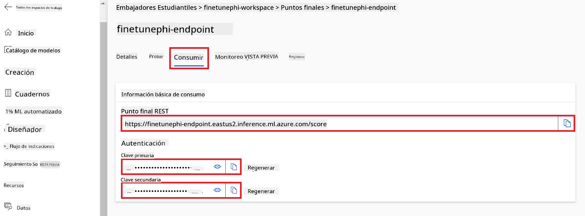

#### Agregar código al archivo *flow.dag.yml*

1. Abre el archivo *flow.dag.yml* en Visual Studio Code.

1. Añade el siguiente código en *flow.dag.yml*.

    ```yml
    inputs:
      input_data:
        type: string
        default: "Who founded Microsoft?"

    outputs:
      answer:
        type: string
        reference: ${integrate_with_promptflow.output}

    nodes:
    - name: integrate_with_promptflow
      type: python
      source:
        type: code
        path: integrate_with_promptflow.py
      inputs:
        input_data: ${inputs.input_data}
    ```

#### Agregar código al archivo *integrate_with_promptflow.py*

1. Abre el archivo *integrate_with_promptflow.py* en Visual Studio Code.

1. Añade el siguiente código en *integrate_with_promptflow.py*.

    ```python
    import logging
    import requests
    from promptflow.core import tool
    import asyncio
    import platform
    from config import (
        AZURE_ML_ENDPOINT,
        AZURE_ML_API_KEY
    )

    # Configuración de registro
    logging.basicConfig(
        format="%(asctime)s - %(levelname)s - %(name)s - %(message)s",
        datefmt="%Y-%m-%d %H:%M:%S",
        level=logging.DEBUG
    )
    logger = logging.getLogger(__name__)

    def query_azml_endpoint(input_data: list, endpoint_url: str, api_key: str) -> str:
        """
        Send a request to the Azure ML endpoint with the given input data.
        """
        headers = {
            "Content-Type": "application/json",
            "Authorization": f"Bearer {api_key}"
        }
        data = {
            "input_data": [input_data],
            "params": {
                "temperature": 0.7,
                "max_new_tokens": 128,
                "do_sample": True,
                "return_full_text": True
            }
        }
        try:
            response = requests.post(endpoint_url, json=data, headers=headers)
            response.raise_for_status()
            result = response.json()[0]
            logger.info("Successfully received response from Azure ML Endpoint.")
            return result
        except requests.exceptions.RequestException as e:
            logger.error(f"Error querying Azure ML Endpoint: {e}")
            raise

    def setup_asyncio_policy():
        """
        Setup asyncio event loop policy for Windows.
        """
        if platform.system() == 'Windows':
            asyncio.set_event_loop_policy(asyncio.WindowsSelectorEventLoopPolicy())
            logger.info("Set Windows asyncio event loop policy.")

    @tool
    def my_python_tool(input_data: str) -> str:
        """
        Tool function to process input data and query the Azure ML endpoint.
        """
        setup_asyncio_policy()
        return query_azml_endpoint(input_data, AZURE_ML_ENDPOINT, AZURE_ML_API_KEY)

    ```

### Chatear con tu modelo personalizado

1. Escribe el siguiente comando para ejecutar el script *deploy_model.py* y comenzar el proceso de implementación en Azure Machine Learning.

    ```python
    pf flow serve --source ./ --port 8080 --host localhost
    ```

1. Aquí tienes un ejemplo de los resultados: ahora puedes chatear con tu modelo personalizado Phi-3. Se recomienda hacer preguntas basadas en los datos utilizados para la afinación.

    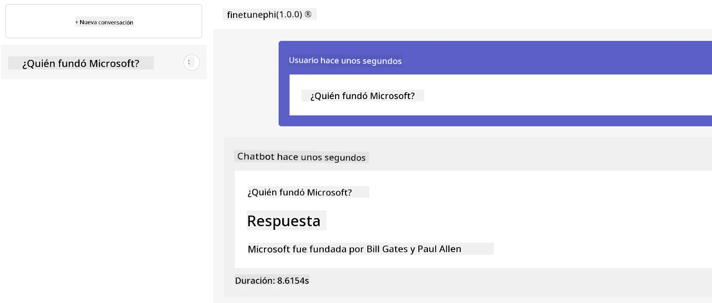

---

<!-- CO-OP TRANSLATOR DISCLAIMER START -->
**Aviso Legal**:
Este documento ha sido traducido utilizando el servicio de traducción por IA [Co-op Translator](https://github.com/Azure/co-op-translator). Aunque nos esforzamos por la precisión, tenga en cuenta que las traducciones automáticas pueden contener errores o inexactitudes. El documento original en su idioma nativo debe considerarse la fuente autorizada. Para información crítica, se recomienda una traducción profesional humana. No nos hacemos responsables de cualquier malentendido o mala interpretación que pueda derivarse del uso de esta traducción.
<!-- CO-OP TRANSLATOR DISCLAIMER END -->