# Ajustar y integrar modelos personalizados Phi-3 con Prompt flow en Azure AI Foundry

Esta muestra integral (E2E) está basada en la guía "[Fine-Tune and Integrate Custom Phi-3 Models with Prompt Flow in Azure AI Foundry](https://techcommunity.microsoft.com/t5/educator-developer-blog/fine-tune-and-integrate-custom-phi-3-models-with-prompt-flow-in/ba-p/4191726?WT.mc_id=aiml-137032-kinfeylo)" de la Comunidad Técnica de Microsoft. Introduce los procesos de ajuste fino, despliegue e integración de modelos personalizados Phi-3 con Prompt flow en Azure AI Foundry.  
A diferencia de la muestra E2E, "[Fine-Tune and Integrate Custom Phi-3 Models with Prompt Flow](./E2E_Phi-3-FineTuning_PromptFlow_Integration.md)", que involucraba ejecutar código localmente, este tutorial se centra completamente en ajustar y integrar tu modelo dentro del Azure AI / ML Studio.

## Visión general

En esta muestra E2E, aprenderás a ajustar el modelo Phi-3 y a integrarlo con Prompt flow en Azure AI Foundry. Aprovechando Azure AI / ML Studio, establecerás un flujo de trabajo para desplegar y utilizar modelos de IA personalizados. Esta muestra E2E está dividida en tres escenarios:

**Escenario 1: Configurar recursos de Azure y prepararse para el ajuste fino**

**Escenario 2: Ajustar el modelo Phi-3 y desplegarlo en Azure Machine Learning Studio**

**Escenario 3: Integrar con Prompt flow y chatear con tu modelo personalizado en Azure AI Foundry**

Aquí tienes una vista general de esta muestra E2E.

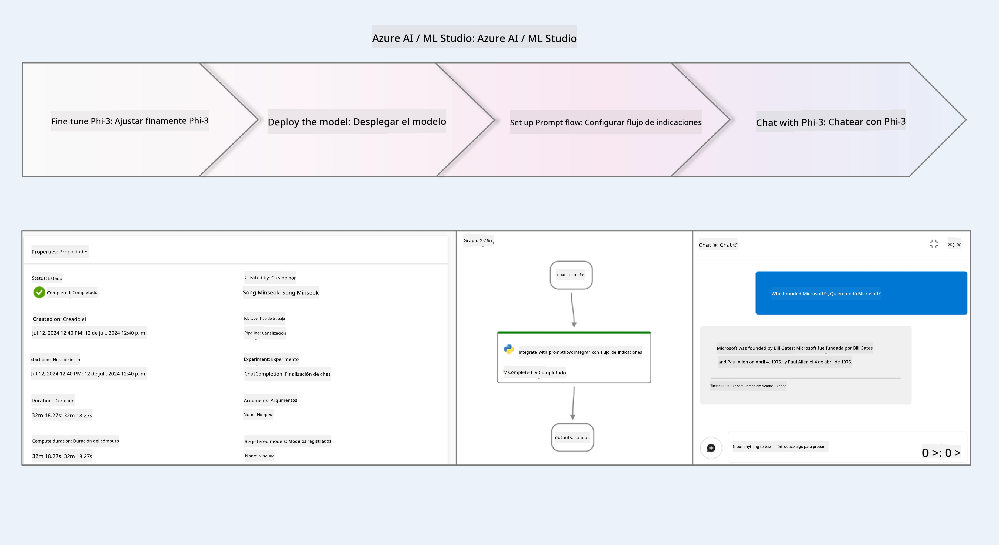

### Tabla de contenido

1. **[Escenario 1: Configurar recursos de Azure y prepararse para el ajuste fino](../../../../../../md/02.Application/01.TextAndChat/Phi3)**
    - [Crear un espacio de trabajo de Azure Machine Learning](../../../../../../md/02.Application/01.TextAndChat/Phi3)
    - [Solicitar cuotas de GPU en la suscripción de Azure](../../../../../../md/02.Application/01.TextAndChat/Phi3)
    - [Agregar asignación de roles](../../../../../../md/02.Application/01.TextAndChat/Phi3)
    - [Configurar proyecto](../../../../../../md/02.Application/01.TextAndChat/Phi3)
    - [Preparar conjunto de datos para ajuste fino](../../../../../../md/02.Application/01.TextAndChat/Phi3)

1. **[Escenario 2: Ajustar modelo Phi-3 y desplegar en Azure Machine Learning Studio](../../../../../../md/02.Application/01.TextAndChat/Phi3)**
    - [Ajustar el modelo Phi-3](../../../../../../md/02.Application/01.TextAndChat/Phi3)
    - [Desplegar el modelo Phi-3 ajustado](../../../../../../md/02.Application/01.TextAndChat/Phi3)

1. **[Escenario 3: Integrar con Prompt flow y chatear con tu modelo personalizado en Azure AI Foundry](../../../../../../md/02.Application/01.TextAndChat/Phi3)**
    - [Integrar el modelo Phi-3 personalizado con Prompt flow](../../../../../../md/02.Application/01.TextAndChat/Phi3)
    - [Chatear con tu modelo Phi-3 personalizado](../../../../../../md/02.Application/01.TextAndChat/Phi3)

## Escenario 1: Configurar recursos de Azure y prepararse para el ajuste fino

### Crear un espacio de trabajo de Azure Machine Learning

1. Escribe *azure machine learning* en la **barra de búsqueda** en la parte superior de la página del portal y selecciona **Azure Machine Learning** de las opciones que aparezcan.

    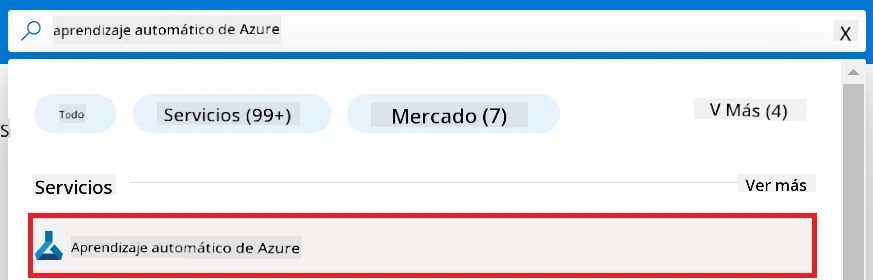

2. Selecciona **+ Crear** en el menú de navegación.

3. Selecciona **Nuevo espacio de trabajo** en el menú de navegación.

    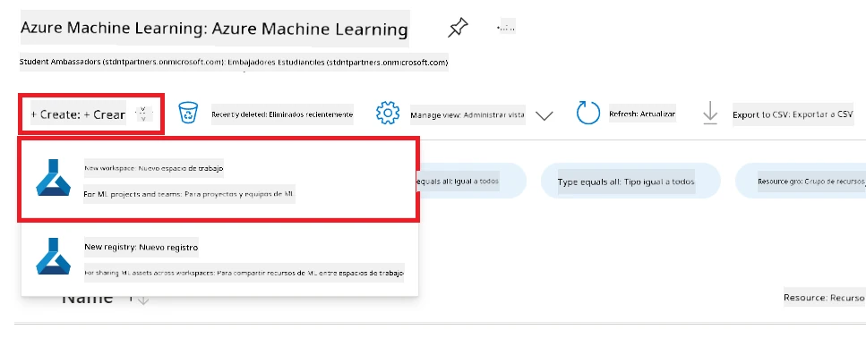

4. Realiza las siguientes tareas:

    - Selecciona tu **Suscripción** de Azure.
    - Selecciona el **Grupo de recursos** a utilizar (crea uno nuevo si es necesario).
    - Introduce el **Nombre del espacio de trabajo**. Debe ser un valor único.
    - Selecciona la **Región** que deseas usar.
    - Selecciona la **Cuenta de almacenamiento** a utilizar (crea una nueva si es necesario).
    - Selecciona el **Bóveda de claves** a utilizar (crea una nueva si es necesario).
    - Selecciona la **Informaciones de aplicación** a utilizar (crea una nueva si es necesario).
    - Selecciona el **Registro de contenedores** a usar (crea uno nuevo si es necesario).

    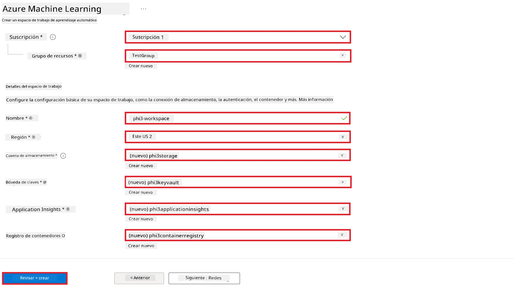

5. Selecciona **Revisar + Crear**.

6. Selecciona **Crear**.

### Solicitar cuotas de GPU en la suscripción de Azure

En este tutorial, aprenderás cómo ajustar y desplegar un modelo Phi-3 utilizando GPUs. Para el ajuste fino, utilizarás la GPU *Standard_NC24ads_A100_v4*, que requiere solicitar una cuota. Para el despliegue, usarás la GPU *Standard_NC6s_v3*, la cual también requiere una solicitud de cuota.

> [!NOTE]
>
> Solo las suscripciones de tipo Pay-As-You-Go (tipo estándar) son elegibles para asignación de GPU; las suscripciones de beneficio no están soportadas actualmente.
>

1. Visita [Azure ML Studio](https://ml.azure.com/home?wt.mc_id=studentamb_279723).

1. Realiza las siguientes tareas para solicitar la cuota de la familia *Standard NCADSA100v4*:

    - Selecciona **Cuota** desde la pestaña lateral izquierda.
    - Selecciona la **familia de máquinas virtuales** a usar. Por ejemplo, selecciona **Standard NCADSA100v4 Family Cluster Dedicated vCPUs**, que incluye la GPU *Standard_NC24ads_A100_v4*.
    - Selecciona **Solicitar cuota** en el menú de navegación.

        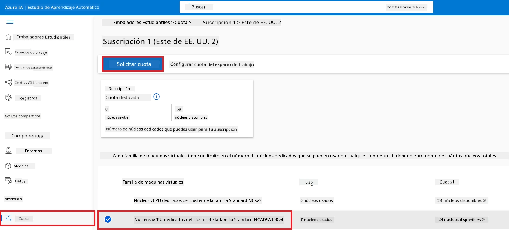

    - En la página Solicitar cuota, ingresa el **Nuevo límite de núcleos** que deseas usar. Por ejemplo, 24.
    - En la página Solicitar cuota, selecciona **Enviar** para solicitar la cuota de GPU.

1. Realiza las siguientes tareas para solicitar la cuota de la familia *Standard NCSv3*:

    - Selecciona **Cuota** desde la pestaña lateral izquierda.
    - Selecciona la **familia de máquinas virtuales** a usar. Por ejemplo, selecciona **Standard NCSv3 Family Cluster Dedicated vCPUs**, que incluye la GPU *Standard_NC6s_v3*.
    - Selecciona **Solicitar cuota** en el menú de navegación.
    - En la página Solicitar cuota, ingresa el **Nuevo límite de núcleos** que deseas usar. Por ejemplo, 24.
    - En la página Solicitar cuota, selecciona **Enviar** para solicitar la cuota de GPU.

### Agregar asignación de roles

Para ajustar y desplegar tus modelos, primero debes crear una Identidad Administrada Asignada por Usuario (UAI) y asignarle los permisos correspondientes. Esta UAI se usará para autenticación durante el despliegue.

#### Crear Identidad Administrada Asignada por Usuario (UAI)

1. Escribe *managed identities* en la **barra de búsqueda** en la parte superior de la página del portal y selecciona **Managed Identities** de las opciones que aparezcan.

    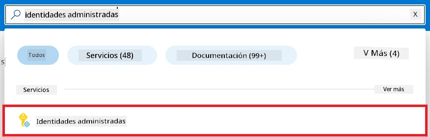

1. Selecciona **+ Crear**.

    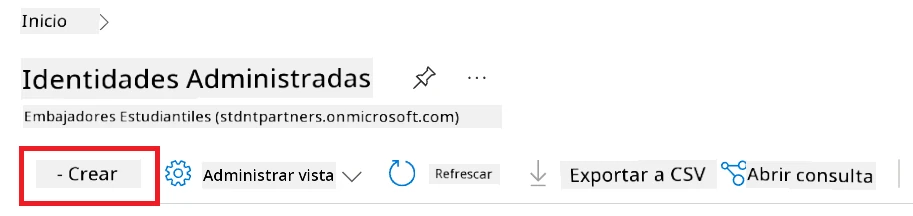

1. Realiza las siguientes tareas:

    - Selecciona tu **Suscripción** de Azure.
    - Selecciona el **Grupo de recursos** a usar (crea uno nuevo si es necesario).
    - Selecciona la **Región** que quieras usar.
    - Ingresa el **Nombre**. Debe ser un valor único.

    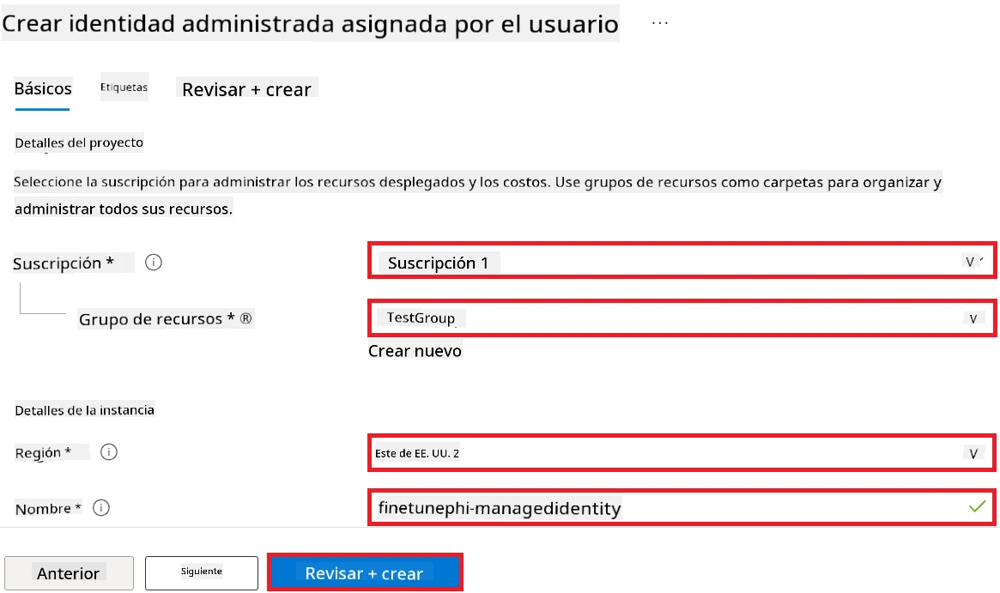

1. Selecciona **Revisar + crear**.

1. Selecciona **+ Crear**.

#### Agregar asignación de rol de Colaborador a la Identidad Administrada

1. Navega al recurso Identidad Administrada que creaste.

1. Selecciona **Asignaciones de roles de Azure** en la pestaña lateral izquierda.

1. Selecciona **+ Agregar asignación de rol** en el menú de navegación.

1. En la página Agregar asignación de rol, realiza las siguientes tareas:
    - Selecciona el **Alcance** a **Grupo de recursos**.
    - Selecciona tu **Suscripción** de Azure.
    - Selecciona el **Grupo de recursos** a usar.
    - Selecciona el **Rol** a **Colaborador**.

    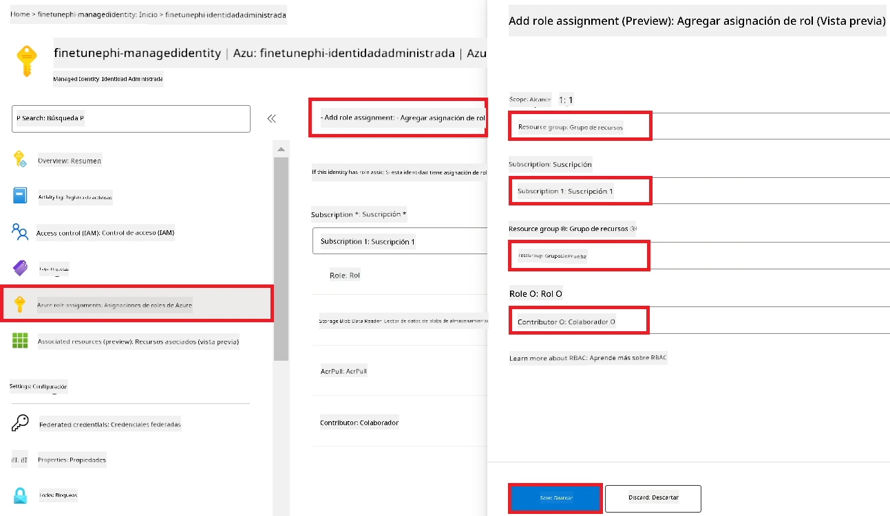

2. Selecciona **Guardar**.

#### Agregar asignación de rol de Lector de datos de blobs de almacenamiento a la Identidad Administrada

1. Escribe *storage accounts* en la **barra de búsqueda** en la parte superior de la página del portal y selecciona **Storage accounts** de las opciones que aparezcan.

    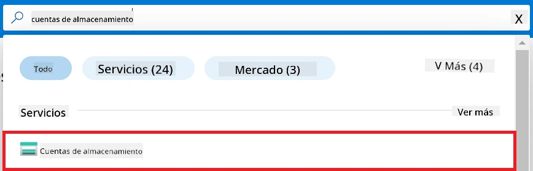

1. Selecciona la cuenta de almacenamiento asociada con el espacio de trabajo Azure Machine Learning que creaste. Por ejemplo, *finetunephistorage*.

1. Realiza las siguientes tareas para navegar a la página Agregar asignación de rol:

    - Navega a la cuenta de almacenamiento de Azure que creaste.
    - Selecciona **Control de acceso (IAM)** desde la pestaña lateral izquierda.
    - Selecciona **+ Agregar** en el menú de navegación.
    - Selecciona **Agregar asignación de rol** en el menú de navegación.

    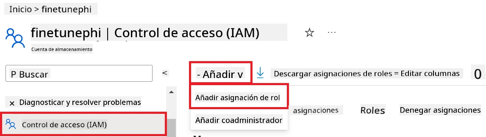

1. En la página Agregar asignación de rol, realiza las siguientes tareas:

    - En la página Rol, escribe *Storage Blob Data Reader* en la **barra de búsqueda** y selecciona **Storage Blob Data Reader** de las opciones que aparezcan.
    - En la página Rol, selecciona **Siguiente**.
    - En la página Miembros, selecciona **Asignar acceso a** **Identidad administrada**.
    - En la página Miembros, selecciona **+ Seleccionar miembros**.
    - En la página Seleccionar identidades administradas, selecciona tu **Suscripción** de Azure.
    - En la página Seleccionar identidades administradas, selecciona la **Identidad administrada** a **Identidad administrada**.
    - En la página Seleccionar identidades administradas, selecciona la Identidad administrada que creaste. Por ejemplo, *finetunephi-managedidentity*.
    - En la página Seleccionar identidades administradas, selecciona **Seleccionar**.

    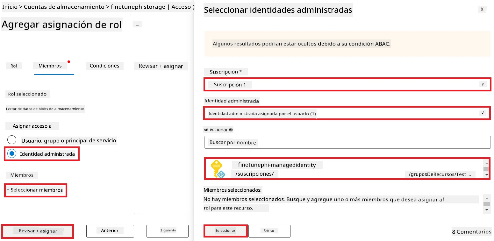

1. Selecciona **Revisar + asignar**.

#### Agregar asignación de rol AcrPull a la Identidad Administrada

1. Escribe *container registries* en la **barra de búsqueda** en la parte superior de la página del portal y selecciona **Container registries** de las opciones que aparezcan.

    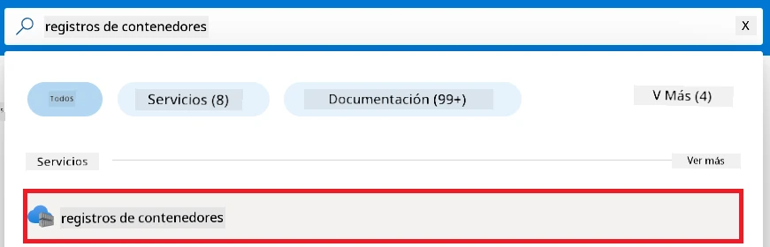

1. Selecciona el registro de contenedores asociado con el espacio de trabajo Azure Machine Learning. Por ejemplo, *finetunephicontainerregistry*.

1. Realiza las siguientes tareas para navegar a la página Agregar asignación de rol:

    - Selecciona **Control de acceso (IAM)** desde la pestaña lateral izquierda.
    - Selecciona **+ Agregar** en el menú de navegación.
    - Selecciona **Agregar asignación de rol** en el menú de navegación.

1. En la página Agregar asignación de rol, realiza las siguientes tareas:

    - En la página Rol, escribe *AcrPull* en la **barra de búsqueda** y selecciona **AcrPull** de las opciones que aparezcan.
    - En la página Rol, selecciona **Siguiente**.
    - En la página Miembros, selecciona **Asignar acceso a** **Identidad administrada**.
    - En la página Miembros, selecciona **+ Seleccionar miembros**.
    - En la página Seleccionar identidades administradas, selecciona tu **Suscripción** de Azure.
    - En la página Seleccionar identidades administradas, selecciona la **Identidad administrada** a **Identidad administrada**.
    - En la página Seleccionar identidades administradas, selecciona la Identidad administrada que creaste. Por ejemplo, *finetunephi-managedidentity*.
    - En la página Seleccionar identidades administradas, selecciona **Seleccionar**.
    - Selecciona **Revisar + asignar**.

### Configurar proyecto

Para descargar los conjuntos de datos necesarios para el ajuste fino, configurarás un entorno local.

En este ejercicio, vas a:

- Crear una carpeta para trabajar dentro de ella.
- Crear un entorno virtual.
- Instalar los paquetes requeridos.
- Crear un archivo *download_dataset.py* para descargar el conjunto de datos.

#### Crear una carpeta para trabajar dentro de ella

1. Abre una ventana de terminal y escribe el siguiente comando para crear una carpeta llamada *finetune-phi* en la ruta por defecto.

    ```console
    mkdir finetune-phi
    ```

2. Escriba el siguiente comando dentro de su terminal para navegar a la carpeta *finetune-phi* que creó.

    ```console
    cd finetune-phi
    ```

#### Crear un entorno virtual

1. Escriba el siguiente comando dentro de su terminal para crear un entorno virtual llamado *.venv*.

    ```console
    python -m venv .venv
    ```

2. Escriba el siguiente comando dentro de su terminal para activar el entorno virtual.

    ```console
    .venv\Scripts\activate.bat
    ```

> [!NOTE]
> Si funcionó, debería ver *(.venv)* antes del indicador de comandos.

#### Instalar los paquetes requeridos

1. Escriba los siguientes comandos dentro de su terminal para instalar los paquetes requeridos.

    ```console
    pip install datasets==2.19.1
    ```

#### Crear `donload_dataset.py`

> [!NOTE]
> Estructura completa de la carpeta:
>
> ```text
> └── YourUserName
> .    └── finetune-phi
> .        └── download_dataset.py
> ```

1. Abra **Visual Studio Code**.

1. Seleccione **Archivo** en la barra de menú.

1. Seleccione **Abrir carpeta**.

1. Seleccione la carpeta *finetune-phi* que creó, la cual se encuentra en *C:\Users\tuNombreDeUsuario\finetune-phi*.

    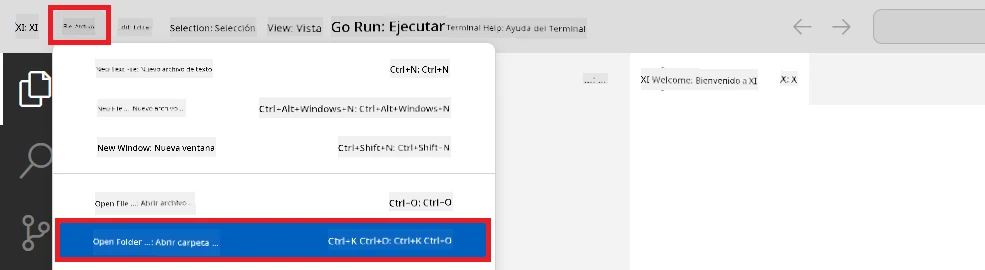

1. En el panel izquierdo de Visual Studio Code, haga clic derecho y seleccione **Nuevo archivo** para crear un archivo nuevo llamado *download_dataset.py*.

    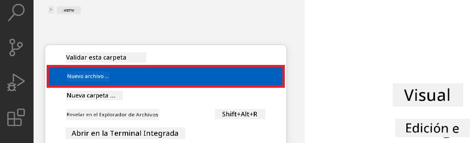

### Preparar el conjunto de datos para fine-tuning

En este ejercicio, ejecutará el archivo *download_dataset.py* para descargar los conjuntos de datos *ultrachat_200k* a su entorno local. Luego usará estos conjuntos de datos para afinar el modelo Phi-3 en Azure Machine Learning.

En este ejercicio, usted:

- Agregará código al archivo *download_dataset.py* para descargar los conjuntos de datos.
- Ejecutará el archivo *download_dataset.py* para descargar los conjuntos de datos a su entorno local.

#### Descargue su conjunto de datos usando *download_dataset.py*

1. Abra el archivo *download_dataset.py* en Visual Studio Code.

1. Agregue el siguiente código dentro del archivo *download_dataset.py*.

    ```python
    import json
    import os
    from datasets import load_dataset

    def load_and_split_dataset(dataset_name, config_name, split_ratio):
        """
        Load and split a dataset.
        """
        # Cargar el conjunto de datos con el nombre, configuración y proporción de división especificados
        dataset = load_dataset(dataset_name, config_name, split=split_ratio)
        print(f"Original dataset size: {len(dataset)}")
        
        # Dividir el conjunto de datos en conjuntos de entrenamiento y prueba (80% entrenamiento, 20% prueba)
        split_dataset = dataset.train_test_split(test_size=0.2)
        print(f"Train dataset size: {len(split_dataset['train'])}")
        print(f"Test dataset size: {len(split_dataset['test'])}")
        
        return split_dataset

    def save_dataset_to_jsonl(dataset, filepath):
        """
        Save a dataset to a JSONL file.
        """
        # Crear el directorio si no existe
        os.makedirs(os.path.dirname(filepath), exist_ok=True)
        
        # Abrir el archivo en modo de escritura
        with open(filepath, 'w', encoding='utf-8') as f:
            # Iterar sobre cada registro en el conjunto de datos
            for record in dataset:
                # Volcar el registro como un objeto JSON y escribirlo en el archivo
                json.dump(record, f)
                # Escribir un carácter de nueva línea para separar registros
                f.write('\n')
        
        print(f"Dataset saved to {filepath}")

    def main():
        """
        Main function to load, split, and save the dataset.
        """
        # Cargar y dividir el conjunto de datos ULTRACHAT_200k con una configuración específica y proporción de división
        dataset = load_and_split_dataset("HuggingFaceH4/ultrachat_200k", 'default', 'train_sft[:1%]')
        
        # Extraer los conjuntos de datos de entrenamiento y prueba de la división
        train_dataset = dataset['train']
        test_dataset = dataset['test']

        # Guardar el conjunto de datos de entrenamiento en un archivo JSONL
        save_dataset_to_jsonl(train_dataset, "data/train_data.jsonl")
        
        # Guardar el conjunto de datos de prueba en un archivo JSONL separado
        save_dataset_to_jsonl(test_dataset, "data/test_data.jsonl")

    if __name__ == "__main__":
        main()

    ```

1. Escriba el siguiente comando dentro de su terminal para ejecutar el script y descargar el conjunto de datos en su entorno local.

    ```console
    python download_dataset.py
    ```

1. Verifique que los conjuntos de datos se guardaron correctamente en su directorio local *finetune-phi/data*.

> [!NOTE]
>
> #### Nota sobre el tamaño del conjunto de datos y el tiempo de fine-tuning
>
> En este tutorial, solo se usa el 1% del conjunto de datos (`split='train[:1%]'`). Esto reduce significativamente la cantidad de datos, acelerando tanto la carga como el proceso de fine-tuning. Puede ajustar el porcentaje para encontrar el equilibrio adecuado entre el tiempo de entrenamiento y el desempeño del modelo. Usar un subconjunto más pequeño del conjunto de datos reduce el tiempo requerido para el fine-tuning, haciendo el proceso más manejable para un tutorial.

## Escenario 2: Afinar el modelo Phi-3 y desplegarlo en Azure Machine Learning Studio

### Afinar el modelo Phi-3

En este ejercicio, afinará el modelo Phi-3 en Azure Machine Learning Studio.

En este ejercicio, usted:

- Creará un clúster de cómputo para fine-tuning.
- Afinará el modelo Phi-3 en Azure Machine Learning Studio.

#### Crear clúster de cómputo para fine-tuning

1. Visite [Azure ML Studio](https://ml.azure.com/home?wt.mc_id=studentamb_279723).

1. Seleccione **Compute** en la pestaña del lado izquierdo.

1. Seleccione **Compute clusters** en el menú de navegación.

1. Seleccione **+ Nuevo**.

    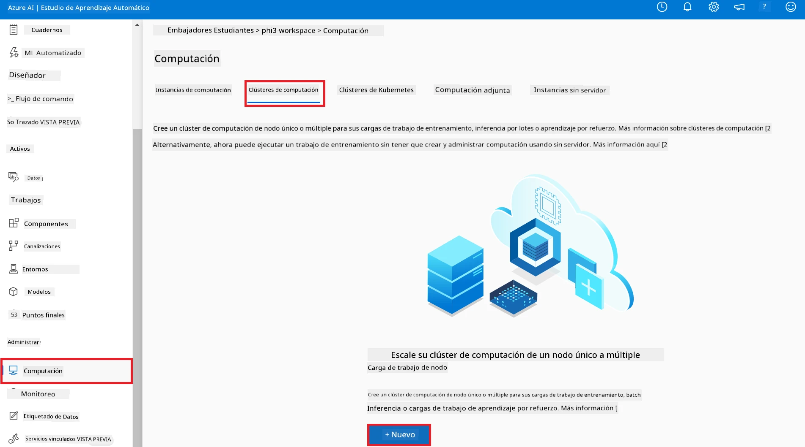

1. Realice las siguientes tareas:

    - Seleccione la **Región** que desea usar.
    - Seleccione el **Nivel de máquina virtual** a **Dedicated**.
    - Seleccione el **Tipo de máquina virtual** a **GPU**.
    - Seleccione el filtro de **Tamaño de máquina virtual** a **Seleccionar de todas las opciones**.
    - Seleccione el **Tamaño de máquina virtual** a **Standard_NC24ads_A100_v4**.

    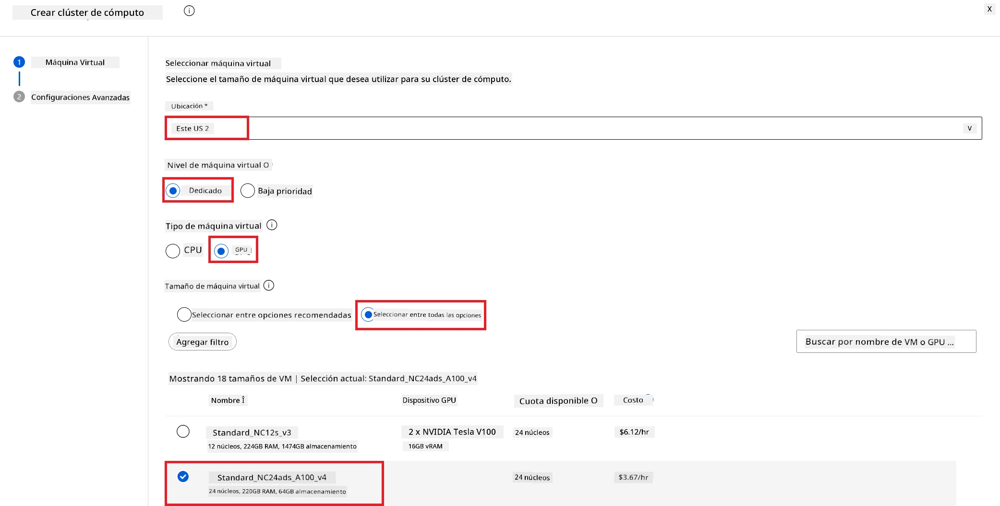

1. Seleccione **Siguiente**.

1. Realice las siguientes tareas:

    - Ingrese el **Nombre del clúster**. Debe ser un valor único.
    - Seleccione el **Número mínimo de nodos** a **0**.
    - Seleccione el **Número máximo de nodos** a **1**.
    - Seleccione los **Segundos de inactividad antes de reducir escala** a **120**.

    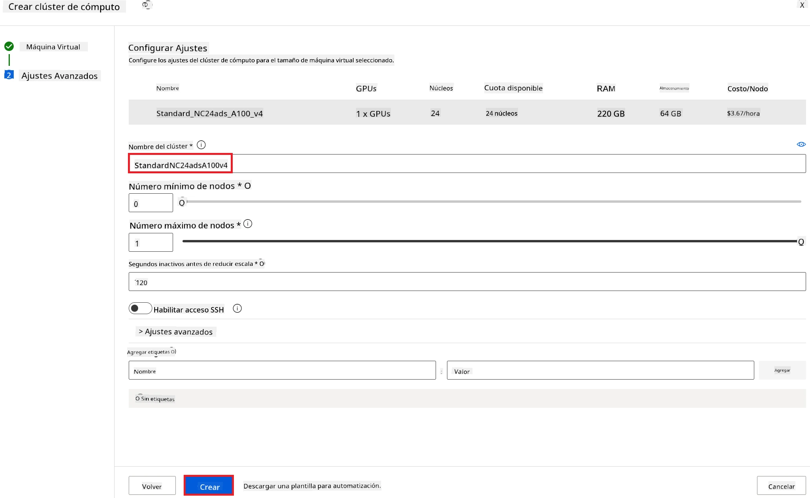

1. Seleccione **Crear**.

#### Afinar el modelo Phi-3

1. Visite [Azure ML Studio](https://ml.azure.com/home?wt.mc_id=studentamb_279723).

1. Seleccione el workspace de Azure Machine Learning que creó.

    

1. Realice las siguientes tareas:

    - Seleccione **Catálogo de modelos** en la pestaña del lado izquierdo.
    - Escriba *phi-3-mini-4k* en la **barra de búsqueda** y seleccione **Phi-3-mini-4k-instruct** de las opciones que aparecen.

    

1. Seleccione **Afinar** en el menú de navegación.

    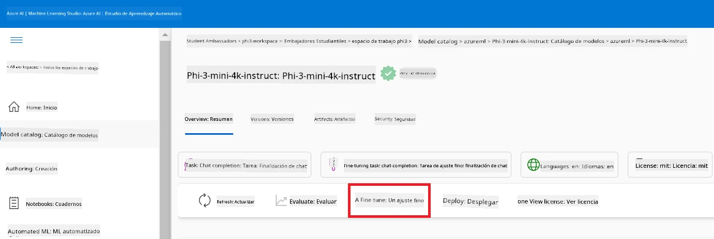

1. Realice las siguientes tareas:

    - Seleccione **Tipo de tarea** como **Chat completion**.
    - Seleccione **+ Seleccionar datos** para cargar los **Datos de entrenamiento**.
    - Seleccione el tipo de carga para Datos de validación a **Proporcionar datos de validación diferentes**.
    - Seleccione **+ Seleccionar datos** para cargar los **Datos de validación**.

    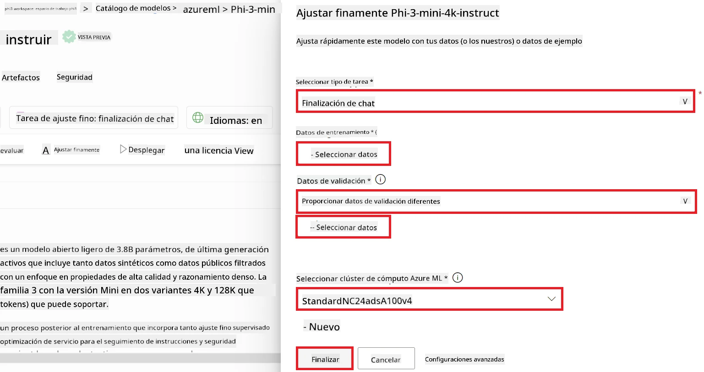

> [!TIP]
>
> Puede seleccionar **Configuraciones avanzadas** para personalizar configuraciones como **learning_rate** y **lr_scheduler_type** para optimizar el proceso de fine-tuning según sus necesidades específicas.

1. Seleccione **Finalizar**.

1. En este ejercicio, afinó exitosamente el modelo Phi-3 usando Azure Machine Learning. Tenga en cuenta que el proceso de fine-tuning puede tomar una cantidad considerable de tiempo. Después de ejecutar el trabajo de fine-tuning, debe esperar a que termine. Puede monitorear el estado del trabajo de fine-tuning navegando a la pestaña Jobs en el lado izquierdo de su workspace de Azure Machine Learning. En la siguiente serie, desplegará el modelo afinado y lo integrará con Prompt flow.

    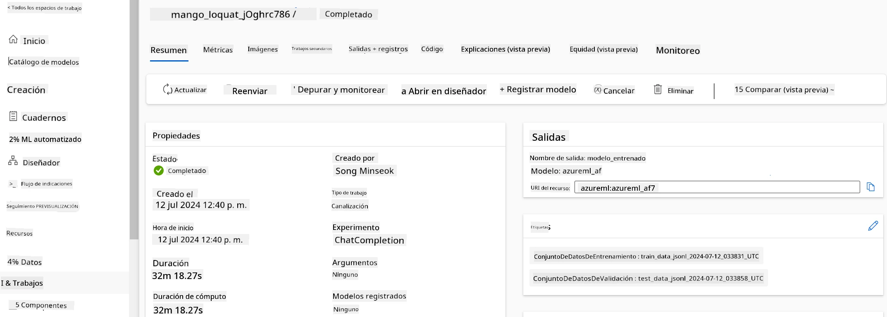

### Desplegar el modelo Phi-3 afinado

Para integrar el modelo Phi-3 afinado con Prompt flow, necesita desplegar el modelo para que esté accesible para inferencia en tiempo real. Este proceso involucra registrar el modelo, crear un endpoint en línea y desplegar el modelo.

En este ejercicio, usted:

- Registrará el modelo afinado en el workspace de Azure Machine Learning.
- Creará un endpoint en línea.
- Desplegará el modelo Phi-3 afinado registrado.

#### Registrar el modelo afinado

1. Visite [Azure ML Studio](https://ml.azure.com/home?wt.mc_id=studentamb_279723).

1. Seleccione el workspace de Azure Machine Learning que creó.

    

1. Seleccione **Modelos** en la pestaña del lado izquierdo.
1. Seleccione **+ Registrar**.
1. Seleccione **Desde la salida de un trabajo**.

    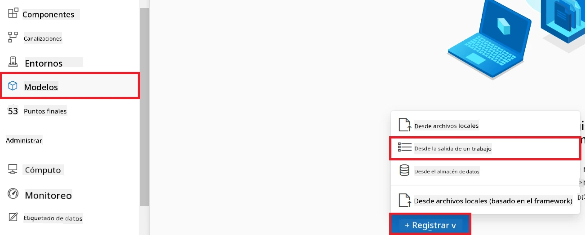

1. Seleccione el trabajo que creó.

    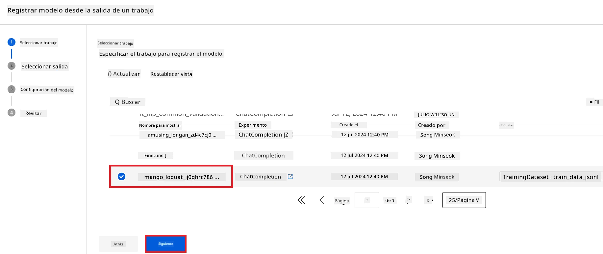

1. Seleccione **Siguiente**.

1. Seleccione **Tipo de modelo** como **MLflow**.

1. Asegúrese de que **Salida del trabajo** esté seleccionado; debería seleccionarse automáticamente.

    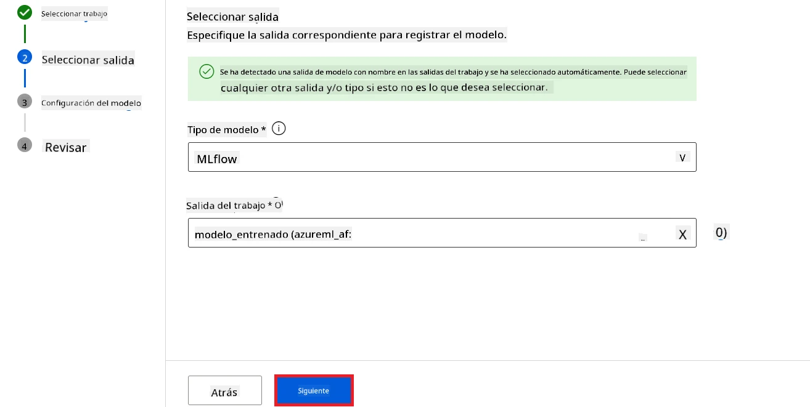

2. Seleccione **Siguiente**.

3. Seleccione **Registrar**.

    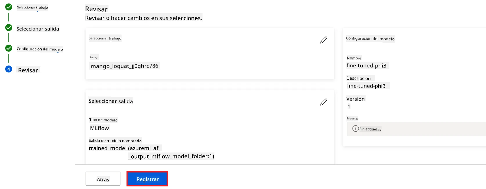

4. Puede ver su modelo registrado navegando al menú **Modelos** en la pestaña del lado izquierdo.

    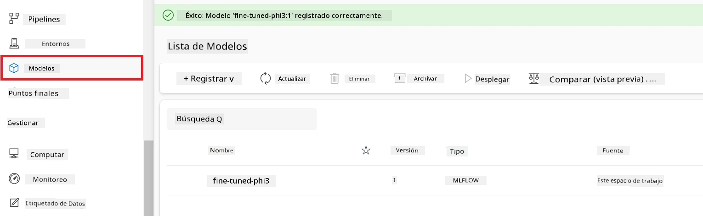

#### Desplegar el modelo afinado

1. Navegue al workspace de Azure Machine Learning que creó.

1. Seleccione **Endpoints** en la pestaña del lado izquierdo.

1. Seleccione **Endpoints en tiempo real** en el menú de navegación.

    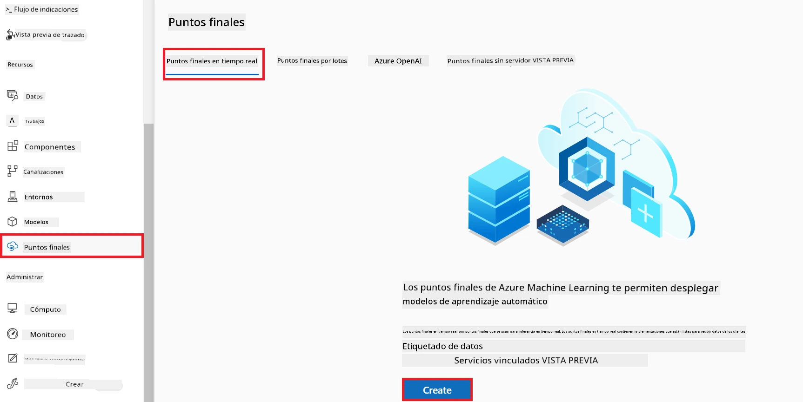

1. Seleccione **Crear**.

1. Seleccione el modelo registrado que creó.

    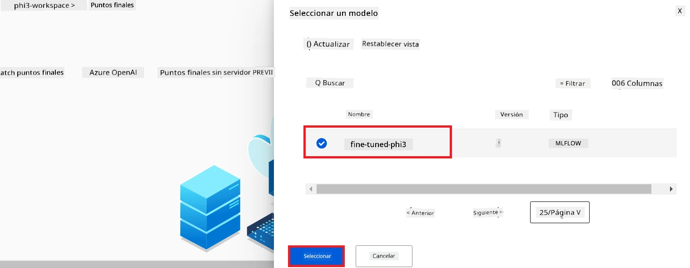

1. Seleccione **Seleccionar**.

1. Realice las siguientes tareas:

    - Seleccione **Máquina virtual** a *Standard_NC6s_v3*.
    - Seleccione la **Cantidad de instancias** que desea usar. Por ejemplo, *1*.
    - Seleccione **Endpoint** a **Nuevo** para crear un endpoint.
    - Ingrese el **Nombre del endpoint**. Debe ser un valor único.
    - Ingrese el **Nombre del despliegue**. Debe ser un valor único.

    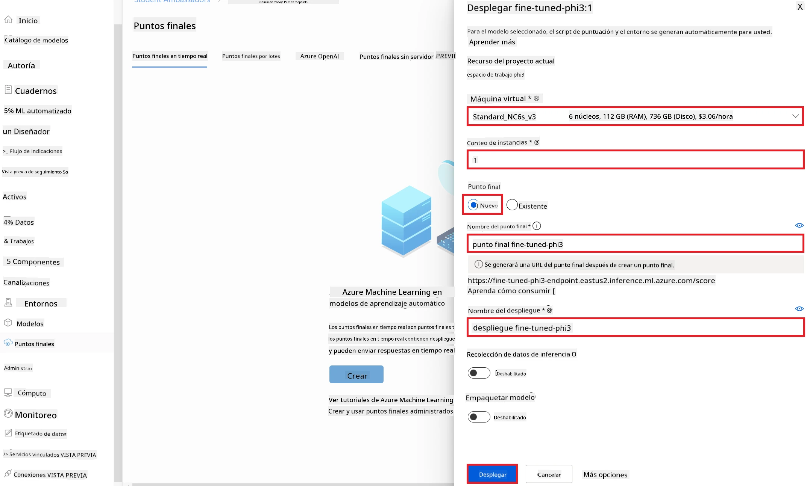

1. Seleccione **Desplegar**.

> [!WARNING]
> Para evitar cargos adicionales en su cuenta, asegúrese de eliminar el endpoint creado en el workspace de Azure Machine Learning.
>

#### Verificar el estado del despliegue en Azure Machine Learning Workspace

1. Navegue al workspace de Azure Machine Learning que creó.

1. Seleccione **Endpoints** en la pestaña del lado izquierdo.

1. Seleccione el endpoint que creó.

    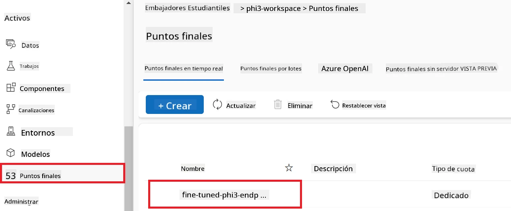

1. En esta página, puede administrar los endpoints durante el proceso de despliegue.

> [!NOTE]
> Una vez que el despliegue esté completo, asegúrese de que **Tráfico en vivo** esté configurado al **100%**. Si no es así, seleccione **Actualizar tráfico** para ajustar la configuración de tráfico. Tenga en cuenta que no puede probar el modelo si el tráfico está configurado a 0%.
>
> 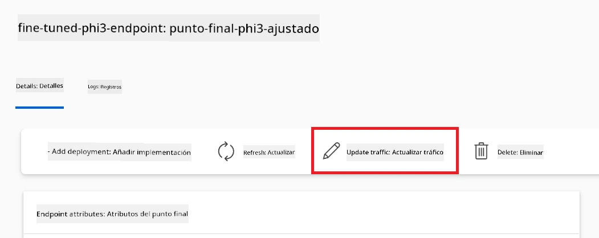
>

## Escenario 3: Integrar con Prompt flow y chatear con su modelo personalizado en Azure AI Foundry

### Integrar el modelo personalizado Phi-3 con Prompt flow

Después de desplegar exitosamente su modelo afinado, ahora puede integrarlo con Prompt Flow para usar su modelo en aplicaciones en tiempo real, habilitando una variedad de tareas interactivas con su modelo Phi-3 personalizado.

En este ejercicio, usted:

- Creará Azure AI Foundry Hub.
- Creará Azure AI Foundry Project.
- Creará Prompt flow.
- Agregará una conexión personalizada para el modelo Phi-3 afinado.
- Configurará Prompt flow para chatear con su modelo Phi-3 personalizado.

> [!NOTE]
> También puede integrar con Promptflow usando Azure ML Studio. El mismo proceso de integración puede aplicarse a Azure ML Studio.

#### Crear Azure AI Foundry Hub

Necesita crear un Hub antes de crear el Proyecto. Un Hub funciona como un Grupo de Recursos, permitiéndole organizar y administrar múltiples proyectos dentro de Azure AI Foundry.

1. Visite [Azure AI Foundry](https://ai.azure.com/?WT.mc_id=aiml-137032-kinfeylo).

1. Seleccione **Todos los hubs** en la pestaña del lado izquierdo.

1. Seleccione **+ Nuevo hub** en el menú de navegación.
    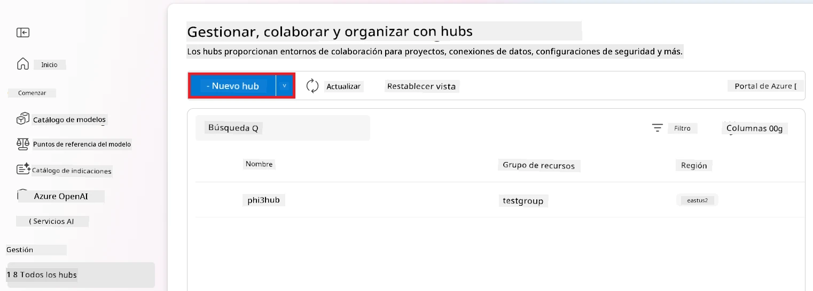

1. Realice las siguientes tareas:

    - Ingrese el **Nombre del hub**. Debe ser un valor único.
    - Seleccione su **Suscripción** de Azure.
    - Seleccione el **Grupo de recursos** a usar (cree uno nuevo si es necesario).
    - Seleccione la **Ubicación** que desee usar.
    - Seleccione la **Conexión a Azure AI Services** a usar (cree una nueva si es necesario).
    - Seleccione **Conectar Azure AI Search** para **Omitir la conexión**.

    

1. Seleccione **Siguiente**.

#### Crear proyecto Azure AI Foundry

1. En el Hub que creó, seleccione **Todos los proyectos** en la pestaña del lado izquierdo.

1. Seleccione **+ Nuevo proyecto** en el menú de navegación.

    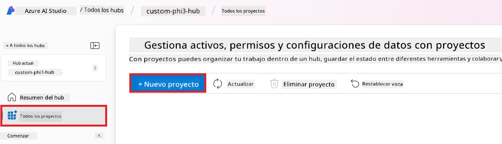

1. Ingrese el **Nombre del proyecto**. Debe ser un valor único.

    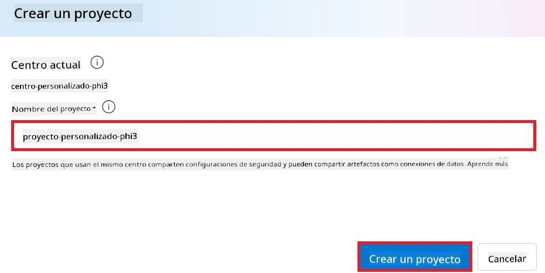

1. Seleccione **Crear un proyecto**.

#### Agregar una conexión personalizada para el modelo Phi-3 afinado

Para integrar su modelo Phi-3 personalizado con Prompt flow, necesita guardar el endpoint y la clave del modelo en una conexión personalizada. Esta configuración asegura el acceso a su modelo Phi-3 personalizado en Prompt flow.

#### Configurar la clave api y la uri del endpoint del modelo Phi-3 afinado

1. Visite [Azure ML Studio](https://ml.azure.com/home?WT.mc_id=aiml-137032-kinfeylo).

1. Navegue al espacio de trabajo de Azure Machine Learning que creó.

1. Seleccione **Endpoints** en la pestaña del lado izquierdo.

    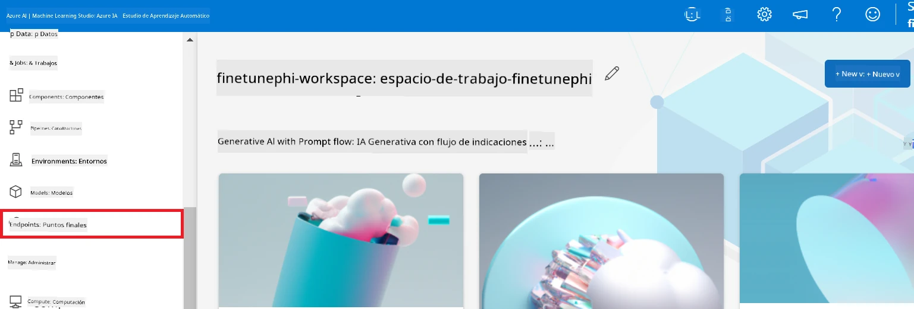

1. Seleccione el endpoint que creó.

    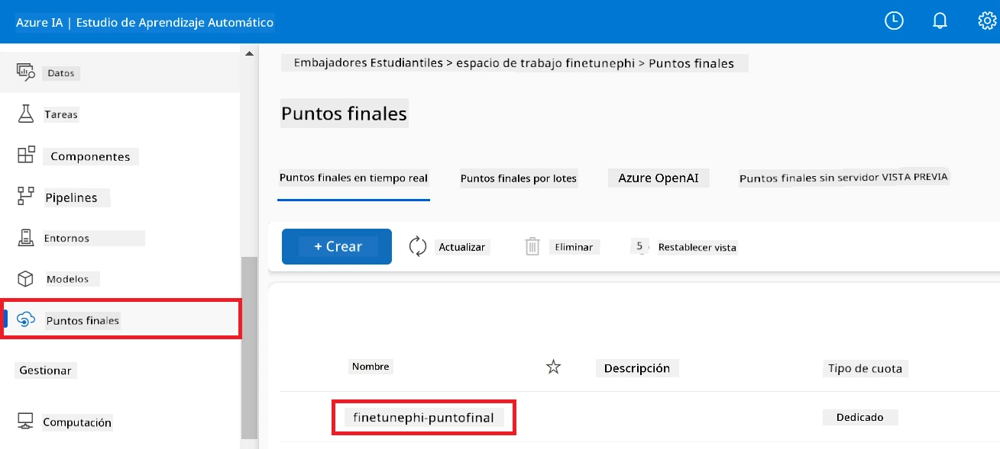

1. Seleccione **Consumir** en el menú de navegación.

1. Copie su **REST endpoint** y **Clave primaria**.

    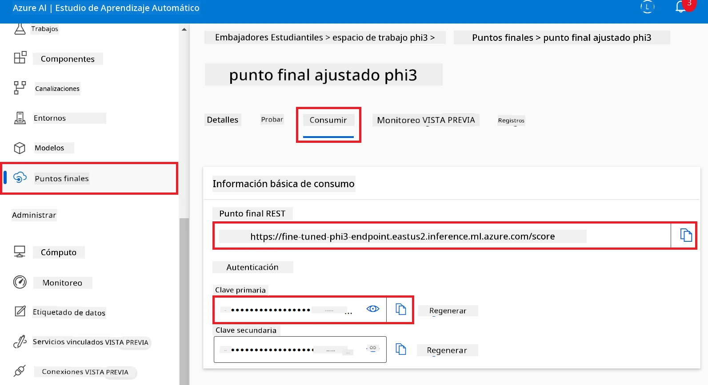

#### Agregar la Conexión Personalizada

1. Visite [Azure AI Foundry](https://ai.azure.com/?WT.mc_id=aiml-137032-kinfeylo).

1. Navegue al proyecto Azure AI Foundry que creó.

1. En el proyecto que creó, seleccione **Configuración** en la pestaña del lado izquierdo.

1. Seleccione **+ Nueva conexión**.

    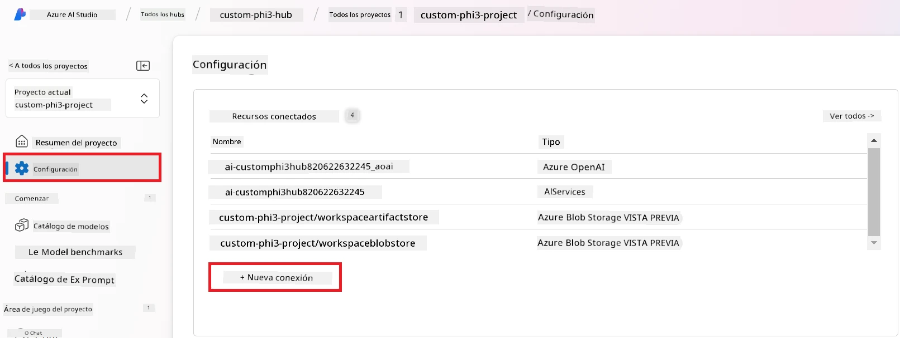

1. Seleccione **Claves personalizadas** en el menú de navegación.

    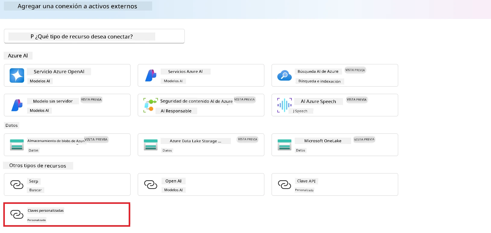

1. Realice las siguientes tareas:

    - Seleccione **+ Agregar pares clave-valor**.
    - Para el nombre de la clave, ingrese **endpoint** y pegue el endpoint que copió de Azure ML Studio en el campo de valor.
    - Seleccione nuevamente **+ Agregar pares clave-valor**.
    - Para el nombre de la clave, ingrese **key** y pegue la clave que copió de Azure ML Studio en el campo de valor.
    - Después de agregar las claves, seleccione **es secreto** para evitar que la clave se exponga.

    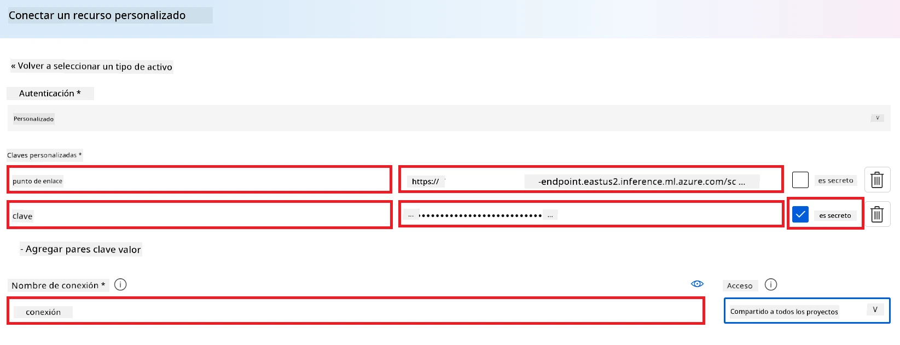

1. Seleccione **Agregar conexión**.

#### Crear Prompt flow

Ha agregado una conexión personalizada en Azure AI Foundry. Ahora, vamos a crear un Prompt flow utilizando los siguientes pasos. Luego, conectará este Prompt flow a la conexión personalizada para que pueda usar el modelo afinado dentro del Prompt flow.

1. Navegue al proyecto Azure AI Foundry que creó.

1. Seleccione **Prompt flow** en la pestaña del lado izquierdo.

1. Seleccione **+ Crear** en el menú de navegación.

    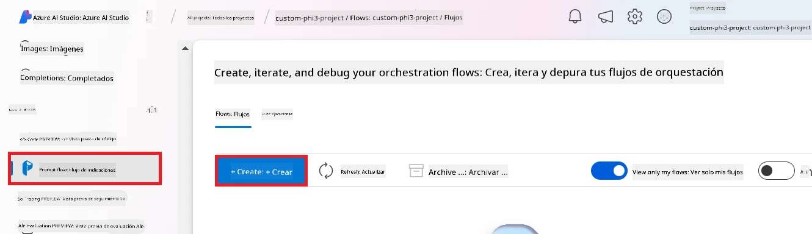

1. Seleccione **Flujo de chat** en el menú de navegación.

    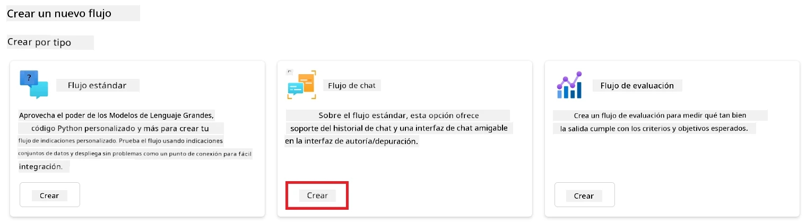

1. Ingrese el **Nombre de la carpeta** a usar.

    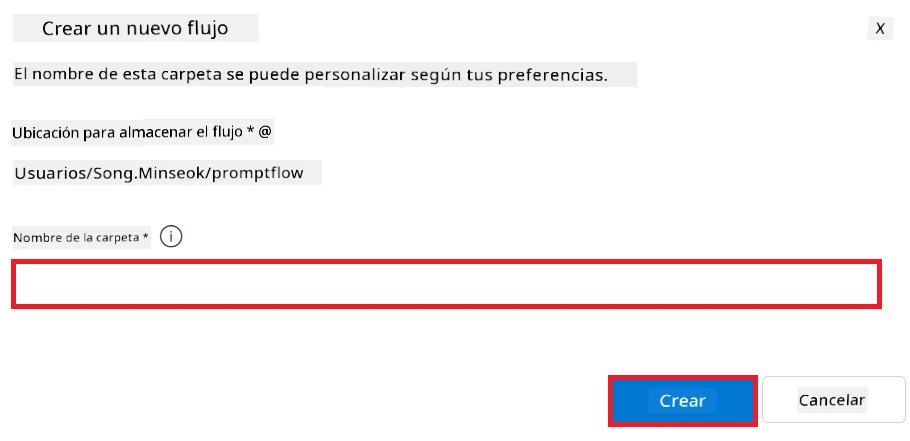

2. Seleccione **Crear**.

#### Configurar Prompt flow para chatear con su modelo Phi-3 personalizado

Necesita integrar el modelo Phi-3 afinado en un Prompt flow. Sin embargo, el Prompt flow existente proporcionado no está diseñado para este propósito. Por lo tanto, debe rediseñar el Prompt flow para habilitar la integración del modelo personalizado.

1. En el Prompt flow, realice las siguientes tareas para reconstruir el flujo existente:

    - Seleccione **Modo de archivo crudo**.
    - Elimine todo el código existente en el archivo *flow.dag.yml*.
    - Agregue el siguiente código al archivo *flow.dag.yml*.

        ```yml
        inputs:
          input_data:
            type: string
            default: "Who founded Microsoft?"

        outputs:
          answer:
            type: string
            reference: ${integrate_with_promptflow.output}

        nodes:
        - name: integrate_with_promptflow
          type: python
          source:
            type: code
            path: integrate_with_promptflow.py
          inputs:
            input_data: ${inputs.input_data}
        ```

    - Seleccione **Guardar**.

    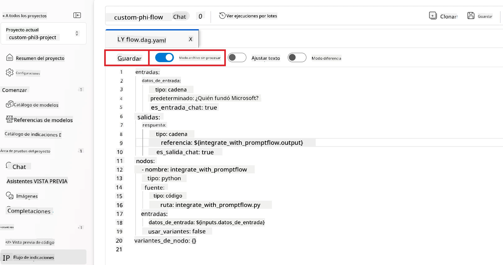

1. Agregue el siguiente código al archivo *integrate_with_promptflow.py* para usar el modelo Phi-3 personalizado en Prompt flow.

    ```python
    import logging
    import requests
    from promptflow import tool
    from promptflow.connections import CustomConnection

    # Configuración de registro
    logging.basicConfig(
        format="%(asctime)s - %(levelname)s - %(name)s - %(message)s",
        datefmt="%Y-%m-%d %H:%M:%S",
        level=logging.DEBUG
    )
    logger = logging.getLogger(__name__)

    def query_phi3_model(input_data: str, connection: CustomConnection) -> str:
        """
        Send a request to the Phi-3 model endpoint with the given input data using Custom Connection.
        """

        # "connection" es el nombre de la Conexión Personalizada, "endpoint", "key" son las claves en la Conexión Personalizada
        endpoint_url = connection.endpoint
        api_key = connection.key

        headers = {
            "Content-Type": "application/json",
            "Authorization": f"Bearer {api_key}"
        }
        data = {
            "input_data": {
                "input_string": [
                    {"role": "user", "content": input_data}
                ],
                "parameters": {
                    "temperature": 0.7,
                    "max_new_tokens": 128
                }
            }
        }
        try:
            response = requests.post(endpoint_url, json=data, headers=headers)
            response.raise_for_status()
            
            # Registrar la respuesta JSON completa
            logger.debug(f"Full JSON response: {response.json()}")

            result = response.json()["output"]
            logger.info("Successfully received response from Azure ML Endpoint.")
            return result
        except requests.exceptions.RequestException as e:
            logger.error(f"Error querying Azure ML Endpoint: {e}")
            raise

    @tool
    def my_python_tool(input_data: str, connection: CustomConnection) -> str:
        """
        Tool function to process input data and query the Phi-3 model.
        """
        return query_phi3_model(input_data, connection)

    ```

    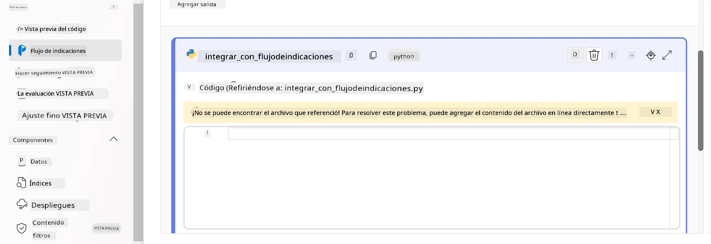

> [!NOTE]
> Para obtener información más detallada sobre el uso de Prompt flow en Azure AI Foundry, puede consultar [Prompt flow en Azure AI Foundry](https://learn.microsoft.com/azure/ai-studio/how-to/prompt-flow).

1. Seleccione **Entrada de chat**, **Salida de chat** para habilitar el chat con su modelo.

    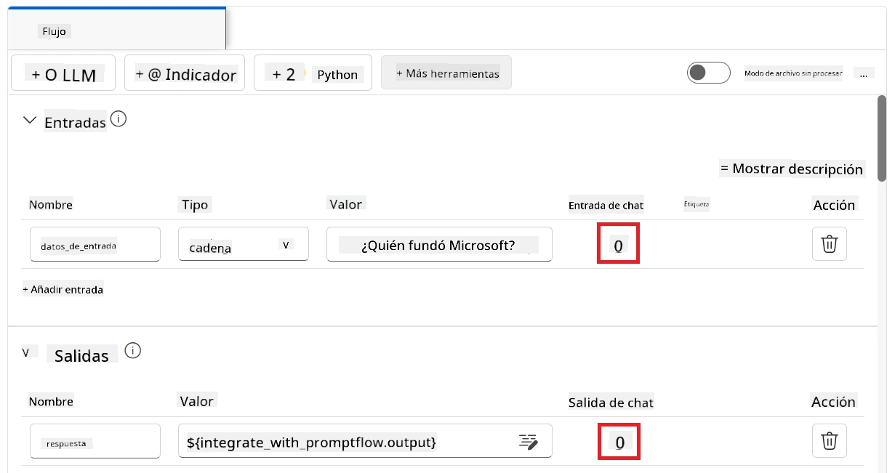

1. Ahora está listo para chatear con su modelo Phi-3 personalizado. En el siguiente ejercicio, aprenderá cómo iniciar Prompt flow y usarlo para chatear con su modelo Phi-3 afinado.

> [!NOTE]
>
> El flujo reconstruido debería parecerse a la imagen siguiente:
>
> 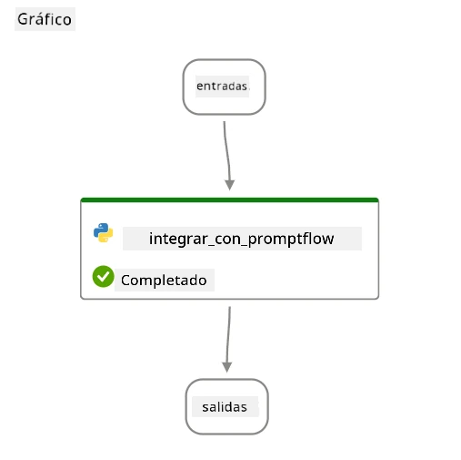
>

### Chatear con su modelo Phi-3 personalizado

Ahora que ha afinado e integrado su modelo Phi-3 personalizado con Prompt flow, está listo para comenzar a interactuar con él. Este ejercicio lo guiará a través del proceso de configuración e inicio de un chat con su modelo usando Prompt flow. Siguiendo estos pasos, podrá utilizar al máximo las capacidades de su modelo Phi-3 afinado para diversas tareas y conversaciones.

- Chatee con su modelo Phi-3 personalizado usando Prompt flow.

#### Iniciar Prompt flow

1. Seleccione **Iniciar sesiones de cómputo** para iniciar Prompt flow.

    

1. Seleccione **Validar y analizar entrada** para renovar parámetros.

    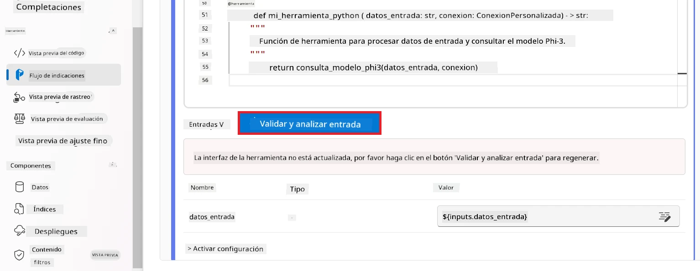

1. Seleccione el **Valor** de la **conexión** a la conexión personalizada que creó. Por ejemplo, *connection*.

    

#### Chatear con su modelo personalizado

1. Seleccione **Chat**.

    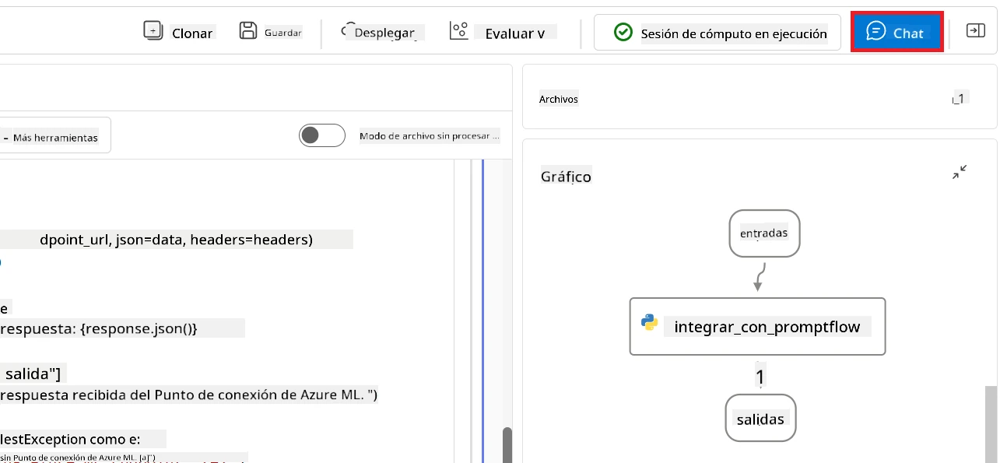

1. Aquí hay un ejemplo de los resultados: Ahora puede chatear con su modelo Phi-3 personalizado. Se recomienda hacer preguntas basadas en los datos usados para el afinamiento.

    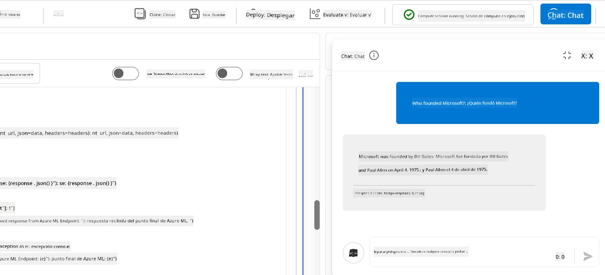

---

<!-- CO-OP TRANSLATOR DISCLAIMER START -->
**Aviso legal**:
Este documento ha sido traducido utilizando el servicio de traducción automática [Co-op Translator](https://github.com/Azure/co-op-translator). Aunque nos esforzamos por la precisión, tenga en cuenta que las traducciones automáticas pueden contener errores o inexactitudes. El documento original en su idioma nativo debe considerarse la fuente autorizada. Para información crítica, se recomienda una traducción profesional realizada por humanos. No nos responsabilizamos por malentendidos o interpretaciones erróneas derivadas del uso de esta traducción.
<!-- CO-OP TRANSLATOR DISCLAIMER END -->