<!--
CO_OP_TRANSLATOR_METADATA:
{
  "original_hash": "ecbd9179a21edbaafaf114d47f09f3e3",
  "translation_date": "2025-07-17T00:57:20+00:00",
  "source_file": "md/02.Application/01.TextAndChat/Phi3/E2E_Phi-3-FineTuning_PromptFlow_Integration_AIFoundry.md",
  "language_code": "es"
}
-->
# Ajusta y integra modelos personalizados Phi-3 con Prompt flow en Azure AI Foundry

Este ejemplo de principio a fin (E2E) está basado en la guía "[Fine-Tune and Integrate Custom Phi-3 Models with Prompt Flow in Azure AI Foundry](https://techcommunity.microsoft.com/t5/educator-developer-blog/fine-tune-and-integrate-custom-phi-3-models-with-prompt-flow-in/ba-p/4191726?WT.mc_id=aiml-137032-kinfeylo)" de la Comunidad Técnica de Microsoft. Introduce los procesos de ajuste fino, despliegue e integración de modelos personalizados Phi-3 con Prompt flow en Azure AI Foundry.  
A diferencia del ejemplo E2E, "[Fine-Tune and Integrate Custom Phi-3 Models with Prompt Flow](./E2E_Phi-3-FineTuning_PromptFlow_Integration.md)", que implicaba ejecutar código localmente, este tutorial se centra completamente en ajustar e integrar tu modelo dentro de Azure AI / ML Studio.

## Resumen

En este ejemplo E2E aprenderás cómo ajustar el modelo Phi-3 e integrarlo con Prompt flow en Azure AI Foundry. Aprovechando Azure AI / ML Studio, establecerás un flujo de trabajo para desplegar y utilizar modelos de IA personalizados. Este ejemplo E2E está dividido en tres escenarios:

**Escenario 1: Configurar recursos de Azure y preparar para el ajuste fino**

**Escenario 2: Ajustar el modelo Phi-3 y desplegarlo en Azure Machine Learning Studio**

**Escenario 3: Integrar con Prompt flow y chatear con tu modelo personalizado en Azure AI Foundry**

Aquí tienes una vista general de este ejemplo E2E.


### Tabla de contenidos

1. **[Escenario 1: Configurar recursos de Azure y preparar para el ajuste fino](../../../../../../md/02.Application/01.TextAndChat/Phi3)**
    - [Crear un Azure Machine Learning Workspace](../../../../../../md/02.Application/01.TextAndChat/Phi3)
    - [Solicitar cuotas de GPU en la suscripción de Azure](../../../../../../md/02.Application/01.TextAndChat/Phi3)
    - [Agregar asignación de roles](../../../../../../md/02.Application/01.TextAndChat/Phi3)
    - [Configurar el proyecto](../../../../../../md/02.Application/01.TextAndChat/Phi3)
    - [Preparar el conjunto de datos para el ajuste fino](../../../../../../md/02.Application/01.TextAndChat/Phi3)

1. **[Escenario 2: Ajustar el modelo Phi-3 y desplegar en Azure Machine Learning Studio](../../../../../../md/02.Application/01.TextAndChat/Phi3)**
    - [Ajustar el modelo Phi-3](../../../../../../md/02.Application/01.TextAndChat/Phi3)
    - [Desplegar el modelo Phi-3 ajustado](../../../../../../md/02.Application/01.TextAndChat/Phi3)

1. **[Escenario 3: Integrar con Prompt flow y chatear con tu modelo personalizado en Azure AI Foundry](../../../../../../md/02.Application/01.TextAndChat/Phi3)**
    - [Integrar el modelo Phi-3 personalizado con Prompt flow](../../../../../../md/02.Application/01.TextAndChat/Phi3)
    - [Chatear con tu modelo Phi-3 personalizado](../../../../../../md/02.Application/01.TextAndChat/Phi3)

## Escenario 1: Configurar recursos de Azure y preparar para el ajuste fino

### Crear un Azure Machine Learning Workspace

1. Escribe *azure machine learning* en la **barra de búsqueda** en la parte superior de la página del portal y selecciona **Azure Machine Learning** de las opciones que aparecen.

    

2. Selecciona **+ Crear** en el menú de navegación.

3. Selecciona **Nuevo workspace** en el menú de navegación.

    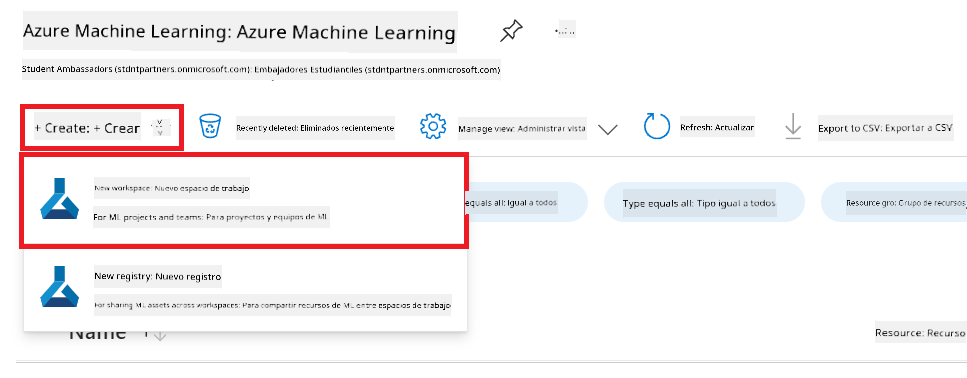

4. Realiza las siguientes tareas:

    - Selecciona tu **Suscripción** de Azure.
    - Selecciona el **Grupo de recursos** que usarás (crea uno nuevo si es necesario).
    - Ingresa el **Nombre del workspace**. Debe ser un valor único.
    - Selecciona la **Región** que deseas usar.
    - Selecciona la **Cuenta de almacenamiento** que usarás (crea una nueva si es necesario).
    - Selecciona el **Key vault** que usarás (crea uno nuevo si es necesario).
    - Selecciona **Application insights** que usarás (crea uno nuevo si es necesario).
    - Selecciona el **Registro de contenedores** que usarás (crea uno nuevo si es necesario).

    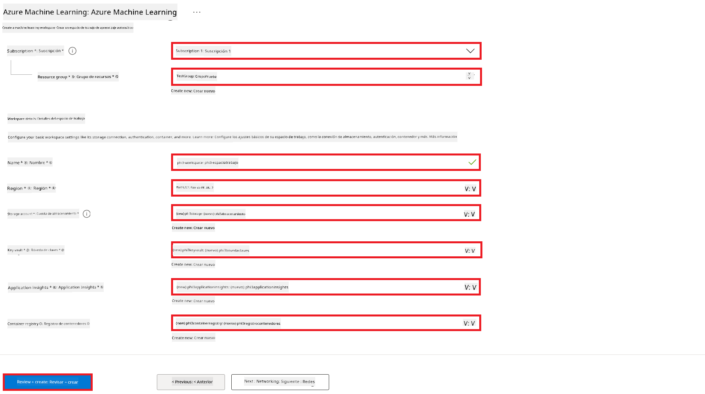

5. Selecciona **Revisar + crear**.

6. Selecciona **Crear**.

### Solicitar cuotas de GPU en la suscripción de Azure

En este tutorial aprenderás a ajustar y desplegar un modelo Phi-3 usando GPUs. Para el ajuste fino, usarás la GPU *Standard_NC24ads_A100_v4*, que requiere una solicitud de cuota. Para el despliegue, usarás la GPU *Standard_NC6s_v3*, que también requiere una solicitud de cuota.

> [!NOTE]
>
> Solo las suscripciones Pay-As-You-Go (el tipo estándar de suscripción) son elegibles para la asignación de GPU; las suscripciones de beneficio no están soportadas actualmente.
>

1. Visita [Azure ML Studio](https://ml.azure.com/home?wt.mc_id=studentamb_279723).

1. Realiza las siguientes tareas para solicitar la cuota *Standard NCADSA100v4 Family*:

    - Selecciona **Cuotas** en la pestaña lateral izquierda.
    - Selecciona la **Familia de máquinas virtuales** que usarás. Por ejemplo, selecciona **Standard NCADSA100v4 Family Cluster Dedicated vCPUs**, que incluye la GPU *Standard_NC24ads_A100_v4*.
    - Selecciona **Solicitar cuota** en el menú de navegación.

        

    - En la página de Solicitud de cuota, ingresa el **Nuevo límite de núcleos** que deseas usar. Por ejemplo, 24.
    - En la página de Solicitud de cuota, selecciona **Enviar** para solicitar la cuota de GPU.

1. Realiza las siguientes tareas para solicitar la cuota *Standard NCSv3 Family*:

    - Selecciona **Cuotas** en la pestaña lateral izquierda.
    - Selecciona la **Familia de máquinas virtuales** que usarás. Por ejemplo, selecciona **Standard NCSv3 Family Cluster Dedicated vCPUs**, que incluye la GPU *Standard_NC6s_v3*.
    - Selecciona **Solicitar cuota** en el menú de navegación.
    - En la página de Solicitud de cuota, ingresa el **Nuevo límite de núcleos** que deseas usar. Por ejemplo, 24.
    - En la página de Solicitud de cuota, selecciona **Enviar** para solicitar la cuota de GPU.

### Agregar asignación de roles

Para ajustar y desplegar tus modelos, primero debes crear una Identidad Administrada Asignada por el Usuario (UAI) y asignarle los permisos adecuados. Esta UAI se usará para la autenticación durante el despliegue.

#### Crear Identidad Administrada Asignada por el Usuario (UAI)

1. Escribe *managed identities* en la **barra de búsqueda** en la parte superior de la página del portal y selecciona **Managed Identities** de las opciones que aparecen.

    

1. Selecciona **+ Crear**.

    

1. Realiza las siguientes tareas:

    - Selecciona tu **Suscripción** de Azure.
    - Selecciona el **Grupo de recursos** que usarás (crea uno nuevo si es necesario).
    - Selecciona la **Región** que deseas usar.
    - Ingresa el **Nombre**. Debe ser un valor único.

    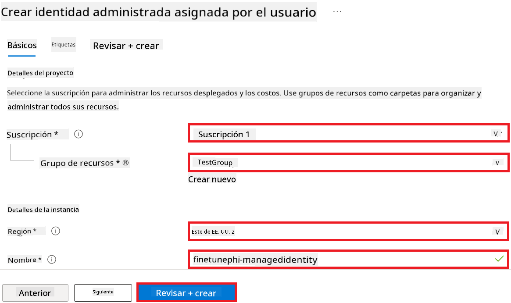

1. Selecciona **Revisar + crear**.

1. Selecciona **+ Crear**.

#### Agregar asignación de rol Contributor a la Identidad Administrada

1. Navega al recurso de Identidad Administrada que creaste.

1. Selecciona **Asignaciones de roles de Azure** en la pestaña lateral izquierda.

1. Selecciona **+ Agregar asignación de rol** en el menú de navegación.

1. En la página Agregar asignación de rol, realiza las siguientes tareas:
    - Selecciona el **Ámbito** a **Grupo de recursos**.
    - Selecciona tu **Suscripción** de Azure.
    - Selecciona el **Grupo de recursos** que usarás.
    - Selecciona el **Rol** a **Contributor**.

    

2. Selecciona **Guardar**.

#### Agregar asignación de rol Storage Blob Data Reader a la Identidad Administrada

1. Escribe *storage accounts* en la **barra de búsqueda** en la parte superior de la página del portal y selecciona **Storage accounts** de las opciones que aparecen.

    

1. Selecciona la cuenta de almacenamiento asociada con el Azure Machine Learning workspace que creaste. Por ejemplo, *finetunephistorage*.

1. Realiza las siguientes tareas para navegar a la página Agregar asignación de rol:

    - Navega a la cuenta de almacenamiento de Azure que creaste.
    - Selecciona **Control de acceso (IAM)** en la pestaña lateral izquierda.
    - Selecciona **+ Agregar** en el menú de navegación.
    - Selecciona **Agregar asignación de rol** en el menú de navegación.

    

1. En la página Agregar asignación de rol, realiza las siguientes tareas:

    - En la página de Roles, escribe *Storage Blob Data Reader* en la **barra de búsqueda** y selecciona **Storage Blob Data Reader** de las opciones que aparecen.
    - En la página de Roles, selecciona **Siguiente**.
    - En la página de Miembros, selecciona **Asignar acceso a** **Managed identity**.
    - En la página de Miembros, selecciona **+ Seleccionar miembros**.
    - En la página Seleccionar identidades administradas, selecciona tu **Suscripción** de Azure.
    - En la página Seleccionar identidades administradas, selecciona la **Identidad administrada** a **Managed Identity**.
    - En la página Seleccionar identidades administradas, selecciona la Identidad Administrada que creaste. Por ejemplo, *finetunephi-managedidentity*.
    - En la página Seleccionar identidades administradas, selecciona **Seleccionar**.

    

1. Selecciona **Revisar + asignar**.

#### Agregar asignación de rol AcrPull a la Identidad Administrada

1. Escribe *container registries* en la **barra de búsqueda** en la parte superior de la página del portal y selecciona **Container registries** de las opciones que aparecen.

    

1. Selecciona el registro de contenedores asociado con el Azure Machine Learning workspace. Por ejemplo, *finetunephicontainerregistry*

1. Realiza las siguientes tareas para navegar a la página Agregar asignación de rol:

    - Selecciona **Control de acceso (IAM)** en la pestaña lateral izquierda.
    - Selecciona **+ Agregar** en el menú de navegación.
    - Selecciona **Agregar asignación de rol** en el menú de navegación.

1. En la página Agregar asignación de rol, realiza las siguientes tareas:

    - En la página de Roles, escribe *AcrPull* en la **barra de búsqueda** y selecciona **AcrPull** de las opciones que aparecen.
    - En la página de Roles, selecciona **Siguiente**.
    - En la página de Miembros, selecciona **Asignar acceso a** **Managed identity**.
    - En la página de Miembros, selecciona **+ Seleccionar miembros**.
    - En la página Seleccionar identidades administradas, selecciona tu **Suscripción** de Azure.
    - En la página Seleccionar identidades administradas, selecciona la **Identidad administrada** a **Managed Identity**.
    - En la página Seleccionar identidades administradas, selecciona la Identidad Administrada que creaste. Por ejemplo, *finetunephi-managedidentity*.
    - En la página Seleccionar identidades administradas, selecciona **Seleccionar**.
    - Selecciona **Revisar + asignar**.

### Configurar el proyecto

Para descargar los conjuntos de datos necesarios para el ajuste fino, configurarás un entorno local.

En este ejercicio, vas a:

- Crear una carpeta para trabajar dentro de ella.
- Crear un entorno virtual.
- Instalar los paquetes requeridos.
- Crear un archivo *download_dataset.py* para descargar el conjunto de datos.

#### Crear una carpeta para trabajar dentro de ella

1. Abre una ventana de terminal y escribe el siguiente comando para crear una carpeta llamada *finetune-phi* en la ruta predeterminada.

    ```console
    mkdir finetune-phi
    ```

2. Escribe el siguiente comando en tu terminal para navegar a la carpeta *finetune-phi* que creaste.
#### Crear un entorno virtual

1. Escribe el siguiente comando en tu terminal para crear un entorno virtual llamado *.venv*.

    ```console
    python -m venv .venv
    ```

2. Escribe el siguiente comando en tu terminal para activar el entorno virtual.

    ```console
    .venv\Scripts\activate.bat
    ```


> [!NOTE]
> Si funcionó, deberías ver *(.venv)* antes del prompt de comando.

#### Instalar los paquetes requeridos

1. Escribe los siguientes comandos en tu terminal para instalar los paquetes necesarios.

    ```console
    pip install datasets==2.19.1
    ```

#### Crear `download_dataset.py`

> [!NOTE]
> Estructura completa de carpetas:
>
> ```text
> └── YourUserName
> .    └── finetune-phi
> .        └── download_dataset.py
> ```

1. Abre **Visual Studio Code**.

1. Selecciona **Archivo** en la barra de menú.

1. Selecciona **Abrir carpeta**.

1. Selecciona la carpeta *finetune-phi* que creaste, ubicada en *C:\Users\yourUserName\finetune-phi*.

    

1. En el panel izquierdo de Visual Studio Code, haz clic derecho y selecciona **Nuevo archivo** para crear un archivo llamado *download_dataset.py*.

    

### Preparar el conjunto de datos para fine-tuning

En este ejercicio, ejecutarás el archivo *download_dataset.py* para descargar los conjuntos de datos *ultrachat_200k* a tu entorno local. Luego usarás estos datos para ajustar el modelo Phi-3 en Azure Machine Learning.

En este ejercicio, harás lo siguiente:

- Añadir código al archivo *download_dataset.py* para descargar los conjuntos de datos.
- Ejecutar el archivo *download_dataset.py* para descargar los datos a tu entorno local.

#### Descargar tu conjunto de datos usando *download_dataset.py*

1. Abre el archivo *download_dataset.py* en Visual Studio Code.

1. Añade el siguiente código en el archivo *download_dataset.py*.

    ```python
    import json
    import os
    from datasets import load_dataset

    def load_and_split_dataset(dataset_name, config_name, split_ratio):
        """
        Load and split a dataset.
        """
        # Load the dataset with the specified name, configuration, and split ratio
        dataset = load_dataset(dataset_name, config_name, split=split_ratio)
        print(f"Original dataset size: {len(dataset)}")
        
        # Split the dataset into train and test sets (80% train, 20% test)
        split_dataset = dataset.train_test_split(test_size=0.2)
        print(f"Train dataset size: {len(split_dataset['train'])}")
        print(f"Test dataset size: {len(split_dataset['test'])}")
        
        return split_dataset

    def save_dataset_to_jsonl(dataset, filepath):
        """
        Save a dataset to a JSONL file.
        """
        # Create the directory if it does not exist
        os.makedirs(os.path.dirname(filepath), exist_ok=True)
        
        # Open the file in write mode
        with open(filepath, 'w', encoding='utf-8') as f:
            # Iterate over each record in the dataset
            for record in dataset:
                # Dump the record as a JSON object and write it to the file
                json.dump(record, f)
                # Write a newline character to separate records
                f.write('\n')
        
        print(f"Dataset saved to {filepath}")

    def main():
        """
        Main function to load, split, and save the dataset.
        """
        # Load and split the ULTRACHAT_200k dataset with a specific configuration and split ratio
        dataset = load_and_split_dataset("HuggingFaceH4/ultrachat_200k", 'default', 'train_sft[:1%]')
        
        # Extract the train and test datasets from the split
        train_dataset = dataset['train']
        test_dataset = dataset['test']

        # Save the train dataset to a JSONL file
        save_dataset_to_jsonl(train_dataset, "data/train_data.jsonl")
        
        # Save the test dataset to a separate JSONL file
        save_dataset_to_jsonl(test_dataset, "data/test_data.jsonl")

    if __name__ == "__main__":
        main()

    ```

1. Escribe el siguiente comando en tu terminal para ejecutar el script y descargar el conjunto de datos a tu entorno local.

    ```console
    python download_dataset.py
    ```

1. Verifica que los conjuntos de datos se hayan guardado correctamente en el directorio local *finetune-phi/data*.

> [!NOTE]
>
> #### Nota sobre el tamaño del conjunto de datos y el tiempo de fine-tuning
>
> En este tutorial, usas solo el 1% del conjunto de datos (`split='train[:1%]'`). Esto reduce significativamente la cantidad de datos, acelerando tanto la carga como el proceso de fine-tuning. Puedes ajustar el porcentaje para encontrar el equilibrio adecuado entre el tiempo de entrenamiento y el rendimiento del modelo. Usar un subconjunto más pequeño reduce el tiempo necesario para el fine-tuning, haciendo el proceso más manejable para un tutorial.

## Escenario 2: Ajustar el modelo Phi-3 y desplegarlo en Azure Machine Learning Studio

### Ajustar el modelo Phi-3

En este ejercicio, ajustarás el modelo Phi-3 en Azure Machine Learning Studio.

En este ejercicio, harás lo siguiente:

- Crear un clúster de cómputo para el fine-tuning.
- Ajustar el modelo Phi-3 en Azure Machine Learning Studio.

#### Crear un clúster de cómputo para el fine-tuning

1. Visita [Azure ML Studio](https://ml.azure.com/home?wt.mc_id=studentamb_279723).

1. Selecciona **Compute** en la pestaña lateral izquierda.

1. Selecciona **Compute clusters** en el menú de navegación.

1. Selecciona **+ Nuevo**.

    

1. Realiza las siguientes acciones:

    - Selecciona la **Región** que deseas usar.
    - Selecciona el **Nivel de máquina virtual** a **Dedicado**.
    - Selecciona el **Tipo de máquina virtual** a **GPU**.
    - Filtra el **Tamaño de máquina virtual** a **Seleccionar entre todas las opciones**.
    - Selecciona el **Tamaño de máquina virtual** a **Standard_NC24ads_A100_v4**.

    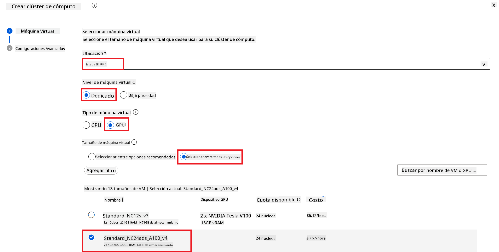

1. Selecciona **Siguiente**.

1. Realiza las siguientes acciones:

    - Ingresa un **Nombre del clúster**. Debe ser un valor único.
    - Selecciona el **Número mínimo de nodos** a **0**.
    - Selecciona el **Número máximo de nodos** a **1**.
    - Selecciona los **Segundos de inactividad antes de reducir escala** a **120**.

    

1. Selecciona **Crear**.

#### Ajustar el modelo Phi-3

1. Visita [Azure ML Studio](https://ml.azure.com/home?wt.mc_id=studentamb_279723).

1. Selecciona el espacio de trabajo de Azure Machine Learning que creaste.

    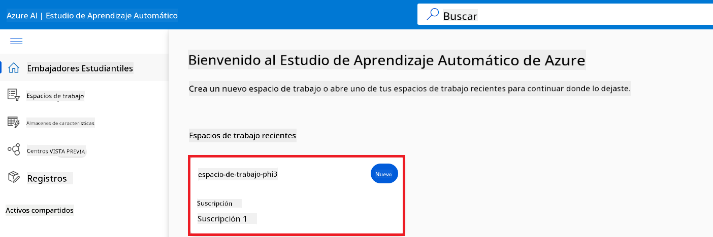

1. Realiza las siguientes acciones:

    - Selecciona **Catálogo de modelos** en la pestaña lateral izquierda.
    - Escribe *phi-3-mini-4k* en la **barra de búsqueda** y selecciona **Phi-3-mini-4k-instruct** de las opciones que aparecen.

    

1. Selecciona **Fine-tune** en el menú de navegación.

    

1. Realiza las siguientes acciones:

    - Selecciona **Seleccionar tipo de tarea** a **Chat completion**.
    - Selecciona **+ Seleccionar datos** para subir los **Datos de entrenamiento**.
    - Selecciona el tipo de carga de datos de validación a **Proporcionar datos de validación diferentes**.
    - Selecciona **+ Seleccionar datos** para subir los **Datos de validación**.

    

    > [!TIP]
    >
    > Puedes seleccionar **Configuración avanzada** para personalizar opciones como **learning_rate** y **lr_scheduler_type** para optimizar el proceso de fine-tuning según tus necesidades específicas.

1. Selecciona **Finalizar**.

1. En este ejercicio, ajustaste con éxito el modelo Phi-3 usando Azure Machine Learning. Ten en cuenta que el proceso de fine-tuning puede tomar bastante tiempo. Después de iniciar el trabajo de fine-tuning, debes esperar a que termine. Puedes monitorear el estado del trabajo en la pestaña Jobs en el lado izquierdo de tu espacio de trabajo de Azure Machine Learning. En la siguiente serie, desplegarás el modelo ajustado e integrarás con Prompt flow.

    

### Desplegar el modelo Phi-3 ajustado

Para integrar el modelo Phi-3 ajustado con Prompt flow, necesitas desplegar el modelo para que esté accesible para inferencia en tiempo real. Este proceso implica registrar el modelo, crear un endpoint en línea y desplegar el modelo.

En este ejercicio, harás lo siguiente:

- Registrar el modelo ajustado en el espacio de trabajo de Azure Machine Learning.
- Crear un endpoint en línea.
- Desplegar el modelo Phi-3 ajustado registrado.

#### Registrar el modelo ajustado

1. Visita [Azure ML Studio](https://ml.azure.com/home?wt.mc_id=studentamb_279723).

1. Selecciona el espacio de trabajo de Azure Machine Learning que creaste.

    

1. Selecciona **Modelos** en la pestaña lateral izquierda.

1. Selecciona **+ Registrar**.

1. Selecciona **Desde la salida de un trabajo**.

    

1. Selecciona el trabajo que creaste.

    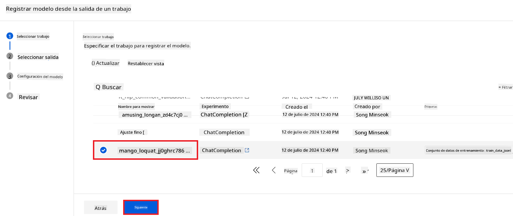

1. Selecciona **Siguiente**.

1. Selecciona **Tipo de modelo** a **MLflow**.

1. Asegúrate de que **Salida del trabajo** esté seleccionada; debería estar seleccionada automáticamente.

    

2. Selecciona **Siguiente**.

3. Selecciona **Registrar**.

    

4. Puedes ver tu modelo registrado navegando al menú **Modelos** en la pestaña lateral izquierda.

    

#### Desplegar el modelo ajustado

1. Navega al espacio de trabajo de Azure Machine Learning que creaste.

1. Selecciona **Endpoints** en la pestaña lateral izquierda.

1. Selecciona **Endpoints en tiempo real** en el menú de navegación.

    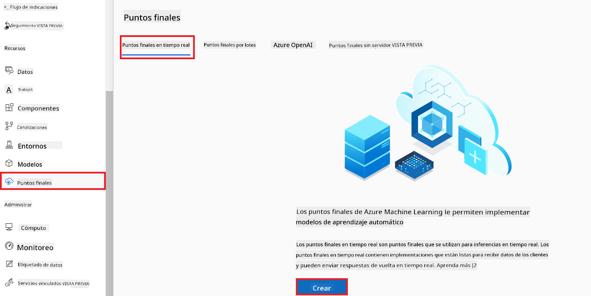

1. Selecciona **Crear**.

1. Selecciona el modelo registrado que creaste.

    

1. Selecciona **Seleccionar**.

1. Realiza las siguientes acciones:

    - Selecciona **Máquina virtual** a *Standard_NC6s_v3*.
    - Selecciona la **Cantidad de instancias** que deseas usar. Por ejemplo, *1*.
    - Selecciona el **Endpoint** a **Nuevo** para crear un endpoint.
    - Ingresa un **Nombre del endpoint**. Debe ser un valor único.
    - Ingresa un **Nombre del despliegue**. Debe ser un valor único.

    

1. Selecciona **Desplegar**.

> [!WARNING]
> Para evitar cargos adicionales en tu cuenta, asegúrate de eliminar el endpoint creado en el espacio de trabajo de Azure Machine Learning.
>

#### Verificar el estado del despliegue en Azure Machine Learning Workspace

1. Navega al espacio de trabajo de Azure Machine Learning que creaste.

1. Selecciona **Endpoints** en la pestaña lateral izquierda.

1. Selecciona el endpoint que creaste.

    

1. En esta página, puedes administrar los endpoints durante el proceso de despliegue.

> [!NOTE]
> Una vez que el despliegue esté completo, asegúrate de que **Tráfico en vivo** esté configurado al **100%**. Si no es así, selecciona **Actualizar tráfico** para ajustar la configuración. Ten en cuenta que no puedes probar el modelo si el tráfico está en 0%.
>
> 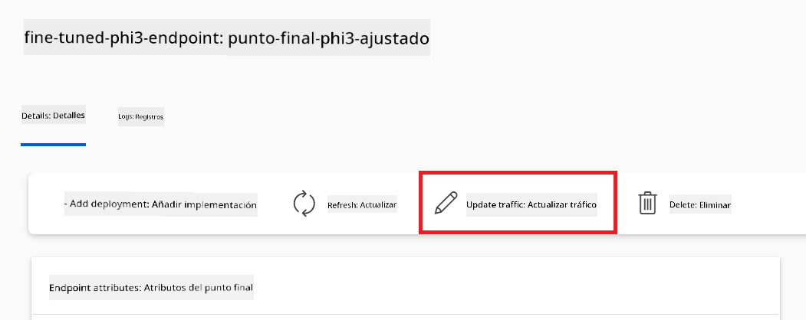
>

## Escenario 3: Integrar con Prompt flow y chatear con tu modelo personalizado en Azure AI Foundry

### Integrar el modelo Phi-3 personalizado con Prompt flow

Después de desplegar con éxito tu modelo ajustado, ahora puedes integrarlo con Prompt Flow para usar tu modelo en aplicaciones en tiempo real, permitiendo una variedad de tareas interactivas con tu modelo Phi-3 personalizado.

En este ejercicio, harás lo siguiente:

- Crear Azure AI Foundry Hub.
- Crear un proyecto en Azure AI Foundry.
- Crear un Prompt flow.
- Añadir una conexión personalizada para el modelo Phi-3 ajustado.
- Configurar Prompt flow para chatear con tu modelo Phi-3 personalizado.
> [!NOTE]  
> También puedes integrarte con Promptflow usando Azure ML Studio. El mismo proceso de integración se puede aplicar a Azure ML Studio.
#### Crear Azure AI Foundry Hub

Necesitas crear un Hub antes de crear el Proyecto. Un Hub funciona como un Grupo de Recursos, permitiéndote organizar y gestionar múltiples Proyectos dentro de Azure AI Foundry.

1. Visita [Azure AI Foundry](https://ai.azure.com/?WT.mc_id=aiml-137032-kinfeylo).

1. Selecciona **All hubs** en la pestaña del lado izquierdo.

1. Selecciona **+ New hub** en el menú de navegación.

    

1. Realiza las siguientes tareas:

    - Ingresa el **Hub name**. Debe ser un valor único.
    - Selecciona tu **Subscription** de Azure.
    - Selecciona el **Resource group** que deseas usar (crea uno nuevo si es necesario).
    - Selecciona la **Location** que prefieras.
    - Selecciona **Connect Azure AI Services** para usar (crea uno nuevo si es necesario).
    - Selecciona **Connect Azure AI Search** para **Skip connecting**.

    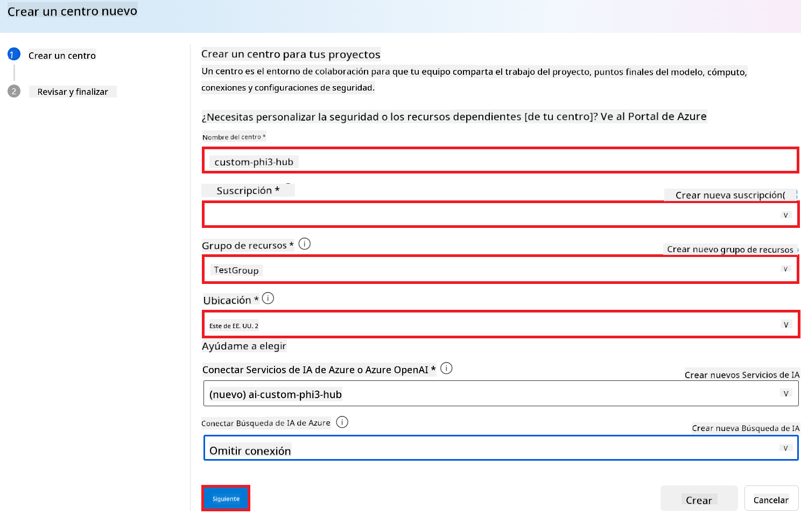

1. Selecciona **Next**.

#### Crear Proyecto en Azure AI Foundry

1. En el Hub que creaste, selecciona **All projects** en la pestaña del lado izquierdo.

1. Selecciona **+ New project** en el menú de navegación.

    

1. Ingresa el **Project name**. Debe ser un valor único.

    

1. Selecciona **Create a project**.

#### Agregar una conexión personalizada para el modelo Phi-3 afinado

Para integrar tu modelo Phi-3 personalizado con Prompt flow, necesitas guardar el endpoint y la clave del modelo en una conexión personalizada. Esta configuración asegura el acceso a tu modelo Phi-3 personalizado en Prompt flow.

#### Configurar la clave API y el URI del endpoint del modelo Phi-3 afinado

1. Visita [Azure ML Studio](https://ml.azure.com/home?WT.mc_id=aiml-137032-kinfeylo).

1. Navega al espacio de trabajo de Azure Machine Learning que creaste.

1. Selecciona **Endpoints** en la pestaña del lado izquierdo.

    

1. Selecciona el endpoint que creaste.

    

1. Selecciona **Consume** en el menú de navegación.

1. Copia tu **REST endpoint** y tu **Primary key**.

    

#### Agregar la Conexión Personalizada

1. Visita [Azure AI Foundry](https://ai.azure.com/?WT.mc_id=aiml-137032-kinfeylo).

1. Navega al proyecto de Azure AI Foundry que creaste.

1. En el Proyecto que creaste, selecciona **Settings** en la pestaña del lado izquierdo.

1. Selecciona **+ New connection**.

    

1. Selecciona **Custom keys** en el menú de navegación.

    

1. Realiza las siguientes tareas:

    - Selecciona **+ Add key value pairs**.
    - Para el nombre de la clave, ingresa **endpoint** y pega el endpoint que copiaste de Azure ML Studio en el campo de valor.
    - Selecciona **+ Add key value pairs** nuevamente.
    - Para el nombre de la clave, ingresa **key** y pega la clave que copiaste de Azure ML Studio en el campo de valor.
    - Después de agregar las claves, selecciona **is secret** para evitar que la clave se exponga.

    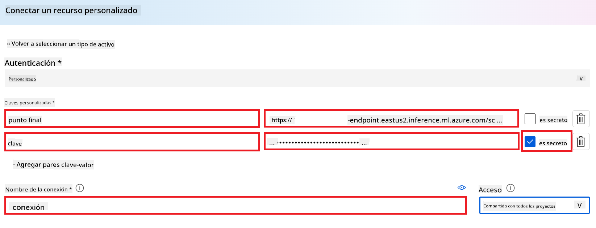

1. Selecciona **Add connection**.

#### Crear Prompt flow

Has agregado una conexión personalizada en Azure AI Foundry. Ahora, vamos a crear un Prompt flow siguiendo los pasos a continuación. Luego, conectarás este Prompt flow a la conexión personalizada para que puedas usar el modelo afinado dentro del Prompt flow.

1. Navega al proyecto de Azure AI Foundry que creaste.

1. Selecciona **Prompt flow** en la pestaña del lado izquierdo.

1. Selecciona **+ Create** en el menú de navegación.

    

1. Selecciona **Chat flow** en el menú de navegación.

    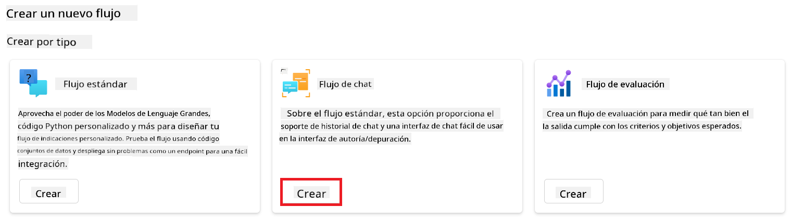

1. Ingresa el **Folder name** que deseas usar.

    

2. Selecciona **Create**.

#### Configurar Prompt flow para chatear con tu modelo Phi-3 personalizado

Necesitas integrar el modelo Phi-3 afinado en un Prompt flow. Sin embargo, el Prompt flow existente no está diseñado para este propósito. Por lo tanto, debes rediseñar el Prompt flow para habilitar la integración del modelo personalizado.

1. En el Prompt flow, realiza las siguientes tareas para reconstruir el flujo existente:

    - Selecciona **Raw file mode**.
    - Elimina todo el código existente en el archivo *flow.dag.yml*.
    - Agrega el siguiente código al archivo *flow.dag.yml*.

        ```yml
        inputs:
          input_data:
            type: string
            default: "Who founded Microsoft?"

        outputs:
          answer:
            type: string
            reference: ${integrate_with_promptflow.output}

        nodes:
        - name: integrate_with_promptflow
          type: python
          source:
            type: code
            path: integrate_with_promptflow.py
          inputs:
            input_data: ${inputs.input_data}
        ```

    - Selecciona **Save**.

    

1. Agrega el siguiente código al archivo *integrate_with_promptflow.py* para usar el modelo Phi-3 personalizado en Prompt flow.

    ```python
    import logging
    import requests
    from promptflow import tool
    from promptflow.connections import CustomConnection

    # Logging setup
    logging.basicConfig(
        format="%(asctime)s - %(levelname)s - %(name)s - %(message)s",
        datefmt="%Y-%m-%d %H:%M:%S",
        level=logging.DEBUG
    )
    logger = logging.getLogger(__name__)

    def query_phi3_model(input_data: str, connection: CustomConnection) -> str:
        """
        Send a request to the Phi-3 model endpoint with the given input data using Custom Connection.
        """

        # "connection" is the name of the Custom Connection, "endpoint", "key" are the keys in the Custom Connection
        endpoint_url = connection.endpoint
        api_key = connection.key

        headers = {
            "Content-Type": "application/json",
            "Authorization": f"Bearer {api_key}"
        }
        data = {
            "input_data": {
                "input_string": [
                    {"role": "user", "content": input_data}
                ],
                "parameters": {
                    "temperature": 0.7,
                    "max_new_tokens": 128
                }
            }
        }
        try:
            response = requests.post(endpoint_url, json=data, headers=headers)
            response.raise_for_status()
            
            # Log the full JSON response
            logger.debug(f"Full JSON response: {response.json()}")

            result = response.json()["output"]
            logger.info("Successfully received response from Azure ML Endpoint.")
            return result
        except requests.exceptions.RequestException as e:
            logger.error(f"Error querying Azure ML Endpoint: {e}")
            raise

    @tool
    def my_python_tool(input_data: str, connection: CustomConnection) -> str:
        """
        Tool function to process input data and query the Phi-3 model.
        """
        return query_phi3_model(input_data, connection)

    ```

    

> [!NOTE]
> Para obtener información más detallada sobre cómo usar Prompt flow en Azure AI Foundry, puedes consultar [Prompt flow in Azure AI Foundry](https://learn.microsoft.com/azure/ai-studio/how-to/prompt-flow).

1. Selecciona **Chat input**, **Chat output** para habilitar el chat con tu modelo.

    

1. Ahora estás listo para chatear con tu modelo Phi-3 personalizado. En el siguiente ejercicio, aprenderás cómo iniciar Prompt flow y usarlo para chatear con tu modelo Phi-3 afinado.

> [!NOTE]
>
> El flujo reconstruido debería verse como en la imagen a continuación:
>
> 
>

### Chatear con tu modelo Phi-3 personalizado

Ahora que has afinado e integrado tu modelo Phi-3 personalizado con Prompt flow, estás listo para comenzar a interactuar con él. Este ejercicio te guiará a través del proceso de configuración e inicio de un chat con tu modelo usando Prompt flow. Siguiendo estos pasos, podrás aprovechar al máximo las capacidades de tu modelo Phi-3 afinado para diversas tareas y conversaciones.

- Chatea con tu modelo Phi-3 personalizado usando Prompt flow.

#### Iniciar Prompt flow

1. Selecciona **Start compute sessions** para iniciar Prompt flow.

    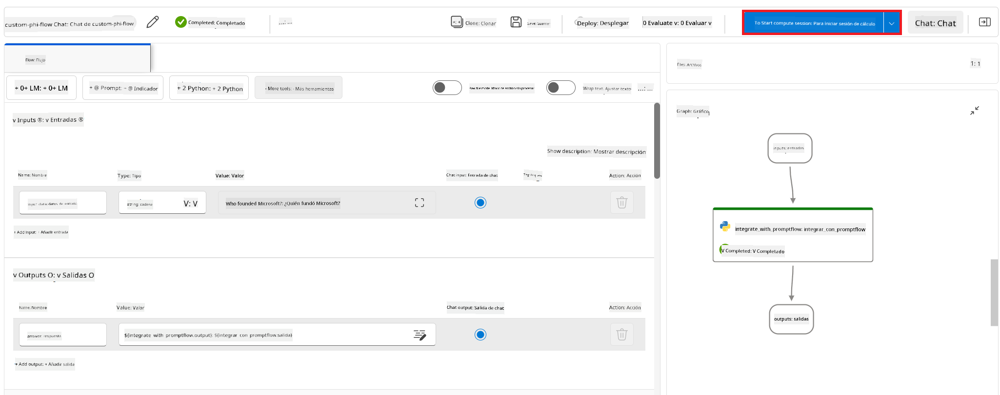

1. Selecciona **Validate and parse input** para renovar los parámetros.

    

1. Selecciona el **Value** de la **connection** a la conexión personalizada que creaste. Por ejemplo, *connection*.

    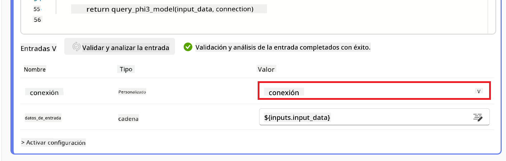

#### Chatear con tu modelo personalizado

1. Selecciona **Chat**.

    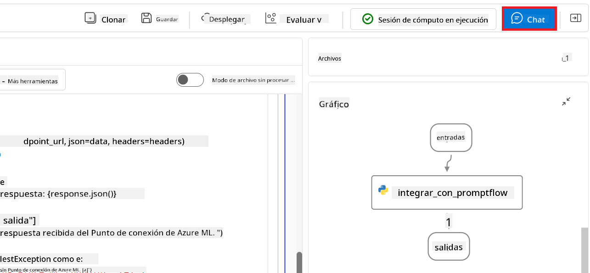

1. Aquí tienes un ejemplo de los resultados: ahora puedes chatear con tu modelo Phi-3 personalizado. Se recomienda hacer preguntas basadas en los datos usados para el afinamiento.

    

**Aviso legal**:  
Este documento ha sido traducido utilizando el servicio de traducción automática [Co-op Translator](https://github.com/Azure/co-op-translator). Aunque nos esforzamos por la precisión, tenga en cuenta que las traducciones automáticas pueden contener errores o inexactitudes. El documento original en su idioma nativo debe considerarse la fuente autorizada. Para información crítica, se recomienda la traducción profesional realizada por humanos. No nos hacemos responsables de malentendidos o interpretaciones erróneas derivadas del uso de esta traducción.