# Ajustar y integrar modelos personalizados Phi-3 con Prompt flow en Microsoft Foundry

Este ejemplo de extremo a extremo (E2E) se basa en la guía "[Fine-Tune and Integrate Custom Phi-3 Models with Prompt Flow in Microsoft Foundry](https://techcommunity.microsoft.com/t5/educator-developer-blog/fine-tune-and-integrate-custom-phi-3-models-with-prompt-flow-in/ba-p/4191726?WT.mc_id=aiml-137032-kinfeylo)" de Microsoft Tech Community. Presenta los procesos de ajuste fino, despliegue e integración de modelos personalizados Phi-3 con Prompt flow en Microsoft Foundry.  
A diferencia del ejemplo E2E, "[Fine-Tune and Integrate Custom Phi-3 Models with Prompt Flow](./E2E_Phi-3-FineTuning_PromptFlow_Integration.md)", que implicaba ejecutar código localmente, este tutorial se centra totalmente en ajustar e integrar su modelo dentro de Azure AI / ML Studio.

## Descripción general

En este ejemplo E2E aprenderá a ajustar el modelo Phi-3 e integrarlo con Prompt flow en Microsoft Foundry. Aprovechando Azure AI / ML Studio, establecerá un flujo de trabajo para desplegar y utilizar modelos de IA personalizados. Este ejemplo E2E se divide en tres escenarios:

**Escenario 1: Configurar recursos de Azure y preparar para ajuste fino**

**Escenario 2: Ajustar el modelo Phi-3 y desplegarlo en Azure Machine Learning Studio**

**Escenario 3: Integrar con Prompt flow y chatear con su modelo personalizado en Microsoft Foundry**

Aquí tiene una vista general de este ejemplo E2E.

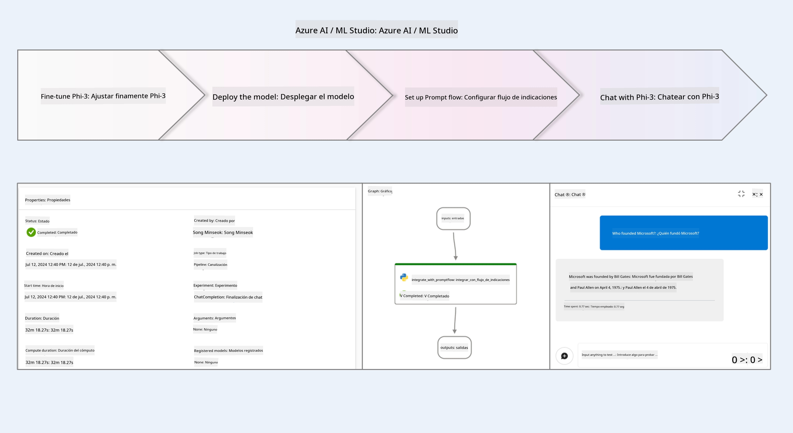

### Tabla de contenido

1. **[Escenario 1: Configurar recursos de Azure y preparar para ajuste fino](../../../../../../md/02.Application/01.TextAndChat/Phi3)**
    - [Crear un espacio de trabajo Azure Machine Learning](../../../../../../md/02.Application/01.TextAndChat/Phi3)
    - [Solicitar cuotas de GPU en la suscripción de Azure](../../../../../../md/02.Application/01.TextAndChat/Phi3)
    - [Agregar asignación de rol](../../../../../../md/02.Application/01.TextAndChat/Phi3)
    - [Configurar proyecto](../../../../../../md/02.Application/01.TextAndChat/Phi3)
    - [Preparar conjunto de datos para ajuste fino](../../../../../../md/02.Application/01.TextAndChat/Phi3)

1. **[Escenario 2: Ajustar modelo Phi-3 y desplegar en Azure Machine Learning Studio](../../../../../../md/02.Application/01.TextAndChat/Phi3)**
    - [Ajustar el modelo Phi-3](../../../../../../md/02.Application/01.TextAndChat/Phi3)
    - [Desplegar el modelo Phi-3 ajustado](../../../../../../md/02.Application/01.TextAndChat/Phi3)

1. **[Escenario 3: Integrar con Prompt flow y chatear con su modelo personalizado en Microsoft Foundry](../../../../../../md/02.Application/01.TextAndChat/Phi3)**
    - [Integrar el modelo Phi-3 personalizado con Prompt flow](../../../../../../md/02.Application/01.TextAndChat/Phi3)
    - [Chatear con su modelo Phi-3 personalizado](../../../../../../md/02.Application/01.TextAndChat/Phi3)

## Escenario 1: Configurar recursos de Azure y preparar para ajuste fino

### Crear un espacio de trabajo Azure Machine Learning

1. Escriba *azure machine learning* en la **barra de búsqueda** en la parte superior de la página del portal y seleccione **Azure Machine Learning** de las opciones que aparecen.

    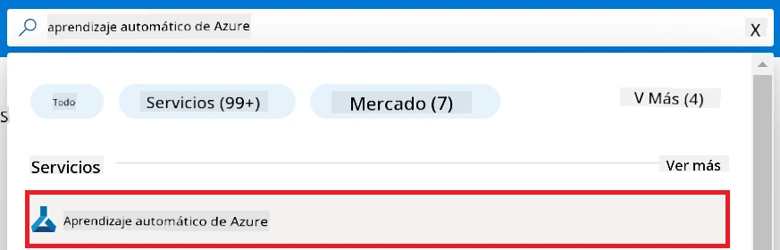

2. Seleccione **+ Crear** en el menú de navegación.

3. Seleccione **Nuevo espacio de trabajo** en el menú de navegación.

    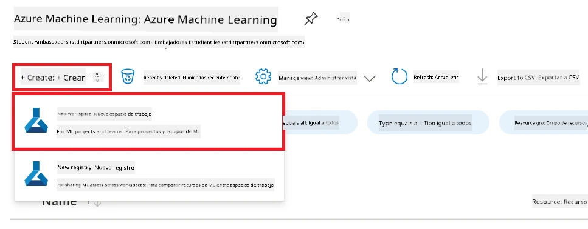

4. Realice las siguientes tareas:

    - Seleccione su **Suscripción** de Azure.
    - Seleccione el **Grupo de recursos** que usará (crea uno nuevo si es necesario).
    - Introduzca el **Nombre del espacio de trabajo**. Debe ser un valor único.
    - Seleccione la **Región** que desea usar.
    - Seleccione la **Cuenta de almacenamiento** que usará (cree una nueva si es necesario).
    - Seleccione el **Bóveda de claves** que usará (crea una nueva si es necesario).
    - Seleccione **Application Insights** que usará (cree uno nuevo si es necesario).
    - Seleccione el **Registro de contenedores** que usará (cree uno nuevo si es necesario).

    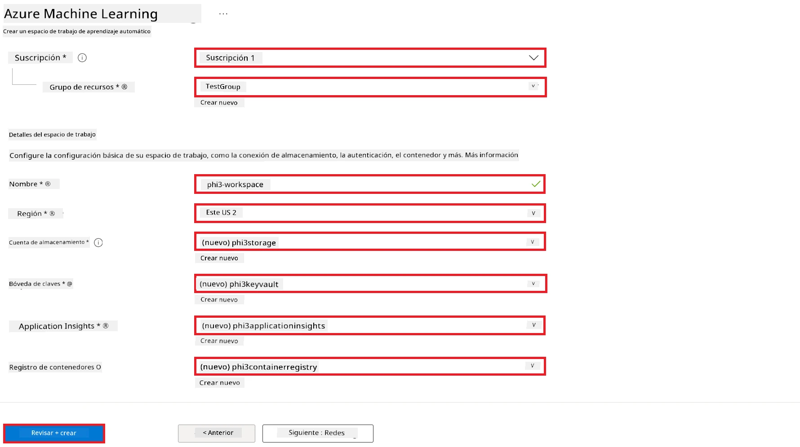

5. Seleccione **Revisar + Crear**.

6. Seleccione **Crear**.

### Solicitar cuotas de GPU en la suscripción de Azure

En este tutorial aprenderá cómo ajustar y desplegar un modelo Phi-3, usando GPUs. Para el ajuste fino, usará la GPU *Standard_NC24ads_A100_v4*, que requiere una solicitud de cuota. Para el despliegue, usará la GPU *Standard_NC6s_v3*, que también requiere solicitud de cuota.

> [!NOTE]
>
> Solo las suscripciones de pago por uso (el tipo de suscripción estándar) son elegibles para la asignación de GPU; las suscripciones con beneficios no están soportadas actualmente.
>

1. Visite [Azure ML Studio](https://ml.azure.com/home?wt.mc_id=studentamb_279723).

1. Realice las siguientes tareas para solicitar cuota del *Standard NCADSA100v4 Family*:

    - Seleccione **Cuota** en la pestaña del lado izquierdo.
    - Seleccione la **Familia de máquinas virtuales** que desea usar. Por ejemplo, seleccione **Standard NCADSA100v4 Family Cluster Dedicated vCPUs**, que incluye la GPU *Standard_NC24ads_A100_v4*.
    - Seleccione **Solicitar cuota** en el menú de navegación.

        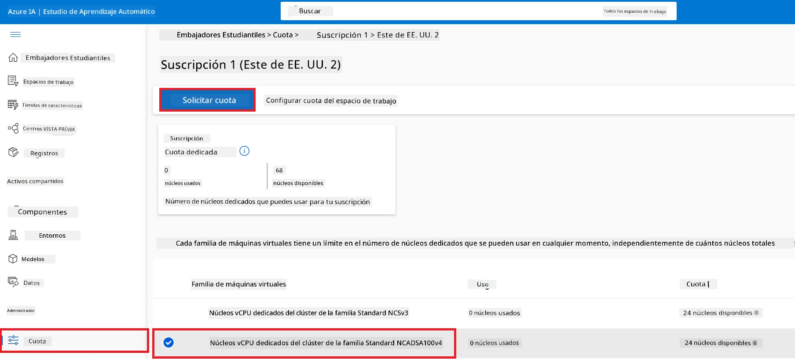

    - En la página Solicitar cuota, introduzca el **Nuevo límite de núcleos** que desee usar. Por ejemplo, 24.
    - En la página Solicitar cuota, seleccione **Enviar** para solicitar la cuota de GPU.

1. Realice las siguientes tareas para solicitar cuota del *Standard NCSv3 Family*:

    - Seleccione **Cuota** en la pestaña de la izquierda.
    - Seleccione la **Familia de máquinas virtuales** que desea usar. Por ejemplo, seleccione **Standard NCSv3 Family Cluster Dedicated vCPUs**, que incluye la GPU *Standard_NC6s_v3*.
    - Seleccione **Solicitar cuota** en el menú de navegación.
    - En la página Solicitar cuota, introduzca el **Nuevo límite de núcleos** que desee usar. Por ejemplo, 24.
    - En la página Solicitar cuota, seleccione **Enviar** para solicitar la cuota de GPU.

### Agregar asignación de rol

Para ajustar y desplegar sus modelos, debe primero crear una Identidad Administrada Asignada por el Usuario (UAI) y asignarle los permisos apropiados. Esta UAI se utilizará para la autenticación durante el despliegue.

#### Crear Identidad Administrada Asignada por el Usuario (UAI)

1. Escriba *identidades administradas* en la **barra de búsqueda** en la parte superior de la página del portal y seleccione **Identidades administradas** de las opciones que aparecen.

    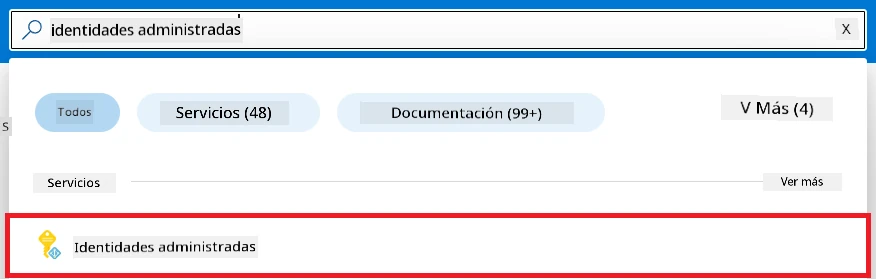

1. Seleccione **+ Crear**.

    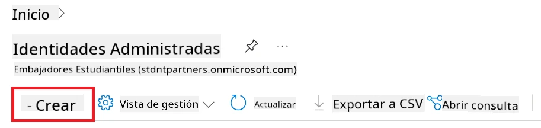

1. Realice las siguientes tareas:

    - Seleccione su **Suscripción** de Azure.
    - Seleccione el **Grupo de recursos** que usará (crea uno nuevo si es necesario).
    - Seleccione la **Región** que desea usar.
    - Introduzca el **Nombre**. Debe ser un valor único.

    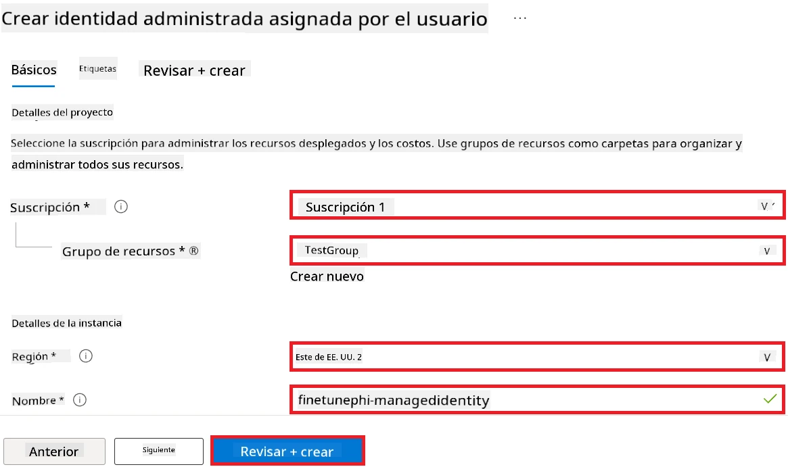

1. Seleccione **Revisar + crear**.

1. Seleccione **+ Crear**.

#### Agregar asignación de rol de colaborador a la Identidad Administrada

1. Navegue al recurso de Identidad Administrada que creó.

1. Seleccione **Asignaciones de roles de Azure** en la pestaña izquierda.

1. Seleccione **+Agregar asignación de rol** en el menú de navegación.

1. En la página Agregar asignación de rol, realice las siguientes tareas:  
    - Seleccione el **Alcance** como **Grupo de recursos**.  
    - Seleccione su **Suscripción** de Azure.  
    - Seleccione el **Grupo de recursos** que usará.  
    - Seleccione el **Rol** como **Colaborador**.

    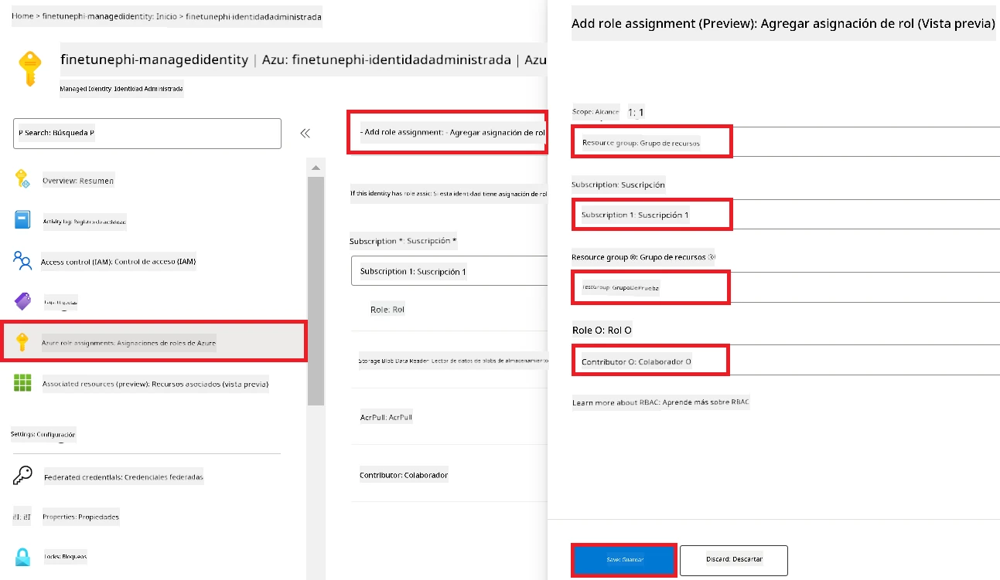

2. Seleccione **Guardar**.

#### Agregar asignación de rol Storage Blob Data Reader a la Identidad Administrada

1. Escriba *cuentas de almacenamiento* en la **barra de búsqueda** en la parte superior de la página del portal y seleccione **Cuentas de almacenamiento** de las opciones que aparecen.

    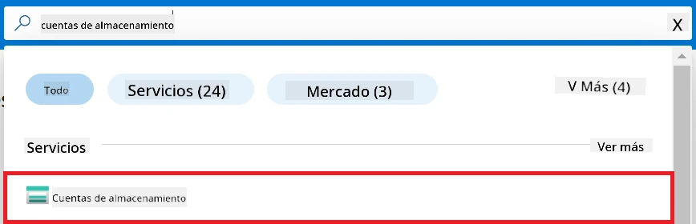

1. Seleccione la cuenta de almacenamiento asociada con el espacio de trabajo Azure Machine Learning que creó. Por ejemplo, *finetunephistorage*.

1. Realice las siguientes tareas para navegar a la página de Agregar asignación de rol:

    - Navegue a la cuenta de almacenamiento de Azure que creó.
    - Seleccione **Control de acceso (IAM)** en la pestaña izquierda.
    - Seleccione **+ Agregar** en el menú de navegación.
    - Seleccione **Agregar asignación de rol** en el menú de navegación.

    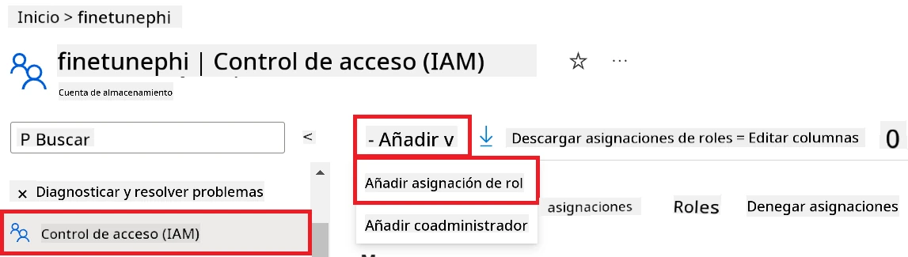

1. En la página Agregar asignación de rol, realice las siguientes tareas:

    - En la página Rol, escriba *Storage Blob Data Reader* en la **barra de búsqueda** y seleccione **Storage Blob Data Reader** en las opciones que aparecen.
    - En la página Rol, seleccione **Siguiente**.
    - En la página Miembros, seleccione **Asignar acceso a** **Identidad administrada**.
    - En la página Miembros, seleccione **+ Seleccionar miembros**.
    - En la página Seleccionar identidades administradas, seleccione su **Suscripción** de Azure.
    - En la página Seleccionar identidades administradas, seleccione la **Identidad Administrada** para **Identidad Administrada**.
    - En la página Seleccionar identidades administradas, seleccione la Identidad Administrada que creó. Por ejemplo, *finetunephi-managedidentity*.
    - En la página Seleccionar identidades administradas, seleccione **Seleccionar**.

    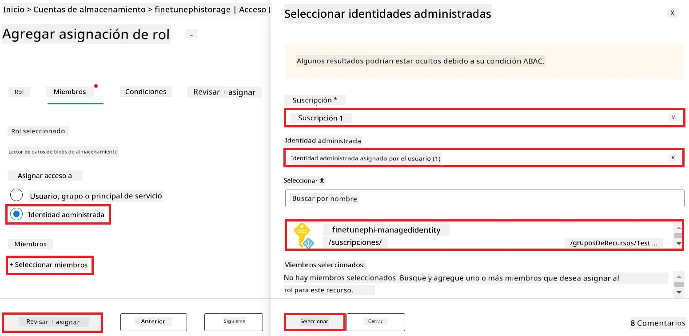

1. Seleccione **Revisar + asignar**.

#### Agregar asignación de rol AcrPull a la Identidad Administrada

1. Escriba *registros de contenedores* en la **barra de búsqueda** en la parte superior de la página del portal y seleccione **Registros de contenedores** de las opciones que aparecen.

    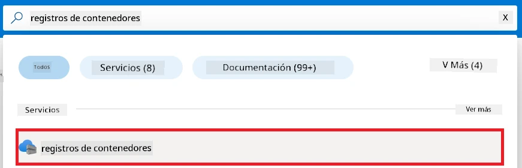

1. Seleccione el registro de contenedores asociado con el espacio de trabajo Azure Machine Learning. Por ejemplo, *finetunephicontainerregistry*

1. Realice las siguientes tareas para navegar a la página de Agregar asignación de rol:

    - Seleccione **Control de acceso (IAM)** en la pestaña izquierda.
    - Seleccione **+ Agregar** en el menú de navegación.
    - Seleccione **Agregar asignación de rol** en el menú de navegación.

1. En la página Agregar asignación de rol, realice las siguientes tareas:

    - En la página Rol, escriba *AcrPull* en la **barra de búsqueda** y seleccione **AcrPull** en las opciones que aparecen.
    - En la página Rol, seleccione **Siguiente**.
    - En la página Miembros, seleccione **Asignar acceso a** **Identidad administrada**.
    - En la página Miembros, seleccione **+ Seleccionar miembros**.
    - En la página Seleccionar identidades administradas, seleccione su **Suscripción** de Azure.
    - En la página Seleccionar identidades administradas, seleccione la **Identidad Administrada** para **Identidad Administrada**.
    - En la página Seleccionar identidades administradas, seleccione la Identidad Administrada que creó. Por ejemplo, *finetunephi-managedidentity*.
    - En la página Seleccionar identidades administradas, seleccione **Seleccionar**.
    - Seleccione **Revisar + asignar**.

### Configurar proyecto

Para descargar los conjuntos de datos necesarios para el ajuste fino, configurará un entorno local.

En este ejercicio usted:

- Creará una carpeta para trabajar dentro de ella.
- Creará un entorno virtual.
- Instalará los paquetes requeridos.
- Creará un archivo *download_dataset.py* para descargar el conjunto de datos.

#### Crear una carpeta para trabajar dentro de ella

1. Abra una ventana de terminal y escriba el siguiente comando para crear una carpeta llamada *finetune-phi* en la ruta predeterminada.

    ```console
    mkdir finetune-phi
    ```

2. Escriba el siguiente comando dentro de su terminal para navegar a la carpeta *finetune-phi* que creó.

    ```console
    cd finetune-phi
    ```

#### Crear un entorno virtual

1. Escriba el siguiente comando dentro de su terminal para crear un entorno virtual llamado *.venv*.
    ```console
    python -m venv .venv
    ```

2. Escriba el siguiente comando en su terminal para activar el entorno virtual.

    ```console
    .venv\Scripts\activate.bat
    ```

> [!NOTE]
> Si funcionó, debería ver *(.venv)* antes del símbolo del sistema.

#### Instalar los paquetes necesarios

1. Escriba los siguientes comandos en su terminal para instalar los paquetes necesarios.

    ```console
    pip install datasets==2.19.1
    ```

#### Crear `download_dataset.py`

> [!NOTE]
> Estructura completa de carpetas:
>
> ```text
> └── YourUserName
> .    └── finetune-phi
> .        └── download_dataset.py
> ```

1. Abra **Visual Studio Code**.

1. Seleccione **Archivo** en la barra de menú.

1. Seleccione **Abrir carpeta**.

1. Seleccione la carpeta *finetune-phi* que creó, ubicada en *C:\Users\yourUserName\finetune-phi*.

    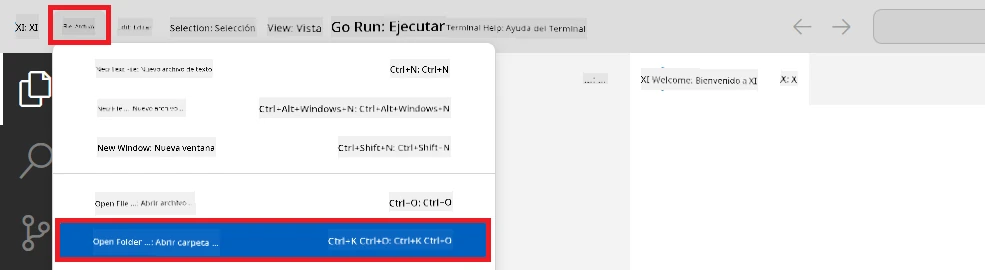

1. En el panel izquierdo de Visual Studio Code, haga clic derecho y seleccione **Nuevo archivo** para crear un nuevo archivo llamado *download_dataset.py*.

    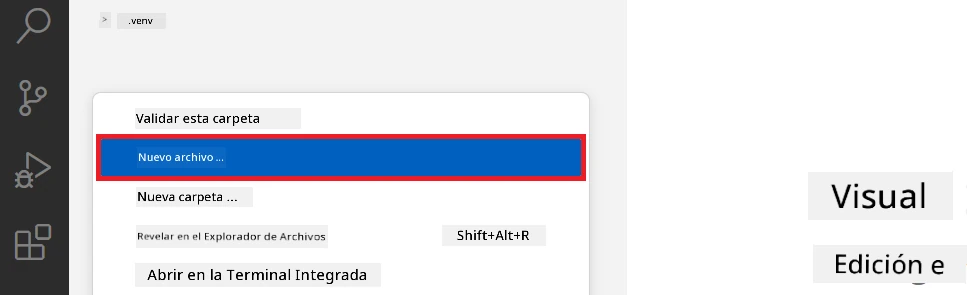

### Preparar dataset para el fine-tuning

En este ejercicio, ejecutará el archivo *download_dataset.py* para descargar los conjuntos de datos *ultrachat_200k* a su entorno local. Luego, usará estos conjuntos de datos para afinar el modelo Phi-3 en Azure Machine Learning.

En este ejercicio, usted:

- Agregará código al archivo *download_dataset.py* para descargar los conjuntos de datos.
- Ejecutará el archivo *download_dataset.py* para descargar los conjuntos de datos a su entorno local.

#### Descargar su dataset usando *download_dataset.py*

1. Abra el archivo *download_dataset.py* en Visual Studio Code.

1. Agregue el siguiente código en el archivo *download_dataset.py*.

    ```python
    import json
    import os
    from datasets import load_dataset

    def load_and_split_dataset(dataset_name, config_name, split_ratio):
        """
        Load and split a dataset.
        """
        # Cargar el conjunto de datos con el nombre, configuración y proporción de división especificados
        dataset = load_dataset(dataset_name, config_name, split=split_ratio)
        print(f"Original dataset size: {len(dataset)}")
        
        # Dividir el conjunto de datos en conjuntos de entrenamiento y prueba (80% entrenamiento, 20% prueba)
        split_dataset = dataset.train_test_split(test_size=0.2)
        print(f"Train dataset size: {len(split_dataset['train'])}")
        print(f"Test dataset size: {len(split_dataset['test'])}")
        
        return split_dataset

    def save_dataset_to_jsonl(dataset, filepath):
        """
        Save a dataset to a JSONL file.
        """
        # Crear el directorio si no existe
        os.makedirs(os.path.dirname(filepath), exist_ok=True)
        
        # Abrir el archivo en modo de escritura
        with open(filepath, 'w', encoding='utf-8') as f:
            # Iterar sobre cada registro en el conjunto de datos
            for record in dataset:
                # Volcar el registro como un objeto JSON y escribirlo en el archivo
                json.dump(record, f)
                # Escribir un carácter de nueva línea para separar los registros
                f.write('\n')
        
        print(f"Dataset saved to {filepath}")

    def main():
        """
        Main function to load, split, and save the dataset.
        """
        # Cargar y dividir el conjunto de datos ULTRACHAT_200k con una configuración y proporción de división específicas
        dataset = load_and_split_dataset("HuggingFaceH4/ultrachat_200k", 'default', 'train_sft[:1%]')
        
        # Extraer los conjuntos de datos de entrenamiento y prueba de la división
        train_dataset = dataset['train']
        test_dataset = dataset['test']

        # Guardar el conjunto de datos de entrenamiento en un archivo JSONL
        save_dataset_to_jsonl(train_dataset, "data/train_data.jsonl")
        
        # Guardar el conjunto de datos de prueba en un archivo JSONL separado
        save_dataset_to_jsonl(test_dataset, "data/test_data.jsonl")

    if __name__ == "__main__":
        main()

    ```

1. Escriba el siguiente comando en su terminal para ejecutar el script y descargar el conjunto de datos a su entorno local.

    ```console
    python download_dataset.py
    ```

1. Verifique que los conjuntos de datos se hayan guardado correctamente en su directorio local *finetune-phi/data*.

> [!NOTE]
>
> #### Nota sobre el tamaño del dataset y el tiempo de fine-tuning
>
> En este tutorial, usa solo el 1% del dataset (`split='train[:1%]'`). Esto reduce significativamente la cantidad de datos, acelerando tanto la carga como los procesos de fine-tuning. Puede ajustar el porcentaje para encontrar el equilibrio adecuado entre tiempo de entrenamiento y rendimiento del modelo. Usar un subconjunto más pequeño del dataset reduce el tiempo necesario para el fine-tuning, haciendo el proceso más manejable para un tutorial.

## Escenario 2: Afinar el modelo Phi-3 y desplegar en Azure Machine Learning Studio

### Afinar el modelo Phi-3

En este ejercicio, afinará el modelo Phi-3 en Azure Machine Learning Studio.

En este ejercicio, usted:

- Creará un clúster de computación para el fine-tuning.
- Afinará el modelo Phi-3 en Azure Machine Learning Studio.

#### Crear un clúster de computación para el fine-tuning

1. Visite [Azure ML Studio](https://ml.azure.com/home?wt.mc_id=studentamb_279723).

1. Seleccione **Compute** en la pestaña lateral izquierda.

1. Seleccione **Compute clusters** en el menú de navegación.

1. Seleccione **+ Nuevo**.

    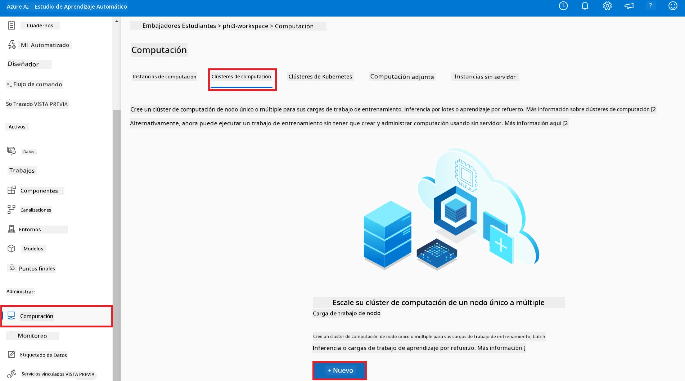

1. Realice las siguientes tareas:

    - Seleccione la **Región** que desea usar.
    - Seleccione el **Nivel de máquina virtual** como **Dedicado**.
    - Seleccione el **Tipo de máquina virtual** como **GPU**.
    - Filtre el **Tamaño de máquina virtual** a **Seleccionar de todas las opciones**.
    - Seleccione el **Tamaño de máquina virtual** a **Standard_NC24ads_A100_v4**.

    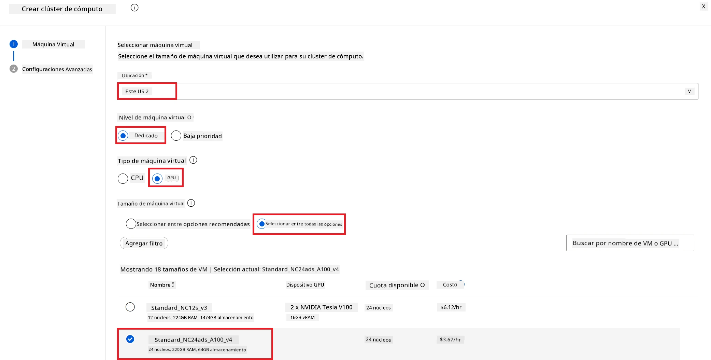

1. Seleccione **Siguiente**.

1. Realice las siguientes tareas:

    - Ingrese el **Nombre del clúster**. Debe ser un valor único.
    - Seleccione el **Número mínimo de nodos** a **0**.
    - Seleccione el **Número máximo de nodos** a **1**.
    - Seleccione los **Segundos de inactividad antes de reducir** a **120**.

    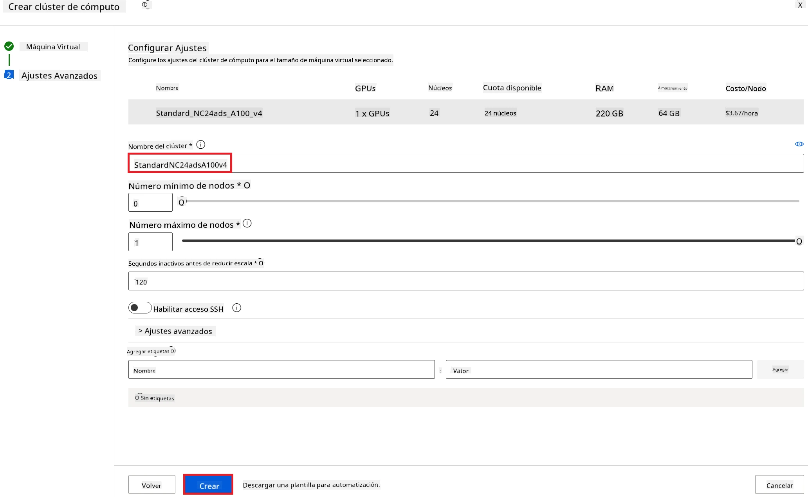

1. Seleccione **Crear**.

#### Afinar el modelo Phi-3

1. Visite [Azure ML Studio](https://ml.azure.com/home?wt.mc_id=studentamb_279723).

1. Seleccione el espacio de trabajo de Azure Machine Learning que creó.

    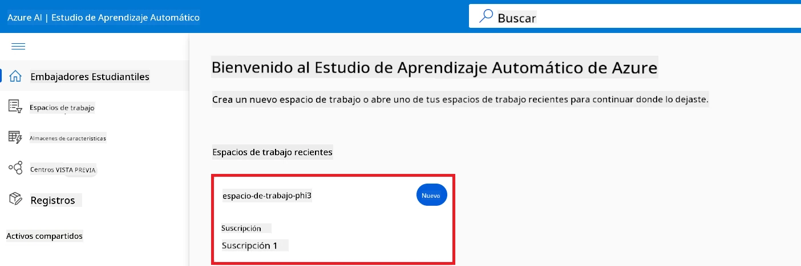

1. Realice las siguientes tareas:

    - Seleccione **Catálogo de modelos** en la pestaña lateral izquierda.
    - Escriba *phi-3-mini-4k* en la **barra de búsqueda** y seleccione **Phi-3-mini-4k-instruct** de las opciones que aparezcan.

    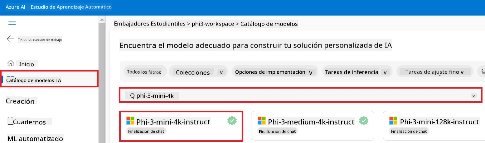

1. Seleccione **Afinar** en el menú de navegación.

    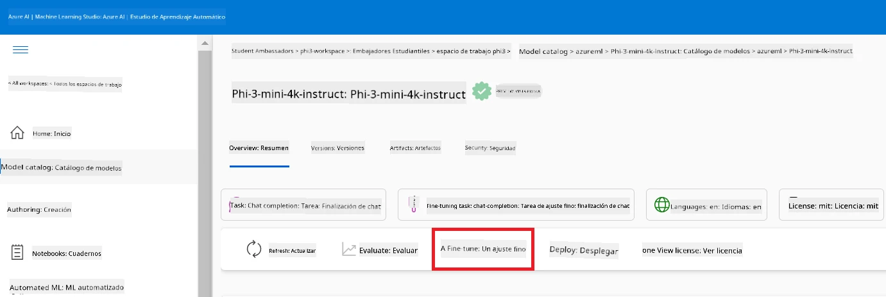

1. Realice las siguientes tareas:

    - Seleccione **Tipo de tarea** como **Chat completion**.
    - Seleccione **+ Seleccionar datos** para cargar los **Datos de entrenamiento**.
    - Seleccione el tipo de carga de datos de validación a **Proporcionar diferentes datos de validación**.
    - Seleccione **+ Seleccionar datos** para cargar los **Datos de validación**.

    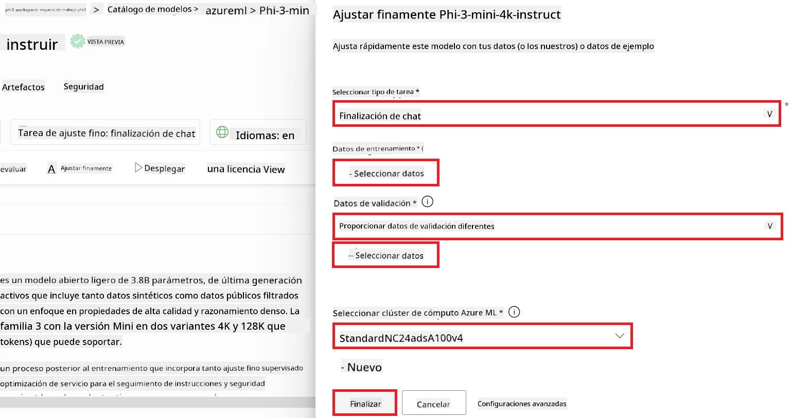

> [!TIP]
>
> Puede seleccionar **Configuración avanzada** para personalizar configuraciones como **learning_rate** y **lr_scheduler_type** para optimizar el proceso de fine-tuning según sus necesidades específicas.

1. Seleccione **Finalizar**.

1. En este ejercicio, afinó exitosamente el modelo Phi-3 usando Azure Machine Learning. Tenga en cuenta que el proceso de fine-tuning puede tardar bastante tiempo. Después de iniciar el trabajo de fine-tuning, debe esperar a que se complete. Puede monitorear el estado del trabajo de fine-tuning navegando a la pestaña Trabajos en el lado izquierdo de su espacio de trabajo de Azure Machine Learning. En la siguiente serie, desplegará el modelo afinado e integrará con Prompt flow.

    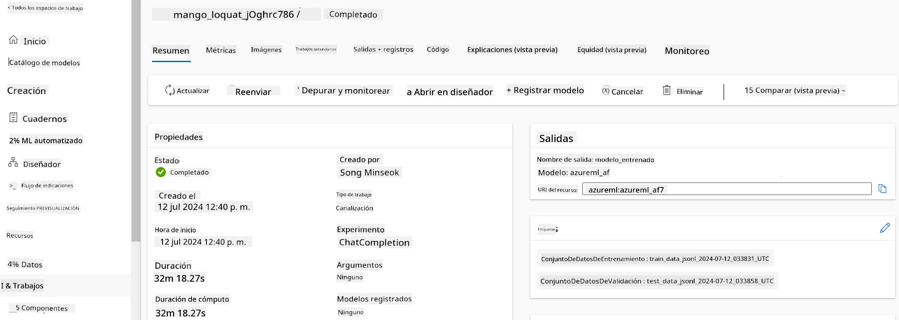

### Desplegar el modelo Phi-3 afinado

Para integrar el modelo Phi-3 afinado con Prompt flow, necesita desplegar el modelo para hacerlo accesible para inferencia en tiempo real. Este proceso incluye registrar el modelo, crear un endpoint en línea y desplegar el modelo.

En este ejercicio, usted:

- Registrará el modelo afinado en el espacio de trabajo de Azure Machine Learning.
- Creará un endpoint en línea.
- Desplegará el modelo Phi-3 afinado registrado.

#### Registrar el modelo afinado

1. Visite [Azure ML Studio](https://ml.azure.com/home?wt.mc_id=studentamb_279723).

1. Seleccione el espacio de trabajo de Azure Machine Learning que creó.

    

1. Seleccione **Modelos** en la pestaña lateral izquierda.
1. Seleccione **+ Registrar**.
1. Seleccione **Desde la salida de un trabajo**.

    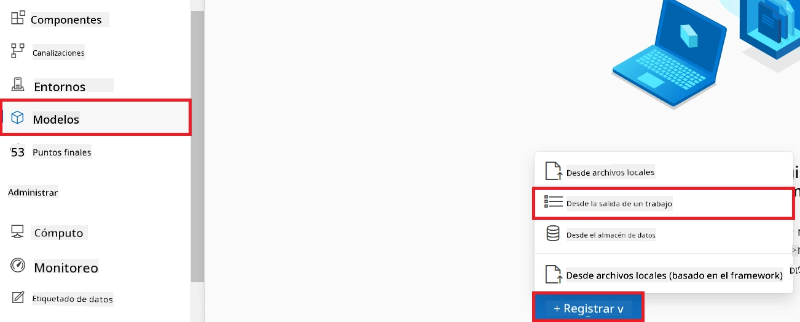

1. Seleccione el trabajo que creó.

    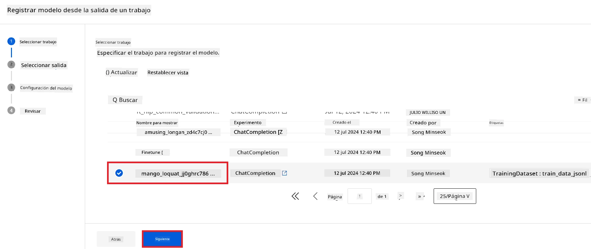

1. Seleccione **Siguiente**.

1. Seleccione **Tipo de modelo** como **MLflow**.

1. Asegúrese que **Salida del trabajo** esté seleccionada; debería estar seleccionada automáticamente.

    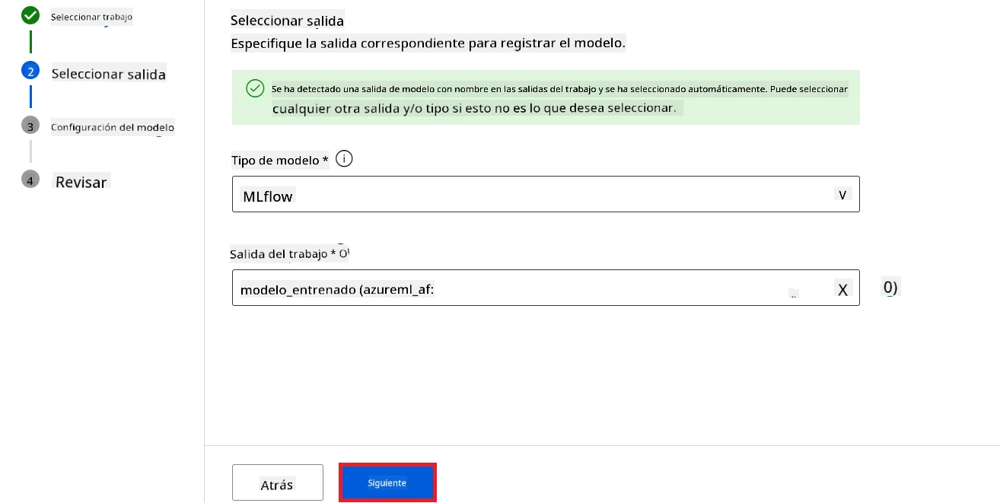

2. Seleccione **Siguiente**.

3. Seleccione **Registrar**.

    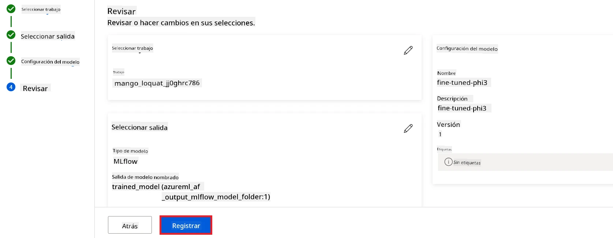

4. Puede ver su modelo registrado navegando al menú **Modelos** en la pestaña lateral izquierda.

    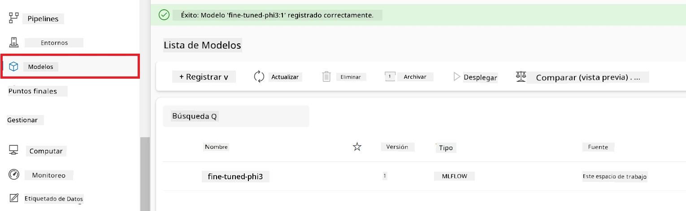

#### Desplegar el modelo afinado

1. Navegue al espacio de trabajo de Azure Machine Learning que creó.

1. Seleccione **EndPoints** en la pestaña lateral izquierda.

1. Seleccione **Endpoints en tiempo real** en el menú de navegación.

    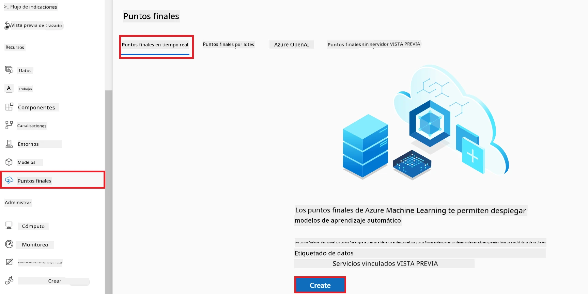

1. Seleccione **Crear**.

1. Seleccione el modelo registrado que creó.

    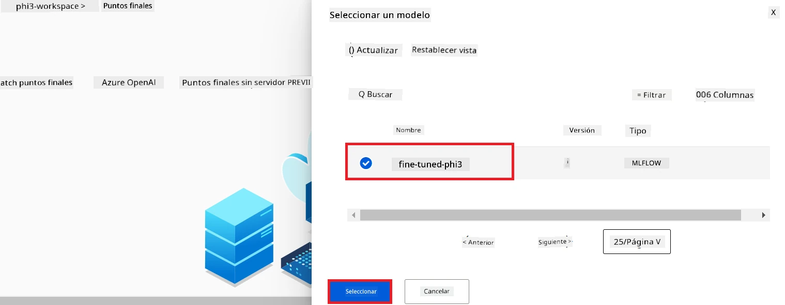

1. Seleccione **Seleccionar**.

1. Realice las siguientes tareas:

    - Seleccione **Máquina virtual** a *Standard_NC6s_v3*.
    - Seleccione la **Cantidad de instancias** que desea usar. Por ejemplo, *1*.
    - Seleccione el **Endpoint** a **Nuevo** para crear un endpoint.
    - Ingrese el **Nombre del endpoint**. Debe ser un valor único.
    - Ingrese el **Nombre de despliegue**. Debe ser un valor único.

    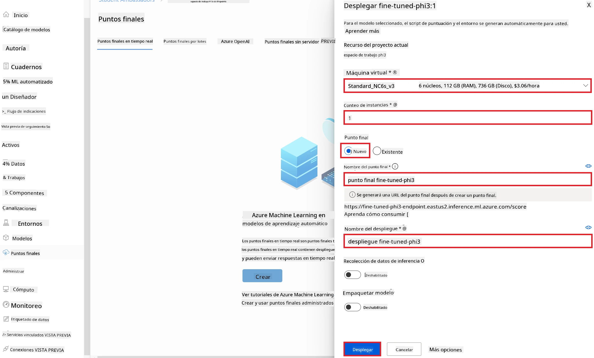

1. Seleccione **Desplegar**.

> [!WARNING]
> Para evitar cargos adicionales en su cuenta, asegúrese de eliminar el endpoint creado en el espacio de trabajo de Azure Machine Learning.
>

#### Verificar estado de despliegue en Azure Machine Learning Workspace

1. Navegue al espacio de trabajo de Azure Machine Learning que creó.

1. Seleccione **Endpoints** en la pestaña lateral izquierda.

1. Seleccione el endpoint que creó.

    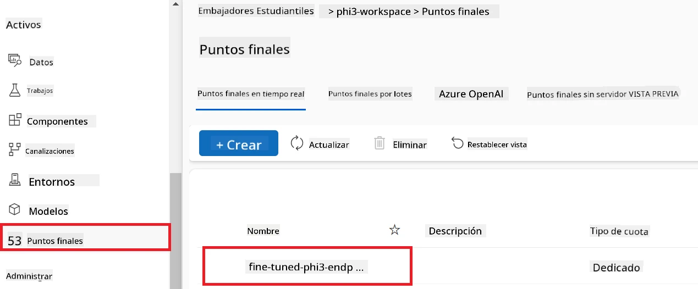

1. En esta página, puede administrar los endpoints durante el proceso de despliegue.

> [!NOTE]
> Una vez que el despliegue esté completo, asegúrese de que **Tráfico en vivo** esté configurado en **100%**. Si no es así, seleccione **Actualizar tráfico** para ajustar la configuración. Tenga en cuenta que no podrá probar el modelo si el tráfico está configurado a 0%.
>
> 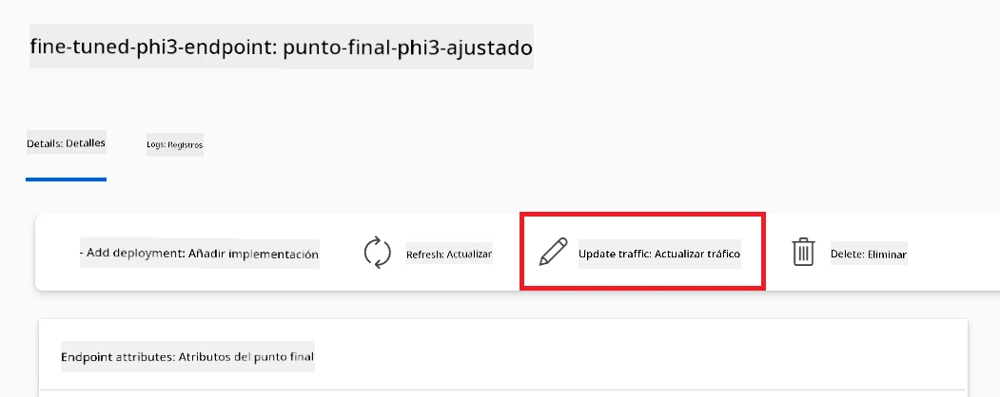
>

## Escenario 3: Integrar con Prompt flow y chatear con su modelo personalizado en Microsoft Foundry

### Integrar el modelo Phi-3 personalizado con Prompt flow

Después de desplegar con éxito su modelo afinado, ahora puede integrarlo con Prompt Flow para usar su modelo en aplicaciones en tiempo real, habilitando una variedad de tareas interactivas con su modelo Phi-3 personalizado.

En este ejercicio, usted:

- Creará Microsoft Foundry Hub.
- Creará un proyecto de Microsoft Foundry.
- Creará un Prompt flow.
- Agregará una conexión personalizada para el modelo Phi-3 afinado.
- Configurará Prompt flow para chatear con su modelo Phi-3 personalizado.

> [!NOTE]
> También puede integrar con Promptflow usando Azure ML Studio. El mismo proceso de integración se puede aplicar a Azure ML Studio.

#### Crear Microsoft Foundry Hub

Necesita crear un Hub antes de crear el Proyecto. Un Hub funciona como un Grupo de Recursos, permitiéndole organizar y administrar múltiples proyectos dentro de Microsoft Foundry.
1. Visita [Microsoft Foundry](https://ai.azure.com/?WT.mc_id=aiml-137032-kinfeylo).

1. Selecciona **All hubs** en la pestaña lateral izquierda.

1. Selecciona **+ New hub** en el menú de navegación.

    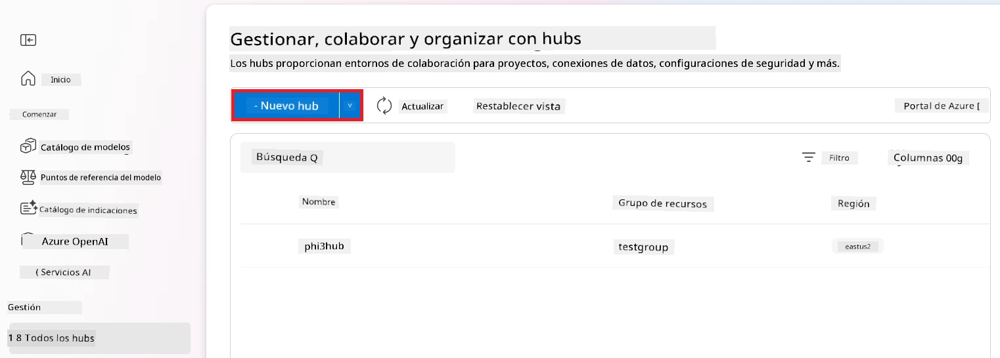

1. Realiza las siguientes tareas:

    - Ingresa el **Hub name**. Debe ser un valor único.
    - Selecciona tu **Subscription** de Azure.
    - Selecciona el **Resource group** a usar (crea uno nuevo si es necesario).
    - Selecciona la **Location** que deseas usar.
    - Selecciona **Connect Azure AI Services** para usar (crea uno nuevo si es necesario).
    - Selecciona **Connect Azure AI Search** para **Skip connecting**.

    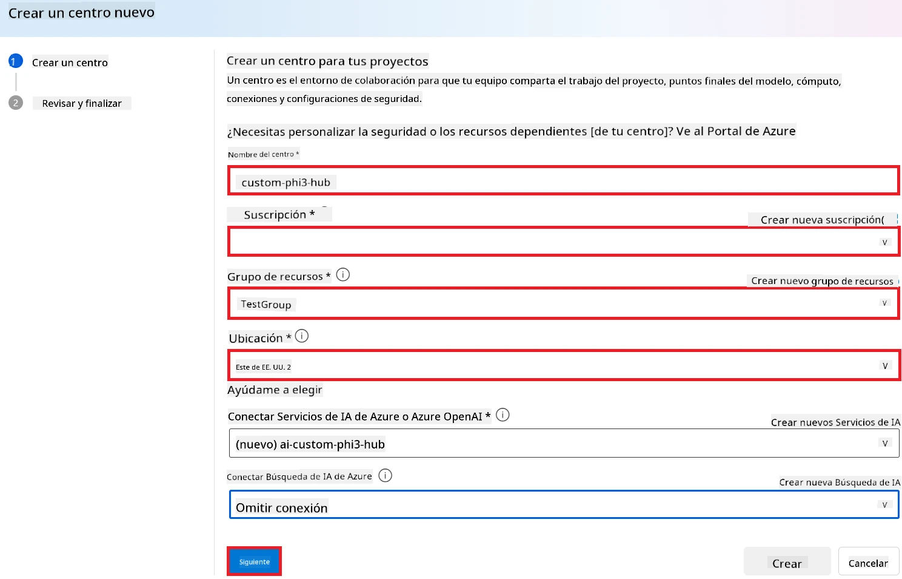

1. Selecciona **Next**.

#### Crear proyecto en Microsoft Foundry

1. En el Hub que creaste, selecciona **All projects** en la pestaña lateral izquierda.

1. Selecciona **+ New project** en el menú de navegación.

    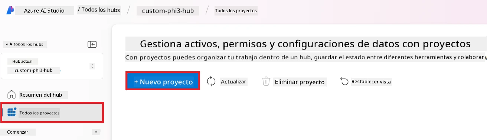

1. Ingresa el **Project name**. Debe ser un valor único.

    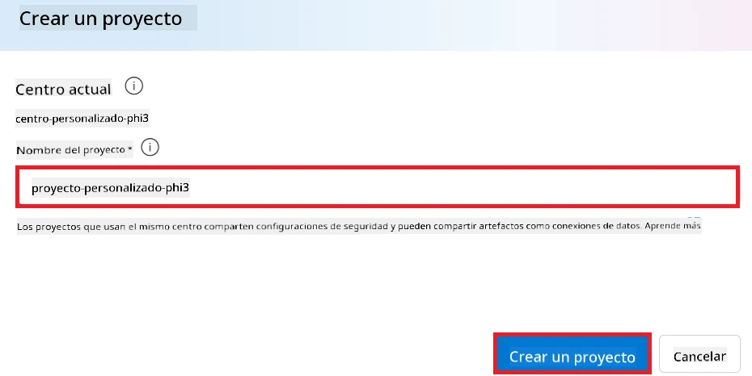

1. Selecciona **Create a project**.

#### Agregar una conexión personalizada para el modelo fine-tuned Phi-3

Para integrar tu modelo Phi-3 personalizado con Prompt flow, necesitas guardar el endpoint y la clave del modelo en una conexión personalizada. Esta configuración asegura el acceso a tu modelo Phi-3 personalizado en Prompt flow.

#### Establecer clave de API y URI del endpoint del modelo fine-tuned Phi-3

1. Visita [Azure ML Studio](https://ml.azure.com/home?WT.mc_id=aiml-137032-kinfeylo).

1. Navega al espacio de trabajo de Azure Machine Learning que creaste.

1. Selecciona **Endpoints** en la pestaña lateral izquierda.

    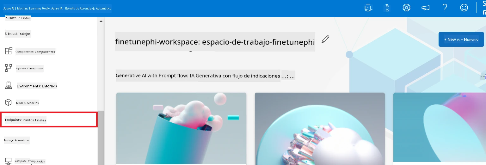

1. Selecciona el endpoint que creaste.

    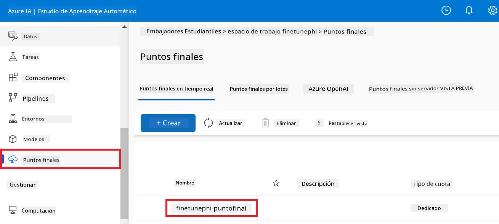

1. Selecciona **Consume** en el menú de navegación.

1. Copia tu **REST endpoint** y **Primary key**.

    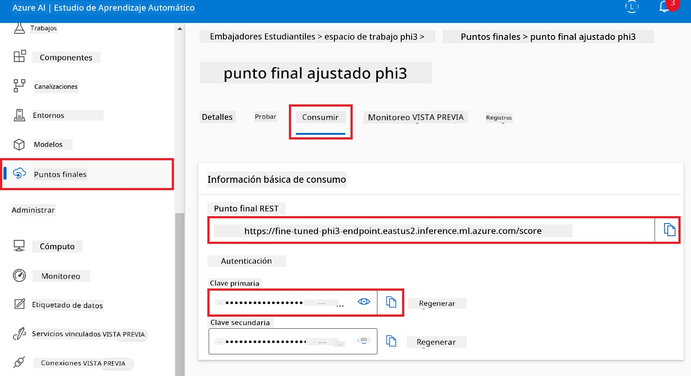

#### Agregar la conexión personalizada

1. Visita [Microsoft Foundry](https://ai.azure.com/?WT.mc_id=aiml-137032-kinfeylo).

1. Navega al proyecto de Microsoft Foundry que creaste.

1. En el proyecto que creaste, selecciona **Settings** en la pestaña lateral izquierda.

1. Selecciona **+ New connection**.

    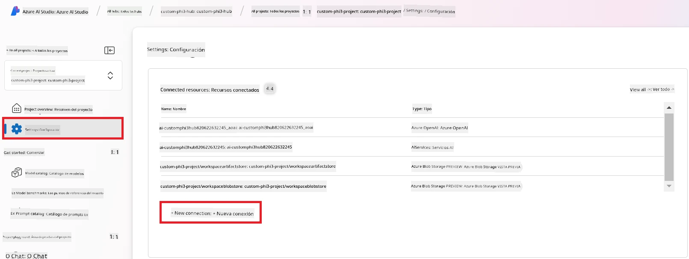

1. Selecciona **Custom keys** en el menú de navegación.

    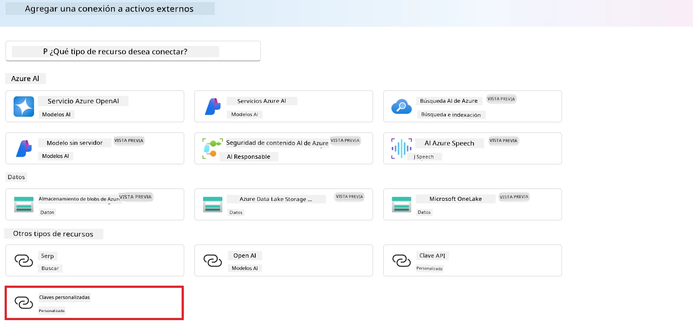

1. Realiza las siguientes tareas:

    - Selecciona **+ Add key value pairs**.
    - Para el nombre de la clave, ingresa **endpoint** y pega el endpoint copiado de Azure ML Studio en el campo valor.
    - Selecciona **+ Add key value pairs** de nuevo.
    - Para el nombre de la clave, ingresa **key** y pega la clave copiada de Azure ML Studio en el campo valor.
    - Después de agregar las claves, selecciona **is secret** para evitar que la clave sea expuesta.

    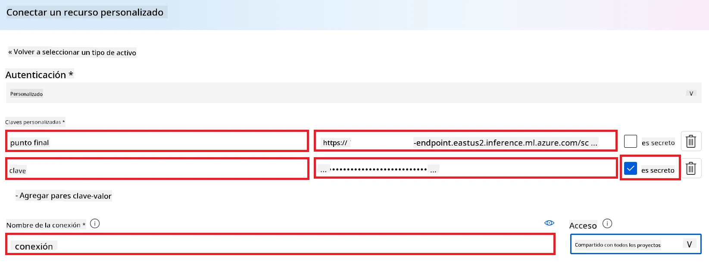

1. Selecciona **Add connection**.

#### Crear Prompt flow

Has agregado una conexión personalizada en Microsoft Foundry. Ahora, vamos a crear un Prompt flow usando los siguientes pasos. Después, conectarás este Prompt flow a la conexión personalizada para que puedas usar el modelo fine-tuned dentro del Prompt flow.

1. Navega al proyecto de Microsoft Foundry que creaste.

1. Selecciona **Prompt flow** en la pestaña lateral izquierda.

1. Selecciona **+ Create** en el menú de navegación.

    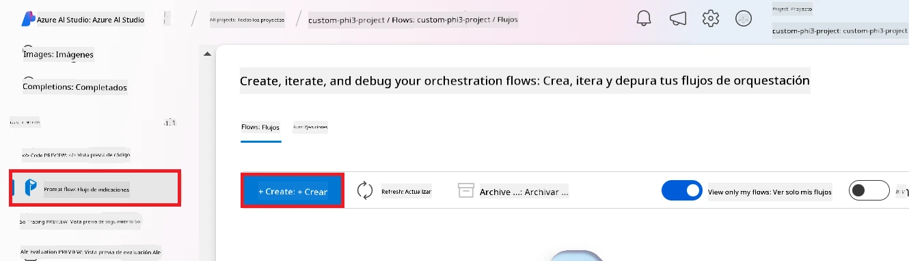

1. Selecciona **Chat flow** en el menú de navegación.

    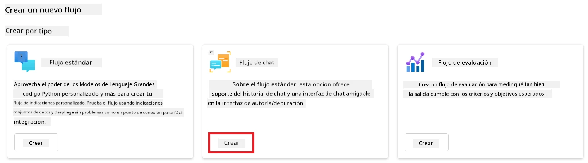

1. Ingresa el **Folder name** a usar.

    

2. Selecciona **Create**.

#### Configurar Prompt flow para chatear con tu modelo Phi-3 personalizado

Necesitas integrar el modelo Phi-3 fine-tuned en un Prompt flow. Sin embargo, el Prompt flow existente no está diseñado para este propósito. Por lo tanto, debes rediseñar el Prompt flow para permitir la integración del modelo personalizado.

1. En el Prompt flow, realiza las siguientes tareas para reconstruir el flujo existente:

    - Selecciona **Raw file mode**.
    - Elimina todo el código existente en el archivo *flow.dag.yml*.
    - Agrega el siguiente código al archivo *flow.dag.yml*.

        ```yml
        inputs:
          input_data:
            type: string
            default: "Who founded Microsoft?"

        outputs:
          answer:
            type: string
            reference: ${integrate_with_promptflow.output}

        nodes:
        - name: integrate_with_promptflow
          type: python
          source:
            type: code
            path: integrate_with_promptflow.py
          inputs:
            input_data: ${inputs.input_data}
        ```

    - Selecciona **Save**.

    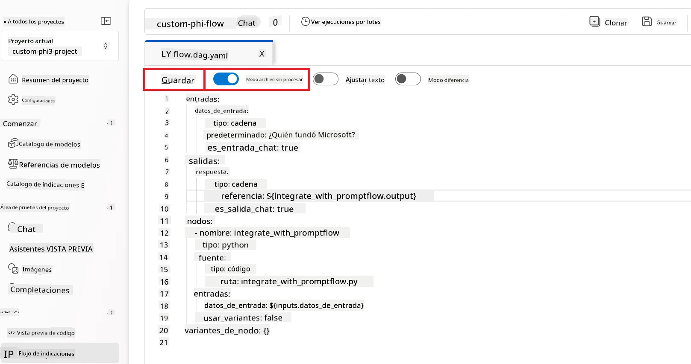

1. Agrega el siguiente código al archivo *integrate_with_promptflow.py* para usar el modelo Phi-3 personalizado en Prompt flow.

    ```python
    import logging
    import requests
    from promptflow import tool
    from promptflow.connections import CustomConnection

    # Configuración del registro
    logging.basicConfig(
        format="%(asctime)s - %(levelname)s - %(name)s - %(message)s",
        datefmt="%Y-%m-%d %H:%M:%S",
        level=logging.DEBUG
    )
    logger = logging.getLogger(__name__)

    def query_phi3_model(input_data: str, connection: CustomConnection) -> str:
        """
        Send a request to the Phi-3 model endpoint with the given input data using Custom Connection.
        """

        # "connection" es el nombre de la Conexión Personalizada, "endpoint", "key" son las claves en la Conexión Personalizada
        endpoint_url = connection.endpoint
        api_key = connection.key

        headers = {
            "Content-Type": "application/json",
            "Authorization": f"Bearer {api_key}"
        }
        data = {
            "input_data": {
                "input_string": [
                    {"role": "user", "content": input_data}
                ],
                "parameters": {
                    "temperature": 0.7,
                    "max_new_tokens": 128
                }
            }
        }
        try:
            response = requests.post(endpoint_url, json=data, headers=headers)
            response.raise_for_status()
            
            # Registrar la respuesta JSON completa
            logger.debug(f"Full JSON response: {response.json()}")

            result = response.json()["output"]
            logger.info("Successfully received response from Azure ML Endpoint.")
            return result
        except requests.exceptions.RequestException as e:
            logger.error(f"Error querying Azure ML Endpoint: {e}")
            raise

    @tool
    def my_python_tool(input_data: str, connection: CustomConnection) -> str:
        """
        Tool function to process input data and query the Phi-3 model.
        """
        return query_phi3_model(input_data, connection)

    ```

    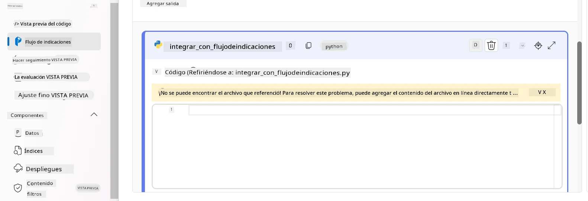

> [!NOTE]
> Para información más detallada sobre el uso de Prompt flow en Microsoft Foundry, puedes consultar [Prompt flow en Microsoft Foundry](https://learn.microsoft.com/azure/ai-studio/how-to/prompt-flow).

1. Selecciona **Chat input**, **Chat output** para habilitar el chat con tu modelo.

    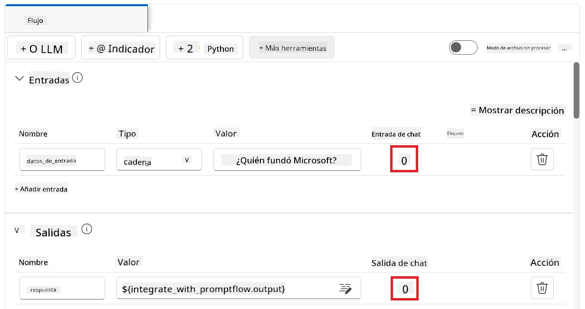

1. Ahora estás listo para chatear con tu modelo Phi-3 personalizado. En el siguiente ejercicio, aprenderás cómo iniciar Prompt flow y usarlo para chatear con tu modelo Phi-3 fine-tuned.

> [!NOTE]
>
> El flujo reconstruido debería verse como la imagen a continuación:
>
> 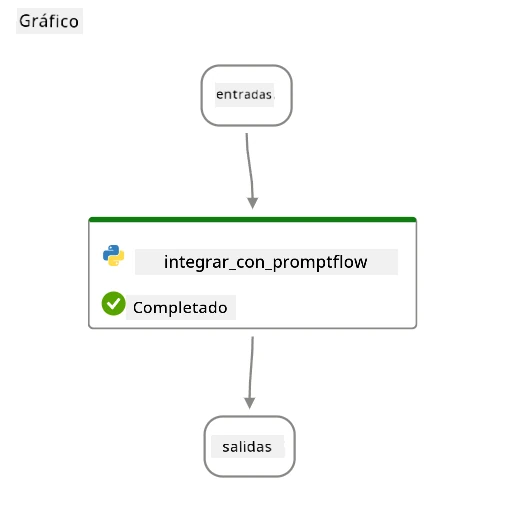
>

### Chatea con tu modelo Phi-3 personalizado

Ahora que has fine-tuned e integrado tu modelo Phi-3 personalizado con Prompt flow, estás listo para empezar a interactuar con él. Este ejercicio te guiará a través del proceso de configuración e inicio de un chat con tu modelo usando Prompt flow. Siguiendo estos pasos, podrás aprovechar al máximo las capacidades de tu modelo Phi-3 fine-tuned para diversas tareas y conversaciones.

- Chatea con tu modelo Phi-3 personalizado usando Prompt flow.

#### Iniciar Prompt flow

1. Selecciona **Start compute sessions** para iniciar Prompt flow.

    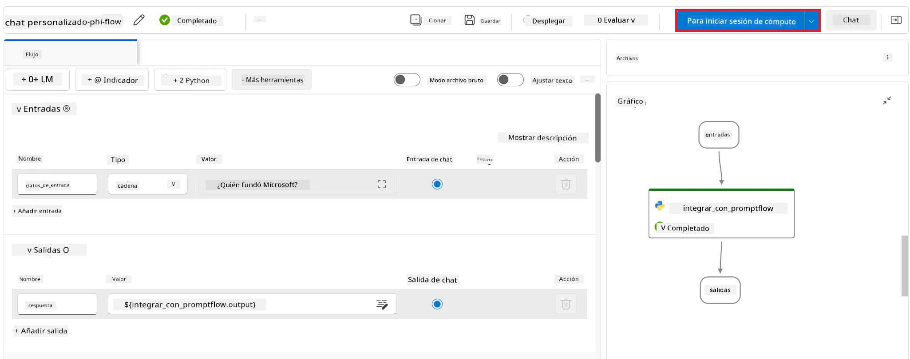

1. Selecciona **Validate and parse input** para renovar parámetros.

    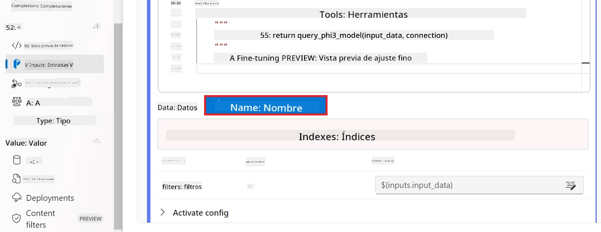

1. Selecciona el **Value** de la **connection** a la conexión personalizada que creaste. Por ejemplo, *connection*.

    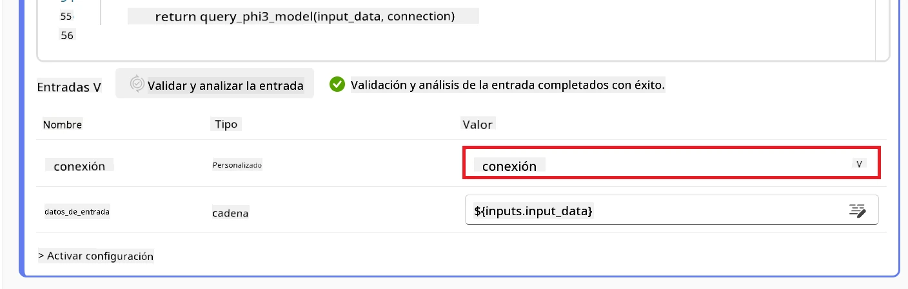

#### Chatea con tu modelo personalizado

1. Selecciona **Chat**.

    

1. Aquí tienes un ejemplo de los resultados: Ahora puedes chatear con tu modelo Phi-3 personalizado. Se recomienda hacer preguntas basadas en los datos usados para el fine-tuning.

    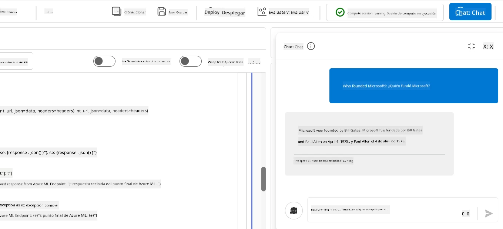

---

<!-- CO-OP TRANSLATOR DISCLAIMER START -->
**Aviso Legal**:
Este documento ha sido traducido utilizando el servicio de traducción automática [Co-op Translator](https://github.com/Azure/co-op-translator). Aunque nos esforzamos por la precisión, tenga en cuenta que las traducciones automáticas pueden contener errores o inexactitudes. El documento original en su idioma nativo debe considerarse la fuente autorizada. Para información crítica, se recomienda una traducción profesional realizada por humanos. No nos responsabilizamos por malentendidos o interpretaciones erróneas derivadas del uso de esta traducción.
<!-- CO-OP TRANSLATOR DISCLAIMER END -->