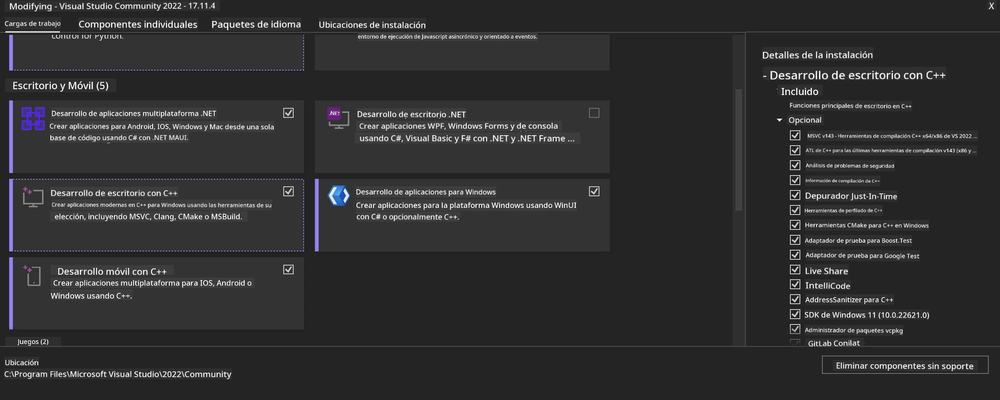
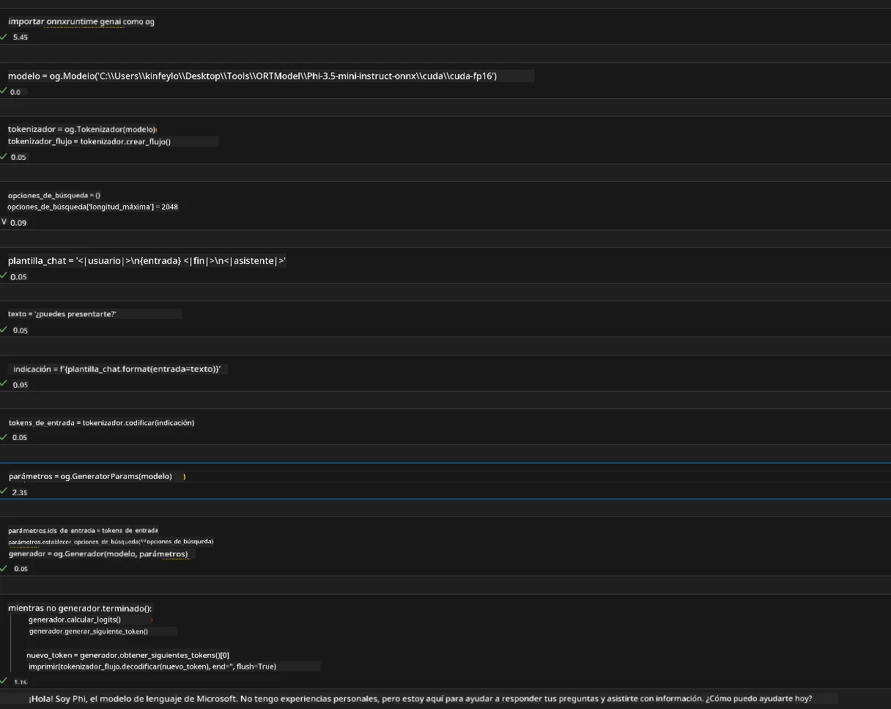
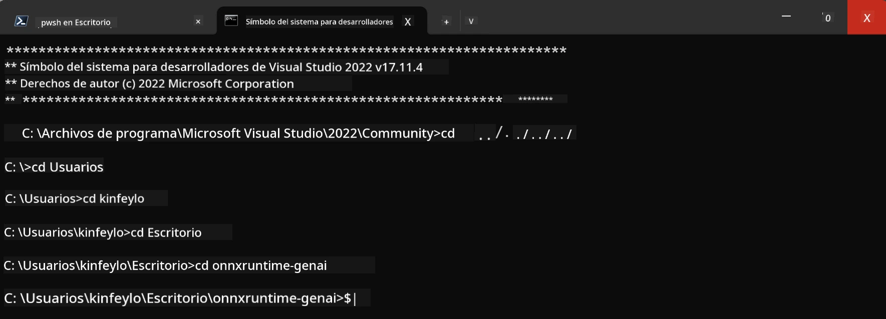

<!--
CO_OP_TRANSLATOR_METADATA:
{
  "original_hash": "b066fc29c1b2129df84e027cb75119ce",
  "translation_date": "2025-07-17T02:38:25+00:00",
  "source_file": "md/02.Application/01.TextAndChat/Phi3/ORTWindowGPUGuideline.md",
  "language_code": "es"
}
-->
# **Guía para OnnxRuntime GenAI Windows GPU**

Esta guía proporciona los pasos para configurar y usar ONNX Runtime (ORT) con GPUs en Windows. Está diseñada para ayudarte a aprovechar la aceleración por GPU en tus modelos, mejorando el rendimiento y la eficiencia.

El documento ofrece orientación sobre:

- Configuración del entorno: Instrucciones para instalar las dependencias necesarias como CUDA, cuDNN y ONNX Runtime.
- Configuración: Cómo configurar el entorno y ONNX Runtime para utilizar eficazmente los recursos de la GPU.
- Consejos de optimización: Recomendaciones para ajustar la configuración de la GPU y obtener el mejor rendimiento.

### **1. Python 3.10.x /3.11.8**

   ***Nota*** Se recomienda usar [miniforge](https://github.com/conda-forge/miniforge/releases/latest/download/Miniforge3-Windows-x86_64.exe) como tu entorno de Python

   ```bash

   conda create -n pydev python==3.11.8

   conda activate pydev

   ```

   ***Recordatorio*** Si tienes instalada alguna librería de ONNX para Python, por favor desinstálala

### **2. Instalar CMake con winget**

   ```bash

   winget install -e --id Kitware.CMake

   ```

### **3. Instalar Visual Studio 2022 - Desarrollo de escritorio con C++**

   ***Nota*** Si no quieres compilar, puedes saltarte este paso



### **4. Instalar el controlador NVIDIA**

1. **Controlador GPU NVIDIA**  [https://www.nvidia.com/en-us/drivers/](https://www.nvidia.com/en-us/drivers/)

2. **NVIDIA CUDA 12.4** [https://developer.nvidia.com/cuda-12-4-0-download-archive](https://developer.nvidia.com/cuda-12-4-0-download-archive)

3. **NVIDIA CUDNN 9.4**  [https://developer.nvidia.com/cudnn-downloads](https://developer.nvidia.com/cudnn-downloads)

***Recordatorio*** Por favor, usa la configuración predeterminada durante la instalación

### **5. Configurar entorno NVIDIA**

Copia las carpetas lib, bin, include de NVIDIA CUDNN 9.4 a NVIDIA CUDA 12.4 lib, bin, include

- Copia los archivos de *'C:\Program Files\NVIDIA\CUDNN\v9.4\bin\12.6'* a *'C:\Program Files\NVIDIA GPU Computing Toolkit\CUDA\v12.4\bin'*

- Copia los archivos de *'C:\Program Files\NVIDIA\CUDNN\v9.4\include\12.6'* a *'C:\Program Files\NVIDIA GPU Computing Toolkit\CUDA\v12.4\include'*

- Copia los archivos de *'C:\Program Files\NVIDIA\CUDNN\v9.4\lib\12.6'* a *'C:\Program Files\NVIDIA GPU Computing Toolkit\CUDA\v12.4\lib\x64'*

### **6. Descargar Phi-3.5-mini-instruct-onnx**

   ```bash

   winget install -e --id Git.Git

   winget install -e --id GitHub.GitLFS

   git lfs install

   git clone https://huggingface.co/microsoft/Phi-3.5-mini-instruct-onnx

   ```

### **7. Ejecutar InferencePhi35Instruct.ipynb**

   Abre el [Notebook](../../../../../../code/09.UpdateSamples/Aug/ortgpu-phi35-instruct.ipynb) y ejecútalo



### **8. Compilar ORT GenAI GPU**

   ***Nota*** 
   
   1. Por favor, desinstala primero todo lo relacionado con onnx, onnxruntime y onnxruntime-genai

   ```bash

   pip list 
   
   ```

   Luego desinstala todas las librerías onnxruntime, por ejemplo:

   ```bash

   pip uninstall onnxruntime

   pip uninstall onnxruntime-genai

   pip uninstall onnxruntume-genai-cuda
   
   ```

   2. Verificar soporte de la extensión de Visual Studio

   Revisa en C:\Program Files\NVIDIA GPU Computing Toolkit\CUDA\v12.4\extras para asegurarte de que existe la carpeta C:\Program Files\NVIDIA GPU Computing Toolkit\CUDA\v12.4\extras\visual_studio_integration. 
   
   Si no está, busca en otras carpetas del toolkit CUDA y copia la carpeta visual_studio_integration y su contenido a C:\Program Files\NVIDIA GPU Computing Toolkit\CUDA\v12.4\extras\visual_studio_integration

   - Si no quieres compilar, puedes saltarte este paso

   ```bash

   git clone https://github.com/microsoft/onnxruntime-genai

   ```

   - Descarga [https://github.com/microsoft/onnxruntime/releases/download/v1.19.2/onnxruntime-win-x64-gpu-1.19.2.zip](https://github.com/microsoft/onnxruntime/releases/download/v1.19.2/onnxruntime-win-x64-gpu-1.19.2.zip)

   - Descomprime onnxruntime-win-x64-gpu-1.19.2.zip, renómbralo a **ort** y copia la carpeta ort dentro de onnxruntime-genai

   - Usando Windows Terminal, abre Developer Command Prompt para VS 2022 y navega a onnxruntime-genai



   - Compílalo con tu entorno de Python

   ```bash

   cd onnxruntime-genai

   python build.py --use_cuda  --cuda_home "C:\Program Files\NVIDIA GPU Computing Toolkit\CUDA\v12.4" --config Release
 

   cd build/Windows/Release/Wheel

   pip install .whl

   ```

**Aviso legal**:  
Este documento ha sido traducido utilizando el servicio de traducción automática [Co-op Translator](https://github.com/Azure/co-op-translator). Aunque nos esforzamos por la precisión, tenga en cuenta que las traducciones automáticas pueden contener errores o inexactitudes. El documento original en su idioma nativo debe considerarse la fuente autorizada. Para información crítica, se recomienda la traducción profesional realizada por humanos. No nos hacemos responsables de malentendidos o interpretaciones erróneas derivadas del uso de esta traducción.