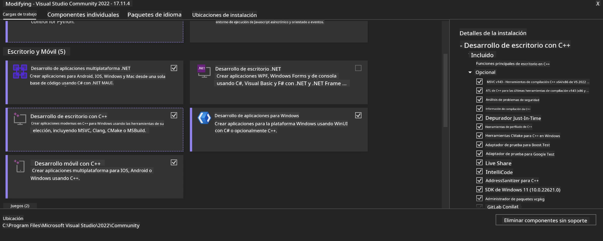
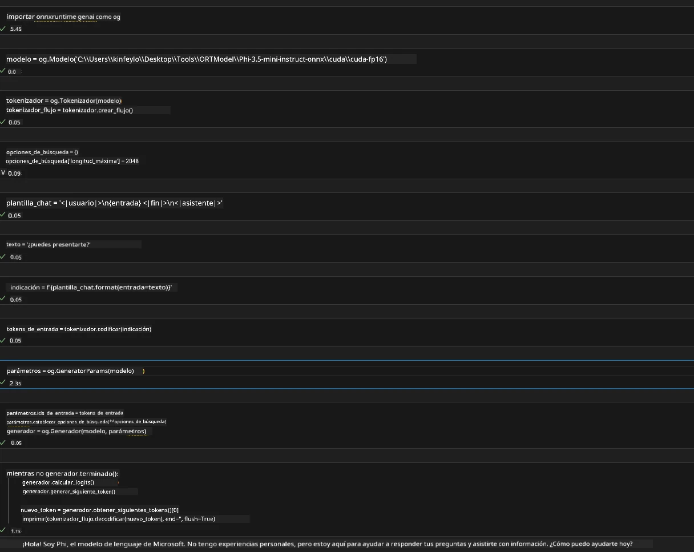
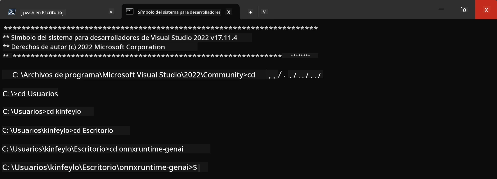

# **Guía para OnnxRuntime GenAI Windows GPU**

Esta guía proporciona pasos para configurar y usar ONNX Runtime (ORT) con GPUs en Windows. Está diseñada para ayudarte a aprovechar la aceleración de GPU para tus modelos, mejorando el rendimiento y la eficiencia.

El documento ofrece orientación sobre:

- Configuración del entorno: Instrucciones para instalar las dependencias necesarias como CUDA, cuDNN y ONNX Runtime.
- Configuración: Cómo configurar el entorno y ONNX Runtime para utilizar recursos de GPU de forma efectiva.
- Consejos de optimización: Recomendaciones para ajustar la configuración de tu GPU para un rendimiento óptimo.

### **1. Python 3.10.x /3.11.8**

   ***Nota*** Se sugiere usar [miniforge](https://github.com/conda-forge/miniforge/releases/latest/download/Miniforge3-Windows-x86_64.exe) como tu entorno de Python

   ```bash

   conda create -n pydev python==3.11.8

   conda activate pydev

   ```

   ***Recordatorio*** Si has instalado alguna biblioteca de Python ONNX, por favor desinstálala

### **2. Instalar CMake con winget**


   ```bash

   winget install -e --id Kitware.CMake

   ```

### **3. Instalar Visual Studio 2022 - Desarrollo de Escritorio con C++**

   ***Nota*** Si no deseas compilar, puedes omitir este paso




### **4. Instalar Driver NVIDIA**

1. **Driver NVIDIA GPU**  [https://www.nvidia.com/en-us/drivers/](https://www.nvidia.com/en-us/drivers/)

2. **NVIDIA CUDA 12.4** [https://developer.nvidia.com/cuda-12-4-0-download-archive](https://developer.nvidia.com/cuda-12-4-0-download-archive)

3. **NVIDIA CUDNN 9.4**  [https://developer.nvidia.com/cudnn-downloads](https://developer.nvidia.com/cudnn-downloads)

***Recordatorio*** Por favor usa la configuración por defecto en el proceso de instalación

### **5. Configurar entorno NVIDIA**

Copia las carpetas lib, bin, include de NVIDIA CUDNN 9.4 a NVIDIA CUDA 12.4(lib, bin, include)

- copia los archivos de *'C:\Program Files\NVIDIA\CUDNN\v9.4\bin\12.6'* a  *'C:\Program Files\NVIDIA GPU Computing Toolkit\CUDA\v12.4\bin'*

- copia los archivos de *'C:\Program Files\NVIDIA\CUDNN\v9.4\include\12.6'* a  *'C:\Program Files\NVIDIA GPU Computing Toolkit\CUDA\v12.4\include'*

- copia los archivos de *'C:\Program Files\NVIDIA\CUDNN\v9.4\lib\12.6'* a *'C:\Program Files\NVIDIA GPU Computing Toolkit\CUDA\v12.4\lib\x64'*


### **6. Descargar Phi-3.5-mini-instruct-onnx**


   ```bash

   winget install -e --id Git.Git

   winget install -e --id GitHub.GitLFS

   git lfs install

   git clone https://huggingface.co/microsoft/Phi-3.5-mini-instruct-onnx

   ```

### **7. Ejecutar InferencePhi35Instruct.ipynb**

   Abre [Notebook](../../../../code/09.UpdateSamples/Aug/ortgpu-phi35-instruct.ipynb) y ejecútalo





### **8. Compilar ORT GenAI GPU**


   ***Nota*** 
   
   1. Por favor desinstala todo lo relacionado con onnx, onnxruntime y onnxruntime-genai primero

   
   ```bash

   pip list 
   
   ```

   Luego desinstala todas las bibliotecas de onnxruntime, es decir,


   ```bash

   pip uninstall onnxruntime

   pip uninstall onnxruntime-genai

   pip uninstall onnxruntume-genai-cuda
   
   ```

   2. Verifica el soporte de la extensión de Visual Studio

   Revisa en C:\Program Files\NVIDIA GPU Computing Toolkit\CUDA\v12.4\extras para asegurarte de que se encuentre C:\Program Files\NVIDIA GPU Computing Toolkit\CUDA\v12.4\extras\visual_studio_integration.
   
   Si no se encuentra, revisa otras carpetas del toolkit de Cuda y copia la carpeta visual_studio_integration y su contenido a C:\Program Files\NVIDIA GPU Computing Toolkit\CUDA\v12.4\extras\visual_studio_integration


   - Si no quieres compilar, puedes omitir este paso


   ```bash

   git clone https://github.com/microsoft/onnxruntime-genai

   ```

   - Descarga [https://github.com/microsoft/onnxruntime/releases/download/v1.19.2/onnxruntime-win-x64-gpu-1.19.2.zip](https://github.com/microsoft/onnxruntime/releases/download/v1.19.2/onnxruntime-win-x64-gpu-1.19.2.zip)

   - Descomprime onnxruntime-win-x64-gpu-1.19.2.zip, y renómbralo como **ort**, copia la carpeta ort a onnxruntime-genai

   - Usando Windows Terminal, abre Developer Command Prompt para VS 2022 y navega a onnxruntime-genai 



   - Compílalo con tu entorno de python

   
   ```bash

   cd onnxruntime-genai

   python build.py --use_cuda  --cuda_home "C:\Program Files\NVIDIA GPU Computing Toolkit\CUDA\v12.4" --config Release
 

   cd build/Windows/Release/Wheel

   pip install .whl

   ```

---

<!-- CO-OP TRANSLATOR DISCLAIMER START -->
**Descargo de responsabilidad**:
Este documento ha sido traducido utilizando el servicio de traducción automática [Co-op Translator](https://github.com/Azure/co-op-translator). Aunque nos esforzamos por la precisión, tenga en cuenta que las traducciones automatizadas pueden contener errores o inexactitudes. El documento original en su idioma nativo debe considerarse la fuente autorizada. Para información crítica, se recomienda una traducción profesional humana. No somos responsables de cualquier malentendido o interpretación errónea que surja del uso de esta traducción.
<!-- CO-OP TRANSLATOR DISCLAIMER END -->