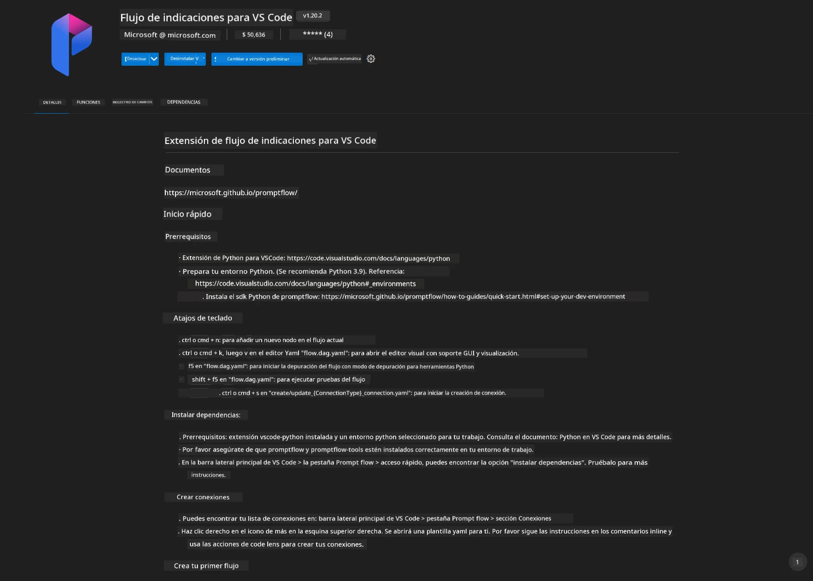
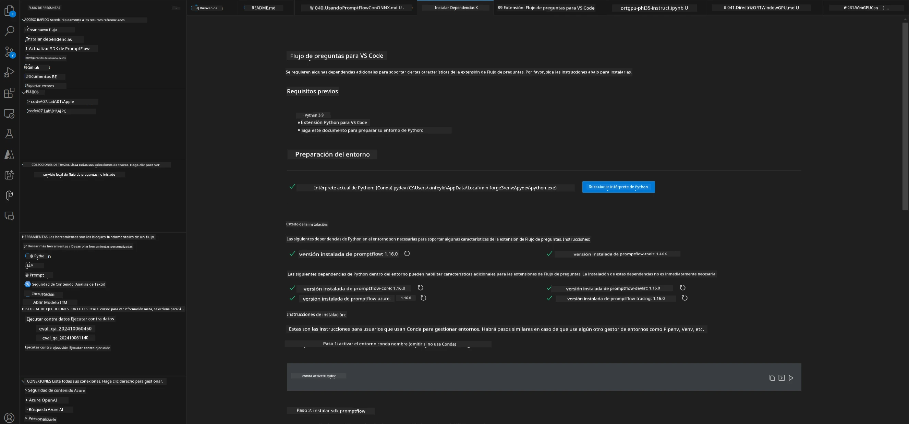
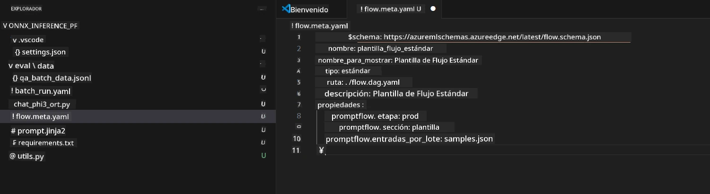
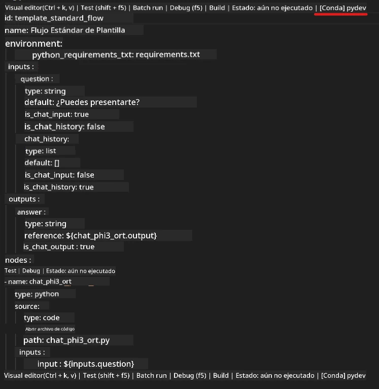
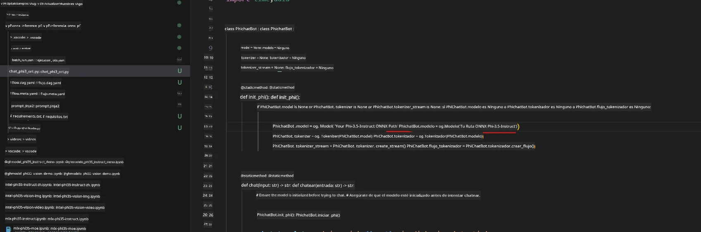
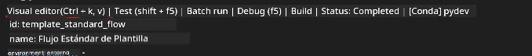
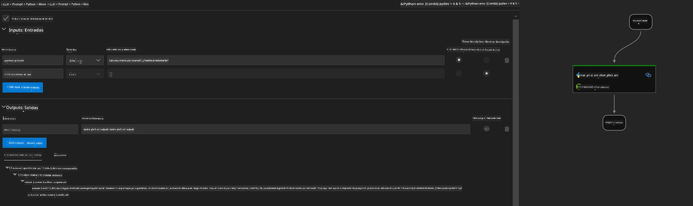
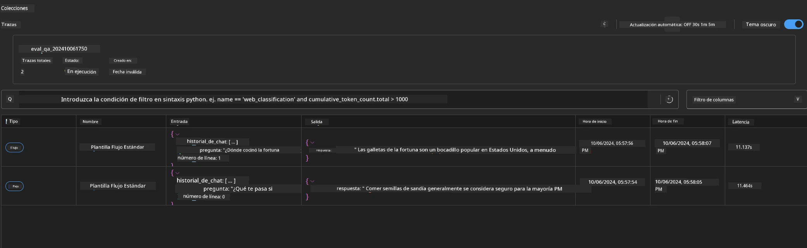

# Usando GPU de Windows para crear una solución de Prompt flow con Phi-3.5-Instruct ONNX 

El siguiente documento es un ejemplo de cómo usar PromptFlow con ONNX (Open Neural Network Exchange) para desarrollar aplicaciones de IA basadas en modelos Phi-3.

PromptFlow es un conjunto de herramientas de desarrollo diseñadas para simplificar el ciclo de desarrollo completo de aplicaciones de IA basadas en LLM (Large Language Model), desde la ideación y el prototipado hasta las pruebas y la evaluación.

Al integrar PromptFlow con ONNX, los desarrolladores pueden:

- Optimizar el rendimiento del modelo: Aprovechar ONNX para una inferencia y despliegue eficiente del modelo.
- Simplificar el desarrollo: Usar PromptFlow para gestionar el flujo de trabajo y automatizar tareas repetitivas.
- Mejorar la colaboración: Facilitar una mejor colaboración entre los miembros del equipo proporcionando un entorno de desarrollo unificado.

**Prompt flow** es un conjunto de herramientas de desarrollo diseñadas para optimizar el ciclo completo de desarrollo de aplicaciones de IA basadas en LLM, desde la ideación, prototipado, pruebas, evaluación hasta el despliegue y monitoreo en producción. Hace que la ingeniería de prompts sea mucho más fácil y te permite construir aplicaciones LLM con calidad de producción.

Prompt flow puede conectarse a OpenAI, Azure OpenAI Service y modelos personalizables (Huggingface, LLM/SLM local). Esperamos desplegar el modelo ONNX cuantizado Phi-3.5 a aplicaciones locales. Prompt flow puede ayudarnos a planificar mejor nuestro negocio y completar soluciones locales basadas en Phi-3.5. En este ejemplo, combinaremos la biblioteca ONNX Runtime GenAI para completar la solución Prompt flow basada en GPU de Windows.

## **Instalación**

### **ONNX Runtime GenAI para GPU de Windows**

Lee esta guía para configurar ONNX Runtime GenAI para GPU de Windows [haz clic aquí](./ORTWindowGPUGuideline.md)

### **Configurar Prompt flow en VSCode**

1. Instalar la extensión Prompt flow para VS Code



2. Después de instalar la extensión Prompt flow para VS Code, haz clic en la extensión y elige **Dependencias de instalación** para seguir esta guía e instalar el SDK de Prompt flow en tu entorno



3. Descarga el [Código de Ejemplo](../../../../../../code/09.UpdateSamples/Aug/pf/onnx_inference_pf) y usa VS Code para abrir este ejemplo



4. Abre **flow.dag.yaml** para elegir tu entorno de Python



   Abre **chat_phi3_ort.py** para cambiar la ubicación de tu modelo ONNX Phi-3.5-instruct



5. Ejecuta tu prompt flow para probarlo

Abre **flow.dag.yaml** y haz clic en el editor visual



después de hacer clic, ejecútalo para probar



1. Puedes ejecutar por lotes en la terminal para revisar más resultados


```bash

pf run create --file batch_run.yaml --stream --name 'Your eval qa name'    

```

Puedes ver los resultados en tu navegador predeterminado




---

<!-- CO-OP TRANSLATOR DISCLAIMER START -->
**Descargo de responsabilidad**:
Este documento ha sido traducido utilizando el servicio de traducción automática [Co-op Translator](https://github.com/Azure/co-op-translator). Aunque nos esforzamos por la precisión, tenga en cuenta que las traducciones automatizadas pueden contener errores o inexactitudes. El documento original en su idioma nativo debe considerarse la fuente autorizada. Para información crítica, se recomienda una traducción profesional humana. No somos responsables de cualquier malentendido o interpretación errónea que surja del uso de esta traducción.
<!-- CO-OP TRANSLATOR DISCLAIMER END -->