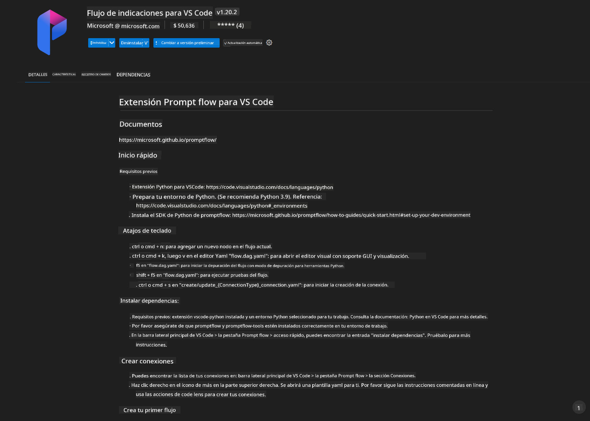
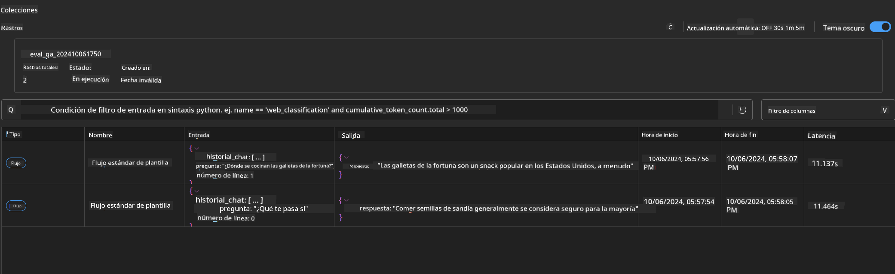

<!--
CO_OP_TRANSLATOR_METADATA:
{
  "original_hash": "92e7dac1e5af0dd7c94170fdaf6860fe",
  "translation_date": "2025-05-07T11:05:56+00:00",
  "source_file": "md/02.Application/01.TextAndChat/Phi3/UsingPromptFlowWithONNX.md",
  "language_code": "es"
}
-->
# Uso de GPU en Windows para crear una solución Prompt flow con Phi-3.5-Instruct ONNX

El siguiente documento es un ejemplo de cómo usar PromptFlow con ONNX (Open Neural Network Exchange) para desarrollar aplicaciones de IA basadas en modelos Phi-3.

PromptFlow es un conjunto de herramientas de desarrollo diseñadas para agilizar el ciclo completo de desarrollo de aplicaciones de IA basadas en LLM (Large Language Model), desde la ideación y el prototipado hasta las pruebas y la evaluación.

Al integrar PromptFlow con ONNX, los desarrolladores pueden:

- Optimizar el rendimiento del modelo: aprovechar ONNX para una inferencia y despliegue eficiente del modelo.
- Simplificar el desarrollo: usar PromptFlow para gestionar el flujo de trabajo y automatizar tareas repetitivas.
- Mejorar la colaboración: facilitar una mejor colaboración entre los miembros del equipo proporcionando un entorno de desarrollo unificado.

**Prompt flow** es un conjunto de herramientas de desarrollo diseñado para agilizar el ciclo completo de desarrollo de aplicaciones de IA basadas en LLM, desde la ideación, prototipado, pruebas, evaluación hasta el despliegue en producción y monitoreo. Hace que la ingeniería de prompts sea mucho más sencilla y te permite construir aplicaciones LLM con calidad de producción.

Prompt flow puede conectarse a OpenAI, Azure OpenAI Service y modelos personalizables (Huggingface, LLM/SLM local). Esperamos desplegar el modelo ONNX cuantificado de Phi-3.5 en aplicaciones locales. Prompt flow puede ayudarnos a planificar mejor nuestro negocio y completar soluciones locales basadas en Phi-3.5. En este ejemplo, combinaremos la biblioteca ONNX Runtime GenAI para completar la solución Prompt flow basada en GPU de Windows.

## **Instalación**

### **ONNX Runtime GenAI para GPU en Windows**

Lee esta guía para configurar ONNX Runtime GenAI para GPU en Windows [haz clic aquí](./ORTWindowGPUGuideline.md)

### **Configurar Prompt flow en VSCode**

1. Instala la extensión Prompt flow para VS Code



2. Después de instalar la extensión Prompt flow para VS Code, haz clic en la extensión y elige **Installation dependencies**; sigue esta guía para instalar el SDK de Prompt flow en tu entorno


3. Descarga el [Código de ejemplo](../../../../../../code/09.UpdateSamples/Aug/pf/onnx_inference_pf) y usa VS Code para abrir este ejemplo


4. Abre **flow.dag.yaml** para seleccionar tu entorno de Python


   Abre **chat_phi3_ort.py** para cambiar la ubicación de tu modelo Phi-3.5-instruct ONNX


5. Ejecuta tu prompt flow para hacer pruebas

Abre **flow.dag.yaml** y haz clic en el editor visual


Después de hacer clic, ejecútalo para probar


1. Puedes ejecutar en batch desde la terminal para ver más resultados


```bash

pf run create --file batch_run.yaml --stream --name 'Your eval qa name'    

```

Puedes revisar los resultados en tu navegador predeterminado




**Aviso Legal**:  
Este documento ha sido traducido utilizando el servicio de traducción automática [Co-op Translator](https://github.com/Azure/co-op-translator). Aunque nos esforzamos por la precisión, tenga en cuenta que las traducciones automáticas pueden contener errores o inexactitudes. El documento original en su idioma nativo debe considerarse la fuente autorizada. Para información crítica, se recomienda la traducción profesional realizada por un humano. No nos responsabilizamos por malentendidos o interpretaciones erróneas derivadas del uso de esta traducción.