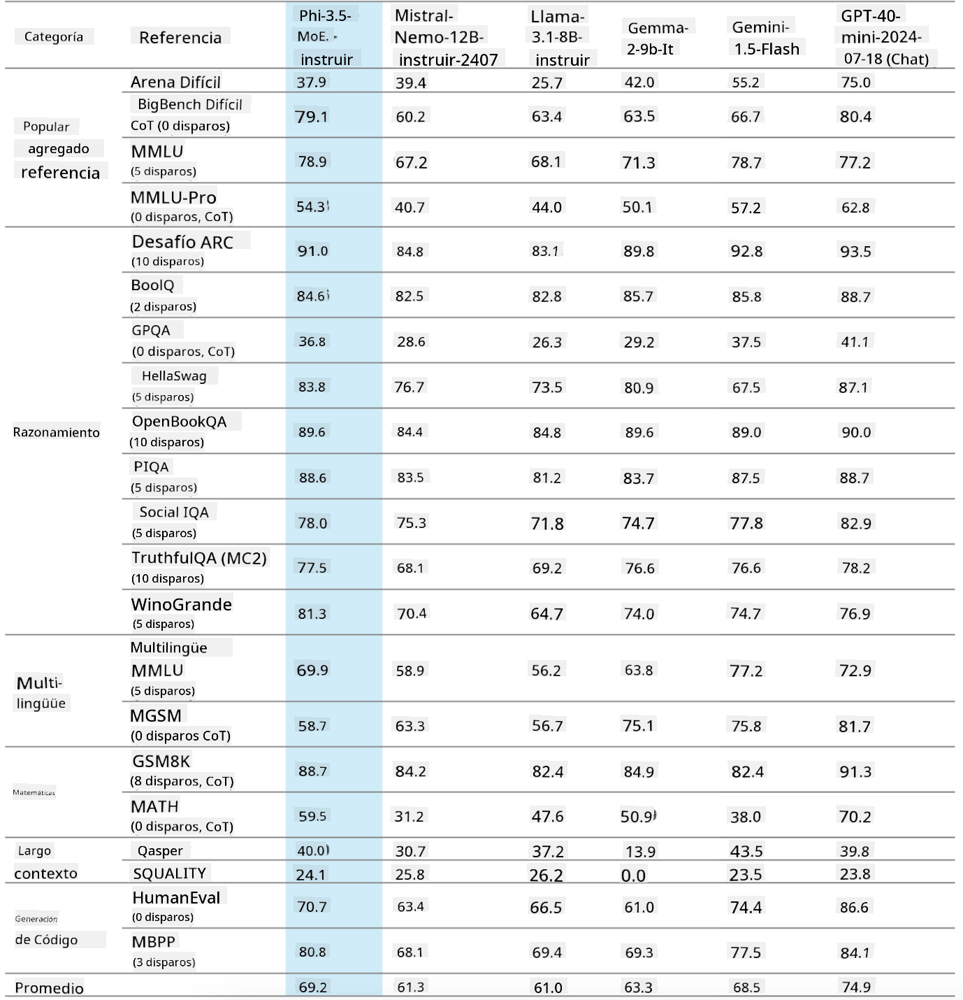
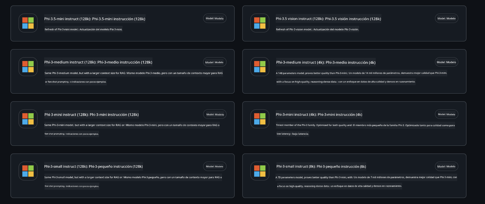
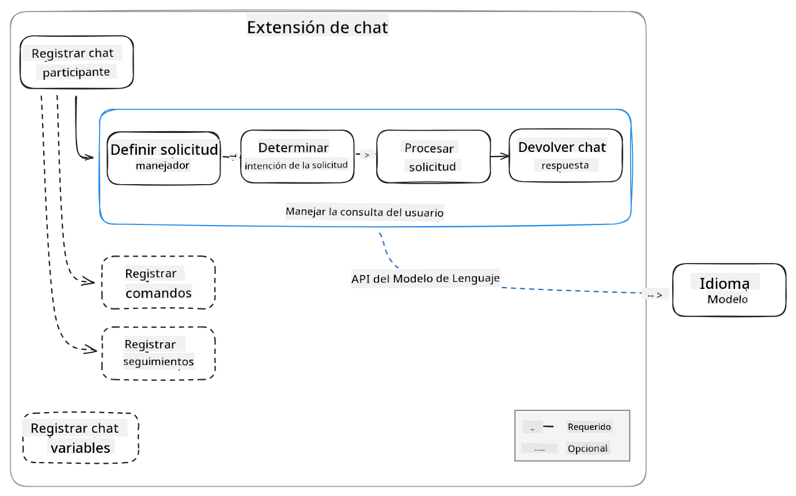
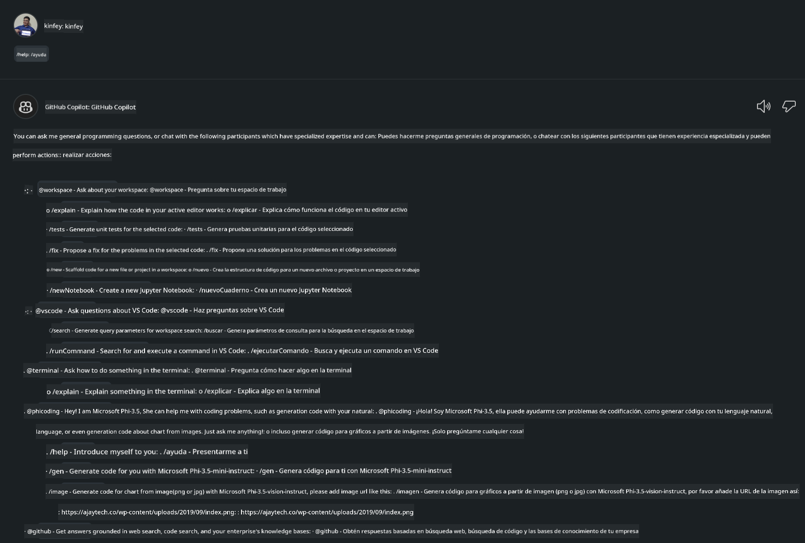
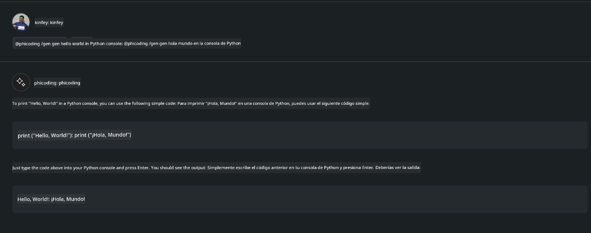

<!--
CO_OP_TRANSLATOR_METADATA:
{
  "original_hash": "35bf81388ac6917277b8d9a0c39bdc70",
  "translation_date": "2025-05-07T10:54:04+00:00",
  "source_file": "md/02.Application/02.Code/Phi3/CreateVSCodeChatAgentWithGitHubModels.md",
  "language_code": "es"
}
-->
# **Crea tu propio agente Visual Studio Code Chat Copilot con Phi-3.5 de GitHub Models**

¿Estás usando Visual Studio Code Copilot? Especialmente en Chat, puedes usar diferentes agentes para mejorar la capacidad de crear, escribir y mantener proyectos en Visual Studio Code. Visual Studio Code proporciona una API que permite a empresas e individuos crear diferentes agentes basados en su negocio para ampliar sus capacidades en distintos campos propietarios. En este artículo, nos centraremos en **Phi-3.5-mini-instruct (128k)** y **Phi-3.5-vision-instruct (128k)** de GitHub Models para crear tu propio agente de Visual Studio Code.

## **Acerca de Phi-3.5 en GitHub Models**

Sabemos que Phi-3/3.5-mini-instruct en la familia Phi-3/3.5 tiene fuertes capacidades de comprensión y generación de código, y presenta ventajas sobre Gemma-2-9b y Mistral-Nemo-12B-instruct-2407.



Los últimos GitHub Models ya ofrecen acceso a los modelos Phi-3.5-mini-instruct (128k) y Phi-3.5-vision-instruct (128k). Los desarrolladores pueden acceder a ellos mediante el OpenAI SDK, Azure AI Inference SDK y REST API.



***Nota:*** Se recomienda usar Azure AI Inference SDK aquí, porque permite una mejor integración con el Azure Model Catalog en entornos de producción.

A continuación se muestran los resultados de **Phi-3.5-mini-instruct (128k)** y **Phi-3.5-vision-instruct (128k)** en el escenario de generación de código tras la integración con GitHub Models, y también sirven como preparación para los ejemplos siguientes.

**Demo: GitHub Models Phi-3.5-mini-instruct (128k) genera código desde Prompt** ([haz clic en este enlace](../../../../../../code/09.UpdateSamples/Aug/ghmodel_phi35_instruct_demo.ipynb))

**Demo: GitHub Models Phi-3.5-vision-instruct (128k) genera código desde Imagen** ([haz clic en este enlace](../../../../../../code/09.UpdateSamples/Aug/ghmodel_phi35_vision_demo.ipynb))


## **Acerca del agente GitHub Copilot Chat**

El agente GitHub Copilot Chat puede completar diferentes tareas en distintos escenarios de proyecto basándose en el código. El sistema cuenta con cuatro agentes: workspace, github, terminal, vscode


Al añadir el nombre del agente con ‘@’, puedes completar rápidamente el trabajo correspondiente. Para empresas, si añades contenido relacionado con tu negocio como requisitos, codificación, especificaciones de prueba y liberación, puedes disponer de funciones privadas empresariales más potentes basadas en GitHub Copilot.

El agente Visual Studio Code Chat ha lanzado oficialmente su API, permitiendo que empresas o desarrolladores empresariales desarrollen agentes basados en diferentes ecosistemas de software empresarial. Basado en el método de desarrollo de extensiones para Visual Studio Code, puedes acceder fácilmente a la interfaz del API del agente Visual Studio Code Chat. Podemos desarrollar basándonos en este proceso.



El escenario de desarrollo puede soportar acceso a APIs de modelos de terceros (como GitHub Models, Azure Model Catalog y servicios propios basados en modelos open source) y también puede usar los modelos gpt-35-turbo, gpt-4 y gpt-4o proporcionados por GitHub Copilot.

## **Añadir un agente @phicoding basado en Phi-3.5**

Intentamos integrar las capacidades de programación de Phi-3.5 para completar la escritura de código, generación de código a partir de imágenes y otras tareas. Completa un agente construido alrededor de Phi-3.5 - @PHI, las siguientes son algunas funciones:

1. Generar una auto-presentación basada en GPT-4o proporcionado por GitHub Copilot mediante el comando **@phicoding /help**

2. Generar código para diferentes lenguajes de programación basándose en **Phi-3.5-mini-instruct (128k)** mediante el comando **@phicoding /gen**

3. Generar código basado en **Phi-3.5-vision-instruct (128k)** y completar imágenes mediante el comando **@phicoding /image**


## **Pasos relacionados**

1. Instala el soporte para desarrollo de extensiones de Visual Studio Code usando npm

```bash

npm install --global yo generator-code 

```
2. Crea un plugin de extensión para Visual Studio Code (usando modo de desarrollo Typescript, llamado phiext)

```bash

yo code 

```

3. Abre el proyecto creado y modifica package.json. Aquí están las instrucciones y configuraciones relacionadas, así como la configuración de GitHub Models. Ten en cuenta que debes añadir tu token de GitHub Models aquí.

```json

{
  "name": "phiext",
  "displayName": "phiext",
  "description": "",
  "version": "0.0.1",
  "engines": {
    "vscode": "^1.93.0"
  },
  "categories": [
    "AI",
    "Chat"
  ],
  "activationEvents": [],
  "enabledApiProposals": [
      "chatVariableResolver"
  ],
  "main": "./dist/extension.js",
  "contributes": {
    "chatParticipants": [
        {
            "id": "chat.phicoding",
            "name": "phicoding",
            "description": "Hey! I am Microsoft Phi-3.5, She can help me with coding problems, such as generation code with your natural language, or even generation code about chart from images. Just ask me anything!",
            "isSticky": true,
            "commands": [
                {
                    "name": "help",
                    "description": "Introduce myself to you"
                },
                {
                    "name": "gen",
                    "description": "Generate code for you with Microsoft Phi-3.5-mini-instruct"
                },
                {
                    "name": "image",
                    "description": "Generate code for chart from image(png or jpg) with Microsoft Phi-3.5-vision-instruct, please add image url like this : https://ajaytech.co/wp-content/uploads/2019/09/index.png"
                }
            ]
        }
    ],
    "commands": [
        {
            "command": "phicoding.namesInEditor",
            "title": "Use Microsoft Phi 3.5 in Editor"
        }
    ],
    "configuration": {
      "type": "object",
      "title": "githubmodels",
      "properties": {
        "githubmodels.endpoint": {
          "type": "string",
          "default": "https://models.inference.ai.azure.com",
          "description": "Your GitHub Models Endpoint",
          "order": 0
        },
        "githubmodels.api_key": {
          "type": "string",
          "default": "Your GitHub Models Token",
          "description": "Your GitHub Models Token",
          "order": 1
        },
        "githubmodels.phi35instruct": {
          "type": "string",
          "default": "Phi-3.5-mini-instruct",
          "description": "Your Phi-35-Instruct Model",
          "order": 2
        },
        "githubmodels.phi35vision": {
          "type": "string",
          "default": "Phi-3.5-vision-instruct",
          "description": "Your Phi-35-Vision Model",
          "order": 3
        }
      }
    }
  },
  "scripts": {
    "vscode:prepublish": "npm run package",
    "compile": "webpack",
    "watch": "webpack --watch",
    "package": "webpack --mode production --devtool hidden-source-map",
    "compile-tests": "tsc -p . --outDir out",
    "watch-tests": "tsc -p . -w --outDir out",
    "pretest": "npm run compile-tests && npm run compile && npm run lint",
    "lint": "eslint src",
    "test": "vscode-test"
  },
  "devDependencies": {
    "@types/vscode": "^1.93.0",
    "@types/mocha": "^10.0.7",
    "@types/node": "20.x",
    "@typescript-eslint/eslint-plugin": "^8.3.0",
    "@typescript-eslint/parser": "^8.3.0",
    "eslint": "^9.9.1",
    "typescript": "^5.5.4",
    "ts-loader": "^9.5.1",
    "webpack": "^5.94.0",
    "webpack-cli": "^5.1.4",
    "@vscode/test-cli": "^0.0.10",
    "@vscode/test-electron": "^2.4.1"
  },
  "dependencies": {
    "@types/node-fetch": "^2.6.11",
    "node-fetch": "^3.3.2",
    "@azure-rest/ai-inference": "latest",
    "@azure/core-auth": "latest",
    "@azure/core-sse": "latest"
  }
}


```

4. Modifica src/extension.ts

```typescript

// The module 'vscode' contains the VS Code extensibility API
// Import the module and reference it with the alias vscode in your code below
import * as vscode from 'vscode';
import ModelClient from "@azure-rest/ai-inference";
import { AzureKeyCredential } from "@azure/core-auth";


interface IPhiChatResult extends vscode.ChatResult {
    metadata: {
        command: string;
    };
}


const MODEL_SELECTOR: vscode.LanguageModelChatSelector = { vendor: 'copilot', family: 'gpt-4o' };

function isValidImageUrl(url: string): boolean {
    const regex = /^(https?:\/\/.*\.(?:png|jpg))$/i;
    return regex.test(url);
}
  

// This method is called when your extension is activated
// Your extension is activated the very first time the command is executed
export function activate(context: vscode.ExtensionContext) {

    const codinghandler: vscode.ChatRequestHandler = async (request: vscode.ChatRequest, context: vscode.ChatContext, stream: vscode.ChatResponseStream, token: vscode.CancellationToken): Promise<IPhiChatResult> => {


        const config : any = vscode.workspace.getConfiguration('githubmodels');
        const endPoint: string = config.get('endpoint');
        const apiKey: string = config.get('api_key');
        const phi35instruct: string = config.get('phi35instruct');
        const phi35vision: string = config.get('phi35vision');
        
        if (request.command === 'help') {

            const content = "Welcome to Coding assistant with Microsoft Phi-3.5"; 
            stream.progress(content);


            try {
                const [model] = await vscode.lm.selectChatModels(MODEL_SELECTOR);
                if (model) {
                    const messages = [
                        vscode.LanguageModelChatMessage.User("Please help me express this content in a humorous way: I am a programming assistant who can help you convert natural language into code and generate code based on the charts in the images. output format like this : Hey I am Phi ......")
                    ];
                    const chatResponse = await model.sendRequest(messages, {}, token);
                    for await (const fragment of chatResponse.text) {
                        stream.markdown(fragment);
                    }
                }
            } catch(err) {
                console.log(err);
            }


            return { metadata: { command: 'help' } };

        }

        
        if (request.command === 'gen') {

            const content = "Welcome to use phi-3.5 to generate code";

            stream.progress(content);

            const client = new ModelClient(endPoint, new AzureKeyCredential(apiKey));

            const response = await client.path("/chat/completions").post({
              body: {
                messages: [
                  { role:"system", content: "You are a coding assistant.Help answer all code generation questions." },
                  { role:"user", content: request.prompt }
                ],
                model: phi35instruct,
                temperature: 0.4,
                max_tokens: 1000,
                top_p: 1.
              }
            });

            stream.markdown(response.body.choices[0].message.content);

            return { metadata: { command: 'gen' } };

        }


        
        if (request.command === 'image') {


            const content = "Welcome to use phi-3.5 to generate code from image(png or jpg),image url like this:https://ajaytech.co/wp-content/uploads/2019/09/index.png";

            stream.progress(content);

            if (!isValidImageUrl(request.prompt)) {
                stream.markdown('Please provide a valid image URL');
                return { metadata: { command: 'image' } };
            }
            else
            {

                const client = new ModelClient(endPoint, new AzureKeyCredential(apiKey));
    
                const response = await client.path("/chat/completions").post({
                    body: {
                      messages: [
                        { role: "system", content: "You are a helpful assistant that describes images in details." },
                        { role: "user", content: [
                            { type: "text", text: "Please generate code according to the chart in the picture according to the following requirements\n1. Keep all information in the chart, including data and text\n2. Do not generate additional information that is not included in the chart\n3. Please extract data from the picture, do not generate it from csv\n4. Please save the regenerated chart as a chart and save it to ./output/demo.png"},
                            { type: "image_url", image_url: {url: request.prompt}
                            }
                          ]
                        }
                      ],
                      model: phi35vision,
                      temperature: 0.4,
                      max_tokens: 2048,
                      top_p: 1.
                    }
                  });
    
                
                stream.markdown(response.body.choices[0].message.content);
    
                return { metadata: { command: 'image' } };
            }


        }


        return { metadata: { command: '' } };
    };


    const phi_ext = vscode.chat.createChatParticipant("chat.phicoding", codinghandler);

    phi_ext.iconPath = new vscode.ThemeIcon('sparkle');


    phi_ext.followupProvider = {
        provideFollowups(result: IPhiChatResult, context: vscode.ChatContext, token: vscode.CancellationToken) {
            return [{
                prompt: 'Let us coding with Phi-3.5 😋😋😋😋',
                label: vscode.l10n.t('Enjoy coding with Phi-3.5'),
                command: 'help'
            } satisfies vscode.ChatFollowup];
        }
    };

    context.subscriptions.push(phi_ext);
}

// This method is called when your extension is deactivated
export function deactivate() {}


```

6. Ejecución

***/help***



***@phicoding /help***


***@phicoding /gen***



***@phicoding /image***


Puedes descargar el código de ejemplo: [clic aquí](../../../../../../code/09.UpdateSamples/Aug/vscode)

## **Recursos**

1. Regístrate en GitHub Models [https://gh.io/models](https://gh.io/models)

2. Aprende desarrollo de extensiones para Visual Studio Code [https://code.visualstudio.com/api/get-started/your-first-extension](https://code.visualstudio.com/api/get-started/your-first-extension)

3. Aprende sobre la API de Visual Studio Code Coilot Chat [https://code.visualstudio.com/api/extension-guides/chat](https://code.visualstudio.com/api/extension-guides/chat)

**Aviso legal**:  
Este documento ha sido traducido utilizando el servicio de traducción automática [Co-op Translator](https://github.com/Azure/co-op-translator). Aunque nos esforzamos por la precisión, tenga en cuenta que las traducciones automáticas pueden contener errores o inexactitudes. El documento original en su idioma nativo debe considerarse la fuente autorizada. Para información crítica, se recomienda una traducción profesional realizada por humanos. No nos hacemos responsables por malentendidos o interpretaciones erróneas derivadas del uso de esta traducción.