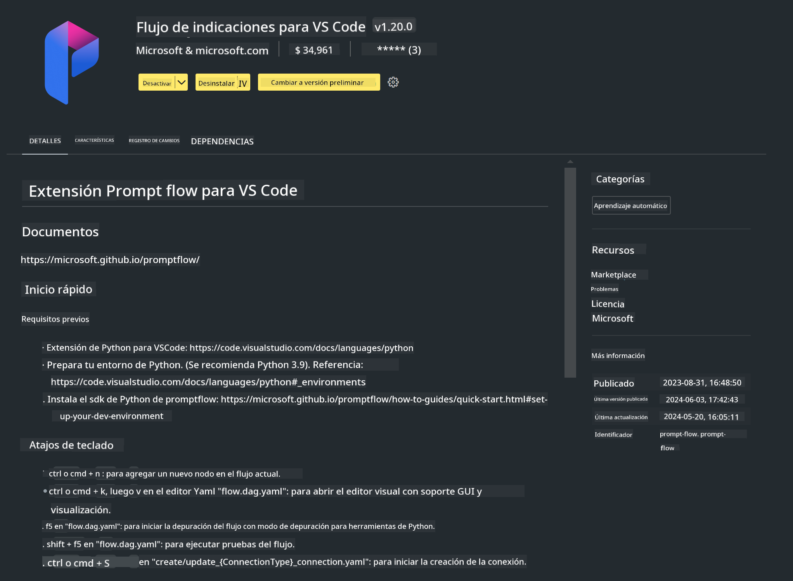

<!--
CO_OP_TRANSLATOR_METADATA:
{
  "original_hash": "4b16264917d9b93169745d92b8ce8c65",
  "translation_date": "2025-05-07T10:58:22+00:00",
  "source_file": "md/02.Application/02.Code/Phi3/VSCodeExt/HOL/Apple/01.Installations.md",
  "language_code": "es"
}
-->
# **Laboratorio 0 - Instalación**

Cuando ingresamos al laboratorio, necesitamos configurar el entorno correspondiente:


### **1. Python 3.11+**

Se recomienda usar miniforge para configurar tu entorno de Python

Para configurar miniforge, consulta [https://github.com/conda-forge/miniforge](https://github.com/conda-forge/miniforge)

Después de configurar miniforge, ejecuta el siguiente comando en Power Shell

```bash

conda create -n pyenv python==3.11.8 -y

conda activate pyenv

```


### **2. Instalar Prompt flow SDK**

En el Laboratorio 1, usamos Prompt flow, por lo que necesitas configurar el Prompt flow SDK.

```bash

pip install promptflow --upgrade

```

Puedes verificar promptflow sdk con este comando


```bash

pf --version

```

### **3. Instalar la extensión de Prompt flow para Visual Studio Code**



### **4. Framework MLX de Apple**

MLX es un framework de arrays para investigación en aprendizaje automático en Apple silicon, desarrollado por Apple machine learning research. Puedes usar el **framework Apple MLX** para acelerar LLM / SLM con Apple Silicon. Si quieres saber más, puedes leer [https://github.com/microsoft/PhiCookBook/blob/main/md/01.Introduction/03/MLX_Inference.md](https://github.com/microsoft/PhiCookBook/blob/main/md/01.Introduction/03/MLX_Inference.md).

Instala la librería del framework MLX en bash


```bash

pip install mlx-lm

```


### **5. Otras librerías de Python**


crea requirements.txt y añade este contenido

```txt

notebook
numpy 
scipy 
scikit-learn 
matplotlib 
pandas 
pillow 
graphviz

```


### **6. Instalar NVM**

instala nvm en Powershell


```bash

brew install nvm

```

instala nodejs 18.20


```bash

nvm install 18.20.0

nvm use 18.20.0

```

### **7. Instalar soporte de desarrollo para Visual Studio Code**


```bash

npm install --global yo generator-code

```

¡Felicidades! Has configurado correctamente el SDK. A continuación, procede con los pasos prácticos.

**Aviso legal**:  
Este documento ha sido traducido utilizando el servicio de traducción automática [Co-op Translator](https://github.com/Azure/co-op-translator). Aunque nos esforzamos por la precisión, tenga en cuenta que las traducciones automáticas pueden contener errores o inexactitudes. El documento original en su idioma nativo debe considerarse la fuente autorizada. Para información crítica, se recomienda una traducción profesional realizada por humanos. No nos hacemos responsables de ningún malentendido o interpretación errónea derivada del uso de esta traducción.