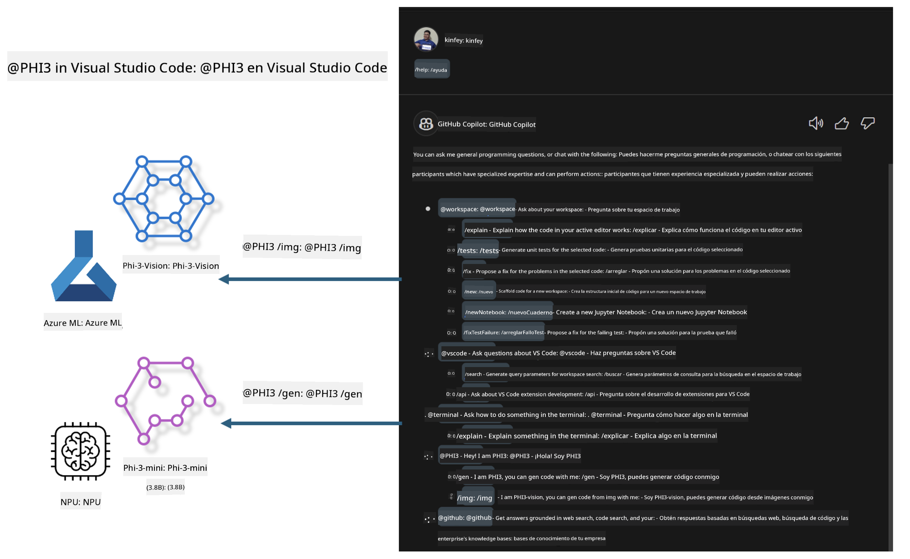

<!--
CO_OP_TRANSLATOR_METADATA:
{
  "original_hash": "00b7a699de8ac405fa821f4c0f7fc0ab",
  "translation_date": "2025-07-17T03:32:40+00:00",
  "source_file": "md/02.Application/02.Code/Phi3/VSCodeExt/README.md",
  "language_code": "es"
}
-->
# **Construye tu propio GitHub Copilot Chat para Visual Studio Code con la familia Microsoft Phi-3**

¿Has usado el agente de espacio de trabajo en GitHub Copilot Chat? ¿Quieres crear el agente de código para tu propio equipo? Este laboratorio práctico busca combinar el modelo de código abierto para construir un agente empresarial de código a nivel empresarial.

## **Fundamentos**

### **Por qué elegir Microsoft Phi-3**

Phi-3 es una serie familiar que incluye phi-3-mini, phi-3-small y phi-3-medium, basados en diferentes parámetros de entrenamiento para generación de texto, finalización de diálogos y generación de código. También existe phi-3-vision basado en Vision. Es adecuado para empresas o diferentes equipos que quieran crear soluciones de IA generativa offline.

Se recomienda leer este enlace [https://github.com/microsoft/PhiCookBook/blob/main/md/01.Introduction/01/01.PhiFamily.md](https://github.com/microsoft/PhiCookBook/blob/main/md/01.Introduction/01/01.PhiFamily.md)

### **Microsoft GitHub Copilot Chat**

La extensión GitHub Copilot Chat te ofrece una interfaz de chat que te permite interactuar con GitHub Copilot y recibir respuestas a preguntas relacionadas con la programación directamente dentro de VS Code, sin necesidad de navegar por documentación o buscar en foros en línea.

Copilot Chat puede usar resaltado de sintaxis, indentación y otras características de formato para dar claridad a la respuesta generada. Dependiendo del tipo de pregunta del usuario, el resultado puede contener enlaces al contexto que Copilot usó para generar la respuesta, como archivos de código fuente o documentación, o botones para acceder a funcionalidades de VS Code.

- Copilot Chat se integra en tu flujo de desarrollo y te brinda ayuda donde la necesites:

- Inicia una conversación de chat en línea directamente desde el editor o la terminal para obtener ayuda mientras programas

- Usa la vista de Chat para tener un asistente de IA al lado que te ayude en cualquier momento

- Lanza Quick Chat para hacer una pregunta rápida y volver a lo que estabas haciendo

Puedes usar GitHub Copilot Chat en varios escenarios, como:

- Responder preguntas de programación sobre la mejor forma de resolver un problema

- Explicar el código de otra persona y sugerir mejoras

- Proponer correcciones de código

- Generar casos de prueba unitarios

- Generar documentación de código

Se recomienda leer este enlace [https://code.visualstudio.com/docs/copilot/copilot-chat](https://code.visualstudio.com/docs/copilot/copilot-chat?WT.mc_id=aiml-137032-kinfeylo)

###  **Microsoft GitHub Copilot Chat @workspace**

Referenciar **@workspace** en Copilot Chat te permite hacer preguntas sobre todo tu código. Según la pregunta, Copilot recupera inteligentemente archivos y símbolos relevantes, que luego referencia en su respuesta como enlaces y ejemplos de código.

Para responder a tu pregunta, **@workspace** busca en las mismas fuentes que un desarrollador usaría al navegar un código en VS Code:

- Todos los archivos en el espacio de trabajo, excepto los archivos ignorados por un archivo .gitignore

- Estructura de directorios con carpetas y nombres de archivos anidados

- Índice de búsqueda de código de GitHub, si el espacio de trabajo es un repositorio de GitHub e indexado por búsqueda de código

- Símbolos y definiciones en el espacio de trabajo

- Texto seleccionado actualmente o texto visible en el editor activo

Nota: .gitignore se omite si tienes un archivo abierto o texto seleccionado dentro de un archivo ignorado.

Se recomienda leer este enlace [[https://code.visualstudio.com/docs/copilot/copilot-chat](https://code.visualstudio.com/docs/copilot/workspace-context?WT.mc_id=aiml-137032-kinfeylo)]

## **Conoce más sobre este laboratorio**

GitHub Copilot ha mejorado enormemente la eficiencia de programación en las empresas, y cada empresa espera personalizar las funciones relevantes de GitHub Copilot. Muchas empresas han personalizado extensiones similares a GitHub Copilot basadas en sus propios escenarios de negocio y modelos de código abierto. Para las empresas, las extensiones personalizadas son más fáciles de controlar, pero esto también afecta la experiencia del usuario. Después de todo, GitHub Copilot tiene funciones más potentes para manejar escenarios generales y profesionalismo. Si se puede mantener una experiencia consistente, sería mejor personalizar la extensión propia de la empresa. GitHub Copilot Chat proporciona APIs relevantes para que las empresas amplíen la experiencia de Chat. Mantener una experiencia consistente y tener funciones personalizadas es una mejor experiencia para el usuario.

Este laboratorio usa principalmente el modelo Phi-3 combinado con NPU local y Azure híbrido para construir un agente personalizado en GitHub Copilot Chat ***@PHI3*** para ayudar a los desarrolladores empresariales a completar la generación de código ***(@PHI3 /gen)*** y generar código basado en imágenes ***(@PHI3 /img)***.

### ***Nota:*** 

Este laboratorio está implementado actualmente en AIPC de Intel CPU y Apple Silicon. Continuaremos actualizando la versión Qualcomm de NPU.

## **Laboratorio**

| Nombre | Descripción | AIPC | Apple |
| ------------ | ----------- | -------- |-------- |
| Lab0 - Instalaciones(✅) | Configurar e instalar entornos relacionados y herramientas de instalación | [Ir](./HOL/AIPC/01.Installations.md) |[Ir](./HOL/Apple/01.Installations.md) |
| Lab1 - Ejecutar flujo de Prompt con Phi-3-mini (✅) | Combinado con AIPC / Apple Silicon, usando NPU local para crear generación de código con Phi-3-mini | [Ir](./HOL/AIPC/02.PromptflowWithNPU.md) |  [Ir](./HOL/Apple/02.PromptflowWithMLX.md) |
| Lab2 - Desplegar Phi-3-vision en Azure Machine Learning Service(✅) | Generar código desplegando el Catálogo de Modelos de Azure Machine Learning Service - imagen Phi-3-vision | [Ir](./HOL/AIPC/03.DeployPhi3VisionOnAzure.md) |[Ir](./HOL/Apple/03.DeployPhi3VisionOnAzure.md) |
| Lab3 - Crear un agente @phi-3 en GitHub Copilot Chat(✅)  | Crear un agente Phi-3 personalizado en GitHub Copilot Chat para completar generación de código, generación de código gráfico, RAG, etc. | [Ir](./HOL/AIPC/04.CreatePhi3AgentInVSCode.md) | [Ir](./HOL/Apple/04.CreatePhi3AgentInVSCode.md) |
| Código de ejemplo (✅)  | Descargar código de ejemplo | [Ir](../../../../../../../code/07.Lab/01/AIPC) | [Ir](../../../../../../../code/07.Lab/01/Apple) |

## **Recursos**

1. Phi-3 Cookbook [https://github.com/microsoft/Phi-3CookBook](https://github.com/microsoft/Phi-3CookBook)

2. Aprende más sobre GitHub Copilot [https://learn.microsoft.com/training/paths/copilot/](https://learn.microsoft.com/training/paths/copilot/?WT.mc_id=aiml-137032-kinfeylo)

3. Aprende más sobre GitHub Copilot Chat [https://learn.microsoft.com/training/paths/accelerate-app-development-using-github-copilot/](https://learn.microsoft.com/training/paths/accelerate-app-development-using-github-copilot/?WT.mc_id=aiml-137032-kinfeylo)

4. Aprende más sobre la API de GitHub Copilot Chat [https://code.visualstudio.com/api/extension-guides/chat](https://code.visualstudio.com/api/extension-guides/chat?WT.mc_id=aiml-137032-kinfeylo)

5. Aprende más sobre Azure AI Foundry [https://learn.microsoft.com/training/paths/create-custom-copilots-ai-studio/](https://learn.microsoft.com/training/paths/create-custom-copilots-ai-studio/?WT.mc_id=aiml-137032-kinfeylo)

6. Aprende más sobre el Catálogo de Modelos de Azure AI Foundry [https://learn.microsoft.com/azure/ai-studio/how-to/model-catalog-overview](https://learn.microsoft.com/azure/ai-studio/how-to/model-catalog-overview)

**Aviso legal**:  
Este documento ha sido traducido utilizando el servicio de traducción automática [Co-op Translator](https://github.com/Azure/co-op-translator). Aunque nos esforzamos por la precisión, tenga en cuenta que las traducciones automáticas pueden contener errores o inexactitudes. El documento original en su idioma nativo debe considerarse la fuente autorizada. Para información crítica, se recomienda la traducción profesional realizada por humanos. No nos hacemos responsables de malentendidos o interpretaciones erróneas derivadas del uso de esta traducción.