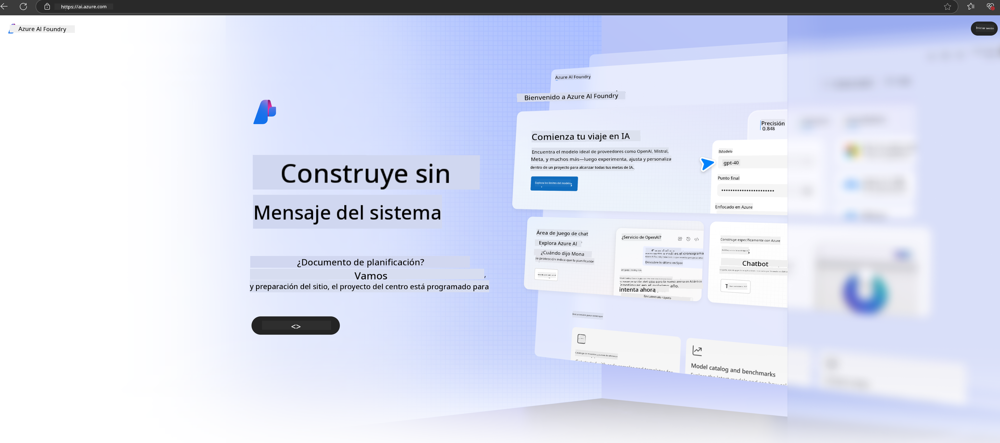

<!--
CO_OP_TRANSLATOR_METADATA:
{
  "original_hash": "3a1e48b628022485aac989c9f733e792",
  "translation_date": "2025-07-17T05:18:10+00:00",
  "source_file": "md/02.QuickStart/AzureAIFoundry_QuickStart.md",
  "language_code": "es"
}
-->
# **Uso de Phi-3 en Azure AI Foundry**

Con el desarrollo de la IA Generativa, esperamos utilizar una plataforma unificada para gestionar diferentes LLM y SLM, la integración de datos empresariales, operaciones de fine-tuning/RAG y la evaluación de distintos negocios empresariales tras integrar LLM y SLM, etc., para que las aplicaciones inteligentes basadas en IA generativa se implementen de manera más eficiente. [Azure AI Foundry](https://ai.azure.com) es una plataforma de aplicaciones de IA generativa a nivel empresarial.

Con Azure AI Foundry, puedes evaluar las respuestas de modelos de lenguaje grande (LLM) y orquestar componentes de aplicación de prompts con prompt flow para mejorar el rendimiento. La plataforma facilita la escalabilidad para transformar pruebas de concepto en producción completa con facilidad. El monitoreo y refinamiento continuo apoyan el éxito a largo plazo.

Podemos desplegar rápidamente el modelo Phi-3 en Azure AI Foundry mediante pasos sencillos, y luego usar Azure AI Foundry para completar trabajos relacionados con Playground/Chat, fine-tuning, evaluación y otros aspectos de Phi-3.

## **1. Preparación**

Si ya tienes instalado el [Azure Developer CLI](https://learn.microsoft.com/azure/developer/azure-developer-cli/overview?WT.mc_id=aiml-138114-kinfeylo) en tu equipo, usar esta plantilla es tan simple como ejecutar este comando en un directorio nuevo.

## Creación Manual

Crear un proyecto y un hub en Microsoft Azure AI Foundry es una excelente forma de organizar y gestionar tu trabajo de IA. Aquí tienes una guía paso a paso para comenzar:

### Crear un Proyecto en Azure AI Foundry

1. **Ir a Azure AI Foundry**: Inicia sesión en el portal de Azure AI Foundry.
2. **Crear un Proyecto**:
   - Si estás dentro de un proyecto, selecciona "Azure AI Foundry" en la parte superior izquierda para ir a la página principal.
   - Selecciona "+ Crear proyecto".
   - Ingresa un nombre para el proyecto.
   - Si tienes un hub, se seleccionará por defecto. Si tienes acceso a más de un hub, puedes elegir otro desde el menú desplegable. Si quieres crear un hub nuevo, selecciona "Crear nuevo hub" y proporciona un nombre.
   - Selecciona "Crear".

### Crear un Hub en Azure AI Foundry

1. **Ir a Azure AI Foundry**: Inicia sesión con tu cuenta de Azure.
2. **Crear un Hub**:
   - Selecciona el Centro de administración en el menú lateral.
   - Selecciona "Todos los recursos", luego la flecha hacia abajo junto a "+ Nuevo proyecto" y elige "+ Nuevo hub".
   - En el diálogo "Crear un nuevo hub", ingresa un nombre para tu hub (por ejemplo, contoso-hub) y modifica los demás campos según prefieras.
   - Selecciona "Siguiente", revisa la información y luego selecciona "Crear".

Para instrucciones más detalladas, puedes consultar la [documentación oficial de Microsoft](https://learn.microsoft.com/azure/ai-studio/how-to/create-projects).

Después de crear con éxito, puedes acceder al estudio que creaste a través de [ai.azure.com](https://ai.azure.com/)

Puede haber múltiples proyectos en un solo AI Foundry. Crea un proyecto en AI Foundry para prepararte.

Crea Azure AI Foundry [QuickStarts](https://learn.microsoft.com/azure/ai-studio/quickstarts/get-started-code)

## **2. Desplegar un modelo Phi en Azure AI Foundry**

Haz clic en la opción Explorar del proyecto para entrar al Catálogo de Modelos y selecciona Phi-3

Selecciona Phi-3-mini-4k-instruct

Haz clic en 'Deploy' para desplegar el modelo Phi-3-mini-4k-instruct

> [!NOTE]
>
> Puedes seleccionar la potencia de cómputo al desplegar

## **3. Playground Chat Phi en Azure AI Foundry**

Ve a la página de despliegue, selecciona Playground y chatea con Phi-3 de Azure AI Foundry

## **4. Desplegar el Modelo desde Azure AI Foundry**

Para desplegar un modelo desde el Catálogo de Modelos de Azure, puedes seguir estos pasos:

- Inicia sesión en Azure AI Foundry.
- Elige el modelo que deseas desplegar desde el catálogo de modelos de Azure AI Foundry.
- En la página de Detalles del modelo, selecciona Deploy y luego elige Serverless API con Azure AI Content Safety.
- Selecciona el proyecto en el que quieres desplegar tus modelos. Para usar la oferta Serverless API, tu espacio de trabajo debe pertenecer a la región East US 2 o Sweden Central. Puedes personalizar el nombre del despliegue.
- En el asistente de despliegue, selecciona Pricing and terms para conocer los precios y términos de uso.
- Selecciona Deploy. Espera hasta que el despliegue esté listo y seas redirigido a la página de Despliegues.
- Selecciona Open in playground para comenzar a interactuar con el modelo.
- Puedes volver a la página de Despliegues, seleccionar el despliegue y anotar la URL de destino del endpoint y la Clave Secreta, que puedes usar para llamar al despliegue y generar respuestas.
- Siempre puedes encontrar los detalles del endpoint, URL y claves de acceso navegando a la pestaña Build y seleccionando Deployments en la sección Componentes.

> [!NOTE]
> Ten en cuenta que tu cuenta debe tener permisos de rol Azure AI Developer en el Grupo de Recursos para realizar estos pasos.

## **5. Uso de la API Phi en Azure AI Foundry**

Puedes acceder a https://{Nombre de tu proyecto}.region.inference.ml.azure.com/swagger.json mediante una petición GET en Postman y combinarlo con la Key para conocer las interfaces disponibles.

Podrás obtener los parámetros de solicitud de forma muy sencilla, así como los parámetros de respuesta.

**Aviso legal**:  
Este documento ha sido traducido utilizando el servicio de traducción automática [Co-op Translator](https://github.com/Azure/co-op-translator). Aunque nos esforzamos por la precisión, tenga en cuenta que las traducciones automáticas pueden contener errores o inexactitudes. El documento original en su idioma nativo debe considerarse la fuente autorizada. Para información crítica, se recomienda la traducción profesional realizada por humanos. No nos hacemos responsables de malentendidos o interpretaciones erróneas derivadas del uso de esta traducción.